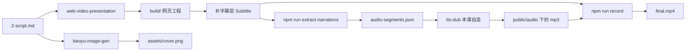

第 05 课交稿。三关全过：硬禁令清零、`check-lesson.sh ... 实操` RESULT: PASS（代码行 104/200，围栏块 18，排障句 4，命令与脚本名十条全 ok 无 WARN）、文中路径与命令逐条回材料 grep 过。落盘 `docs/Iterative-spec/0901-AI自媒体课程体系/courses-v3/05-用开源Skill跑通一条内容.md`，中间产物在 `writing/v3-05-05/`。

本课按 brief 修的四处：`cp ../../brain/` 路径补成退三级；补字幕层（脚手架 `templates/src/components/` 下五个组件里没有，搜 subs 零命中）与 `?subs=1` 的改法（`--serve` 会覆盖 `--url`，得改 `auto-record.mjs` 的默认地址）；tts-dub 按 L1 给两条 Prompt，不展开多音字与语速；两个开源件的安装第 02 课已给过，这里只补开工前在位确认。

汉字 5060 超参考值 4500，按你定的动态平衡口径没砍，多出来的字都在第 5、6 两节的缺口补法上。

承接台账第 05 课那一行已改：交接点不变，结尾措辞去掉了直角引号和回环。

---

## final.md 全文

# 用开源 Skill 跑通一条内容：从口播稿到成片与封面

上一课的产出是 `brain/` 下的六个文件。`positioning.md` 把内容比例写成了一个能照着取题的数字。`persona.md` 和 `style-guide.md` 里每一条都能拿去对着写完的稿子逐句核。`sources.md` 的关键词分了三层。`benchmarks.md` 只写了四行头部，正文留空等第一批数据。`tts.config.json` 填好了音色、语速和四条缩写念法。最后的验收是让 AI 只读这六个文件，输出两栏：一栏是它判得了的条目，一栏是它判不了的，末尾再回答今天该取深度题还是流量题。

判断依据齐了就该出活。这一课把一条内容从稿子做到成片，一次走完，产出四样：一个 `build/` 网页工程、一条 `final.mp4`、一张竖版 `cover.png`，还有一个你自己造的 `tts-dub` skill。

## 1. 四件工具的接力顺序与两处缺口

这条链上有四件工具。web-video-presentation 把口播稿做成能录屏的网页，顺带抽出分段文案；tts-dub 把分段文案合成每段一个 mp3；录制脚本把网页和音频合成 mp4；baoyu-image-gen 出封面。

| 工具 | 它读什么 | 它写什么 | 哪来的 |
|---|---|---|---|
| web-video-presentation | `2-script.md` | `build/` 工程、`audio-segments.json` | 开源，第 02 课装过 |
| tts-dub | `audio-segments.json`、`tts.config.json` | `public/audio/<章>/<步>.mp3` | 本课自己造 |
| 录制脚本 | 网页、分段 mp3 | `final.mp4` | 脚手架自带，本课要改它的默认地址 |
| baoyu-image-gen | 封面提示词文件 | `assets/cover.png` | 开源，第 02 课装过 |

每件工具只认自己的输入文件，也只写下一件要读的文件。文件就是它们之间的接口，上游文件改了，下游得重跑。

开工前确认两件开源件还在位。第 02 课那张自检表里，web-video-presentation 是唯一没进表的一件，因为它没有自己的二进制和凭据，装了就在，真验它得等第一次用。现在就是第一次用。

```bash
ls .claude/skills/web-video-presentation/SKILL.md   # 项目级 skill，住在仓库里
ls ~/.claude/skills/baoyu-image-gen/SKILL.md        # 装在家目录的 skill
ls ~/.baoyu-skills/.env                             # 出图的 key
```

两个 skill 落在不同位置，是因为第 02 课装它们的两条命令一条装进了仓库、一条装进了家目录。Claude Code 两个位置都读，路径不同而已，后面写命令时别搞混。

四件接力里有两处开源件接不上。

第一处是配音。web-video-presentation 自带一条 `npm run synthesize-audio`，它走的是 mmx 这个命令行工具，那条路是坏的：多音字注音的参数被拼成了一个字符串，接口要的是数组，注音传过去不生效。所以第 03 课写的创作契约 `pipeline/2-create.md` 里直接写死了不要用它自带的那条。缺的这一截就是 `tts-dub`。

第二处是字幕。脚手架模板的 `templates/src/components/` 下只有五个组件，进度条、模式切换、舞台这些都在，没有字幕。在模板目录里搜 subs 这个词，零命中。不补的话，录出来的片子底部是空的，刷到它的人只能靠听。

跑完之后，一条内容的工作目录长这样。这是本仓一条真实内容的 `build/`，只列了和这一课有关的部分。

```text
build/
├── outline.md                    # 开发计划：章节切分、每步屏幕内容
├── src/chapters/01-coldopen/
│   ├── Coldopen.tsx              # 画面
│   └── narrations.ts             # 本章每一步的口播文本
├── src/components/Subtitle.tsx   # 字幕层，脚手架没有，本课补
├── scripts/auto-record.mjs       # 录制脚本，本课要改它的默认地址
├── audio-segments.json           # 抽出来的分段文案
├── tts.config.json               # 配音配置，从 brain/ 复制过来
├── public/audio/<章>/<步>.mp3
└── final.mp4
```

`build/` 是工作区，整个目录不进版本库，内容模板 `content/_template/README.md` 里写着这一条。进版本库的是 `2-script.md` 这类档案文件，成品媒体进 `assets/`。



左边是口播稿进去，右边出成片和封面。中间那条主线上，补字幕层和 tts-dub 这两格没有现成件顶着，其余都有。

## 2. 口播稿：这条链的唯一真相源

口播稿写在 `2-script.md`，内容模板把它标成必产。字幕、配音、画面三方都以它为准，后面任何一处要改文案，都得先回来改它。这一步 AI 写，你审。

短视频第一次刷到的人没有上下文。第一句如果是上一集我们讲了、前面说过，这个人手一划就走了。所以第一句必须自成立：把前面所有内容删掉，它单独放在那里还能让人听懂、还想往下听。创作契约把这条写成了冷开铁律，系列之间的承接放到结尾去做。

本仓那条 9 段的真实内容，第一句是这样的：xAI 把自家旗舰的 coding agent，全部源码开到 GitHub 上了，纯 Rust 写的，Apache 协议。开口就是事实，没有一个承接词。

```
读取 1-brief.md，把它改写成一篇口播稿，写到 2-script.md。
要求：
1. 第一句不依赖上文自成立，禁止上一集、前面说过、今天我们来这类开头；
2. 每句不超过 20 个字，念出来不别扭；
3. 保留原文 60% 以上的信息量，删的是修饰，事实和数字不删；
4. 按章节分段，每段一个完整想法，段与段之间空一行。
只输出稿子，不解释。
```

拿到稿子先把第一句单独复制出来读一遍，一个没看过上文的人听到它会不会想往下听。再找最长的三句，超过 20 个字的拆开。其余先不动，节奏问题下一步还会再过一遍。

如果第一句读着还是带承接的味道，多半是句首藏了一个时间状语，或者一个没必要的转折词。把句首那段修饰整个删掉，只留后面的断言，通常就立住了。

## 3. 让 skill 做网页：两处要你确认的停顿

稿子定了就交给 web-video-presentation。它的流程分四段：先一次产出内部的 `script.md` 和开发计划 `outline.md`，停一次；然后搭脚手架做第一章，再停一次；剩下的章节按你选的模式往下做；最后是配音和录屏，那两步本课不走它自带的，第 5 节和第 6 节另说。人工确认被压缩到了前面那两次停顿。

它产出的 `script.md` 和你写的 `2-script.md` 只差两个字符，很容易混。前者是它自己工程里的派生件，内容以后者为准。

```
用 web-video-presentation skill，把 2-script.md 做成 16:9 的网页演示。
工程放在 build/ 目录。
2-script.md 是口播稿的唯一真相源，你产出的 script.md 以它为准，不要改写内容。
按 skill 的流程走，在 Checkpoint Plan 停下来等我。
```

第一次停顿叫 Checkpoint Plan，它把五件事一起摆出来等你一次确认。每件事只看一个点。

| 五件事 | 你看什么 | 常见处理 |
|---|---|---|
| 稿子 `script.md` | 和 `2-script.md` 内容一致，没被改写 | 不一致就让它以 `2-script.md` 为准重出 |
| 开发计划 `outline.md` | 每章估时 30 到 60 秒，每步只写屏幕内容 | 章太长就拆，写了动画就删 |
| 主题 | 一套配色字体和装饰风格的预设，脚手架自带二十多套 | 选一套，或者让它替你选 |
| 素材 | 需要真图的地方你给不给 | 给不了就全部占位图，后面再补 |
| 开发模式 | A 逐章确认、B 顺序做完统一验收、C 并行 | 第一次跑选 A |

开发计划里不许写动画，这一条确实绕。skill 的设计是 outline 只规划节奏和每一步屏幕上放什么信息，动画留给写章节的那一步按内容临场定。动画在 outline 里写死了，写章节的那一步就只剩照抄，画面会退回一页一页翻的样子。所以看到 outline 里出现淡入、弹簧、从左滑入这类词，让它删掉，只留这一步屏幕上是三个数字这种描述。

第二次停顿在第一章做完，这一停不能跳。第一章是这套主题和这个题材头一回碰面，颜色不够用、字号太小这类问题都会在这里露出来，而后面每一章都会照着第一章的代码模式写。在浏览器里按右方向键推进，逐步验一遍：每一步停留时间和口播长度对不对得上，列表是一项一项亮出来还是一次全堆上去，有没有紫粉渐变和 emoji 图标这类 AI 味。都过了再说继续。剩下的章节三种模式随时能换，第二章验收完觉得稳了，说一句剩下的并行就行。

如果你点页面上的按钮，整页跟着翻了一页，多半是那个按钮少了 `data-no-advance` 属性。脚手架靠它识别这一下点击不算推进，让 AI 补上就行。

全部章节做完，在 `build/` 里跑一次类型检查，零报错再往下走：

```bash
cd build && npx tsc --noEmit
```

## 4. 分段文案：改了文案必须重抽

网页有了，声音还是文字。下一步把文字从组件里抽出来，变成配音能读的格式。

每个章节目录下有一个 `narrations.ts`，它是一个字符串数组，第 N 项就是第 N 步的口播文本。这个文件是 step 数和口播文本的唯一真相源：章节组件里出现的最大 step 编号加一，必须等于数组长度。skill 靠这一条约束，让口播稿、开发计划、章节代码、章节注册表 `chapters.ts`、音频文件这五处对得上。

在 `build/` 里抽一次：

```bash
npm run extract-narrations
```

它扫所有 `narrations.ts`，合并成 `audio-segments.json`。本仓那条 9 段的内容，抽出来每段长这样：

```json
{
  "chapter": "coldopen",
  "step": 1,
  "text": "xAI 把自家旗舰的 coding agent，全部源码开到 GitHub 上了。",
  "audio": "coldopen/1.mp3"
}
```

抽完核两处。每章的段数要和你在浏览器里点过的步数一致。任何一段 text 为空都不行，录制脚本按每段音频的时长推进，空段没有音频就没有时长，时间线从那一步开始错位。有纯画面的转场步，给它补一句口播。

从这里开始有一条铁律：改过任何一处口播文案，先重跑 `npm run extract-narrations`，再删掉改动那几段的旧 mp3，然后才重新合成。合成读的是 `audio-segments.json`，不读 `narrations.ts`；合成脚本看到目标 mp3 已经在了会跳过。漏掉重抽或者漏掉删旧文件，结果都是画面新文案、声音旧文案。本仓 EP02 就这样出过一次，改了钩子没重抽，连过两轮组件截图检查都没抓出来，成片出来才发现。成片里画面文字和配音对不上，源头基本都在这两个动作上。

## 5. 补上第一件自建 skill：tts-dub

分段文案就位，这条接力在这里断第一次。断口要补的东西是一个 skill：一份说明书加两个脚本。

它的实现路线是唯一的：输入两份文件，输出每段一个 mp3，中间调一次语音合成接口。没有互斥的选型要拍板，做错了重跑一次也不贵。这种量级的东西不用写 SPEC，两条把判据钉死的 Prompt 就够，判据你出，代码它写。

### 5.1 先定配置契约

先定配置，再让它写脚本。顺序反过来的话，AI 会一边写脚本一边顺手决定字段叫什么名字，你拿到的字段名是它的习惯，跟你的约定没关系。

上一课那份 `brain/tts.config.json` 就是契约本身，字段和取值都在里面。把它当输入给 AI，让它写成说明书。

```
造一个 skill，叫 tts-dub，放在 .claude/skills/tts-dub/。
先只写 SKILL.md，不写代码。

它做的事：读分段文案和一份配置，输出每段一个 mp3。
配置字段以 brain/tts.config.json 为准，逐个字段写清管什么、什么时候改。
四条硬约束写进说明书：
1. 机制住脚本，会变的值全住配置；换一条内容只改配置，不动脚本；
2. normalize 只改送去合成的那份文本，字幕源文件一个字不动；
3. pronunciation 全局留空，多音字一律走 overrides 逐段处理；
4. 输出路径是 <outDir>/<段 id>.mp3，段 id 里的斜杠当目录。
不要写多音字逐段注音和单段语速怎么调的操作细节，那些留到后面。
```

第 2 条最容易在起草时被写丢，理由是它管的事不在配音这一侧。normalize 改的是念法，比如把 `RAG` 在送去合成时拆成 `R A G`，念出来是三个字母，屏幕上的字幕还是连着的原样。这条分工不写进说明书，改的人会直接去改稿子，字幕跟着变成分开的三个字母。

### 5.2 再让它写两个脚本

```
按 .claude/skills/tts-dub/SKILL.md 写两个脚本，放在 scripts/ 下。

一、synthesize.mjs，合成。
输入：--config 指向配置，--segments 指向分段文案。
兼容 web-video-presentation 的 audio-segments.json：
{chapter, step, text} 自动映射成 id 为 chapter/step。
必须做到：
1. 目标 mp3 已存在就跳过，加 --force 才全部重合成；
2. 支持 --only 后跟逗号分隔的段 id，只补这几段；
3. 每段失败重试 3 次，退避时间逐次加长；
4. 直调服务商的 HTTP 接口，不要走 mmx 命令行。

二、list-voices.mjs，列出账户里可用的音色 id，按时间排，标出最新的。
它的用处是核对配置里的 voice_id 有没有抄错。

写完告诉我：哪几个字段是你从配置里读的，哪几个是你写死在脚本里的。
```

最后那一句是验收用的。写死在脚本里的字段就是以后换一条内容时你要回来改代码的地方，让它自己报出来，比你回头翻代码快。

第 4 条得给个理由，否则 AI 大概率会顺手调那个现成的命令行工具。mmx 把多音字参数拼成了字符串送出去，接口要的是数组，注音就此失效。直调接口是为了绕开这个 bug。

### 5.3 复制配置，先单段后全量

下面几条命令里的 `<仓库根>` 换成你仓库的绝对路径。这一段要在两个目录之间来回切，写相对路径容易差一级。

配置不从零写，从账号级模板复制。这一条在 `content/<日期>/<slug>/` 目录里跑，退三级才到仓库根：

```bash
cp ../../../brain/tts.config.json build/tts.config.json
```

上一课在 `voice_id` 那里留了个尾巴：编号只能从服务商控制台复制，抄错一个字符要到合成才报错。现在脚本有了，核一遍：

```bash
node <仓库根>/.claude/skills/tts-dub/scripts/list-voices.mjs
```

批量合成之前先单段试跑一次，这一跑探的是余额。

```bash
cd build
node <仓库根>/.claude/skills/tts-dub/scripts/synthesize.mjs \
  --config tts.config.json --segments audio-segments.json --only coldopen/1
```

单段回来了再跑全量，把 `--only` 那一行去掉就是。

合成完验三处。`public/audio` 下的 mp3 数等于 `audio-segments.json` 的段数，本仓那条内容是 9 对 9。每个文件都得大于 1KB，比这小的当失败处理，限流失败会留下 0 字节的空壳。最后挑两三段听一下，重点听英文缩写。

如果单段试跑返回 1008，那是服务商的余额耗尽错误码。停下来充值，别带着缺失的段落往下走。创作契约把这种情况的处置写死了：状态停在还没交审的 `drafting`，推消息报充值，不推审也不硬跑。如果全量跑完有几段小于 1KB，用 `--only` 加上那几段的 id 重跑；串行合成偶发限流，脚本自己重试三次之后还失败的，多半是网络或者额度的问题。

## 6. 录屏出片：字幕层要自己加

网页和音频都齐了。出片本身是一条命令，但在这之前得先把字幕补上，字幕是网页的一部分，要一起录进去。

脚手架不带字幕层，模板的 `src/components/` 下那五个组件全是控制和布局用的。让 AI 加一个，顺带把录制脚本的默认地址改掉：

```
在 build/src/ 下加一个字幕层，组件叫 Subtitle.tsx，在 App 里挂到舞台内部。
判据：
1. 文本取当前 step 的 narration，和配音同源；
2. 只在 URL 带 ?subs=1 时渲染，默认不渲染，我自己看效果时不挡画面；
3. 绝对定位在 1920 乘 1080 的舞台帧内底部，不吃鼠标点击；
4. 底部加一层轻微压暗，深浅背景下字都看得清；
5. 整段口播切成短句轮播，按这一段音频的时长分配每句停留多久。

加完改 scripts/auto-record.mjs：它有两处默认地址不带 subs 参数，
都改成带 ?subs=1 的地址。注意 --serve 模式会覆盖命令行给的 --url，
所以只在命令行后面补参数没用，必须改脚本里的默认值。
```

本仓真实工程和脚手架模板之间的差异就是那两行。改完先构建再录：

```bash
cd build
npm run build && npm run record -- --serve --out final.mp4
```

它能无人出片而且音画同步，靠的是画面和声音共用同一条按步算出来的时间线：每段音频多长，画面在这一步就停多久，加 0.2 秒缓冲，最后把音轨和画面合到一起。这也解释了上一节为什么不能有空串段，那一步没有音频，也就没有时长。

出片后抽三帧，再量一次时长：

```bash
for t in 1 30 60; do ffmpeg -y -ss $t -i final.mp4 -frames:v 1 frame_$t.png; done
ffprobe -v error -show_entries format=duration -of csv=p=0 final.mp4
```

看三处。三帧底部都要有字幕。第一帧和最后一帧要干净，没录进浏览器的启动画面，也没有停在终态的长尾。成片时长要接近音轨总时长加上每步那 0.2 秒缓冲。本仓一条 15 段的内容，音轨合计 195.707 秒，加 15 个缓冲是 198.707 秒。它的成片是 198.701 秒，差 6 毫秒。另一条 10 段的算下来该是 148.375 秒，成片却是 149.870 秒，差了 1.5 秒。判据就照这两个数定：毫秒级的差算对上，到零点几秒就回去查无头浏览器是不是渲染变慢把画面拉长了。中间地带没有样本，这条线是估的。

如果三帧底部都没有字幕，多半是 `auto-record.mjs` 那两处默认地址没改到，或者只在命令行加了参数而 `--serve` 把它覆盖了。

## 7. 封面：竖版 9:16 与参考图锁角色

成片是横屏，封面必须另做一张竖版 9:16。抖音主页是竖屏网格，横屏截图放进去上下留黑边、字号缩到看不清。创作契约交审前的终检清单里，封面那一项写明禁止拿横屏视频帧充数。

系列内容还要保证角色一致，办法是把上一集的封面当参考图传进去。本仓 EP02 那次让模型自由发挥，它编出了一只仓鼠吉祥物，和前一集完全不是同一个角色，被打回重做。baoyu-image-gen 的说明书里对这件事有一句提醒：想保住同一个角色，就写短而硬的同一身份指令，别用一长串长相描述去替代参考图。长描述会让模型照着描述另造一个。

你现在做的是第一条，手上没有上一集，这一张出来就是后面所有集的参考图。所以第一次生成不带 `--ref`，出图后把它单独存好，从第二条起每次都拿它当参考。

先让 AI 写封面的图像提示词，存成文件：

```
读取 2-script.md，为这条视频写一份封面图像提示词，存到 assets/cover-prompt.md。
要求：
1. 竖版 9:16，暗底，单一热橙色作强调色；
2. 定一个能反复用的角色形象，后面每一集都沿用它；
3. 顶部一个胶囊徽章写系列名和集数，底部两行大字标题，标题用口播稿第一句改写；
4. 背景虚化，放两三个和本集内容相关的关键词。
只输出提示词文件的内容。
```

然后生成。第二条起在末尾加一行 `--ref <第一集的 cover.png 路径>`：

```bash
set -a; source ~/.baoyu-skills/.env; set +a
npx -y bun ~/.claude/skills/baoyu-image-gen/scripts/main.ts \
  --promptfiles assets/cover-prompt.md \
  --image assets/cover.png --ar 9:16
```

第一次跑它会先停下来问用哪家模型、出图质量和默认存哪，这是它的首次配置，答完才开始出图，之后不再问。

出图后看三处：比例是不是 9:16，角色和你定的形象对不对得上，标题字缩到手机屏幕宽度还认不认得出。封面是独立的发布物料，不进录屏，改封面不用重录。

## 8. 小结

四样交付都在磁盘上了，路上还落了几个中间件。

| 产出 | 谁产 | 你验什么 |
|---|---|---|
| `2-script.md` | AI 写 | 第一句自成立，句长 |
| `build/` 网页工程 | web-video-presentation | 五件事，第一章逐步验一遍 |
| `audio-segments.json` | `npm run extract-narrations` | 段数，无空串 |
| `tts-dub` skill | AI 按你的判据写 | 哪些字段写死在脚本里 |
| `public/audio` 下的 mp3 | tts-dub | 数量、大小、听两三段 |
| `final.mp4` | `npm run record` | 三帧、时长 |
| `assets/cover.png` | baoyu-image-gen | 比例、角色、字看不看得清 |

这条链从口播稿跑到成片是通的，但右边那一整列全是你在做。听配音的是你，抽帧的是你，AI 做完一步就停下来等你点头。反正现在能跑通，撑不撑得住是另一回事。

第一条成片出来了，你自己看着觉得还行。下次你不在场的时候，这个还行由谁来判？

---

## polish-report.md

# 第 05 课润色报告

## 一、诊断问题的逐条处理

subagent 返回 53 条，按它给的分档处理。

### P0 五条，全改

1. **`node ../../../.claude/skills/...` 少一级**（原 5.3）。`cd build` 之后退三级只到 `content/`，要退四级。改法不是加一个点点斜杠，而是引入 `<仓库根>` 占位，两条 node 命令都改成绝对路径，并在小节开头写明这一段要在两个目录之间来回切、相对路径容易差一级。`cp` 那条保留相对路径，它就在 slug 目录里跑，退三级是对的，这一条正是本课要修的旧稿错误。
2. **`list-voices.mjs` 凭空出现**。5.2 的 Prompt 原本只让 AI 写合成脚本，正文却让读者跑一个没造过的脚本。改成 5.2 一次写两个脚本，标题从「再让它写合成脚本」改成「再让它写两个脚本」，Prompt 里加第二段，写明它的用处是核对 `voice_id`。
3. **产出件数三个数字打架**（开头四样、小结六样、表格七行）。开头的四样是本课的交付定义，不动；小结改成「四样交付都在磁盘上了，路上还落了几个中间件」，表格保持七行不变。
4. **第一条内容没有上一集封面可当参考图**。第 7 节原文把 `--ref` 当成必填。加一段说明：这一张出来就是后面所有集的参考图，第一次不带 `--ref`，从第二条起才加；生成命令去掉 `--ref` 那一行，改在命令前一句说明第二条起怎么加。封面 Prompt 第 2 条从「沿用参考图里的角色本体」改成「定一个能反复用的角色形象」。
5. **成片时长没有合格线**。补一句判据来源：毫秒级算对上，到零点几秒就回查，并明说中间地带没有样本、这条线是估的。

### P1 两条，全改

6. **视频制作细节超出「从简」口径**。删掉录制脚本原理的四步拆解，压成一句「画面和声音共用同一条按步算出来的时间线」，保留它是因为下一句要用它解释空串段为什么不行，那是设计约束不是操作细节。第一章验收从四项独立列举压成一句连读。5.1 正文里 normalize 的解释保留（它是配音与字幕解耦的契约条款，不是调音操作），但把 Prompt 末行从「不要写多音字和语速怎么调的操作细节」改成「不要写多音字逐段注音和单段语速怎么调的操作细节」，消掉和正文自相矛盾的部分。
7. **「得改脚本里那两行默认值」把动作落到学员身上**。改成写进补字幕层那条 Prompt 的第二段，由 AI 改，并点名是 `auto-record.mjs` 里两处默认地址。

### P2 十八条，改十四条

- 8 mermaid 图注和正文矛盾：图里补一格「补字幕层 Subtitle」，图注改成「补字幕层和 tts-dub 这两格没有现成件顶着」。
- 9 「你只审第一句」和下文看两件事矛盾：改成「这一步 AI 写，你审」。
- 10 「最后是配音和录屏」和第 1 节说它自带那条是坏的矛盾：补一句「那两步本课不走它自带的，第 5 节和第 6 节另说」。
- 11 表格「本课要改一处」和正文「两行」不一致：表格改成「本课要改它的默认地址」。
- 12 验收判据 1KB 和排障描述 0 字节混用：统一成「都得大于 1KB，比这小的当失败处理」，重跑触发条件同步改成「小于 1KB」。
- 14 三套 skill 路径没交代：`ls` 自检块补上 `~/.claude/skills/baoyu-image-gen/SKILL.md` 一行，并加一句说明两个位置的来历。
- 15 三条真实样本都叫「本仓一条真实内容」：改成「那条 9 段的」「一条 15 段的」「另一条 10 段的」。
- 16 开篇长句：拆成五句，每个文件一句。
- 17 「这一段有四件工具」指代不明：改成「这条链上有四件工具」。
- 18 「一个其实」裸写失效：改成「一个没必要的转折词」。
- 19 RAG 例子看不出形态：补成 `RAG` 拆成 `R A G`，用行内代码给出形态。
- 20 「章节注册表」和「不漂」：补 `chapters.ts` 括注，「不漂」改成「对得上」。
- 21 1008 和 `drafting` 裸用：改成「服务商的余额耗尽错误码」「状态停在还没交审的 `drafting`」。
- 22 自造术语：「终检闸」改成「交审前的终检清单」，「创作契约」首次出现补「第 03 课写的」。
- 23 `script.md` 与 `2-script.md` 易混：在 Prompt 之前补一句两者关系。
- 25 「那两行」不指名：并入第 7 条的处理。

不改四条并说明理由：

- 13 `npm run build` 首次出现算跳步：它和 `npm run record` 同在一条命令里，前面加了「改完先构建再录」，不再单独解释一个标准构建命令。
- 24 目录树位置靠前：这棵树前面有「跑完之后」限定，作用是给读者一张全局图，第 01 课和第 03 课都是这个位置放图，保持系列一致。
- 26 到 32 的重复项里，第 1 节缺口说明与第 5、6 节各自的开头有意重复一次：第 1 节是索引，后两节是操作现场，中间隔着四节，读者不会连着读到。已经把措辞改得不一样，不做删除。
- 31 开头列产出、小结再列表：第 04 课成稿也是这个结构，系列一致性优先。

### P3 二十一条，改十六条

- 33 「多半是」定式：从 5 处减到 4 处，删掉第 4 节末尾那条重复因果，改写成陈述句。
- 34 「看 N 件事」定式：改成「核两处」「验三处」「看三处」「逐步验一遍」，不再每次都数数。
- 35 「本仓一条真实内容」七处同措辞：并入第 15 条处理。
- 36 逐条点评自己写的 Prompt：从四处减到三处，删掉字幕 Prompt 后面那段复述。
- 37 每节短促收尾：删掉第 1 节的「这条链上没有任何一处靠某个工具记着上一步做了什么」，第 3 节的「四件都过了再说继续」并进上一句。
- 38 数字量词不统一：正文统一「1920 乘 1080」，Prompt 里也改成同一写法。
- 40 「配音是你在听，成片是你在抽帧」对仗：改成「听配音的是你，抽帧的是你」。
- 41 结尾回环「还行不还行」：改成「这个还行由谁来判」。
- 42 「是它的习惯，不是你的约定」翻案句：改成「你拿到的字段名是它的习惯，跟你的约定没关系」。
- 43 「是绕开它，不是嫌它慢」：改成「直调接口是为了绕开这个 bug」。
- 44 第 1 节收束句：删。
- 45 「你写判据，AI 写代码」对仗：改成「判据你出，代码它写」，并入上一句。
- 46 「颜色不够用、字号太小、节奏太快」三连：删到两项。
- 48 「出片是一条命令的事」：改成「出片本身是一条命令，但在这之前得先把字幕补上」。
- 49 「最容易被写丢的一条」全知腔：补上理由「它管的事不在配音这一侧」。
- 50 导游腔四处：删掉「这一节把断口补上」，其余三处是系列固定的承接写法，保留。
- 51 「一句话把事实和悬念都给了」对偶：改成「开口就是事实，没有一个承接词」。
- 52 标题：第 1 节改成「四件工具的接力顺序与两处缺口」，第 3 节改成「让 skill 做网页：两处要你确认的停顿」，去掉数字加悬念和「硬节点」这个自造词。
- 53 「退化成翻译机」「像 PPT 翻页」：改成「就只剩照抄，画面会退回一页一页翻的样子」。

不改五条并说明理由：

- 39 结尾「反正现在能跑通，撑不撑得住是另一回事」：这是本篇唯一一句口语化收尾，写作规范里明确留一到两句松句子，删了全文就没有破绽。
- 47 「这一条确实绕」：承认难度是规范里写明的手法，紧跟着就给了降维解释，不属于替读者判难易。
- 起草时挑的三处松句子（第 1 节「现在就是第一次用」、第 5 节「判据你出，代码它写」、结尾那句）保留两处，不磨光。

## 二、终检阶段的主要修改

五遍法逐遍过完，另外动了三处：

1. 黑话遍：「链路」两处，一处改成「这条接力」，一处改成「这一段」。
2. 句子遍：时长判据那段原本是一个跨三组数据的分号长句，拆成四句。
3. 事实回核：文中出现的每个路径、命令、脚本名都回材料里 grep 过一遍。脚手架模板 `src/components/` 下确为五个组件；内置主题 23 套，正文写「二十多套」；`data-no-advance` 在 `CHAPTER-CRAFT.md` 和两个模板组件里都能查到；`--promptfiles` 与 `--ar` 在 baoyu-image-gen 的说明书里；从 `content/<日期>/<slug>/` 到 `brain/` 确为退三级。

## 三、验收记录

- `check_style.py`：硬禁令清零，余 5 处警告，其中两处是分号分隔的枚举长句，参照第 04 课成稿的同类情况保留。
- `check-lesson.sh <final.md> 实操`：RESULT: PASS。代码行 104 / 上限 200，围栏块 18，排障句 4，状态值 `drafting` 在 `state.ts` 里，命令与脚本名十条全部 ok，无 WARN。汉字 5060，超参考值 4500，按用户口径只报数不卡控；这一篇多出来的字主要在第 5 节和第 6 节两处缺口的补法上，属于本课的重点，不砍。
- 承接核对：结尾与承接台账第 05 课那一行同义，措辞略有出入，已在台账里记下。
