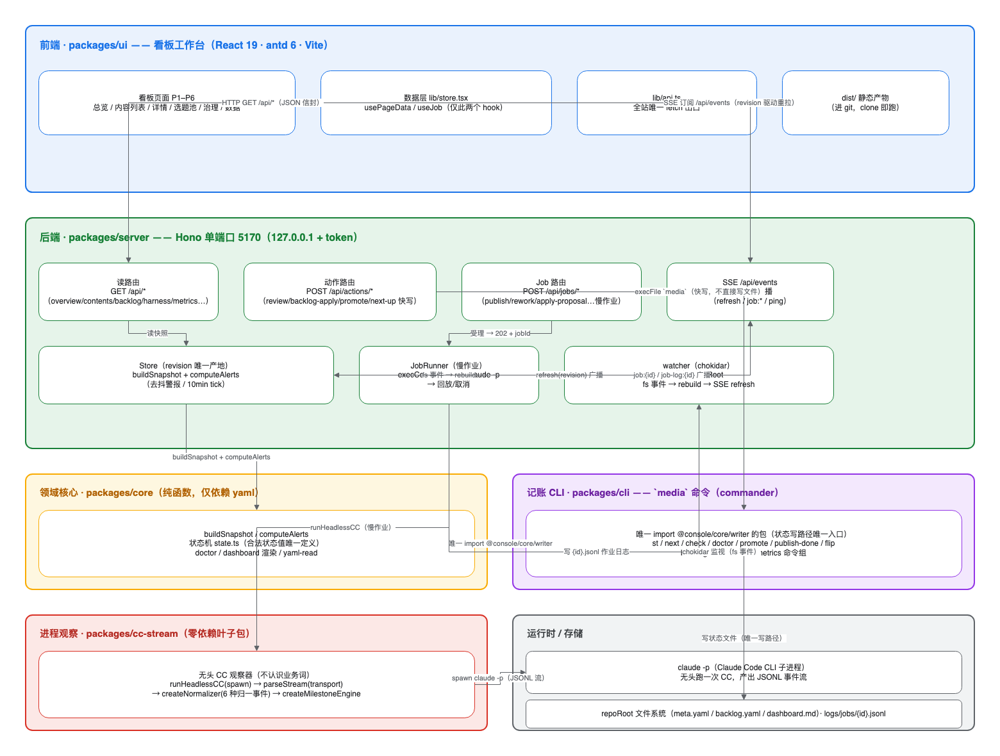

# 技术架构全景 —— 抖音自媒体流水线控制台（tools/console）

> 拆解对象：`tools/console/`（npm workspaces monorepo）。这是整条抖音自媒体流水线（生产线 `pipeline/` + 治理线 `harness/`）的**看板工作台与控制面**：给人在浏览器里看清「选题池 / 内容状态 / 治理任务」，并让所有状态翻转走同一条记账路径。
>
> 本文只拆「前端 + 后端 + 运行时」这一层技术结构，不含选题/创作/发布的具体 skill 内容。

## 0. 一句话定位

一个 **单端口、本地、SSE 驱动的看板 + 记账控制台**：浏览器看板是纯只读视图，所有写操作一律经由 `media` CLI（唯一写路径），慢作业落回 `claude -p` 子进程无头执行，前端通过 SSE 被动刷新。

## 1. 全景图



图中 6 个色块 = 6 个顶层模块（5 个 npm 包 + 1 个运行时/存储区），15 条边 = 关键数据流。下文的章节号与色块一一对应。

## 2. 前端拆解 —— `packages/ui`（蓝色块）

技术栈：**React 19 · antd 6 · Vite · react-router-dom 7 · react-markdown · remark-gfm**。

- **看板页面 P1–P6**：`总览 / 内容列表 / 详情 / 选题池 / 治理 / 数据`。页面是「渲染视图」，不自己拼状态——数据全部来自后端 `/api/*` 快照。
- **数据层 `lib/store.tsx`**：全站只有两个 hook——`usePageData`（拉一次快照并缓存）与 `useJob`（订阅某慢作业的进度/日志）。这两个 hook 是全前端唯一与后端对话的入口。
- **`lib/api.ts`**：**全站唯一 `fetch` 出口**。所有请求收敛到这一个函数，便于统一处理 token 头、`202 + jobId` 轮询、SSE 断线重连。
- **`dist/` 静态产物**：`vite build` 产物**进 git、clone 即跑**——后端直接用 `serveStatic` 把它兜出去，前端无需单独起 dev server。

前端不写文件、不跑 `claude`、不认识业务规则；它是「只读窗口 + 动作按钮」，动作按钮点击后调后端动作路由，由后端决定快写还是慢跑。

## 3. 后端拆解 —— `packages/server`（绿色块）

技术栈：**Hono 4 · @hono/node-server · chokidar 5 · SSE**，单端口 **5170**，绑定 `127.0.0.1`，**加 token 鉴权**。

后端按「读 / 写 / 慢 / 推 / 存」拆成五块：

- **读路由 `GET /api/*`**：`overview / contents / backlog / harness / metrics`… 全部返回 JSON 信封快照，纯读，不触发状态翻转。
- **动作路由 `POST /api/actions/*`**：`review / backlog-apply / promote / next-up`… 这些是**快写**——后端不直接改文件，而是 `execFile("media", …)` 调 CLI 记账（对应边 e7）。
- **Job 路由 `POST /api/jobs/*`**：`publish / rework / apply-proposal`… 这些是**慢作业**——立即返回 `202 + jobId`，作业在后台跑（对应边 e9）。
- **`Store`（revision 唯一产地）**：全系统唯一生产 `revision` 的地方，`buildSnapshot` 拼出看板快照、`computeAlerts` 算去抖警报（10min tick）。前端刷新靠的就是这个 revision。
- **`JobRunner`（慢作业）**：`execCcJob` 里 `spawn claude -p` 无头跑一次 CC，支持回放/取消；产出的事件流交给 `cc-stream` 归一。
- **watcher（chokidar）**：监视 `repoRoot`，**fs 事件 → rebuild → SSE refresh**（对应边 e5/e15）。
- **SSE `/api/events`**：`SseHub` 广播三类事件——`refresh`（revision 变了重拉快照）、`job:{id}` / `job-log:{id}`（慢作业进度/日志）、`ping`（心跳）。

## 4. 领域核心 `packages/core`（黄色块）与记账 CLI `packages/cli`（紫色块）

**`packages/core`：纯函数、仅依赖 yaml。** 是「领域大脑」，但**不碰 I/O、不碰进程**：

- `buildSnapshot` / `computeAlerts`（看板快照与警报，被 Store 复用）；
- **`state.ts`**：**合法状态值的唯一定义**——全项目「什么状态能翻到什么状态」只在这一处，其余环节不得代翻；
- `doctor`（体检）/ `dashboard` 渲染 / `yaml-read`。

**`packages/cli`：`media` 命令（commander 15）。** 它是**唯一 `import @console/core/writer` 的包**——也就是全系统**状态写路径的唯一入口**（对应边 e8/e13）。命令面：`st / next / check / doctor / promote / publish-done / flip / backlog / dashboard`… 一句话：**谁想改状态，都得经 `media`**。

这条「core 定规则、cli 是唯一写手」的分工，是整套系统不出现「状态被多处各写各的」的根基。

## 5. 进程观察 `packages/cc-stream`（红色块）

**零依赖叶子包，不认识任何业务词。** 职责是把一个 `claude -p` 无头 CC 子进程的原始输出，变成结构化事件流：

```
runHeadlessCC(spawn)
  → parseStream(transport)          // 解析子进程 stdout/stderr
  → createNormalizer(6 种归一事件)   // 把异构输出归一成固定事件类型
  → createMilestoneEngine            // 里程碑/进度推进
```

后端 JobRunner 只依赖这一个叶子包的接口，`cc-stream` 不反向依赖任何业务包——依赖方向单向、干净。

## 6. 运行时与存储（灰色块）

- **`claude -p`（Claude Code CLI 子进程）**：无头跑一次 CC，产出 JSONL 事件流（对应边 e11）。这是「让 AI 替人干活」的进程载体，慢作业全在这跑。
- **`repoRoot` 文件系统**：`meta.yaml`（每条内容的真相源）、`backlog.yaml`（选题池）、`dashboard.md`（派生视图）以及 `logs/jobs/{id}.jsonl`（作业日志，对应边 e14）。注意 `dashboard.md` 是**派生视图，不是真相源**。

## 7. 三条数据流（把边串起来）

1. **读链路**：看板打开 → `GET /api/*`（e1）→ `Store.buildSnapshot`（e3/e4）→ JSON 返回；此后前端靠 `SSE /api/events` 的 `refresh(revision)`（e2/e6）被动重拉，不轮询。
2. **快写链路**：看板点「出审/apply」→ `POST /api/actions/*` → 后端 `execFile("media", …)`（e7）→ `cli` 唯一经 `core/writer` 写状态文件（e8/e13）→ watcher 感知 fs 事件（e15）→ rebuild → SSE 广播（e5/e6）。
3. **慢作业链路**：点「发布/rework」→ `POST /api/jobs/*` 返回 `202 + jobId`（e9）→ `JobRunner` 经 `cc-stream` `runHeadlessCC`（e10）→ `spawn claude -p`（e11）→ 进度经 `job:{id}` / `job-log:{id}` 广播（e12）→ 日志落 `logs/jobs/{id}.jsonl`（e14）。

三条链路共享同一条记账出口（`media` → `core/writer`），慢/快之分只在**入口路由**，不在**写路径**。

## 8. 关键设计决策（为什么这么设计）

| 决策 | 理由 |
|---|---|
| 写路径唯一收敛到 `media` CLI | 状态翻转不散落；合法状态值唯一定义在 `core/state.ts`，翻错在入口就挡住 |
| 快写走 `execFile`、慢作业走 `spawn claude -p` | 快写毫秒级、不占进程；慢作业（跑一次 CC）异步 `202+jobId`，前端不傻等 |
| 前端靠 SSE 被动刷新、不轮询 | revision 是唯一刷新信号，避免前端自己算「什么时候该重拉」 |
| `dist/` 进 git、后端 `serveStatic` 兜底 | clone 即跑，前后端一个端口一个进程，无部署编排 |
| `cc-stream` 零依赖叶子包 | 进程观察是通用能力，不该认识业务词；依赖方向单向 |
| `dashboard.md` 是派生视图、`meta.yaml` 是真相源 | 避免「两个地方都在记账」导致的漂移 |
