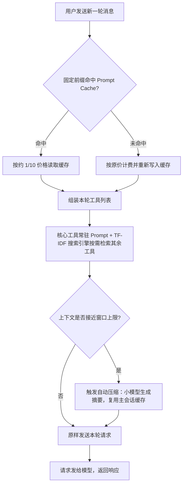
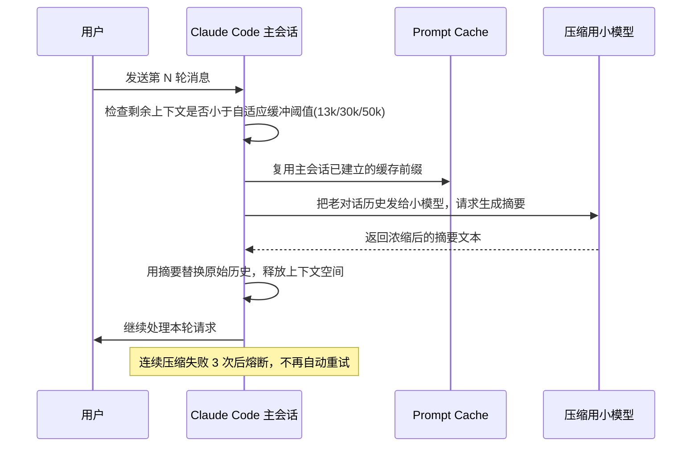

# 长对话为什么越聊越贵：拆解 Claude Code 的四层 Token 成本优化

上一篇《一个 17MB 的 JS 文件，让内存从 35MB 暴涨到 1GB》讲的是 Claude Code 在启动瞬间的内存问题——一次性全量解析打包产物，把内存峰值顶到了天上，最后靠代码分割按需加载解决。那是一个"空间"上的成本问题：内存占多少。这一篇要看的是另一种成本，"时间"维度上的——你和 Claude Code 聊得越久，每一次请求就越贵，而且贵的方式很反直觉。

原因很简单：大模型没有记忆。它不会像人一样把之前聊过的内容记在脑子里，只在下一句话时调用一下。每一次请求，客户端都要把这一轮对话之前的全部历史——系统提示、工具定义、你说过的每一句话、模型回复过的每一句话——重新打包，完整地发一遍给模型，模型再把这一整包内容重新计算一遍 token 费用。聊十句要重读十遍历史，聊一百句就要重读一百遍。单次请求的价格，会随着对话变长而持续上涨，这是几乎所有 AI 编程工具账单里都藏着的隐形成本，只是大多数产品没有在源码层面下功夫去对抗它。

这篇文章的任务是把 Claude Code 源码里应对这笔账单的机制拆开看：它在哪几个环节省钱、每个环节省的是什么钱、怎么省下来的。读完你能做到三件事——看懂 Prompt Cache 命中和未命中在账单上的区别、理解为什么工具列表也是一笔隐形开销、知道上下文快满时系统内部发生了什么。这些机制不是 Claude Code 独有的黑魔法，是任何自己搭 AI 应用、需要控制 token 成本的工程师都用得上的设计模式。

## 一、为什么长对话会越聊越贵

### 1.1 大模型没有记忆：每次请求都要从头读一遍

先把痛点说透。大模型 API 是无状态的——它不维护会话，每次调用都是一次独立的、全新的推理。要让模型"记得"之前聊过什么，唯一的办法是把历史对话原样塞进这次请求的输入里。这意味着，如果你的对话进行到第 50 轮，第 51 轮请求的输入里包含前面 50 轮的全部文本，而不只是这一轮新说的话。

代价是双重的。第一，token 消耗随对话长度线性增长——聊得越久，单次请求越贵，这是账单上直接能看到的部分。第二，也是容易被忽略的一点：上下文窗口是有限的，无论窗口开到 200k 还是 1M，长对话最终都会撞到那个上限，届时如果没有应对机制，请求会直接失败。

Claude Code 面对的就是这两个问题——怎么让每次重发历史的成本降下来，以及上下文真的快满了该怎么办。源码里能数出来至少三招，外加一个面向用户的省钱开关。

### 1.2 Claude Code 的应对全景

在细看每一招之前，先看一眼整体链路——四个机制分别卡在请求流程的哪个位置，谁在谁前面。

整条请求处理的数据流大致如下：



这条链路有一个明确的顺序约束：缓存判断在最前面，因为它决定了这一整轮请求的固定部分（系统提示、工具定义）按什么价格计费；工具列表的组装紧跟其后，因为工具定义本身也算在这个"固定部分"里，会直接影响缓存能命中多少；上下文长度检查放在最后，是因为只有确定了这一轮实际要发送的内容大小，才知道是否需要先压缩历史再发送。三个环节前后咬合，缺了任何一环，后面的省钱效果都会打折扣。

下面逐一拆开看。

## 二、招式一：Prompt Cache——把不变的部分缓存住

### 2.1 减少哪部分成本

一次请求里，内容大致分两种：每次都不变的（系统提示、工具定义、项目里固定注入的上下文）和每次都在变的（你这一轮新说的话）。前者是纯粹的重复劳动——模型每次都要重新"读"一遍完全相同的文本，却拿不到任何新信息。这部分如果能免费或者打折，账单会立刻瘦下来一大截。

### 2.2 怎么做到的

这里用到的是 Prompt Cache（提示词缓存）：把请求里固定不变的前缀部分缓存在服务端，下次请求如果前缀完全一致，就直接命中缓存，价格大概只有原价的十分之一。这是 Anthropic 官方定价能力，不是 Claude Code 自己发明的，具体折扣比例以官方文档为准（参考 [Prompt Caching 文档](https://platform.claude.com/docs/en/build-with-claude/prompt-caching)）。Claude Code 要做的，是把系统提示和工具定义这类内容组织成稳定不变的前缀，尽量让它在整个会话周期内保持一致，从而最大化缓存命中率。

这里有一个坑需要提前说明：缓存命中的前提是前缀**逐字节一致**——哪怕只改动了一个字，缓存也会失效，这一轮请求就要按原价重新计费，还要重新写入一次缓存。所以固定部分越"稳定"越好，频繁变动的内容不适合放在缓存前缀里。

### 2.3 一个额外的偏执：缓存失效诊断

Claude Code 在这上面做了一件更细致的事：它不满足于"缓存失效了"这个结论，还要能查出**是谁让它失效的**。做法是给每个工具的描述都存一份哈希值，下次请求前先比对哈希，一旦发现某个工具的描述变了，就能直接定位到具体是哪个工具。源码注释里写得很直白：77% 的工具缓存失效，都是某个工具描述被改动了一个字导致的（`src/services/api/promptCacheBreakDetection.ts:35-37`）。

这个数字背后是一个很朴素的工程判断：缓存失效这件事，原因往往不是"内容天然会变"，而是"有人手滑改了一处不该改的地方"——既然大部分失效都出在同一类原因上，那就值得专门做一层诊断，把这类问题在源头上暴露出来，而不是等账单异常了才去猜。

**验证方式**：这一步不需要跑 Claude Code 本身，用 Anthropic API 原生调用即可复现——连续发送两次带 `cache_control` 标记、系统提示完全一致的请求，对比两次响应 `usage` 字段里的缓存相关数值：

```bash
# 第一次请求：系统提示较长，标记为可缓存
curl https://api.anthropic.com/v1/messages \
  -H "x-api-key: $ANTHROPIC_API_KEY" \
  -H "anthropic-version: 2023-06-01" \
  -H "content-type: application/json" \
  -d '{
    "model": "<替换成你正在使用的模型 ID>",
    "max_tokens": 100,
    "system": [{"type": "text", "text": "<一段较长的固定系统提示>", "cache_control": {"type": "ephemeral"}}],
    "messages": [{"role": "user", "content": "第一轮提问"}]
  }'
# 预期：usage.cache_creation_input_tokens 有数值，说明这次是在写缓存

# 第二次请求：system 内容逐字节保持一致
curl https://api.anthropic.com/v1/messages \
  -H "x-api-key: $ANTHROPIC_API_KEY" \
  -H "anthropic-version: 2023-06-01" \
  -H "content-type: application/json" \
  -d '{
    "model": "<替换成你正在使用的模型 ID>",
    "max_tokens": 100,
    "system": [{"type": "text", "text": "<同一段固定系统提示，一字不改>", "cache_control": {"type": "ephemeral"}}],
    "messages": [{"role": "user", "content": "第二轮提问"}]
  }'
# 预期：usage.cache_read_input_tokens 有数值、input_tokens 明显下降——命中缓存的直接证据
```

如果把第二次请求里 `system` 文本改动一个字符再发一遍，会看到 `cache_read_input_tokens` 归零、缓存重新走写入路径——这就是缓存失效的现场复现。

## 三、招式二：少带工具——工具清单本身也是钱

### 3.1 为什么工具描述是隐形成本

第二招更反直觉：工具的说明书本身也是要按 token 收费的。每挂载一个工具，它的名字、用法说明、参数描述都要作为固定内容塞进 prompt，每一次请求都要重新计费一遍（哪怕命中缓存，也是按缓存价格而不是免费）。工具越多，这部分固定开销就越大——而现实中，一次对话真正会用到的工具往往只是全集里的一小撮。

### 3.2 核心工具常驻 + 搜索引擎按需检索

Claude Code 的做法是分层：只把最核心的那一批工具（源码里 `CORE_TOOLS`，约 30 项，`src/constants/tools.ts:137`）常驻在 prompt 里，剩下的全部收进一个独立的搜索索引，让模型在真正需要时自己按需去查，而不是把整本工具手册都预先摊开。

这个搜索引擎用的是经典的 TF-IDF（词频-逆文档频率）检索算法，可以把它简单理解成一种"关键词匹配打分"：一个词在某条工具描述里出现得越频繁、同时在其他工具描述里出现得越少，这个词对这条工具的辨识度就越高，打分也越高。Claude Code 在此基础上还给不同字段设置了不同权重（`src/services/searchExtraTools/toolIndex.ts:34-36`）：

| 字段 | 权重 |
| --- | --- |
| 工具名（name） | 3.0 |
| 搜索提示（searchHint） | 2.5 |
| 详细描述（description） | 1.0 |

这个权重分配传递的判断很明确：工具名本身的匹配信号最可靠，值三倍分；专门写来辅助检索的搜索提示次之；详细描述文字最长，但噪音也最多，权重压到最低。这不是一次性凑出来的比例，而是"越精炼、越有辨识度的字段越值得信任"这个直觉的量化版本。

该带的才带，能省一个字是一个字——常驻工具只留下高频、通用、几乎每次对话都可能用到的那一批，长尾工具的说明书成本就从"每次都付"变成了"用到才付"。

**验证方式**：这套权重分配的效果不依赖 Claude Code 本身也能验证。下面是一版简化实现（用字符串包含代替完整的 TF-IDF 计算，只用来验证权重分配本身的效果，不是源码逐字摘录），存成 `score.js` 后用 `node score.js` 直接跑：

```javascript
// score.js —— 验证 name(3.0) / searchHint(2.5) / description(1.0) 权重分配的效果
const tools = [
  { name: 'Bash', searchHint: '执行 shell 命令', description: '在受控环境中运行任意 bash 命令，支持超时与后台执行' },
  { name: 'WebSearch', searchHint: '联网搜索', description: '发起网页搜索，返回带链接的结果摘要' },
  { name: 'Read', searchHint: '读取文件', description: '按路径读取本地文件内容' },
  { name: 'Edit', searchHint: '编辑文件', description: '对已有文件做精确字符串替换' },
]
const WEIGHTS = { name: 3.0, searchHint: 2.5, description: 1.0 }

function score(query, tool) {
  return Object.entries(WEIGHTS).reduce((sum, [field, weight]) => {
    return sum + (tool[field].includes(query) ? weight : 0)
  }, 0)
}

const query = '命令'
const ranked = tools
  .map(t => ({ name: t.name, score: score(query, t) }))
  .sort((a, b) => b.score - a.score)

console.log(ranked)
// 预期输出：Bash 排第一（searchHint + description 都命中"命令"，得分 3.5），
// 其余工具因为完全不命中查询词，得分为 0
```

预期结果是名字或搜索提示里直接命中查询词的工具排名明显靠前，完全不命中的工具排到最后——这就是权重设计生效的直观体现。

## 四、招式三：自动压缩——上下文快满时怎么办

### 4.1 触发时机：自适应缓冲区

前两招省的是"每次请求要花多少钱"，第三招解决的是"对话能聊多长"。上下文窗口终究有上限，长期对话迟早会逼近这个上限。Claude Code 的做法是在快到上限前主动介入：喊一个小模型，把老的对话历史浓缩成一段摘要，用摘要替换掉原始的长历史，腾出空间继续聊。

触发时机不是一个写死的固定数字，而是按上下文窗口大小自适应留缓冲：普通窗口留 13k（约 1.3 万）token 的缓冲，窗口达到 400k 以上留 30k，达到 800k 以上留 50k（`src/services/compact/autoCompact.ts:62,79-81`）。窗口越大，需要预留的安全边际也越大——这是因为大窗口场景下单轮内容本身可能更庞杂，留的缓冲太小容易在压缩还没触发前就撞上限。

### 4.2 压缩本身也要省钱：复用主会话缓存

这里有一个容易被忽略但很关键的细节：压缩这个动作本身也会产生 token 消耗（喂给小模型的输入也要计费），如果处理不当，"省钱的操作"反而会变成新的开销来源。Claude Code 的应对是让压缩流程复用主会话已经建立好的 Prompt Cache 前缀（`src/services/compact/compact.ts:455-457`，对应埋点 `tengu_compact_cache_prefix`）。

源码里的实验注释直接给出了不复用的代价：如果压缩流程不复用主会话缓存，走一条独立路径，命中率会掉到几乎为零——98% 都是缓存 miss，等于每次压缩都在按原价重新付一遍固定前缀的钱。这个数字说明一件事：省钱机制之间不是互相独立的，压缩要依附在缓存这个更底层的机制上才划算，两者脱钩会互相拆台。

整个压缩流程的时序大致如下：



图上有一步容易漏看：压缩用的小模型请求也要先经过 Prompt Cache 这一层，而不是绕开它直接发送——顺序反了的话，98% 缓存 miss 的代价就会实打实地落在账单上。

### 4.3 保险丝：连续失败就熔断

最后这步不要跳过——压缩不是永远保证成功的操作，网络问题、小模型返回异常都可能导致某次压缩失败。Claude Code 给这个流程配了一个熔断器：连续压缩失败达到 3 次（`MAX_CONSECUTIVE_AUTOCOMPACT_FAILURES = 3`，`src/services/compact/autoCompact.ts:99`），系统就不再自动重试，避免在一个反复失败的操作上无限硬撑、持续烧钱。这不是谁的失误兜底，而是"自动化机制必须给自己设边界"这个工程常识的体现——省钱的手段本身如果失控，反而会变成新的成本黑洞。

**验证方式**：这一步不需要看源码也能观察到现象——在一次真实会话里持续聊到接近上下文窗口上限，正常情况下你会看到系统自动插入一条摘要性质的系统消息，历史对话被替换为浓缩版本，会话得以继续；具体的提示文案和触发时机以你使用的 Claude Code 版本实际表现为准，本文只对源码里写死的阈值和熔断次数负责。

## 五、彩蛋：穷鬼模式 /poor

除了以上三招，源码里还藏着一个面向用户的显式开关：`/poor` 命令，官方叫它"穷鬼模式"（`poorMode`）。开启后，Claude Code 会关掉一切非必要的额外 AI 调用——不再后台自动提取记忆（`extract_memories`）、不再生成下一步建议（`prompt_suggestion`）、连独立验证结果的 verification agent 也一并跳过（`src/commands/poor/poorMode.ts:1-5`；`src/constants/prompts.ts:371-372` 注释写的是"Poor mode: skip verification agent to save tokens"；`src/utils/attachments.ts:2431-2433`）。

这三个被砍掉的功能有一个共同点：它们都是"锦上添花"型的后台增强，不影响核心的对话和执行能力，但每一个都是独立的额外模型调用，都要单独计费。把它们做成一个可以随时打开关闭的开关，而不是强制所有用户都为这些增强功能买单，是一个很实用的设计取舍——文件名直接叫 `poorMode`，说明这不是一个藏起来的内部特性，是团队清楚知道用户会在意月底账单，主动给出的选项。

## 六、验证清单与小结

把前面几招过一遍验证方式，汇总成一张表：

| 机制 | 验证方式 | 预期结果 |
| --- | --- | --- |
| Prompt Cache | 连续两次调用 Anthropic API，前缀保持一致 | 第二次响应 `usage.cache_read_input_tokens` 有数值，`input_tokens` 明显下降 |
| 缓存失效诊断 | 改动一处工具描述后再次调用 | 缓存重新走写入路径，`cache_read_input_tokens` 归零 |
| TF-IDF 工具检索 | 手写加权打分脚本，测试几个查询词 | 名字命中的工具排名靠前，仅描述里模糊提及的工具排名靠后 |
| 自动压缩 | 真实会话持续聊到接近上下文上限 | 系统插入摘要性消息，历史被浓缩替换，会话继续 |
| 压缩缓存复用 | 对照压缩请求是否命中主会话缓存前缀 | 命中时账单增量很小；脱离缓存单独跑，成本明显更高 |
| 熔断保险丝 | 无需单独验证，读源码常量确认边界 | `MAX_CONSECUTIVE_AUTOCOMPACT_FAILURES = 3`，连续 3 次失败后不再自动重试 |

回顾一下这四招（含彩蛋）背后的决策逻辑：Prompt Cache 解决的是"固定内容不该反复付费"；工具检索解决的是"不该为用不到的东西预付成本"；自动压缩解决的是"上下文终会耗尽，要有个体面的退路，而且这个退路本身也不能失控地花钱"；穷鬼模式则是把选择权交还给用户，承认不是所有增强功能都值得强制买单。四招合在一起，其实是同一个原则在四个不同位置的落地：**只为真正被使用、真正带来信息增量的部分付费**，其余的重复劳动能省一分是一分。

这套思路不绑定 Claude Code，任何自建的 AI 应用只要有多轮对话、有工具调用、有可能触达上下文上限，都可以照搬这四个检查点去审视自己的实现：固定前缀有没有做成稳定可缓存的结构、工具列表是不是全量常驻、上下文快满时有没有兜底方案、兜底方案本身有没有失控的风险。

省钱的机制讲完了，下一集要看的是另一个更贴近使用体验的瞬间——你按下 Esc 想让 Claude Code 停下来的那 0.1 秒，内部到底发生了什么、怎么做到几乎瞬间响应的。这两个话题其实是同一枚硬币的两面：一个管的是"该省的钱怎么省"，一个管的是"该停的时候怎么停得干净"，都是 Claude Code 在工程细节上愿意较真的地方。
