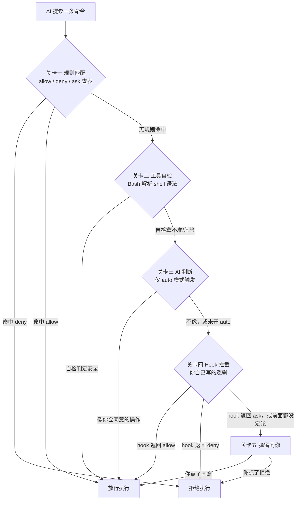
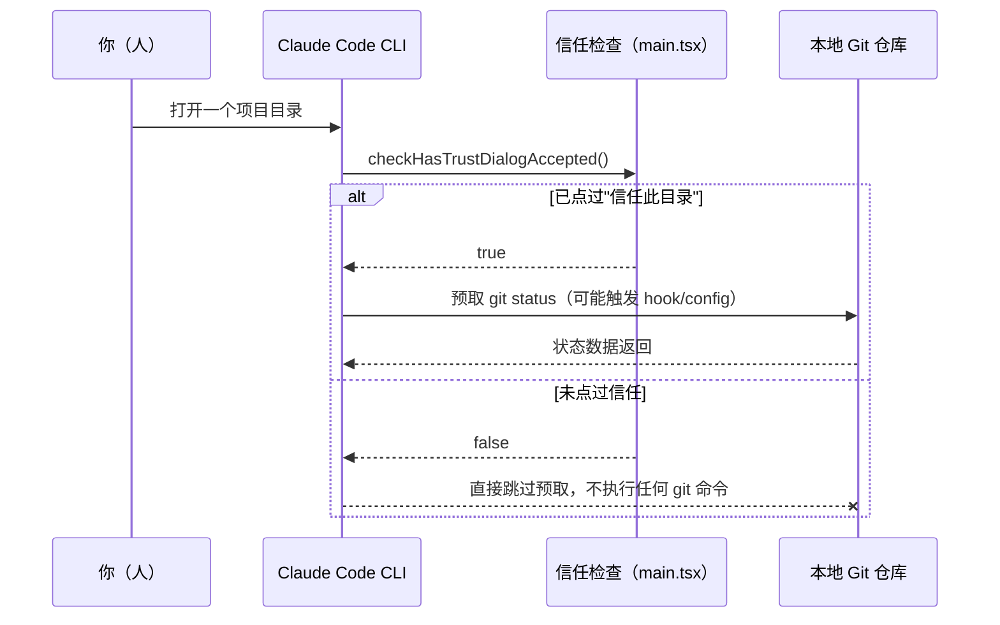

# Claude Code 凭什么敢让 AI 在你电脑上跑命令？源码里的五道权限关卡

上一篇拆的是 Claude Code 怎么在账单上抠钱——prompt cache 命中打一折、精简工具描述、用检索代替硬塞上下文，本质是把"不该问模型的问题"提前挡在外面。省钱是个相对轻松的问题：算法保守一点，最多多花点 token，出不了大事。

这一篇要面对的问题凶险得多。Claude Code 能在你电脑上直接跑命令——读文件、写文件、执行 shell、装依赖。一个能跑任意命令的 AI，理论上能删你的库、偷你的数据、给你装个后门。你敢让它跑，不是因为它"应该"很乖，而是因为源码里有一整套机制，在它真正执行之前先把关。这篇文章把这套机制从源码里拆出来看：一条命令从被 AI 提出，到真正落地执行，中间要闯几道关、每道关谁在判、判不出来时权力交给谁。读完你应该能做到：看懂 `settings.json` 里 allow/deny/ask 规则怎么生效、理解为什么 Bash 工具能拦住你规则里没写过的危险管道命令、自己写一个 Hook 在命令执行前插一脚、并说清楚为什么 Claude Code 连"看一眼 git 状态"都要先问你信不信任这个目录。

> 本文技术细节全部来自对 Claude Code 源码的逐行核查（`source_repo` 见文末），每个结论后面标了具体文件和行号，方便你自己去源码里对一遍。

## 一、为什么需要一条权限管线

### 1.1 根本问题：能跑命令的 AI，风险和能力成正比

如果只靠"模型足够聪明，不会乱来"来兜底，风险敞口是无限的——模型会出错，提示词会被注入，你自己也可能一时没看清就点了确认。真正能落地的做法是反过来想：不去赌模型永远靠谱，而是假设它随时可能提出一个危险操作，然后在执行前架好一层机制，把"能不能跑"这件事从模型的自觉，转移到一套可配置、可审计的规则系统上。

Claude Code 的做法是分层——便宜的判断放最前面，贵的判断往后放，实在判不出来的最后才交还给人。源码里这套逻辑集中在 `src/utils/permissions/permissions.ts`，核心函数是 `hasPermissionsToUseToolInner`（:1179）。

### 1.2 整体工作流

把源码里这条判断链路简化成五道关卡，按顺序排列：



这条链路有个不能打乱的顺序约束：越靠前的关卡代价越低——规则匹配是纯查表，毫秒级；越靠后代价越高——弹窗问人要打断你的工作流，等你回来点一下。把便宜的判断放前面、贵的放后面，是这条管线唯一说得通的设计——如果反过来，每条命令先弹窗问你，再回头查规则，规则系统就形同虚设，你会被烦到关掉所有确认。另外，源码里权限判断的结果只有三种，`PermissionBehavior = 'allow' | 'deny' | 'ask'`（`src/types/permissions.ts:45`），每道关卡产出的都是这三态之一，而且每次决策都带一条 `decisionReason`（:181, 206, 235）——这意味着你事后能审计"这条命令为什么被放行/拒绝"，不是一个黑盒。

## 二、关卡一、二：规则匹配与工具自检——快速路径

### 2.1 关卡一：规则匹配

**为什么**：如果每条命令都要人工点头，效率低到没法用；但完全不设前置过滤，又等于把安全责任全推给后面更贵的判断层。最经济的做法是先用一张你自己维护的规则表做第一轮筛选——命中就直接出结果，不进入后面任何一关。

**怎么做**：Claude Code 在配置里读你写的允许/禁止规则，源码对应 `getDenyRuleForTool` / `getAskRuleForTool` / `toolAlwaysAllowedRule`（permissions.ts:287、297、275），在主管道里的调用顺序是 deny 规则先判（:1192）、再判 ask 规则（:1205）。规则的结构大致如下（字段名以你本地版本的官方文档为准，这里只示意结构）：

```json
// .claude/settings.json（示意结构）
{
  "permissions": {
    "deny": ["Bash(rm -rf *)"],
    "allow": ["Bash(git *)", "Read(*)"],
    "ask": []
  }
}
```

**审查点**：`deny` 优先级高于 `allow`——一条命令如果同时命中两边的规则，源码判断顺序是 deny 先走（:1192 在 :1205 之前），也就是说你没法用一条宽松的 allow 规则去覆盖一条更精确的 deny 规则，这是故意的，安全规则不应该被更宽的允许规则悄悄绕过。

**验证**：在 `deny` 里加一条你确定会触发的规则（比如某个你从不希望被自动执行的命令模式），让 AI 尝试提出这条命令，观察它在关卡一就被拒绝，并且拒绝的提示里能看到具体原因——如果命中的是 deny 规则，理由链会直接指向这条配置，而不是走到后面的工具自检或弹窗。

### 2.2 关卡二：工具自检——每个工具有自己的脑子

**为什么**：规则匹配再细，也是字符串层面的比对，容易被绕过。最典型的场景是命令拼接——如果规则只 deny 了 `rm`，一条 `echo hi && rm -rf /tmp/x` 用简单前缀匹配是抓不住后半段的。危险命令往往不老实地待在命令开头，而是藏在管道、分号、`&&` 后面。

**怎么做**：源码没有让规则匹配独自扛下这件事，而是给每个工具挂了自己的自检逻辑——主管道里对应 `tool.checkPermissions`（:1237）。Bash 工具的自检最典型：它不是把整条命令当一个字符串比对，而是先用 shell 语法解析器（`src/utils/bash/bashParser.ts`）把命令拆解开，再用危险命令识别逻辑（`src/utils/permissions/bashClassifier.ts`）逐段检查——管道后面、分号后面藏着的危险子命令，一样能被揪出来。

**人工审查点**：这一关能拦的是"语法上能识别的危险模式"，不是万能的意图理解——它解决的是"规则写的是 `rm`，你拼了个 `r''m` 或者用变量拼接绕过去"这类字符串层面的绕过，而不是判断"这条命令在业务语义上是否合理"。语义层面的判断留给了后面的关卡。

**验证**：观察一条包含管道或 `&&` 的组合命令在没有命中任何显式规则时的处理路径——如果其中某个子命令触发了自检逻辑的危险模式识别，会在这一关被拦下或转入 ask，而不是因为整条命令字符串没有精确匹配到 deny 规则就直接放行。

## 三、关卡三、四：AI 判断层与你自己写的 Hook——兜底路径

### 3.1 关卡三：全自动模式下，多一个 AI 监工

**为什么**：如果你开了"全自动"模式（不想每条命令都手动确认），前两关又没能给出确定结论，直接放行风险太大，直接拒绝又太死板——命令是不是危险，很多时候要结合"你平时的使用习惯"来判断，这不是一张静态规则表能覆盖的。

**怎么做**：主管道之外还有一层外层逻辑 `hasPermissionsToUseTool`（permissions.ts:519-602）：当内层判断结果是 `ask`、并且当前处于 `auto` 模式、同时对应 feature flag（`TRANSCRIPT_CLASSIFIER`）打开时，才会走到这个分类器，让另一个 AI 判断"这个操作像不像你平时会同意的"。它拦不拦得住取决于这次判断，而不是走个过场。

**据实说明（这里必须澄清，不然容易理解偏差）**：这个 AI 分类器在外部开源构建里是 ANT-only 的 stub 特性（`bashClassifier.ts` 头部注释明写"classifier permissions feature is ANT-ONLY"）——也就是说它不是默认对所有人常开的一层，只在特定构建条件下生效。这一关代表的设计思路值得记住：全自动模式砍掉了人工确认这道闸，系统就得在别处补一道更贴近"意图"的判断，而不是干脆放弃兜底。

**验证**：确认自己使用的构建是否带这层分类器，最直接的办法是去查 `bashClassifier.ts` 头部注释和当前的 feature flag 状态——如果分类器不可用，一条在前两关判不出结论的模糊命令会直接落到关卡四（Hook）或关卡五（弹窗），不会凭空多出一次"AI 判断像不像你"的中间步骤，先确认这一点，再往下理解 Hook 和弹窗兜底的行为才不会觉得"少了一步"。

### 3.2 关卡四：Hook 拦截——你自己写的安检逻辑

**为什么**：前三关全是 Claude Code 自带的通用逻辑，覆盖不了你团队特有的安全策略。比如"任何命令里不能出现生产库连接串""对某个目录的写操作一律先问我"——这些规则太具体，没法靠产品内置的规则语法表达完整，得让用户自己写代码判断。

**怎么做**：Claude Code 允许挂自定义 Hook，在工具真正执行前插一脚。源码里对应 `src/utils/hooks.ts:633-660`——Hook 的返回值里如果 `hookSpecificOutput.hookEventName === 'PreToolUse'`，那么 `permissionDecision` 字段可以取 `'allow' | 'deny' | 'ask'` 三个值中的一个，`deny` 会产生一个 `blockingError`，直接把这次执行挡下来（类型定义见 hooks.ts:346、500-502）。Hook 输出结构大致如下（字段名以你本地版本文档为准，这里只标出已确认的两个核心字段）：

```json
// PreToolUse Hook 的返回结构（src/utils/hooks.ts:633-660，核心字段已确认）
{
  "hookSpecificOutput": {
    "hookEventName": "PreToolUse",
    "permissionDecision": "deny"
  }
}
```

**人工审查点**：Hook 的三个返回值和前面权限管线的三态（allow/deny/ask）是同一套语义，这不是巧合——Hook 本质上是插进这条管线里的一个自定义关卡，而不是一套独立机制，理解了这一点，你写 Hook 时就知道该往哪个方向设计判断逻辑。

**验证**：写一个最小的 PreToolUse Hook 脚本，对某个你能稳定复现的测试命令返回 `permissionDecision: "deny"`，触发这个命令，确认 Claude Code 侧直接拒绝执行并抛出对应的拒绝提示，而不是继续往后走到关卡五的弹窗。

## 四、关卡五 + 最妙的细节：兜底问人，以及连看一眼都要先信任

### 4.1 关卡五：弹窗问你——决定权还给人

前面四关，但凡有一关拿不准、给出了 `ask` 结果，最终都会走到主管道末尾的 `passthrough → ask`（permissions.ts:1321），在非 auto、非"不再询问"模式下，这就落到一次真实的用户确认弹窗。这一关不是让人兜底所有决策，而是收敛前面几关都没法给出确定结论的那一小撮情况——能放行的早在关卡一、二放行了，能拦的早被拦了，真正弹到你面前的，是机器自己都判不准的操作。

### 4.2 最妙的细节：连看一眼 git 状态，都要先点过"信任"

前面五关都是围绕"AI 提议的命令"展开的。但源码里有一个更隐蔽的门槛，不是针对命令，而是针对 Claude Code 自己的一个"顺手"操作——它一打开你的项目，想读一下 git 状态，这么个看起来人畜无害的动作，也要先确认你点过"信任这个目录"。

**为什么这么谨慎**：`git status` 这类命令能通过 git 的钩子和配置偷偷执行任意代码（比如 `core.fsmonitor`、`diff.external` 这些配置项可以指向任意可执行文件）。你以为只是瞟一眼仓库状态，可一个被动过手脚的仓库，光"看一眼"这个动作本身就可能让代码被执行——这和"扫码送礼品"背后其实是木马是同一个逻辑——风险不在于你做了什么"危险操作"，而在于一个看起来安全的动作背后可能藏着别的东西。

**怎么做**：对应源码在 `src/main.tsx:501-527` 的 `prefetchSystemContextIfSafe`——交互模式下，只有 `checkHasTrustDialogAccepted()` 返回真，才会去调用 `getSystemContext()` 读 git status。函数里的注释直接写明了原因（:503）："Git commands can execute arbitrary code via hooks and config (e.g., core.fsmonitor, diff.external)"。这个信任边界的说明在 `src/interactiveHelpers.tsx:170`。整个流程大致如下：



图上最重要的一条边是"未信任"分支下 CLI 到 Git 那条被切断的箭头——在你没点头之前，Claude Code 连最无害的操作都先摁住，不给"看一眼"留任何机会。这是这套权限管线里唯一不属于"命令执行前拦截"、而是"读操作前拦截"的门槛，容易被忽略，但恰恰是最能看出设计者谨慎程度的地方。

> 一个容易踩的坑：如果你在整理项目文档时看到有旧资料把这个信任检查的位置写成 `src/context.ts`，那是过期信息——`context.ts` 里确实有个 `getGitStatus` 函数，但它本身不带信任门控，真正的信任检查逻辑在 `main.tsx` 的 `prefetchSystemContextIfSafe` 里。查源码时认准函数名，不要只认文件名。

## 五、验证清单

把前面几关的验证方式收拢成一张表，照着走一遍就能确认自己理解对了：

| 关卡 | 验证方式 | 预期结果 |
| --- | --- | --- |
| 关卡一 规则匹配 | 在 `settings.json` 的 `deny` 里加一条规则，触发一次命中 | 命令在关卡一即被拒绝，拒绝原因指向该规则 |
| 关卡二 工具自检 | 构造一条不命中任何显式规则、但含管道/`&&`的危险组合命令 | 危险子命令被 Bash 自检识别，不因整条字符串未精确匹配 deny 而放行 |
| 关卡三 AI 判断 | 在开启 auto 模式且分类器可用的构建下观察一条模糊操作的处理路径 | 分类器介入判断，而非直接放行；注意此关在外部开源构建默认不生效 |
| 关卡四 Hook 拦截 | 写一个最小 PreToolUse Hook，对测试命令返回 `permissionDecision: "deny"` | 命令被直接拒绝，不再进入关卡五弹窗 |
| 关卡五 弹窗问人 | 触发一条前四关都判不出确定结论的操作 | 出现用户确认弹窗，决定权落到你手上 |
| 信任门 | 在未点过"信任此目录"的项目里打开 Claude Code | 不会自动预取 git status，任何 git 相关读取都被跳过 |

## 小结

这条权限管线背后有几个设计决策值得记住：

- **代价分层**：便宜的判断（查表）放最前面，贵的判断（AI 推理、等人确认）放最后面——这不只是性能优化，也是安全设计的一部分，能自动判定的越多，需要打断人的场景就越少。
- **结果收敛到三态**：每一关产出的都是 `allow / deny / ask` 中的一个，而且带可审计的 `decisionReason`——这让整条链路是可解释的，不是一个"信任模型就好"的黑盒。
- **规则之外留了两个可扩展的口子**：Hook 是给用户自己的安全策略留的接口，AI 判断层是给"规则说不清楚"的长尾场景留的兜底——两者的返回语义和内置三态完全一致，理解了这套语义，你自己扩展的逻辑才能正确嵌进这条管线。
- **风险不只在"执行"，也在"读取"**：git 状态预取那道信任门提醒了一件容易被忽略的事——某些看起来只是"读一下"的操作，背后也可能触发代码执行，安全审查不能只盯着"会写会执行"的动作。

关键源码锚点，方便你直接跳过去对照：

- 权限主管道：`src/utils/permissions/permissions.ts:1179`（`hasPermissionsToUseToolInner`）
- 三态类型：`src/types/permissions.ts:45`（`PermissionBehavior`）
- AI 判断层：`src/utils/permissions/permissions.ts:519-602`
- Hook 拦截：`src/utils/hooks.ts:633-660`
- 信任门（git 预取）：`src/main.tsx:501-527`（`prefetchSystemContextIfSafe`）

一个 Agent 敢放出去多大的权限，取决于它的权限系统设计得有多严——敢放权的前提，是先把篱笆扎死。但权限只解决了"这一条命令能不能跑"的问题，还有一个更麻烦的问题没解决——Claude Code 经常同时开跑好几个工具调用，读文件、写文件、跑命令并发进行——十个工具同时跑，它们怎么保证不会同时改同一个文件、把你的东西写坏？下一篇拆并发工具调度，看源码怎么处理这件事。
