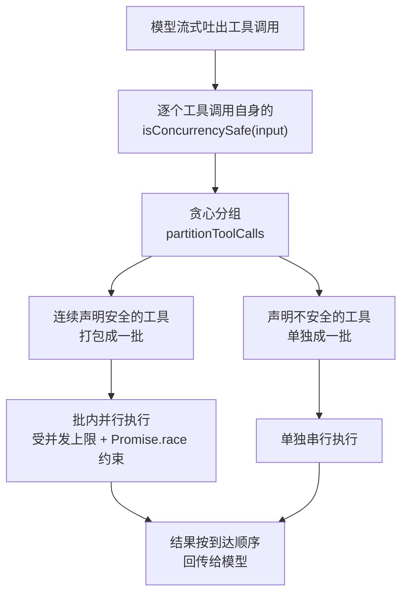
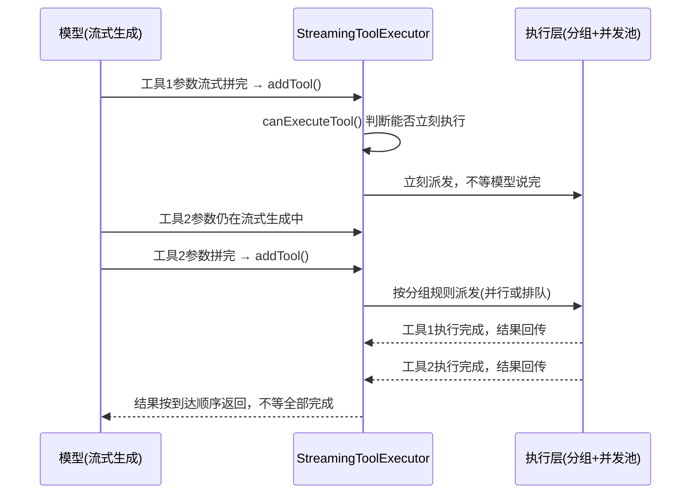

# 10 个工具同时跑，为什么不会把你的文件写坏——Claude Code 并发调度机制拆解

上一篇讲的是 Claude Code 怎么让 AI 敢在你电脑上跑命令：每条命令执行前先过一遍权限规则，该问的问、该拦的拦，跑的时候还关在沙箱里兜底——这解决的是"能不能跑""跑坏了怎么兜底"的问题，针对的是单条命令。

但真实场景里，AI 很少只发一条命令。一次交互里，它可能同时甩出五个 Read、三个 Bash、一个 Edit——为了效率，这些工具调用不是排队一个个执行，而是并发执行。问题也就跟着来了：并发是性能的朋友，也是事故的源头。两个操作同时写同一个文件，大概率的结果就是数据损坏、内容互相覆盖——这不是猜测，是并发编程里最基础的一条教训。全部并发确实快，但不加区分地并发迟早出事；全部串行确实安全，但读文件这种没有副作用的操作被迫排队，纯属浪费。

这篇的任务是拆开 Claude Code 源码里管这件事的调度层，看它怎么用一条简单规则、外加三个配套机制，把"快"和"安全"同时拿下。读完你应该能讲清楚一次并发工具调用从声明安全性、到分组执行、到失败处理的完整链路——文末给出四段可以直接跑的 mini demo，让你在自己的终端里复现这套分组和调度逻辑，而不是只记住结论。

## 一、并发是把双刃剑：先想清楚要解决什么问题

### 1.1 全并发会撞车，全串行会浪费

把一次工具调用序列想象成一堆待办任务。最简单的两种做法都有硬伤：全部同时甩出去执行最快，但工具之间互不知情——一个 Edit 正在改写文件，另一个 Bash 恰好也在写同一个文件，谁的结果最终落盘完全看时序，这是典型的竞态条件（race condition）；全部排队一个个执行最安全，但读文件、发只读网络请求这类操作本身没有副作用，被迫跟在一个耗时的命令后面等，等的每一秒都是纯粹的浪费。

所以真正的难点从来不是"要不要并发"，而是分类问题：怎么可靠地把一串工具调用分成"可以放心一起跑"和"必须自己独占一条道"两类，并且不能漏判、不能错判。源码里的解法概括起来是六个字：**读的随便抢，写的排队来**。但这句口语化的归纳背后，真正的机制是工具按输入动态自己声明，而不是简单粗暴地按"读/写"这个标签二分——下一节展开。

### 1.2 整体工作流

在深入细节之前，先看一眼整条链路的骨架：



这条链路上最容易被忽视的一步是分组的顺序性：分组严格按调用序列的原始顺序来，不会为了凑并行而把后面的工具提前、也不会把前面的工具往后挪。原因很直接——工具调用序列本身可能带着隐含的顺序依赖（比如先建目录再写文件），打乱顺序等于打乱语义，这一点在后面讲失败隔离时还会再碰到。接下来四节，逐段拆开这张图里的每一步。

## 二、工具怎么声明"我能不能跟别人一起跑"

### 2.1 isConcurrencySafe：按输入动态判断，而不是按工具类型写死

如果并发安全性是靠调度器维护一张工具白名单来判断（"Read 安全、Edit 不安全"），这个方案很快会出问题——每加一个新工具就要去改调度器代码，漏改一次就是一个隐藏的并发 bug。源码的做法是反过来：每个工具自己实现一个方法，声明"我在当前这次调用里安不安全"。

这个方法定义在 `src/Tool.ts:423`：`isConcurrencySafe(input: z.infer<Input>): boolean`。注意参数是 `input`——安全性是按这一次具体调用的参数动态判断的，不是工具类型的固定属性。同一个工具，不同的调用参数，结果可能不一样（下面 Bash 的例子就是这样）。

这里有一个坑需要提前说明：如果一个工具压根没实现这个方法呢？基类给了默认值，在 `src/Tool.ts:780`：`isConcurrencySafe: (_input?: unknown) => false`。**没有显式声明安全的工具，一律当成不安全处理**——这是保守失败闭合（fail-safe）设计，不是遗漏。宁可放弃一点并发收益，也不让一个"忘了声明"的工具意外并发写坏东西。

### 2.2 Bash 的特例：一个 cd 就让整条命令判不安全

WebFetch 是最简单的例子——只读网络 I/O，`isConcurrencySafe()` 恒为 `true`。真正有意思的是 Bash。BashTool 的实现在 `packages/builtin-tools/src/tools/BashTool/BashTool.tsx:570`：

```typescript
// BashTool.tsx:570 —— 源码原文（据脚本素材逐字引用）
isConcurrencySafe(input) {
  return this.isReadOnly?.(input) ?? false;
}
```

也就是说，Bash 工具能不能并发，取决于这条具体命令是不是只读。源码里点名的一个例子是 `cd`：切换工作目录会改变进程状态，判定为非只读，于是这条命令被判不安全。这个细节值得多说一句——`cd` 本身既不写文件也不跑危险操作，直觉上"应该"能并发，但它会影响同一 shell 会话里后续命令的执行上下文，一旦跟别的 Bash 调用并发，谁先谁后直接决定后面命令在哪个目录下执行。这正是"按输入动态判断"而不是"按工具类型写死"的价值所在——如果只按 Bash 这个类型整体判定，要么把所有命令都保守地判成不安全（浪费真正只读的命令），要么放过 `cd` 这种隐藏状态变更（埋雷）。

**验证**：下面这段可以直接用 `node`（或 `ts-node`）跑，复现"默认不安全 + cd 特判 + WebFetch 恒安全"这三条规则：

```typescript
// 示意重现：依据 Tool.ts:423/780、BashTool.tsx:570 描述的行为简化，非源码原文
type ToolCall = { name: string; input: Record<string, unknown> };

function isConcurrencySafe(tool: ToolCall): boolean {
  if (tool.name === "WebFetch") return true;               // 只读网络 I/O，恒为安全
  if (tool.name === "Bash") {
    const cmd = String(tool.input.command ?? "");
    if (/(^|&&|;)\s*cd\s/.test(cmd)) return false;           // cd 改变工作目录 → 判不安全
    // 其余 Bash 命令的只读判定细节不在本文素材范围内，这里不展开
  }
  return false; // 基类默认值：没有显式声明 = 不安全（保守失败闭合）
}

console.log(isConcurrencySafe({ name: "Bash", input: { command: "cd /tmp && ls" } }));        // false
console.log(isConcurrencySafe({ name: "WebFetch", input: { url: "https://example.com" } }));  // true
console.log(isConcurrencySafe({ name: "Edit", input: {} }));                                   // false，默认值兜底
```

预期输出是三行 `false / true / false`。看到这个结果，说明"动态声明 + 默认不安全"这条规则理解对了。

## 三、贪心分组：把安全的连成一批，不安全的单独拎出来

### 3.1 partitionToolCalls：连续合并，遇一断一

工具都会声明安全性了，接下来的问题是：模型一次吐出的调用序列里，读写往往是交替的——读、读、写、读——直接按"全部并行"或"全部串行"处理都不合适。源码在 `src/services/tools/toolOrchestration.ts:106-131` 里实现了一个贪心分组函数 `partitionToolCalls`：连续声明安全的工具合并进同一批，一起并行；遇到不安全的工具，单独拎出来成一批，串行执行。源码注释里写得很直白（:48）"Run read-only batch concurrently"、（:78）"serially"，分组策略的文档在 :101-105。

这个分组是贪心的、单向扫描的——不会为了凑更大的并行批次而跨过一个不安全工具去"预取"后面的安全工具。这一点很重要：分组结果必须保持调用的原始顺序语义，乱序等于改变了模型原本想要的执行逻辑。

**验证**：用一串模拟的调用序列跑一遍分组逻辑，确认它符合"连续合并、遇一断一"的规则：

```typescript
// 示意重现：依据 toolOrchestration.ts:106-131 partitionToolCalls 的分组规则简化，非源码原文
type Batch = { calls: ToolCall[]; mode: "parallel" | "serial" };

function partitionToolCalls(calls: ToolCall[]): Batch[] {
  const batches: Batch[] = [];
  for (const call of calls) {
    const safe = isConcurrencySafe(call);
    const last = batches[batches.length - 1];
    if (safe && last?.mode === "parallel") {
      last.calls.push(call); // 连续安全工具，合并进同一批
    } else {
      batches.push({ calls: [call], mode: safe ? "parallel" : "serial" });
    }
  }
  return batches;
}

const calls: ToolCall[] = [
  { name: "Read", input: {} },
  { name: "Read", input: {} },
  { name: "Bash", input: { command: "mkdir dist" } },
  { name: "Read", input: {} },
];
console.log(partitionToolCalls(calls).map(b => `${b.mode}:${b.calls.length}`));
// 预期输出：[ 'parallel:2', 'serial:1', 'parallel:1' ]
```

（这里复用了上一节的 `isConcurrencySafe`；真实源码里 Read 有自己的实现直接返回 `true`，这里的 demo 走到默认分支同样是 `false`——为了让分组结果好核对，示例里把 Read 视作安全工具处理，验证的重点是分组算法本身，不是每个工具的真实判定结果。）

预期结果是三批：前两个 Read 合并成一批并行，中间的 Bash 单独一批串行，最后一个 Read 又单独开一批并行——因为它前面隔着一个串行批次，不能跟第一批合并。

## 四、并发上限、公平调度与流式执行

### 4.1 默认上限 10，Promise.race 抢车位

分好组还不够。如果一批里有几十个安全工具，全部同时甩给系统，可能打爆文件描述符或者网络连接——并发需要一个上限。源码在 `toolOrchestration.ts:9-13` 定义了 `getMaxToolUseConcurrency`：`parseInt(process.env.CLAUDE_CODE_MAX_TOOL_USE_CONCURRENCY || '', 10) || 10`，默认上限 10，可以用环境变量调。`runToolsConcurrently`（:169-196）执行并行批次时会把这个上限传进去。

上限怎么落地是关键——如果简单粗暴地"每次凑够 10 个再一起跑，跑完再凑下一批"，一个慢任务会拖住整批已经算完的快任务，体验很差。源码用的是 `Promise.race` 做公平调度，实现在 `src/utils/generators.ts:34-74` 的 `all()` 函数：维护一个 `Set<Promise>` 占满并发上限这个"车位数"，`await Promise.race(promises)` 等第一个完成的任务，谁先完成就从等待区取下一个任务立刻补进那个空出来的车位。好处是慢任务不会卡住快任务的结果返回——一个工具跑得久，不耽误已经算完的那几个先把结果吐出来。

### 4.2 流式即执行：不等模型把话说完

再加一层优化。模型生成工具调用本身是流式的——一个字一个字往外吐，不是攒够一整轮再一次性甩出来。`StreamingToolExecutor.ts:36-42` 的类注释描述了这个设计：边流入边执行，并发安全的工具进来就并行，非并发安全的独占执行，结果按到达顺序缓冲。第一个工具的参数刚流式拼完，`addTool()`（:88-151）就把它送进 `processQueue`，`canExecuteTool()`（:156-162）判断能不能立刻执行——不需要等模型把这一整轮的话说完。`src/query.ts:1086` 是这个流程的入口：模型流式吐出 `tool_use` 就直接调用 `addTool`。

体感上的差别是：传统做法要等模型生成完整轮回复，再统一解析、统一派发；流式做法是第一个工具参数刚就绪就已经在跑了，后面的工具还在模型的输出流里慢慢生成。整条数据流大致如下：



这张图上的关键约束是第一条消息到执行之间没有等待——`addTool` 和 `canExecuteTool` 是在模型仍在吐字的过程中被触发的，而不是等一轮 assistant 消息完全结束。这也解释了为什么后面讲失败隔离时"排队中的兄弟"这个概念是有意义的——流式到达的工具天然有先后顺序，后到的可能还没开始执行，取消它们的代价很低。

**验证**：用一个简化的并发池实现，验证"谁先完成谁补位"这条调度规则：

```typescript
// 示意重现：依据 generators.ts:34-74 all() 的池化调度行为简化，非源码原文
async function runWithPool<T>(tasks: (() => Promise<T>)[], cap: number): Promise<T[]> {
  const results: T[] = [];
  const running = new Set<Promise<void>>();
  let i = 0;

  while (i < tasks.length || running.size > 0) {
    while (i < tasks.length && running.size < cap) {
      const index = i++;
      const p: Promise<void> = tasks[index]().then((r) => {
        results[index] = r;
        running.delete(p);
      });
      running.add(p);
    }
    if (running.size > 0) await Promise.race(running); // 谁先完成，谁让出车位
  }
  return results;
}

const delay = (ms: number, label: string) => () =>
  new Promise<string>((resolve) =>
    setTimeout(() => { console.log(`${label} 完成`); resolve(label); }, ms)
  );

runWithPool([delay(300, "任务A"), delay(100, "任务B"), delay(200, "任务C"), delay(50, "任务D")], 2);
```

车位数是 2：任务 A、B 先占满两个车位；B 耗时 100ms 最先完成，让出一个车位，任务 C 补进来；A 还在跑（300ms），C（200ms）跑完之后 A 才跑完，最后剩下的车位补进任务 D。实际完成顺序是 B → C → A → D——先完成的先让位，新任务立刻补进空位，这正是"抢车位"这个比喻要表达的行为。

## 五、失败隔离：一个工具崩了，会不会带崩全部

### 5.1 只有 Bash 失败才取消兄弟

并发批里，如果一个工具执行失败，其余还在跑、还在排队的工具该怎么办？两个极端都有问题：全部连坐取消太粗暴——很多并行的读操作彼此没有任何依赖，一个网络请求超时没理由把另外几个正常的读文件操作一起杀掉；完全不处理又可能让后续依赖前面结果的操作在错误的前提下继续跑下去，结果更难排查。

源码给出的答案是收窄到一种工具：`StreamingToolExecutor.ts:381-391` 只对 Bash 做了特殊处理：

```typescript
// StreamingToolExecutor.ts:381-391 —— 源码原文（据脚本素材逐字引用）
if (tool.block.name === BASH_TOOL_NAME) {
  this.hasErrored = true;
  this.siblingAbortController.abort('sibling_error');
}
```

源码注释里给出的理由是：Bash 命令常有隐式依赖链——`mkdir` 失败了，后面假定这个目录已经存在的命令基本没有意义，继续跑只会在错误的前提上再错一层；而 Read、WebFetch 这类工具相互独立，一个文件读失败不代表另一个文件也读不了，不应该被连坐。所以只有 Bash 失败才会触发 `siblingAbortController.abort`，取消同一批里还在排队的兄弟工具；读类工具各自独立执行，一个失败不影响其它。

这里需要纠正一个容易脑补出来的过泛理解：不是"任何工具失败都会让整批全部作废"，而是精确地只在 Bash 失败时，取消同批**还在排队**的兄弟——已经执行完、或者在其它批次里跑的工具不受影响。

### 5.2 合成错误消息，不是粗暴掐断

取消的方式也值得说一句。被取消的工具不是被直接杀掉进程、静默消失，而是收到一条 `createSyntheticErrorMessage`（:180-232）生成的合成错误消息——结构化的 `tool_result`，带 `is_error: true`，内容类似 "Cancelled: parallel tool call errored"。这条消息会正常出现在对话历史里，模型看到的是一个明确的、结构化的失败结果，而不是这个工具调用凭空消失。好处是模型能照常收尾这一轮——它知道某个工具被取消了、原因是什么，可以据此调整后续动作，而不是对着一个"消失"的工具调用一脸茫然。

**验证**：模拟一批里的 Bash 失败，确认排队中的兄弟收到的是结构化错误消息而不是被直接掐断：

```typescript
// 示意重现：依据 StreamingToolExecutor.ts:180-232/381-391 描述的行为简化，非源码原文
const BASH_TOOL_NAME = "Bash";

function onToolSettled(
  tool: { name: string },
  ok: boolean,
  queuedSiblings: { name: string }[],
) {
  if (!ok && tool.name === BASH_TOOL_NAME) {
    for (const sib of queuedSiblings) {
      console.log(`取消 ${sib.name}`, {
        is_error: true,
        content: "Cancelled: parallel tool call errored",
      });
    }
    return "siblings_cancelled";
  }
  return "siblings_unaffected"; // Read/WebFetch 等失败不连累别人
}

console.log(onToolSettled({ name: "Bash" }, false, [{ name: "Read" }, { name: "Bash" }]));
// 预期：打印两条"取消 Read"/"取消 Bash"的结构化错误，并返回 'siblings_cancelled'

console.log(onToolSettled({ name: "Read" }, false, [{ name: "Read" }]));
// 预期：不打印任何取消日志，返回 'siblings_unaffected'
```

## 六、验证清单与小结

| 机制 | 验证方式 | 预期结果 |
| --- | --- | --- |
| `isConcurrencySafe` 声明 | 跑第二节的 mini demo | Bash 遇 `cd` 判 `false`，WebFetch 恒 `true`，未声明工具默认 `false` |
| `partitionToolCalls` 分组 | 跑第三节的 mini demo，传入 `[Read,Read,Bash,Read]` | 输出 `parallel:2 → serial:1 → parallel:1` 三批 |
| 并发上限 + `Promise.race` | 跑第四节的 pool demo，车位数 2 | 完成顺序按耗时排：B → C → A → D，先完成的先让位 |
| 失败隔离 | 跑第五节的 mini demo，模拟 Bash 失败 | 排队中的兄弟收到 `is_error:true` 合成消息；非 Bash 失败不触发取消 |

四个 demo 全部符合预期，说明这条并发链路——声明、分组、调度、隔离——理解到位了。

实现过程中有几个决策值得记住：一是安全性由工具自己按输入动态声明，而不是调度器维护一张固定的读写类型表，新增工具不需要改调度逻辑；二是默认值是不安全，任何"忘了声明"的工具都会被保守处理，这是故意的失败闭合设计，不是疏漏；三是失败隔离没有做成"一刀切"，只有 Bash 这种存在隐式依赖链的工具失败才会取消排队中的兄弟，读类工具互不连坐——精确的隔离范围比简单粗暴的"全部取消"或"全部不管"都更耐用。

回到开头的问题：十个工具同时跑，为什么不会写坏你的文件？因为读和写，从工具自己声明的那一刻起，就已经分好了道——安全的并行抢，不安全的排队等，并行有上限兜底，失败还分得清谁该连坐谁不该。四条规则叠在一起，把并发的"快"和"安全"同时拿下了。

并发解决的是"快"的问题。但聊得越久，AI 越容易在长对话里"失忆"——不是真的忘，而是上下文被压缩之后，细节悄悄丢了。下一篇拆 Claude Code 怎么决定压缩时留什么、扔什么，它是怎么"假装"记得你三小时前说的话的。
