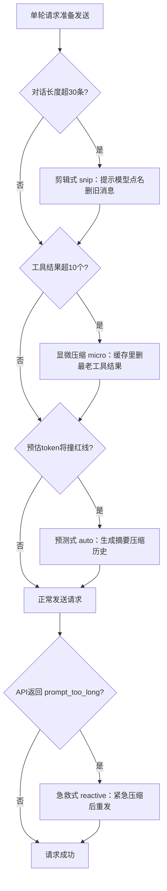
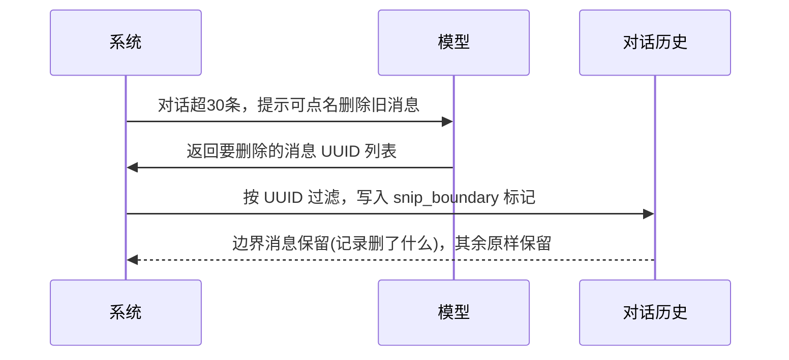

# Claude Code 怎么"假装"记得你说过的话：拆解四层上下文压缩机制

上一篇聊的是 Claude Code 怎么让十个工具同时跑却不会把你的文件写坏——靠的是一套读写冲突检测机制，工具调用前先校验、冲突了就拒绝执行。那一篇解决的是"多个动作同时发生"时的一致性问题。这一篇要拆的是另一个维度的问题：一段对话足够长之后，Claude Code 到底怎么让它"看起来"还记得住。

如果你跟 Claude Code 聊过一个长会话——调试一个复杂问题、连续改几十个文件——大概率遇到过这种体验：过了两三个小时，回头问它早前提过的一个需求，它答得依然头头是道。但这只是表象。真实情况是，你说过的话，它早就删掉了一大半，而且删得让你几乎发现不了。这不是 bug，是一套刻意设计的工程机制。本文要做的事情，是把这套机制从源码层面拆开：它一共有几层、每层解决什么问题、什么时候触发、以及两个决定它靠不靠谱的关键细节。读完之后，你会知道去源码的哪个文件、哪一行，能亲自验证这些结论。

## 一、为什么要"忘记"：上下文窗口的物理上限

### 1.1 上限从哪来

大模型的每次请求都要把完整的对话历史一起发过去——这是它"记住"上文的唯一方式，模型本身不存在跨请求的记忆。但这份历史不能无限长：每个模型都有一个上下文窗口的硬上限（token 数），超过这个数字，请求直接会被 API 拒绝，报 `prompt_too_long`。一段几小时的长对话，尤其是夹杂大量文件读写、命令执行结果的工程会话，撑不了太久就会撞到这堵墙。

所以"记得"从一开始就是个不成立的目标。Claude Code 真正要解决的问题是：怎么在不撞墙的前提下，让对话看起来还能接得上。答案不是让模型记住更多，而是让它主动、持续地"忘掉"不重要的部分——同时不让这种遗忘破坏对话的连贯性。这是一套精密的遗忘工程，而不是一次性的"清空重来"。

### 1.2 "记得"是假象，压缩才是真相

Claude Code 源码里（`src/services/compact/` 目录）一共实现了四套独立的压缩机制，分别在不同的时机、以不同的粒度介入：预测式压缩在请求发出前主动触发，急救式压缩在请求失败后被动兜底，显微压缩持续清理工具结果的缓存废料，剪辑式压缩让模型自己点名删除旧消息。四套手法各管一段，合起来才是"记得住"的完整答案。

### 1.3 整体工作流

四层机制不是并列关系，而是有严格的触发顺序。单轮请求准备发送时，依次经过剪辑式、显微、预测式三道检查，只有真正撞到 API 报错时，才会触发急救式压缩重发。整条链路大致如下：



这个顺序不能乱——剪辑式和显微压缩动的都是"轻量"层（消息级、缓存级），成本低，先做；预测式压缩要重新生成一份摘要，代价最高，放在最后一道防线；急救式压缩则完全是另一个时机：它不在发送前，而在 API 已经报错之后，是本轮请求失败后的下一轮兜底，不是预防手段。理解这个顺序，才能理解下面每一层各自解决什么问题，而不是互相重复。

## 二、预测式压缩：发请求前先算一笔账

预测式压缩（源码里叫 auto compact）是四层里最主力的一套，因为它在问题发生之前就动手。

**为什么需要它**：如果不提前预判，等到请求真的因为太长被拒绝，用户端会看到一次明显的失败和重试，体验很差。更实际的问题是，一次工具调用（比如读一个大文件、跑一条命令）可能瞬间往上下文里塞进去几千到几万 token，如果不预留缓冲，很容易在一轮对话内直接撞穿窗口。

**怎么做**：每次把请求发给模型之前，预测式压缩先算一笔账——当前已经用了多少 token，加上这一轮大概率还会再涨多少，是否会碰到红线。源码里给增长预估留了一个保守值：`TOOL_RESULT_GROWTH_ESTIMATE = 15_000`，专门给工具结果留量——读文件、跑命令吐回来的内容体积不可控，15K 是经验值。完整公式是：

```
estimateMaxTurnGrowth = min(模型最大输出, 20_000) + 15_000
```

也就是"这一轮模型自己最多能吐多少字"加上"工具结果的保守预估"，两者相加得到本轮可能的增长上限。触发红线则是：

```
阈值 = 有效上下文窗口 − 自适应缓冲
有效上下文窗口 = 模型上下文窗口 − max(模型最大输出, 20_000)
```

当前用量加上预估增长，一旦超过这个阈值，就提前触发一次压缩——把此前的对话浓缩成一份摘要，替换掉原始的历史消息。这里"自适应缓冲"是个关键变量，下文第六节会展开。

**审查点**：这套机制的核心假设是"预测足够保守"。如果某次工具调用返回的内容远超 15K（比如一次性读入一个几十万字符的大文件），预测式压缩仍然可能失手——这正是急救式压缩存在的原因。

**验证**：想确认这套逻辑，去源码 `autoCompact.ts:88-94` 看 `estimateMaxTurnGrowth` 的实现，`:101-105` 看阈值计算，`query.ts:637-651` 的 `autoCompactIfNeeded` 是它在请求前被调用的位置——这是它"主动触发"而非"被动兜底"的直接证据。

## 三、急救式压缩：报错之后的最后一道安全网

**为什么需要它**：预测再保守，也架不住极端情况——一次异常大的工具返回、一次连续多轮的快速工具调用堆叠，都可能让预测式压缩来不及反应。这时候 API 会直接返回错误，明确告诉你这段提示词太长了。

**怎么做**：急救式压缩（reactive compact）只在一种情况下触发——API 返回的是 `prompt_too_long` 或媒体体积过大的错误。源码里用 `isWithheldPromptTooLong` 和 `isWithheldMediaSizeError` 两个判断，专门识别这类 assistant 侧的 API 错误消息。一旦命中，`tryReactiveCompact` 会调用和预测式压缩同一套压缩逻辑（`compactConversation`），把历史强制压缩一遍，然后重发这次请求。

**人工审查点/坑**：这里有一个坑需要提前说明——急救式压缩只会尝试一次。源码里用 `hasAttempted` 做守卫，压缩重发之后如果还是失败，不会无限重试。这个设计是合理的：如果压缩一次都解决不了问题，说明本轮的内容量已经超出了系统能处理的范围，再重试也没有意义，不如尽早把错误暴露出来。

一个提前预防、一个出事抢救，两者的分工非常明确：预测式压缩永远是主力，急救式压缩只是兜底的最后一道安全网，不应该、也不会成为常态触发路径。

**验证**：`reactiveCompact.ts` 里的 `isWithheldPromptTooLong`/`isWithheldMediaSizeError` 是判断入口，`query.ts:1343-1405` 是它在收到 413 错误后被调用的位置。

## 四、显微压缩：缓存里的微创手术

**为什么需要它**：前两层压缩的对象都是"整段对话历史"，代价不小——生成摘要要重新调用模型。但对话里有一类内容天然是废料：工具调用返回的旧结果。你让 Claude Code 读过的文件内容、跑过的命令输出，一旦后续对话已经不再依赖它，留着只会占地方，完全不需要动用重量级的摘要生成。

**怎么做**：显微压缩（micro compact）专门清理这类废料，规则很简单——`TRIGGER_THRESHOLD = 10`，`KEEP_RECENT = 5`：工具结果攒过 10 个，就删掉最老的那些，只留最近 5 个。它的特别之处在于操作层级：不改动本地保存的完整消息，而是在 API 的缓存层生成一个 `cache_edits` 指令，类型是 `delete_tool_result`，只精准删掉指定的工具结果，不波及对话的其他部分。可以理解成对缓存做的一次微创手术，而不是重写整份病历。

**审查点**：这一层不依赖模型生成任何内容，纯粹是规则判断加缓存操作，所以它不消耗额外的 API 调用，是四层里成本最低的一层，也因此可以频繁触发而不心疼。

**验证**：`cachedMicrocompact.ts:19-20` 是两个阈值常量的定义，`getToolResultsToDelete` 函数实现"删最老留最近 5"的逻辑，`createCacheEditsBlock` 生成实际发给 API 的 `cache_edits` 结构。

## 五、剪辑式压缩：让模型自己当剪辑师

**为什么需要它**：前三层压缩的删除逻辑，都是系统按固定规则算出来的——阈值、数量、时机全部写死。但对话里哪些内容真正过时、哪些还有用，有时候只有模型自己判断得准。剪辑式压缩（snip compact）把这个决定权交给了模型本身。

**怎么做**：当对话长度超过 `SNIP_NUDGE_THRESHOLD = 30` 条消息，系统会往对话里插入一段提示文本（`SNIP_NUDGE_TEXT`），告诉模型可以主动点名删除不再需要的旧消息。模型挑出它认为该删的消息，返回一份 UUID 列表；系统随后按这份名单把对应消息从历史里过滤掉，同时留下一个 `snip_boundary` 标记，记录"这里删过什么"。边界之后的消息、以及边界标记本身，都原样保留——不是笼统地砍掉一段历史，而是精确到消息级别的点名删除。这一步涉及模型和系统的一来一回，用时序图看更清楚：



这里有一个容易理解错的地方：剪辑式压缩不是"保留章节边界、剪掉内部细节"这种类似电影预告片的做法，而是模型逐条挑出具体消息、按 UUID 精确删除。删什么、留什么，决定权在模型，系统只负责执行这份名单并留痕。

**审查点**：因为删除的粒度精确到单条消息，理论上比预测式压缩生成一份笼统摘要更能保留关键信息——前提是模型的判断准确。如果模型误删了后续还会用到的消息，这条历史就真的找不回来了，这也是为什么它需要一个明确的边界标记做审计，而不是静默删除。

**验证**：`snipCompact.ts:14` 定义了触发阈值和提示文本，`snipCompactIfNeeded`（:83-147）是查找 `snip_boundary` 并按 `removedUuids` 过滤的完整实现。

## 六、两个决定压缩系统靠不靠谱的细节

拆完四层机制，还有两个源码里的设计细节值得单独拿出来讲——它们不属于任何一层，但决定了整套系统在极端情况下是否可靠。

### 6.1 自适应缓冲：窗口越大，留白越多

预测式压缩的触发阈值不是一个写死的数字，而是随模型有效上下文窗口大小自适应变化的：

| 有效上下文窗口 | 预留缓冲 |
| --- | --- |
| ≥ 80 万 token | 5 万 token |
| ≥ 40 万 token | 3 万 token |
| 其余情况 | 1.3 万 token |

逻辑不难理解——窗口越大，模型单轮能吐出的内容量也大致成比例地更大，需要预留的安全垫自然也要更宽，否则窗口越大反而越容易在一轮之内被撑爆。这个阶梯是源码里 `getAutocompactBufferTokens` 的实现，注释原话是"窗口越大需要更多 headroom，因为单轮可产出成比例更多的 token"。

### 6.2 断路器：省钱工程不能变成烧钱黑洞

压缩本身要调用模型生成摘要，这个动作也可能失败——比如模型输出不符合预期格式、或者本身也遇到了 API 错误。如果放任压缩失败后无限重试，会出现一种荒谬的情况：一个本来是为了省 token、省调用次数的机制，因为反复失败重试，反而消耗掉大量 API 调用。

源码里给这种情况设了一个断路器：`MAX_CONSECUTIVE_AUTOCOMPACT_FAILURES = 3`，同一个会话内连续压缩失败 3 次，就直接放弃，这个会话里不再尝试自动压缩。计数器按会话维度累积——压缩成功就归零，失败就加一，达到 3 次跳闸。

这个设计不是理论推演，源码注释里留了一段真实的事故数据：

> BQ 2026-03-10：单日内有 1,279 个会话连续失败超过 50 次，其中最严重的一个会话失败了 3,272 次，全球范围内一天因此白白浪费了约 25 万次 API 调用。

这段注释本身就是断路器存在的理由——没有它，一次压缩逻辑的失效可以在单个会话里放大成千上万次无意义的重试，代价是实打实的调用配额。省钱的工程设计，本身绝不能变成烧钱的黑洞，这条断路器就是为了兜住这种失控。

**验证**：`autoCompact.ts:96-99` 是断路器的阈值常量和原始事故注释，`:361` 是成功归零的位置，`:370-378` 是失败计数递增的位置，`:286-294` 是达到阈值后跳闸拒绝重试的判断。

## 七、彩蛋：写摘要的不是主模型，是它的分身

预测式压缩需要生成一份对话摘要，但这份摘要不是主对话模型停下手头工作、自己写出来的。源码里专门 fork 出一个分身 agent 去写这份摘要（`runForkedAgent`，参数里标了 `forkLabel: 'compact'`、`maxTurns: 1`），而且这个分身还会复用主会话已经缓存好的前缀——system prompt、工具定义、前置上下文这些不变的部分，不需要重新计费。这个复用行为由一个功能开关控制（`tengu_compact_cache_prefix`，默认开启）。

摘要本身的输出长度也有上限：`MAX_OUTPUT_TOKENS_FOR_SUMMARY = 20_000`，源码注释里给出的实际观测数据是 p99.99 分位的摘要输出长度约为 17,387 token——也就是说这个上限留有余量，但几乎不会被真正触达。连写一份摘要，都要在缓存复用和输出长度上省着花，这是整套压缩机制里最能体现"工程克制"的一处细节。

**验证**：`compact.ts:1185-1234` 的 `streamCompactSummary` 是这整段逻辑的实现，`autoCompact.ts:30` 是摘要输出上限的定义位置。

## 八、小结与验证

回到最初的问题：Claude Code 不是真的记得你三小时前说过的话，而是用四套遗忘手法，一边悄悄删、一边维持对话看起来连贯——预测式压缩提前算账主动出手，急救式压缩在报错后兜底，显微压缩清理工具结果的缓存废料，剪辑式压缩把删除的决定权交给模型自己。四层各管一段，配合两个稳定性细节（自适应缓冲、断路器），才把"记得住"和"装得下"这两个互相矛盾的目标同时做到。

如果想自己动手在源码里把这些结论过一遍，可以按这张表逐条核对：

| 机制 | 验证位置（文件:行号） | 预期确认结果 |
| --- | --- | --- |
| 预测式 auto | `autoCompact.ts:77-105`、`query.ts:637-651` | 阈值随窗口分档，请求前主动触发 |
| 急救式 reactive | `reactiveCompact.ts`、`query.ts:1343-1405` | 仅在 API 报 413/媒体过大错误后触发一次 |
| 显微 micro | `cachedMicrocompact.ts:19-20` | 工具结果超 10 个，删最老留最近 5 |
| 剪辑 snip | `snipCompact.ts:14`、`snipCompactIfNeeded:83-147` | 按模型点名的 UUID 精确删除，留边界标记 |
| 自适应缓冲 | `getAutocompactBufferTokens` | 窗口 ≥80万/≥40万/其余对应 5万/3万/1.3万缓冲 |
| 断路器 | `autoCompact.ts:96-99, 286-294, 361-378` | 连续失败 3 次后单会话内停止重试 |
| 摘要分身 | `compact.ts:1185-1234` | fork 出的分身复用主会话缓存前缀 |

这套压缩机制解决的是"已经进来的内容怎么省着花"的问题。但省字数不是唯一的思路——还有一种更省的做法是从源头减少要塞进上下文的东西。下一篇要拆的正是这个方向：Claude Code 里配置了六十多个工具，但每次对话开始时，只会把其中二十七个的定义告诉模型，剩下的工具信息，要靠模型自己去搜索发现才能用上。这是压缩之外的另一层设计，处理的是同一个上下文窗口紧张的问题，但下手的时机更早。
