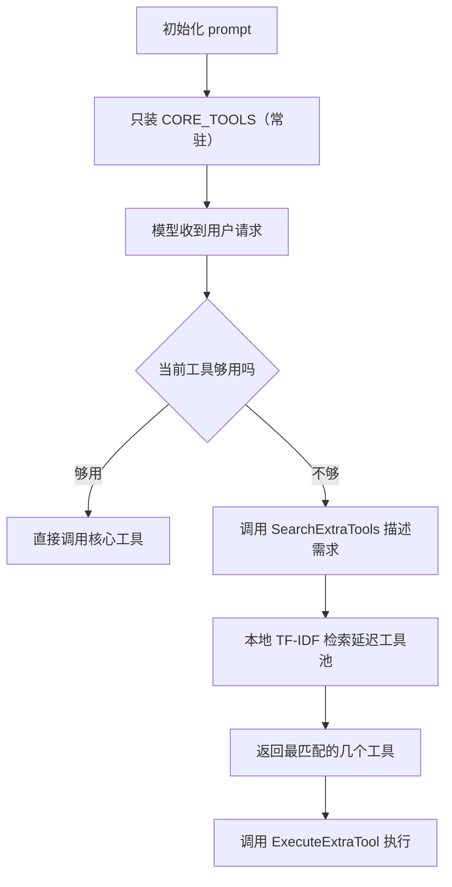
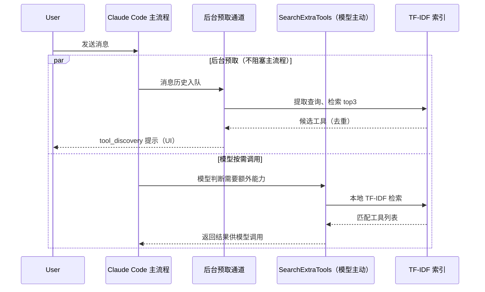

# 60 个工具只塞进 prompt 28 个：Claude Code 怎么给 AI 配一个搜工具的搜索引擎

上一篇拆的是 Claude Code 怎么应对上下文窗口的物理上限——四层压缩机制（预测式主力、急救式兜底、显微清废料、让 AI 自己点名删旧消息的剪辑式），本质是一套精密的遗忘工程：窗口装不下这几个小时的对话，就悄悄把说过的话删掉一大半，只留一份看起来完整、实际已经被裁剪过的记忆。

这次要拆的是同一类问题的另一个变体：不是对话历史太长，是工具太多。Claude Code 内置了几十个工具，还能通过 MCP 无限外挂第三方工具。如果把这些工具的名字、参数、说明书原封不动塞进每一次请求的 prompt，会撞上两个实打实的代价：一是账单跟着工具数量线性增长——每个工具的 schema 都要跟着每一次请求发一遍，按输入 token 计费；二是模型自己开始挑花眼——候选工具越多，它挑中那个真正该用的概率反而越低，这在 agent 圈子里有个专门的名字，叫工具过载（tool overload）。

这篇文章要拆的是源码里怎么应对这个问题：把工具分成"核心常驻"和"延迟发现"两等，再给 AI 配一个本地跑的 TF-IDF 搜索引擎，让它像人用搜索引擎一样，要用什么现查什么。看完这篇，你会理解这套分层发现机制的三层设计——常驻名单怎么划、检索怎么加权、中文查询要多做哪一步——并且能验证同样的思路是不是也适合搬进你自己在做的 Agent/MCP 项目。

## 一、为什么要把大多数工具藏起来

### 1.1 根本问题：工具清单是要按 token 付钱的

每次请求，模型能"看见"哪些工具，取决于 prompt 里塞了哪些工具的 schema——工具名、参数定义、说明文字，一字不落地跟着每一条消息发送一遍，按输入 token 计费。Claude Code 内置工具的数量本身就不是一个定值：源码里 `getAllBaseTools()`（`src/tools.ts:217-280`）大约有 24 个无条件加载的工具，外加一批按 feature flag、环境变量、内部账号类型条件加载的工具（比如 `hasEmbeddedSearchTools()` 打开时会省掉 Glob/Grep，`isTodoV2Enabled()` 打开时才加四个 Task 系列工具），再加上用户自己接入的 MCP server——每接一个 MCP，工具池就再涨一截，没有上限。

如果把这些工具的 schema 全部常驻 prompt，代价立刻显现：每一句话都变贵，同时候选项一多，模型选错工具的概率会上升——这不是模型不够聪明，而是选择空间本身在稀释判断力。

### 1.2 Claude Code 的应对：把工具分两等

源码给出的解法很直接：不是所有工具生而平等。一部分工具划进"核心工具"（`CORE_TOOLS`），永远常驻 prompt；剩下的全部标记成"延迟工具"，开局根本不出现在 prompt 里，需要的时候才被检索出来。源码注释写得很直白：

> "Core tools that are always loaded with full schema at initialization. These tools are never deferred — they appear in the initial prompt. All other tools (non-core built-in + all MCP tools) are deferred and must be discovered via SearchExtraToolsTool / ExecuteExtraTool."（`src/constants/tools.ts:131-135`）

这句注释里有个信息容易被忽略："所有 MCP 工具"默认也进延迟池——哪怕你手动接了一个自己写的 MCP server，它也不会自动挤进常驻名单，得靠后面讲的搜索机制被现查现用。

### 1.3 整体工作流

整条链路的信息流大致如下：



这里有一个坑需要提前说明：`SearchExtraTools` 和 `ExecuteExtraTool` 这两个"元工具"本身必须放进 `CORE_TOOLS`——如果它们也被延迟，AI 就没有入口去发现被延迟的工具，整套机制会死锁。源码里确实把这两个工具显式列进了核心名单（`tools.ts:171-172`），这也是为什么"核心工具"里会出现两个专门用来管理其他工具的工具，而不是全都是干活的工具。

## 二、核心工具白名单：谁配得上"常驻"

### 2.1 数量：28 个，不是 60，也不是 27

先纠正一个容易搞错的数字。这个选题最早的立项材料里写的是"Claude Code 有 60 个工具，只告诉 AI 27 个"——这两个数字在源码里都找不到依据。真实情况是：核心白名单 `CORE_TOOLS`（`src/constants/tools.ts:137-174`）精确统计下来是 28 个——26 个显式列出的工具常量，再加上 `SHELL_TOOL_NAMES` 展开的 `Bash`、`Shell` 两个。至于工具总数，前面说过它随 feature flag、环境变量、接入的 MCP 数量浮动，没有一个可以写死的上限，所以这篇文章只讲"内置几十个、可无限接 MCP，但只把固定的 28 个塞进初始 prompt"，不报一个假的精确总数。

### 2.2 常驻名单长什么样

把这 28 个工具按用途分组会看得更清楚：

| 分组 | 工具 |
| --- | --- |
| 文件读写与代码搜索 | Read / Edit / Write / Glob / Grep / NotebookEdit |
| 执行命令 | Bash / Shell（`SHELL_TOOL_NAMES` 展开） |
| 子任务编排 | Agent / TaskCreate / TaskGet / TaskList / TaskUpdate / TaskOutput / TaskStop |
| 计划与确认 | EnterPlanMode / ExitPlanMode / VerifyPlanExecution / AskUserQuestion / TodoWrite |
| 外部信息 | WebFetch / WebSearch |
| 工具管理（元工具） | SearchExtraTools / ExecuteExtraTool |
| 其他 | LSP / Skill / Sleep / SyntheticOutput |

能看出规律：常驻的都是高频、跨任务通用、几乎每一次会话都可能用到的能力——读写文件、跑命令、搜代码、管理子任务。而那些服务于特定领域（比如某个 MCP 接入的数据库查询、某个第三方 API 封装）的工具，再高频也进不了常驻名单，因为"高频"是全局统计出来的，不是针对某一类项目的。

### 2.3 人工审查点：自己划白名单容易踩的坑

如果想在自己的 Agent 系统里复用这个思路，划核心名单时有两个地方需要提前想清楚。第一，常驻名单不能只按"重要"来选——AskUserQuestion、TodoWrite 这类看起来不起眼的交互型工具也在里面，因为它们几乎每次会话都要用到，漏掉会导致模型频繁"现查"这些高频动作，反而增加延迟。第二，别忘了给发现机制本身留位置——`SearchExtraTools` 和 `ExecuteExtraTool` 必须进核心名单，原因见 1.3，自己实现时很容易漏掉这两个元工具本身也占用常驻名额。

### 2.4 验证：确认这份统计站得住

这份统计不是拍脑袋数出来的，可以在源码仓库里直接验证：

```bash
# 在 source_repo 里数一遍 CORE_TOOLS 里的显式常量（对应 src/constants/tools.ts:137-174）
grep -A40 "CORE_TOOLS = new Set" src/constants/tools.ts | grep -oE "'[A-Za-z]+'" | sort -u | wc -l
# 预期：26（显式常量）；再加上 SHELL_TOOL_NAMES 展开的 Bash / Shell 两个，合计 28
```

如果你在自己的项目里划了一份类似的核心名单，同样可以用这条思路验证：写一段脚本把常驻工具的 schema 拼起来，用 tokenizer 数一遍字数，跟全量工具的 schema 大小做对比——差值越大，说明分层设计省下来的 token 越可观（具体验证方式见第六节）。

## 三、给 AI 配一个搜索引擎：TF-IDF 怎么做工具发现

### 3.1 为什么不是关键词匹配

延迟工具池不是靠字符串包含或者简单关键词匹配来检索的——源码里专门实现了一套 TF-IDF 打分（`src/services/searchExtraTools/toolIndex.ts:3-8`，从 `skillSearch/localSearch` 引入 `tokenizeAndStem`、`computeWeightedTf`、`computeIdf`、`cosineSimilarity`），全程本地计算，不调任何外部搜索 API 或向量数据库。

这里给不熟悉信息检索的读者一句话解释 TF-IDF：TF（词频）衡量一个词在某条工具描述里出现得有多频繁，IDF（逆文档频率）衡量这个词在所有工具里有多"稀有"——一个词如果在大多数工具的描述里都出现（比如"文件"），它的区分度就低，权重会被压低；一个词如果只出现在少数几个工具里，命中就更值钱。两者相乘再用余弦相似度打分，就是这套引擎排序的核心逻辑（`toolIndex.ts:137-143` 计算 idf，`:180` 用 `cosineSimilarity` 打分）。

只索引延迟工具、不索引核心工具——源码里 `:81` 直接写 `deferredTools = tools.filter(t => isDeferredTool(t))`，常驻工具本来就在 prompt 里，没必要再进检索池占位置。日志里还留了一句挺直白的自证：`indexed ${entries.length} deferred tools from ${tools.length} total tools`（`:146`）——这行日志等于把"核心/延迟二分"这套设计钉死在了运行时行为上。

### 3.2 字段加权：名字命中比描述命中更值钱

TF-IDF 打分不是把工具的名字、搜索提示、描述一锅炖，而是分字段加权（`toolIndex.ts:33-37` `TOOL_FIELD_WEIGHT`）：

| 字段 | 权重 |
| --- | --- |
| name（工具名） | 3.0 |
| searchHint（搜索提示） | 2.5 |
| description（描述） | 1.0 |

道理很直接：同一个词，出现在工具名字里，比在几百字描述里偶然提一嘴，靠谱得多。举个例子，如果查询词是"读文件"，一个叫 `ReadFile` 的工具因为名字直接命中，权重乘 3.0；另一个工具描述里第五句话才提到"支持读取文件内容"，权重只乘 1.0——哪怕两者的原始词频接近，排序结果也会明显偏向前者。这个加权是在 `computeWeightedTf` 里按字段分别算完 tf 再合并（`:113-117`），不是简单的字符串拼接后统一计算。

这套打分还留了一个直接命中的捷径：如果查询串完整包含某个工具的规范名（比如查询里直接出现了工具的确切名字），打分会被直接拉到 `max(score, 0.75)`（`:190-191`）——不用绕一圈 TF-IDF，精确命中直接给高分。这是检索系统里常见的 exact match 兜底，避免模型明确知道工具名时反而因为分词干扰排不到前面。

### 3.3 参考实现：加权 TF-IDF 打分骨架

把上面这套逻辑简化成可读的骨架大概是这样——核心是"分字段算 tf，再按权重合并"这个思路，不是逐行复刻源码：

```typescript
// 简化示意，对应 src/services/searchExtraTools/toolIndex.ts
const TOOL_FIELD_WEIGHT = { name: 3.0, searchHint: 2.5, description: 1.0 };

function computeWeightedTf(fields: { tokens: string[]; weight: number }[]) {
  const tf = new Map<string, number>();
  for (const { tokens, weight } of fields) {
    for (const token of tokens) {
      tf.set(token, (tf.get(token) ?? 0) + weight);
    }
  }
  return tf;
}

function score(queryVector: Map<string, number>, toolVector: Map<string, number>) {
  // 若查询串完整包含工具规范名，直接给 0.75 兜底
  if (matchesExactToolName(queryVector, toolVector)) {
    return Math.max(cosineSimilarity(queryVector, toolVector), 0.75);
  }
  return cosineSimilarity(queryVector, toolVector);
}
```

生成后重点检查两点。第一，字段权重要在合并 tf 之前应用，不能先拼字符串再统一分词——拼接会丢失字段边界，权重就失去意义。第二，exact-match 兜底要放在余弦相似度之后再取 max，而不是替代它——否则会丢掉多字段综合排序的信息，退化成纯粹的字符串匹配。

### 3.4 验证：字段加权是不是真的按预期排序

写一组最小测试用例，用一个只在工具名里出现、不在描述里出现的关键词做查询，确认命中的工具排在最前面：

```typescript
// 验证字段加权：名字命中应该排在描述命中前面
const results = searchExtraTools('读文件');
assert(results[0].name === 'ReadFile'); // 名字精确命中，权重 3.0，应排第一
```

如果排序不符合预期，先检查是不是在分词阶段就把字段拼接到了一起——这是最容易漏掉权重的地方。

## 四、专门照顾中文：bigram 分词与"至少命中两段"

### 4.1 为什么中文不能按空格切词

英文分词天然按空格切；中文没有空格，如果直接套用英文分词逻辑，一句话会被当成一个超长 token，几乎不可能匹配上任何工具描述。源码在 `localSearch.ts` 的 `tokenize()`（`:158-165`）里专门处理了这件事：遇到连续的 CJK（中日韩文字）片段，就用 bigram——两个字两个字滑动切分（`for j … tokens.push(cjkRun.slice(j, j+2))`），而不是按整句或者单字切。

### 4.2 至少命中两段，防止单字误判

只做 bigram 切分还不够——两个字的组合天然比英文单词更容易"偶然撞上"。比如查询里出现"文件"两个字，如果只要求命中一个 bigram，可能会连带匹配上跟"文件"毫不相关、只是恰好共享一个字的工具描述。源码加了一道过滤：`CJK_MIN_BIGRAM_MATCHES = 2`（`toolIndex.ts:43`）——中文查询至少要命中两段 bigram，且没有 ascii token 命中兜底时，才算有效匹配；不满足这个条件，直接把分数清零（`:182-188`）。

这个细节值得多说一句：一个服务于开发者、用来检索内部工具的搜索引擎，本可以用最简单的英文分词逻辑草草了事——反正大部分用户输入是英文指令。但源码专门为中文查询加了 bigram 切分和二次过滤这两层处理，说明这不是随手加的功能，而是认真考虑过中文用户输入之后的产物。

### 4.3 人工审查点：自己实现分词时的坑

如果要在自己的检索系统里复用这个思路，有一个容易漏掉的地方——bigram 切分和"至少命中两段"必须绑定一起上，单独加其中一个都不够。只做 bigram 不做二次过滤，噪声会很大，单字巧合命中一大堆不相关结果；只做"至少命中两段"过滤但分词方式不对（比如仍按字符切），那"两段"这个阈值本身就失去意义。

### 4.4 验证：中文查询是否被正确防误判

补一组中文查询用例，用一个只跟某工具描述共享单字、语义完全不相关的查询，确认不会被误判为相关：

```typescript
// 验证中文防误判：单字巧合命中不应该拉高分数
const noise = searchExtraTools('文'); // 只有一个字，切不出满足阈值的 bigram
assert(noise.every(r => r.score === 0));

// 对照：两字命中且语义相关的查询应该正常打分
const valid = searchExtraTools('读取文件');
assert(valid.some(r => r.score > 0));
```

## 五、主动预取：不等模型开口就先查

### 5.1 双通道机制

前面讲的都是"模型主动调用 SearchExtraTools"这条被动通道——AI 判断自己需要额外能力，才发起搜索。但源码里还有一条并行的主动通道：`prefetch.ts`（`src/services/searchExtraTools/prefetch.ts`）会在用户输入或者模型回复产生时，从消息历史里提取查询意图，提前构建索引、搜索 top3 相关的延迟工具，并且去重（只提示本次会话里还没被发现过的工具），打包成一个 `tool_discovery` 的 attachment 提示在界面上。

两条通道的分工大致如下：



这两条通道是并行、互不阻塞的关系——后台预取不会让模型等待，它更像一层"猜你需要"的提示，提前把可能用到的延迟工具摆到界面上；真正决定要不要用、用哪个，还是靠模型主动调用 `SearchExtraTools` 来定夺。这个顺序不能反过来：如果让预取结果直接替代模型的主动判断，相当于把"要不要用某个工具"这个决策权从模型手里拿走，交给了一个基于历史消息的启发式猜测——猜错的代价是模型被动接受了一个不需要的工具，白占了一次上下文。

### 5.2 验证：这套预取机制是否按预期工作

想确认预取通道是不是在正常运行，有两个可观察的信号：一是连续对话中，界面上是否会在模型开口之前就出现 `tool_discovery` 提示；二是这个提示里的候选工具，跟模型后续实际调用的工具重合度高不高——重合度低，说明预取用的查询提取逻辑没有抓准对话意图，值得回头检查从消息历史里提取查询的那一步。

## 六、验证清单

把前面几节的验证方式汇总成一张表，方便对照检查：

| 设计点 | 验证方式 | 预期结果 |
| --- | --- | --- |
| 核心/延迟二分（28 个核心工具） | `grep` 统计 `CORE_TOOLS` 常量数量 | 26 个显式常量 + Bash/Shell，合计 28 |
| 分层带来的 token 节省 | 分别拼出核心工具与全量工具的 schema，用 tokenizer 数字数对比 | 仅核心工具的 token 数明显低于全量工具 |
| TF-IDF 字段加权 | 用只在工具名出现的关键词查询 | 名字命中的工具排名靠前（权重 3.0 生效） |
| 精确命中兜底 | 查询串完整包含某工具规范名 | 该工具得分被拉到至少 0.75 |
| 中文 bigram + 二次过滤 | 用单字或不相关中文短语查询 | 无有效匹配，得分清零而非误判 |
| 主动预取通道 | 观察连续对话中 UI 是否提前给出 `tool_discovery` 提示 | 提示内容与后续模型实际调用的工具重合度高 |

## 七、小结

这篇拆的是 Claude Code 怎么用"分层 + 检索"解决工具过多这个真实的工程问题，几个决策值得记住。第一，常驻名单不是拍脑袋选的，是按"高频、通用、跨任务"这条线划的，而且要给发现机制本身（`SearchExtraTools`/`ExecuteExtraTool`）留位置，否则整套机制会死锁。第二，检索不是简单关键词匹配，是分字段加权的 TF-IDF，名字权重最高、描述权重最低，这个顺序符合直觉，但要写进代码里才算数。第三，中文分词不能照搬英文逻辑，bigram 切分加"至少命中两段"这道过滤，是专门为了防止中文场景下的误判。

往大了说，这套机制背后是同一句话：给 AI 的信息不是越多越好，是越准越好。上下文塞得越满、工具挂得越多，看起来越"全能"，但代价是真金白银的 token 账单，和模型自己挑花眼选错的概率。不管是写提示词、做 RAG、还是设计工具集，同一个思路都成立——先给最该给的那一小批，剩下的让它按需去取。克制本身，就是一种工程能力。

工具的分层发现讲完了，下一篇要拆的是另一个同样朴素但容易被忽略的问题：同一套 Claude Code 代码，怎么同时把 Claude、GPT、Gemini 全接进来，换一个 provider 不用重写一遍逻辑。源码里那层适配设计，跟这篇的"核心 + 延迟"分层思路完全不是一回事，但同样值得拆开看。
