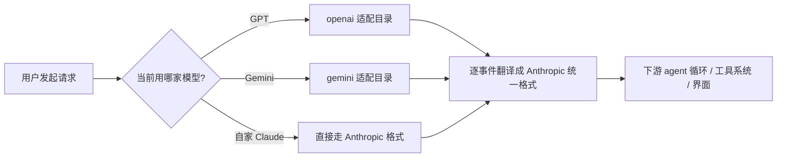
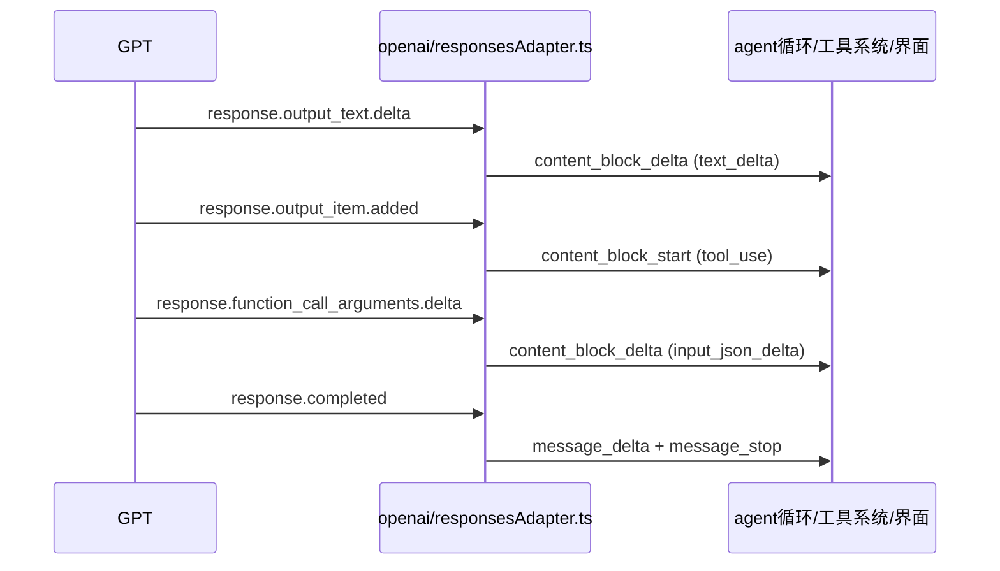

# 同一份代码，怎么同时支持 Claude、GPT、Gemini

上一篇拆的是 Claude Code 怎么应对"工具太多"的问题——六十多个工具定义里，默认只把其中一部分告诉模型，剩下的留着让模型自己去搜索发现，省下的是每次请求都要塞进上下文的那部分 token。这一篇要拆的是另一个维度的工程问题：Claude Code 并不是只能接 Anthropic 自家的 Claude，改一个环境变量，它就能转头去跑 GPT、跑 Gemini，而 agent 循环、工具系统、界面这些下游干活的代码，一行都不用碰。

这件事乍一听有点反直觉。Claude、GPT、Gemini 三家模型的 API 完全是三套东西——消息格式不一样，流式输出的事件不一样，工具调用的协议也不一样。按常理，接一家新模型总得在核心逻辑里插几个 if 分支，接得越多，判断分支越乱，改一处崩三处。但 Claude Code 源码里，这类"判断分支"被死死摁在了一个很窄的层里，没有扩散到下游。本文要做的事情，是把这层"翻译"机制从源码拆开看：它长什么样、为什么必须是流式的、加一家新模型具体要改几个文件、以及最终选哪家模型是怎么决定的。读完之后，你会知道去源码的哪个文件、哪一行，能亲手验证这些结论。

## 一、为什么需要一层"翻译官"

### 1.1 根本问题：每家模型的"语言"都不一样

直接把三家模型的 SDK 分别接进 agent 循环，是最直觉的做法，但代价很快就会显现。工具系统要判断"模型现在要不要调用工具"，界面要判断"现在这段文字是不是还在流式输出中"，这些判断逻辑如果要同时兼容三种不同的消息格式，就得在每一个判断点都写一次"如果是 GPT 就这样解析，如果是 Gemini 就那样解析"。接的模型越多，这类判断点线性增长，而且散落在代码库的各个角落——一旦某家模型的 API 字段名变了，要改的地方可能有十几处，改漏一处就是一个隐藏 bug。

Claude Code 的做法是反过来：不让下游代码知道任何一家模型的具体格式，所有格式差异在进入 agent 循环之前就被处理掉。

### 1.2 解法：像同声传译一样，在入口放一个翻译官

这套设计像极了国际会议上的同声传译——台上讲话的人说英语、日语、法语，听众席上的人却只需要懂一种语言，因为隔间里的翻译官已经把每一种语言实时翻成了听众能听懂的那一种。听众不需要知道台上此刻说的是哪国语言，也不需要为每种语言单独准备一套理解逻辑。

Claude Code 在 API 这一层放的就是这么一个翻译官：不管请求发去的是 GPT 还是 Gemini，返回的流式事件进来之后，先被逐条翻译成 Claude 自己内部统一的事件格式，再往下游传。下游的 agent 循环、工具调用、界面渲染，拿到的永远是同一种格式，不需要关心刚才在背后干活的，究竟是哪一家的模型。

### 1.3 整体工作流

整条请求链路大致如下：



这张图里有一个关键约束：翻译发生在"下游"之前，而不是之后。C、D 两条分支各自维护自己的翻译逻辑，互不干扰；但不管走的是哪条分支，汇入 F 之后就只剩一种格式了。下游 G 只认这一种格式，这也是为什么新增一家模型时，理论上完全不需要碰 G 这一层的代码——下一节具体拆这个翻译过程怎么实现。

## 二、翻译官怎么工作：流式事件的逐条映射

### 2.1 为什么必须是流式翻译，不能等一整段说完

如果翻译官要等台上讲完一整段话再翻译，听众会经历明显的卡顿——先是沉默，然后突然听到一大段。Claude Code 面对的是同样的问题：如果等模型把一整轮回复生成完，再统一转换格式返回给界面，用户会感觉不到"逐字往外蹦"的效果，体验会明显变差。

所以这层翻译的关键设计是流式：不是攒够一整段再翻，而是每收到一个小片段，当场翻译、当场往下传。源码里负责这件事的核心函数是 `adaptResponsesStreamToAnthropic(stream, model)`（`src/services/api/openai/responsesAdapter.ts:249-443`），它是一个 `async function*`，内部用 `for await (const event of stream)`（`:286`）逐帧消费 GPT Responses API 吐出来的 SSE 事件，每处理完一个事件就立刻 `yield` 出对应的 Anthropic 事件，不等待、不攒批。

这里有一个坑需要提前说明：事件级别确实是零攒包，但 SSE 协议本身要求先按 `\n\n` 帧边界把字节流切开才能解析出完整的事件（`parseSSE()`，`:193-222`），这一层缓冲是协议层面的必需操作，不是"攒一批再处理"的设计选择。所以准确的说法是"每收到一个片段就当场翻、当场传"，而不是"零延迟、零缓冲"——协议解析层面的最小缓冲始终存在，只是它跟"攒够一整段"完全是两回事，对用户感知到的流式效果没有影响。

请求方向的转换是反过来的一步：把 Anthropic 格式的输入消息转换成 GPT Responses API 能识别的入参，由 `convertMessagesToResponsesInput()`（`:61`）负责。一来一回，两个方向各有一套转换函数，互不混用。

**验证**：打开 `responsesAdapter.ts:249-443` 确认 `adaptResponsesStreamToAnthropic` 是 `async function*`，`:286` 确认循环体是 `for await`；再看 `:193-222` 的 `parseSSE()`，确认帧缓冲只按 `\n\n` 切边界，不做整段等待。

### 2.2 事件怎么一一对应

流式响应里，GPT 会陆续吐出好几类不同的事件——文字增量、推理过程、工具调用发起、工具参数增量、工具调用结束、整轮结束。每一类都在 `responsesAdapter.ts` 里有对应的翻译规则：

| GPT 侧事件 | 翻译成 Anthropic 侧事件 | 源码位置 |
| --- | --- | --- |
| `response.output_text.delta` | `content_block_delta`（text_delta） | `:290-312` |
| 推理事件 | `thinking_delta` | `:315-337` |
| `response.output_item.added` | `content_block_start`（tool_use） | `:340-374` |
| `response.function_call_arguments.delta` | `content_block_delta`（input_json_delta） | `:377-391` |
| `response.output_item.done` | `content_block_stop` | `:394-405` |
| `response.completed` / `response.incomplete` | `message_delta` + `message_stop` | `:419-441` |

这张表本身就是"翻译官怎么工作"的全部答案——不是笼统地把一段回复搬过来，而是每一种语义单元都有它专属的译文。文字增量对应文字增量，工具调用发起对应工具调用发起，颗粒度对齐到事件级别，这样下游才能按事件类型做出正确的响应，比如界面看到 `content_block_delta` 就往当前气泡里追加文字，看到 `content_block_start` 里带 `tool_use` 就知道要渲染一个工具调用卡片。

整条翻译链路用时序图看更直观：



图里能看出一个不那么显眼但很关键的约束：适配器和下游之间只有一种"语言"，图上完全看不出对面是 GPT——如果把参与方换成 Gemini，这张图的下半部分（适配器到下游）会长得一模一样，唯一变化的是上半部分（谁在发事件）。这正是这层设计要达到的效果。

**验证**：逐行核对上面的映射表——`responsesAdapter.ts:290-312`（text_delta）、`:315-337`（thinking_delta）、`:340-374`（tool_use 起始）、`:377-391`（input_json_delta）、`:394-405`（content_block_stop）、`:419-441`（message_delta/message_stop），六段各自对应一类 GPT 事件，行号连起来正好覆盖 `:249-443` 这整个函数体。

### 2.3 下游拿到的是同一种格式，且真的"无感知"

所有 provider 的适配器最终都会把事件 `yield` 成 Anthropic SDK 统一定义的事件/消息类型（`StreamEvent` / `AssistantMessage`，类型定义在 `packages/@ant/model-provider/src/types/message.ts`）。`claude.ts` 里下游那段 `for await (const event of adaptedStream)` 循环，只对这一套 Anthropic 事件类型做 `switch` 判断，没有任何地方去分辨"这个事件是不是从 GPT 翻译过来的"。

这意味着下游的每一处逻辑——工具调用的执行、界面的渲染、agent 循环的推进——写的时候完全不需要考虑"如果换了模型会不会出问题"，因为它们压根拿不到任何能区分模型来源的信息。这不是巧合或者疏忽留下的空档，而是这一层适配器存在的全部目的：把差异性彻底挡在下游看不到的地方。

**验证**：打开 `packages/@ant/model-provider/src/types/message.ts` 确认 `StreamEvent`/`AssistantMessage` 是不带 provider 标记的统一类型；再回到 `claude.ts` 里下游 `for await (const event of adaptedStream)` 那段循环，确认 `switch` 分支只按 Anthropic 事件类型分派，不出现任何 `if (provider === ...)` 判断。

## 三、加一个新模型有多容易：一个文件夹加一行分发

### 3.1 一家模型，一个文件夹

翻译逻辑不是塞在一个大文件里用 if-else 区分模型，而是按模型物理拆成独立目录：`src/services/api/openai/`、`src/services/api/gemini/`、`src/services/api/grok/`，每个目录下各自有一个 `index.ts` 导出该模型专属的 `queryModel<Provider>` 函数，以及一个 `client.ts` 负责建立到这家模型的连接。每家模型的翻译官单开一个房间，互不打扰——某个目录里的实现出了问题，排查范围天然被限制在这一个目录内，不会牵连别家。

### 3.2 分发点是源码里唯一的判断分支

真正决定"这一轮请求走哪家模型"的判断，全部集中在一处：`src/services/api/claude.ts:1334-1372`。核心逻辑是这样的：

```typescript
// src/services/api/claude.ts:1334-1372（示意，保留关键分支结构）
if (getAPIProvider() === 'openai') {
  const { queryModelOpenAI } = await import('./openai/index.js')
  yield* queryModelOpenAI(...)
}
// gemini、grok 走同构的分支
```

这里有一处需要澄清的地方：口播稿钩子里说的"核心代码一行都没改"略有夸大——这个分发点本身就是一处条件分支，且是源码里现成存在的。准确的说法是：**下游干活的那套代码**（agent 循环、工具系统、界面）一行不动，改动只发生在这一个分发点。加一家新模型时，需要动的地方是：新建一个适配目录、在这个分发点加一条 `import` 分支、在类型定义和环境变量里补上这家新模型的标识。旧有的三家（Claude、GPT、Gemini 或其他已接入的模型）的代码，一行都不需要碰。

**验证**：打开 `claude.ts:1334-1372`，数一下 `if (getAPIProvider() === ...)` 分支的数量应该正好等于已接入的模型家数（不含 `firstParty`，因为默认走的是文件里原生的 Claude 逻辑，不需要走这条 `import` 分发）；再看 `src/services/api/` 目录下有几个模型专属子目录，两者应该一一对应。

### 3.3 这省下的是什么代价

如果没有这层设计，接一家新模型意味着要去改散落在工具系统、界面渲染各处的判断逻辑，每加一家模型，改动点数量跟着现有模型数量一起涨，而且改动分散、容易漏改。现在的代价是固定的：一个新目录 + 一行分发 + 一处类型声明，跟已经接了几家模型无关。改动量从"跟存量成正比"变成了"常数"，这是这层设计换来的实际收益，不是抽象的架构美感。

## 四、到底用哪家：选择的优先级

翻译官解决的是"怎么接"，接下来要看"接了之后到底用谁"。这个问题在源码里由一个函数说了算：`getAPIProvider()`（`src/utils/model/providers.ts:15-32`），判断顺序是固定的三层优先级：

1. 先看用户在设置里显式指定的 `settings.modelType`（`openai` / `gemini` / `grok`），命中就直接用这个；
2. 没有设置，再看云上部署通道的环境变量：`CLAUDE_CODE_USE_BEDROCK` / `CLAUDE_CODE_USE_VERTEX` / `CLAUDE_CODE_USE_FOUNDRY`；
3. 还没命中，再看具体模型的环境变量：`CLAUDE_CODE_USE_OPENAI` / `CLAUDE_CODE_USE_GEMINI` / `CLAUDE_CODE_USE_GROK`；
4. 以上全部没设置，返回 `firstParty`——也就是默认走自家的 Claude。

这个优先级的设计逻辑是：显式设置的意图最强，应该最先被尊重；环境变量属于运行环境层面的配置，适合放在设置之后；什么都不配的情况下，退回到最没有歧义的默认值——自家模型。整个判断是纯函数式的一次性求值，不存在中途状态残留的问题。

`APIProvider` 这个联合类型（`providers.ts:6-13`）一共列了 7 个取值：

```typescript
// src/utils/model/providers.ts:6-13
export type APIProvider =
  | 'firstParty'  // 自家 Claude
  | 'openai'      // GPT
  | 'gemini'      // Gemini
  | 'grok'        // Grok
  | 'bedrock'     // AWS 云上部署通道
  | 'vertex'      // Google Cloud 云上部署通道
  | 'foundry'     // Azure 云上部署通道
```

需要说清楚这 7 个值不是"7 家不同的模型厂商"：`firstParty` 是自家 Claude，`openai`/`gemini`/`grok` 是三家别的模型厂商，`bedrock`/`vertex`/`foundry` 则是同一个模型（通常还是 Claude 系列）在三种不同云上的部署通道，跟"哪家模型"是两个维度的问题。把它们放进同一个联合类型里，是因为对 `getAPIProvider()` 的调用方来说，它们确实都是"决定这一轮请求怎么发出去"这一件事情的不同取值，处理逻辑上是平级的。

**验证**：本地跑 Claude Code 时不设置任何相关配置，打断点或加一行日志打印 `getAPIProvider()` 的返回值，预期结果是 `firstParty`；设置 `CLAUDE_CODE_USE_OPENAI=1` 后同样打印，预期结果切换成 `openai`——这条环境变量的优先级低于 settings，但高于默认值，可以用这两组对照直接验证优先级顺序。

## 五、退一步看：这就是适配器模式落地

把前四节拼起来看，这套设计对应的正是设计模式里那个经典的"适配器模式"——把不同接口的对象包装成调用方期望的统一接口，调用方完全不需要知道背后包装的具体是谁。课本上还有一句更老的话：对扩展开放，对修改关闭。单看这句话容易觉得是一句正确的废话，但落到这个具体案例里，它对应的是一笔具体的、可以量化的收益：再接十家新模型，每次改动只是新增一个目录加一行分发，下游代码一行不动。克制地把"哪家模型"这个变化点封死在一个很窄的入口层，换来的是下游代码可以完全不关心这件事——这是分层设计在真实工程里能兑现的价值，不是一句口号。

### 验证清单

如果想自己去源码里把这些结论过一遍，可以按这张表逐条核对：

| 结论 | 验证位置（文件:行号） | 预期确认结果 |
| --- | --- | --- |
| provider 取值共 7 种 | `providers.ts:6-13` | `APIProvider` 联合类型列出 firstParty/openai/gemini/grok/bedrock/vertex/foundry |
| 选择优先级 = 设置 > 环境变量 > 默认 | `providers.ts:15-32` `getAPIProvider()` | 依次判断 settings.modelType → 云通道环境变量 → 模型环境变量 → 默认 firstParty |
| 流式逐事件翻译 | `responsesAdapter.ts:249-443`、`:286` | `async function*` 内 `for await` 逐帧消费并即时 `yield` |
| 事件一一对应 | `responsesAdapter.ts:290-441` | 六类 GPT 事件分别映射到对应的 Anthropic 事件 |
| SSE 帧级缓冲（协议必需，非批量攒包） | `responsesAdapter.ts:193-222` `parseSSE()` | 按 `\n\n` 边界切帧，事件级仍是零攒包 |
| 一家模型一个目录 | `src/services/api/{openai,gemini,grok}/` | 各目录含 `index.ts`（导出 `queryModel<Provider>`）与 `client.ts` |
| 唯一分发点 | `claude.ts:1334-1372` | 按 `getAPIProvider()` 结果 `import` 对应目录并 `yield*` |
| 下游只认统一格式 | `packages/@ant/model-provider/src/types/message.ts` | `claude.ts` 下游循环只 `switch` Anthropic 统一事件类型 |

### 小结

拆完这套设计，有几个决策值得记住：翻译发生在 API 层的入口，而不是分散在下游各处，这是"下游代码不用改"的根本原因；翻译必须是流式、逐事件的，攒够一整段再翻会破坏流式体验，唯一无法避免的是协议本身要求的帧级缓冲；每家模型单开一个目录、分发点只有一处，让新增模型的改动量固定，不随存量模型数量增长；最终用哪家模型，由一个纯函数按"设置 > 环境变量 > 默认"的顺序一次性决定，没有隐藏状态。

关键产出（源码位置，供后续复查）：

+ `src/utils/model/providers.ts` —— `APIProvider` 类型定义与 `getAPIProvider()` 选择逻辑
+ `src/services/api/openai/responsesAdapter.ts` —— GPT 侧流式事件到 Anthropic 格式的翻译实现
+ `src/services/api/{openai,gemini,grok}/` —— 各家模型独立的适配目录
+ `src/services/api/claude.ts:1334-1372` —— 唯一的 provider 分发点
+ `packages/@ant/model-provider/src/types/message.ts` —— 下游统一消费的 Anthropic 事件/消息类型

模型这一层能随便换了，但换模型解决的只是"谁来干活"的问题。下一个自然的问题是：干活的这个 AI，能不能自己再分身出去，把任务派给另一个 AI 去做？下一篇要拆的正是这个方向——Claude Code 里的子 Agent 机制，一个 AI 怎么给另一个 AI 派活、怎么收工回报，某种意义上是"AI 给 AI 打工"。
