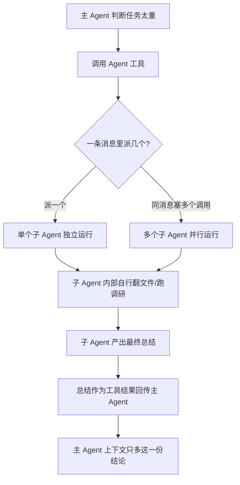
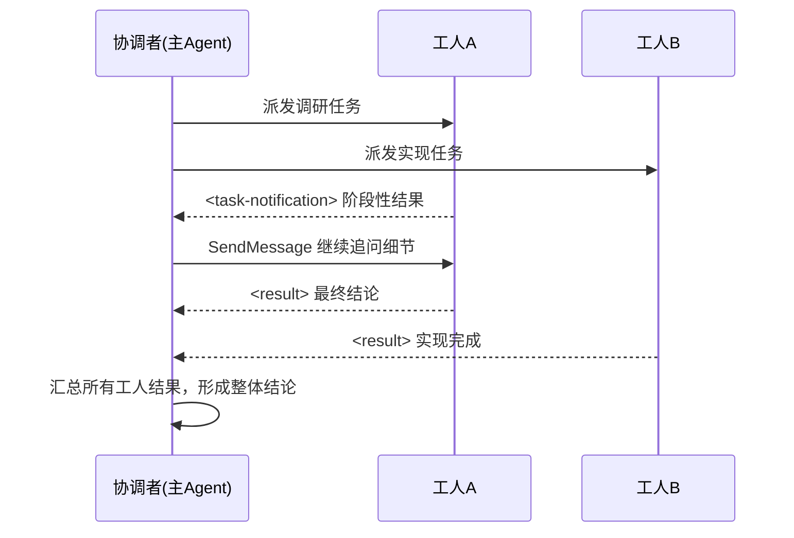

# Claude Code 里的子 Agent：AI 给 AI 打工是怎么写进源码里的

上一篇聊的是同一份 Claude Code 代码，怎么同时支持 Claude、GPT、Gemini 三家不同的模型提供方——那一篇解决的是"横向"问题：同一套逻辑，怎么应对底层模型不一样。这一篇要拆的是另一个维度的问题，跟用哪家模型无关，而是当任务本身太复杂、太琐碎的时候，一个 AI 大脑该怎么应付。

如果你让 Claude Code 去做一件牵扯几百个源码文件的活——比如"通读整个仓库，找出所有用到某个废弃 API 的地方并列清单"——大概率会看到它越跑越慢、答案越来越不着调。原因很直接：主对话的上下文窗口是有限的，一个脑子去翻几百个文件，无关细节堆得到处都是，上下文很快撑爆，模型也容易被这些细节带偏，忘了最初要解决的问题。这不是模型不够聪明，而是"一个人干所有事"这个模式本身就不成立。

这一篇的任务，是把 Claude Code 应对这个问题的方案从源码层面拆开：一个 AI 怎么当场"生"出另外几个 AI 去干脏活累活，这几个"临时工"之间怎么互不干扰，主 Agent 又是怎么把权限收紧、只要结论不要过程。读完之后，你会知道去源码的哪个文件、哪一行，能亲自把这些结论核一遍。

## 一、为什么要分身：主对话的上下文是最稀缺的资源

### 1.1 根本问题

大模型每次请求都要把完整的对话历史一起发过去，这份历史撑着上下文窗口，而窗口大小是有硬上限的。复杂任务往往需要读大量文件、跑大量命令去搜集信息，这些中间过程本身就会占掉巨量的上下文——如果全部堆在同一个对话里，还没等到任务做完，窗口可能已经被"调研过程"本身填满了，更别说这些细节还会持续干扰模型对主线任务的判断。

Claude Code 的应对思路不是想办法把窗口撑得更大，而是把"翻文件、跑调研"这类脏活累活彻底移出主对话，交给别的执行体去干，主对话只接收它们最后交上来的结论。这跟现实里管理一个团队的逻辑几乎一样：老板不需要亲自去读完每一份原始资料，他只需要清楚地布置任务，然后等下属把结论汇报上来。

### 1.2 整体工作流

这套机制的核心是一个叫 Agent 工具的东西。主 Agent 调用它，就能当场生成一个独立运行的子 Agent，专门去干一件具体的事；干完之后，子 Agent 把结论交回来，主 Agent 拿到的只是一份精炼过的汇报，不是中间翻查的全部细节。整条链路大致如下：



这条链路里有一个约束不能颠倒：子 Agent 内部翻了多少文件、走了多少弯路，这些过程数据始终留在它自己的对话记录里，只有最后一段总结会被抽出来交还给主 Agent。换句话说，"分身去干活"能省下上下文，前提是中间过程真的没有回灌主对话——如果每个子 Agent 的调研细节都原样合并回主线，这套机制就失去了意义。下面几节会把"怎么生成""怎么隔离""怎么回传"这几个环节逐个拆开看。

## 二、怎么生成子 Agent：一个工具，能一次派出好几个

### 2.1 Agent 工具是招临时工的唯一入口

子 Agent 不是常驻的，它是按需生成的——主 Agent 调用 Agent 工具的那一刻，才会当场创建一个新的执行体去处理具体任务，任务完成后这个执行体也就结束了。这个生成与运行的过程，源码里是一个异步生成器（async generator）：

```typescript
// packages/builtin-tools/src/tools/AgentTool/runAgent.ts:257
export async function* runAgent({ ... }) {
  // 逐步 yield 子 Agent 的运行状态，直到产出最终结果
}
```

用异步生成器实现有个直接的好处：子 Agent 的生命周期可以被逐步消费、逐步观察，而不是一次性黑盒跑完才返回——这也是后面"独立中断开关""独立隔离"能够实现的技术基础。

### 2.2 并行派发：同一条消息塞进多个调用

Agent 工具不仅能一次生成一个子 Agent，还支持一口气派出好几个，让它们同时开工。源码里的工具说明写得很直接：

> 尽可能并发启动多个 agent（`prompt.ts:162`）；要让它们"并行"运行，必须在同一条消息里塞入多个 Agent 工具调用（`prompt.ts:184`）。

这里"几个"是一个机制上的能力，源码本身没有写死一个固定数字——具体派几个由主 Agent 根据任务拆解的粒度自己决定。理解这一点很重要：如果任务能拆成几个互不依赖的子任务（比如"分别调研三个不同模块的实现"），主 Agent 会倾向于一次性并行派发，而不是一个个排队等结果，这样能显著缩短总耗时。

### 2.3 独立隔离：一个翻车不带累别人

并行派发出去的子 Agent 之间，运行状态是完全隔离的，这一点在源码注释里写得很明确：

> 异步子 Agent 会拿到一个全新的、未关联的控制器，独立运行（`runAgent.ts:533-537`）。

具体来说，异步子 Agent 会拿到一个独立的 `AbortController`（区别于跟主对话共用），而不是复用主线的中断信号：

```typescript
// runAgent.ts 附近逻辑
isAsync ? new AbortController() : toolUseContext.abortController
```

这意味着中止主对话，不会连带打断正在跑的子 Agent；反过来一个子 Agent 出错或被单独取消，也不影响其他并行跑着的子 Agent 和主对话本身。除了中断开关，每个子 Agent 还拥有独立的对话记录和独立的文件读取状态——`createSubagentContext` 会为每个子 Agent 单独分配 `messages`（对话历史）和 `readFileState`（文件视图缓存），身份层面的隔离则依赖 `AsyncLocalStorage`（`runWithAgentContext`，`runAgent.ts:933`）来确保并行运行的多个子 Agent 不会互相串台、读错对方的上下文。

术语解释一下：`AbortController` 是 JavaScript 里用来"喊停"一个异步操作的标准机制，可以把它想象成每个执行体手里握着一根独立的刹车拉杆——主线的刹车和子 Agent 的刹车不连在一起，谁踩自己的，互不影响。`AsyncLocalStorage` 则类似给每条并发的执行路径发一个专属的储物柜，存取身份和上下文数据时自动认得该去哪个柜子拿，不会拿错。这两个概念不需要深入理解实现细节，只需要知道它们共同保证了"子 Agent 互相独立"这个结论是真的落在了代码层面，不只是设计文档上的一句话。

**验证**：`packages/builtin-tools/src/tools/AgentTool/runAgent.ts:257` 是子 Agent 生命周期的入口；`:533-537` 和 `:707-708` 是独立隔离的两处关键注释与判断；`:933` 是 `runWithAgentContext` 的调用位置。并行派发的依据在 `packages/builtin-tools/src/tools/AgentTool/prompt.ts:162` 和 `:184`。

## 三、三个关键设计：权限怎么收紧

生成一批能独立干活的子 Agent 只是第一步，如果这些子 Agent 拿到跟主 Agent 一样多的权限，风险会迅速失控——最直接的问题就是子 Agent 会不会自己再去调用 Agent 工具，无限套娃下去。Claude Code 在权限分配上做了三层收紧。

### 3.1 防递归套娃：分叉出来的不准再分叉

最典型的限制是——Agent 工具本身，不会下放给它生成的子 Agent。源码里有一份专门的黑名单：

```typescript
// src/utils/agentToolFilter.ts
filterParentToolsForFork = parentTools.filter(
  t => !ALL_AGENT_DISALLOWED_TOOLS.has(t.name)
)
```

`ALL_AGENT_DISALLOWED_TOOLS`（`src/constants/tools.ts:44`）里包含了 Agent 工具自身的名称——也就是说子 Agent 的工具集里，从一开始就不包含"再生成一个子 Agent"这个能力。防线不止这一层，`AgentTool.tsx:419-429` 还有一道显式的递归防护，注释直接写着"Recursive fork guard"，一旦检测到已经在一个分叉出来的子 Agent 内部还想再分叉，会直接抛出错误："Fork is not available inside a forked worker."（分叉出来的工人内部不允许再分叉）。两层设计叠在一起，从工具可见性和运行时判断两个角度，把无限套娃的可能性堵死。

### 3.2 敏感工具不下放：私人记忆和密钥只留主线

同一份黑名单里，除了 Agent 工具自己，还包含两类明显敏感的工具：跨会话的用户私人记忆（`LOCAL_MEMORY_RECALL_TOOL_NAME`）和用户密钥相关的请求工具（`VAULT_HTTP_FETCH_TOOL_NAME`）。这两个工具的注释都写着同一句话——只留在主线（keep on the main thread only）。

这个设计的道理不难理解：子 Agent 往往是为了一次性的、边界清楚的任务而生成的，它不需要、也不应该接触用户跨会话积累下来的私人信息或者密钥这类高敏感数据。给临时工配发正式员工才有的门禁卡，是不必要的风险敞口。

### 3.3 按角色配工具：调研型的不给写权限

除了黑名单式的统一裁剪，Claude Code 还有一层更细的权限控制——不同角色的子 Agent，天生配备的工具集就不一样。这一层容易被误解成也是黑名单机制在起作用，但实际上，`filterParentToolsForFork` 这份黑名单里并不包含文件写入或编辑类工具，真正决定"这个子 Agent 能不能写文件"的，是它自身的 agent 定义所声明的可用工具集（`runAgent.ts:270-272` 的 `availableTools`/`allowedTools` 参数 + 具体的 agent 定义）。比如专门做只读调研的 Explore 类型子 Agent，它的定义里根本没有配置 Edit、Write 这类写入工具——不是被临时过滤掉的，而是从一开始就没有。

三种角色的权限差异大致如下：

| 角色 | 典型工具集 | 是否含写入类工具 |
| --- | --- | --- |
| 主 Agent | 全量工具（含 Agent 工具、私人记忆、密钥工具） | 是 |
| 通用型子 Agent | 主 Agent 工具集去掉黑名单（Agent 工具、私人记忆、密钥） | 视具体任务分配 |
| 只读调研型子 Agent（如 Explore） | agent 定义中声明的读/搜类工具 | 否 |

这三层收紧叠在一起，形成的是一个"权限只会越分越窄，不会越分越宽"的单向收紧结构：从主 Agent 到通用子 Agent 是黑名单式的统一裁剪，从通用子 Agent 到专职子 Agent 是角色定义层面的定向配置，两层机制各管一段，合起来才把子 Agent 的权限收得足够紧。

**验证**：黑名单定义在 `src/constants/tools.ts:44-62`，过滤逻辑在 `src/utils/agentToolFilter.ts`；递归防护在 `AgentTool.tsx:419-429`；角色化工具配置的参数入口在 `runAgent.ts:270-272`。

## 四、结果怎么回传：只要结论，不要过程

子 Agent 跑完之后，怎么把结果交回给主 Agent，直接决定了这套机制到底能不能真正省下上下文。

**为什么要这么设计**：如果子 Agent 把自己翻查过的每一个文件、跑过的每一条命令都原样塞回主对话，那"分身去干活"就完全没有意义——主 Agent 的上下文照样会被撑爆，只是换了个地方堆积而已。分工的价值，恰恰在于把繁琐的中间过程留在子 Agent 自己的一亩三分地里。

**怎么做**：子 Agent 完成任务后，只会产出一段最终总结，这段总结会被提取成纯文本，作为这次工具调用的结果交还给主 Agent：

```typescript
// AgentTool.tsx:1133
extractTextContent(agentResult.content, '\n')
```

源码里的工具说明也印证了这一点：

> agent 跑完会给你返回一条消息；agent 返回的结果，用户是看不到的（`prompt.ts:171`）。

也就是说，子 Agent 内部走过的每一步——读了哪些文件、试了哪些方案、踩了哪些坑——全部记录在一份独立的"侧链"对话记录里（`recordSidechainTranscript`），这份记录不会被合并进主对话，只有最后那一段总结会被抽出来交还。主 Agent 拿到的，永远只是"结论"，不是"过程"。

**审查点**：这个设计对子 Agent 的总结质量提出了很高的要求——如果子 Agent 的最终总结写得含糊，主 Agent 是没有办法回头去翻它的调研细节的，因为那些细节压根没有回灌进来。这是"省上下文"必然要付出的代价：主 Agent 只能相信子 Agent 交上来的结论，没法逐字核对它的调研过程。

**验证**：结果抽取逻辑在 `AgentTool.tsx:1133`；工具说明文本在 `prompt.ts:171`；侧链记录的写入逻辑可以搜索 `recordSidechainTranscript` 定位。

## 五、协调者模式：从"派活就完"到"持续盯进度"

前面几节讲的分工模式，本质上是"派活、等结果、拿总结"这样一次性的流程。但有些任务需要更紧密的跟进——不是把活派出去就撒手不管，而是要持续跟每个执行者往返沟通，随时掌握进度、随时调整方向。Claude Code 为此单独设计了一个协调者模式。

### 5.1 系统提示词第一句就定了角色

协调者模式下，主 Agent 的系统提示词开门见山地定义了它的身份：

> 你是 Claude Code，一个负责跨多个工人编排软件工程任务的 AI 助手（`src/coordinator/coordinatorMode.ts:116`）；你是一个协调者，你的职责是指挥工人去调研、实现、验证代码改动（`:120`）。

这份系统提示词由 `getCoordinatorSystemPrompt`（`coordinatorMode.ts:111`）生成，跟普通模式下的系统提示词是两套不同的文本——一旦进入协调者模式，主 Agent 从一开始就被明确告知自己不是在亲自动手，而是在管理一群执行者。

### 5.2 不是派完就完，能持续往返

协调者模式跟前面讲的一次性子 Agent 调用最大的区别，是它支持对已经派出去的执行者继续发消息——通过 `SendMessage` 机制，可以"继续一个已存在的工人（往它对应的 agent ID 发一条后续消息）"（`coordinatorMode.ts:131`）。工人处理完之后，结果会以 `<task-notification>` 这种用户消息的形式回传，里面带着 `<result>` 字段装着执行者的最终回复。

这个往返过程可以持续多轮，直到协调者判断某个工人的任务真正完成，整个协作过程大致如下：



这张图里有一个关键约束：协调者跟工人之间的沟通是可以多来回的（图里工人 A 被继续追问了一次），而不是像第一节那种"派发-回传"一锤子买卖。这也是"协调者"和"普通子 Agent 调用"两种模式的本质区别——前者更像一个持续在场的项目经理，后者更像是临时叫来处理一件事就走的外包。

**验证**：系统提示词生成逻辑在 `src/coordinator/coordinatorMode.ts:111`，角色定义文本在 `:116` 和 `:120`；持续往返机制在 `:131` 附近的 `SendMessage` 处理逻辑。

## 六、小结与验证

拆到这里，回头看这套机制的全貌：主 Agent 通过 Agent 工具按需生成子 Agent，能一次并行派出好几个；每个子 Agent 拥有独立的对话记录、独立的中断开关、独立的文件视图，互不串台；权限上做了两层收紧——统一黑名单挡住无限套娃和敏感工具下放，角色化的工具定义进一步把调研型子 Agent 限制成只读；子 Agent 干完只交回一段总结，中间过程留在自己的侧链记录里，主 Agent 的上下文因此始终干净；如果任务需要持续跟进而不是一锤子买卖，还有专门的协调者模式支持多轮往返沟通。

这套设计翻译成大白话，其实就是人类公司管理学的那一套——分工、授权、汇报：一个聪明的脑子负责拆解任务和最终拍板，一群执行者扎进具体细节里干活，谁也不需要知道对方在干什么，只需要按时把结论交上来。AI 给 AI 打工，说的就是这么回事。

如果想自己动手在源码里把这些结论过一遍，可以按这张表逐条核对：

| 机制 | 验证位置（文件:行号） | 预期确认结果 |
| --- | --- | --- |
| 子 Agent 生成 | `runAgent.ts:257` | 异步生成器驱动子 Agent 生命周期 |
| 并行派发 | `prompt.ts:162`、`:184` | 同一条消息塞多个 Agent 调用即可并发 |
| 独立隔离 | `runAgent.ts:533-537`、`:707-708`、`:933` | 独立 AbortController / messages / readFileState |
| 防递归套娃 | `agentToolFilter.ts`、`AgentTool.tsx:419-429` | 黑名单排除 Agent 工具自身 + 运行时递归防护 |
| 敏感工具隔离 | `src/constants/tools.ts:44-62` | 私人记忆、密钥工具只留主线 |
| 角色化工具配置 | `runAgent.ts:270-272` | 调研型子 Agent（如 Explore）无写入类工具 |
| 结果回传 | `AgentTool.tsx:1133`、`prompt.ts:171` | 只回传最终总结文本，过程留在侧链记录 |
| 协调者模式 | `coordinatorMode.ts:111`、`:116`、`:120`、`:131` | 系统提示词定义协调者角色，支持多轮往返 |

不过团队再能干，也架不住工具本身启动慢。下一篇要拆一个几乎相反方向的细节：`claude --version` 这条命令，凭什么能做到几乎零毫秒出结果——这背后是 CLI 入口里几十条快速路径分发逻辑，`--version` 走的是一条完全不加载业务模块的特殊通道。留个问题：如果给你手上配几个 AI 员工，你会先派它们去干哪件事？
