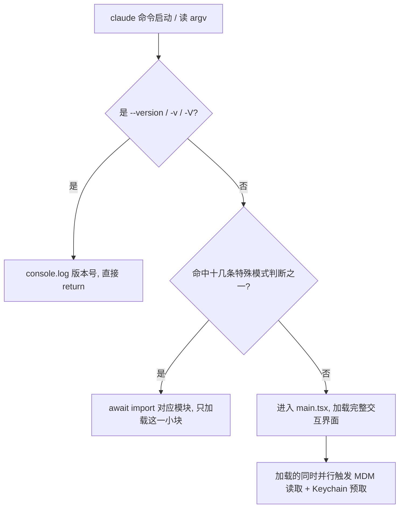
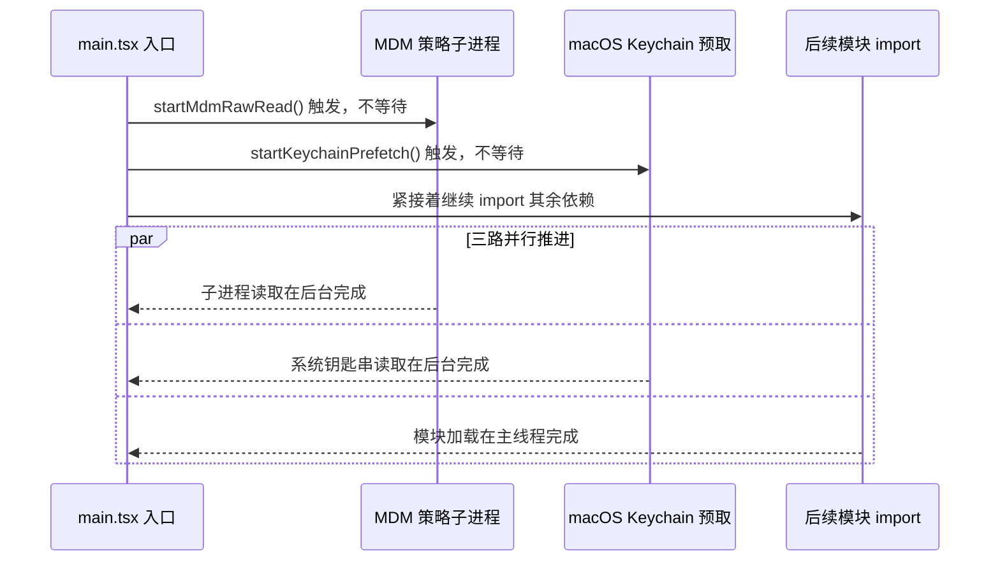

# claude --version 为什么是 0 毫秒：一次入口分层加载的拆解

上一篇拆的是 Claude Code 怎么把脏活累活派给子 Agent——主 Agent 只留一份干净的对话上下文，翻文件、跑调研这些耗资源的活，全甩给临时招来的"员工"去干。这一篇往前挪一步，拆一个更早发生的问题：还没进 agent 循环、甚至还没进交互界面之前，敲下 `claude` 命令的那几十毫秒里，Claude Code 的入口函数在干什么。

很多命令行工具你随手敲个 `--version`，也得等上一两秒才回你，因为它启动时不管你要干嘛，先把整个模块图当场加载完，活还没派下来，全家桶先搬上了桌。Claude Code 不这样——查版本号这种最简单的请求，它几乎是瞬间给出结果。这个差距不是靠后期性能优化挤出来的，而是入口函数在设计阶段就分好了岔路。

本文的任务是拆开 Claude Code 的入口函数 `cli.tsx`，看它怎么把启动路径切成三档快慢不同的通道。读完之后，你应该能在源码里精确定位到这三档各自的判断分支，也能说清楚"先看需求、再决定加载多少"具体是怎么落到代码里的——这是本文的验收标准，文末会给出对应的验证方式。

## 一、为什么入口要分快慢

### 1.1 根本问题：无差别加载的代价

一个 CLI 工具的启动逻辑，最直觉的写法是"从头到尾加载一遍"：先把配置系统、主题系统、遥测系统、交互界面的全部依赖 import 进来，初始化完毕，再回头看用户到底输入了什么参数。这样写代码简单，心智负担低，但代价是所有请求都要为最重的那个功能付费——哪怕用户只是想问一句版本号，也得陪着整个框架启动一遍。

这个代价会随着功能变多而线性增长。Claude Code 支持交互界面、MCP server、后台 daemon、远程桥接、微信客户端等十几种运行模式，如果入口不做分流，每一种模式的依赖都会被无差别地塞进启动路径，`--version` 这种查询类命令就要陪绑着全部买单。

### 1.2 反过来的设计：先判断意图，再决定加载量

Claude Code 的入口函数 `main()`（`src/entrypoints/cli.tsx`）把这个顺序倒过来：第一件事不是加载，而是看 `process.argv` 里到底是什么请求，再决定要不要加载、加载多少。源码注释写得很直白：

```typescript
/**
 * Bootstrap entrypoint - checks for special flags before loading the full CLI.
 * All imports are dynamic to minimize module evaluation for fast paths.
 * Fast-path for --version has zero imports beyond this file.
 */
async function main(): Promise<void> {
```

这里的关键手段是**动态 import**（`await import(...)`）。和写在文件顶部、不管用不用都会在启动时全部加载的静态 import 相反，动态 import 只有代码真正执行到那一行才会触发加载。`main()` 函数体内除了极少数几行，其余分支全部用动态 import 包裹——这意味着一次启动实际加载哪些模块，完全取决于命中了哪个分支，而不是"文件里写了多少 import"。

### 1.3 整体工作流

整条启动路径的判断顺序大致如下：



这张图里有一个顺序不能乱的约束：`--version` 判断必须排在最前面，且必须在任何 `await import` 之前完成——只要它前面插了一行动态加载，"零加载"这个承诺就破了。十几条特殊模式的判断排在中间，各自按需加载自己那一小块。走到最后兜底分支，才真正进入 `main.tsx`，把完整框架的依赖图铺开。下面三节逐档拆开看。

## 二、第一档：真正的零加载 —— `--version` 快速路径

### 2.1 为什么

`--version` 是一条被高频调用的命令——本地环境探测、CI 流水线里判断版本兼容性、脚本里做前置检查，很多场景下会在每次运行前先问一句版本号。这类调用者要的只是一个字符串，如果每次都拖着完整框架启动一遍再退出，是最没有必要的浪费。

### 2.2 怎么做

`main()` 函数里的第一个分支就是它：

```typescript
// src/entrypoints/cli.tsx（main() 函数体第一个分支）
async function main(): Promise<void> {
  const args = process.argv.slice(2);

  // Fast-path for --version/-v: zero module loading needed
  if (args.length === 1 && (args[0] === '--version' || args[0] === '-v' || args[0] === '-V')) {
    // MACRO.VERSION is inlined at build time
    console.log(`${MACRO.VERSION} (Claude Code)`);
    return;
  }
  // 后续分支……
}
```

`MACRO.VERSION` 是构建期常量替换——打包时编译器直接把版本号字符串写死进产物里，运行时不需要读 `package.json`、不需要发起任何文件 I/O 或网络请求，纯粹是一次字符串拼接加一次 `console.log`。整个分支命中之后立即 `return`，函数体后面几百行判断和上百个动态 import 一行都不会执行。

### 2.3 人工审查点

这里有一个坑需要提前说明：这条判断的位置极其敏感。它必须出现在整个入口文件里**第一行执行代码**的位置——排在任何 `await import`、任何配置初始化之前。如果哪天有人在这条判断之前加了一行看似无害的初始化代码（哪怕只是读一次环境变量或者做一次日志埋点），"零模块加载"的承诺就名存实亡了。审查这类快速路径的改动时，重点检查两件事：判断条件本身有没有被改宽（比如误加了别的参数组合也会命中这条分支），以及分支前面有没有被插入新代码。

### 2.4 验证

```bash
# 确认判断条件、直接 return、且分支体内没有 await import
grep -n "Fast-path for --version" -A 5 src/entrypoints/cli.tsx

# 实测：本地已安装 claude 的情况下，多次运行观察响应速度
time claude --version   # 预期：real 时间明显短于跑一次完整交互界面（无需精确到毫秒，能感知到量级差异即可）
```

## 三、第二档：十几条特殊模式的按需加载

### 3.1 为什么

Claude Code 除了交互界面，还要支持 MCP server、后台 daemon、远程桥接（remote-control）、微信客户端、独立的 ACP agent 模式等十几种运行形态。这些模式都不是"查一下版本号"那么轻，但也远不到"加载完整交互界面"的程度——一个只想跑 MCP server 的调用者，不需要主题系统、不需要交互式渲染、也不需要历史记录管理。如果统统塞进完整加载路径，是在为用不上的功能付费；如果每种模式都单独写一遍启动脚本，又会导致十几份重复的初始化逻辑难以维护。

### 3.2 怎么做

`main()` 函数体里，`--version` 分支之后紧跟着十几条判断，每一条只在命中对应参数时才动态加载它自己需要的模块，互不牵连：

| 触发参数 / 子命令 | 动态加载的模块 | 源码位置 |
| --- | --- | --- |
| `--dump-system-prompt` | `config.js` / `model.js` / `prompts.js` | `cli.tsx:93-104` |
| `--claude-in-chrome-mcp` | `claudeInChrome/mcpServer.js` | `cli.tsx:108-109` |
| `--chrome-native-host` | `claudeInChrome/chromeNativeHost.js` | `cli.tsx:113` |
| `--computer-use-mcp` | `computerUse/mcpServer.js` | `cli.tsx:118` |
| `--acp` | `services/acp/entry.js` | `cli.tsx:126` |
| `weixin` | `@claude-code-best/weixin` 等 6 个模块 | `cli.tsx:133-139` |
| `--daemon-worker[=kind]` | `daemon/workerRegistry.js` | `cli.tsx:173` |
| `remote-control` / `rc` / `sync` / `bridge` | `bridge/bridgeMain.js` 等 5 个模块 | `cli.tsx:191-197` |
| `daemon` | `daemon/main.js` | `cli.tsx:239` |
| `autonomy` | `cli/handlers/autonomy.js` | `cli.tsx:251` |

这里列了十条，源码里实际是 14-16 条同类判断（其余几条覆盖 `--bg`、`job`、`environment-runner`、`self-hosted-runner`、`--worktree --tmux` 等场景），模式完全一致，不再逐条展开。整个 `cli.tsx` 文件里，这类 `await import` 一共出现约 46 处。

以 `daemon` 子命令为例，能看出这一档和第一档的区别——它不是零加载，但只加载自己用得上的那几个模块：

```typescript
// src/entrypoints/cli.tsx:231-242
if ((feature('DAEMON') || feature('BG_SESSIONS')) && args[0] === 'daemon') {
  profileCheckpoint('cli_daemon_path');
  const { enableConfigs } = await import('../utils/config.js');
  enableConfigs();
  const { setShellIfWindows } = await import('../utils/windowsPaths.js');
  setShellIfWindows();
  const { initSinks } = await import('../utils/sinks.js');
  initSinks();
  const { daemonMain } = await import('../daemon/main.js');
  await daemonMain(args.slice(1));
  return;
}
```

四次动态 import，只覆盖 daemon 场景需要的配置、shell 处理、日志 sink 和 daemon 主逻辑，主题系统、交互渲染这些完整界面才需要的依赖，完全不会被触碰。

### 3.3 人工审查点

这一档的分支顺序也有讲究——重点检查两点。第一，每条判断都要在真正进入 `commander`（命令行参数解析库，`main.tsx` 里用来处理完整交互模式的子命令和选项）解析完整参数之前完成，因为这类判断依赖的是最原始的 `process.argv`，一旦交给 commander 处理，就意味着已经默认要走完整加载路径了。第二，新增一条特殊模式分支时，要确认它引入的动态 import 不会被上游的静态 import 意外拖入主 bundle——比如某个"只在 daemon 模式用"的模块，如果被完整交互界面那边的文件顶部又 import 了一次，这条快速通道就名不副实了。

### 3.4 验证

```bash
# 数一下整个入口文件里动态 import 的总数，感受"按需加载"的密度
grep -c "await import" src/entrypoints/cli.tsx   # 预期：约 46 处

# 定位某一条具体的快速路径，确认它只 import 了自己需要的模块
grep -n -A 8 "args\[0\] === 'daemon'" src/entrypoints/cli.tsx
```

## 四、第三档：完整界面加载，以及加载过程里的两个优化

### 4.1 只有走到 `main.tsx`，才算真正加载全家桶

前两档判断都没命中，才会走到兜底分支，进入 `src/main.tsx`——这里才是完整交互界面的入口，`commander`、主题系统、agent 循环、UI 渲染这些重量级依赖，都是从这里开始铺开的。用便利店买瓶水打比方：前两档是你进店直奔货架拿了就走，第三档才是你要在店里逛，才需要把整个商场的灯都打开。

### 4.2 加载全家桶不等于傻等——两个并行/延迟优化

就算真的要走完整加载路径，`main.tsx` 也没有闲着等模块加载完。文件最开头，在其余 import 语句执行之前，先同步触发了两个"点火就走、不等结果"的任务：

```typescript
// src/main.tsx:1-22（节选）
import { profileCheckpoint, profileReport } from './utils/startupProfiler.js';

profileCheckpoint('main_tsx_entry');

import { startMdmRawRead } from './utils/settings/mdm/rawRead.js';
startMdmRawRead();   // 触发 MDM 策略读取子进程，不 await

import { ensureKeychainPrefetchCompleted, startKeychainPrefetch } from './utils/secureStorage/keychainPrefetch.js';
startKeychainPrefetch();   // 触发 macOS Keychain 预取，不 await

// 后续才是模块继续加载的其余 import……
```

`startMdmRawRead()` 触发的是读取 MDM（Mobile Device Management，企业设备管理，常见于公司统一下发安全策略的场景）配置的子进程；`startKeychainPrefetch()` 触发的是对 macOS 系统钥匙串的异步预取（把 OAuth token 和旧版 API key 提前读出来）。这两行代码都不带 `await`——调用完立刻往下走，不等结果返回，跟后面几十个模块的静态 import 同时进行，谁也不挡谁的路：



图上这三条轨道谁都不等谁，但用到对应结果的地方（比如判断是否启用远程管理策略）会在真正需要时才去等它完成——源码注释里给出的具体收益是：如果不做这层预取，`isRemoteManagedSettingsEligible()` 后续会通过同步子进程串行读取这两处数据，在 macOS 上每次启动多花约 65ms。并行预取把这部分时间叠进了模块加载的窗口里，不再单独占用启动时间。

第二个优化在 `src/entrypoints/init.ts` 里，管的是遥测系统。OpenTelemetry 加上 protobuf 相关依赖体积不小，源码注释直接写明了数字：

```typescript
// src/entrypoints/init.ts:49-51
// initializeTelemetry is loaded lazily via import() in setMeterState() to defer
// ~400KB of OpenTelemetry + protobuf modules until telemetry is actually initialized.
// gRPC exporters (~700KB via @grpc/grpc-js) are further lazy-loaded within instrumentation.ts.
```

也就是说，就算走了完整加载路径，这约 400KB 的遥测依赖也不会在启动时立刻加载，而是拖到真正需要上报数据的那一刻，才通过 `await import('../utils/telemetry/instrumentation.js')` 动态引入；gRPC exporter 那部分（约 700KB）还要再往后延迟一层。同一个文件里还有一处小设计：整个 `init` 函数用 lodash 的 `memoize` 包了一层：

```typescript
// src/entrypoints/init.ts:66
export const init = memoize(async (): Promise<void> => {
  // …初始化逻辑
});
```

`memoize` 的语义是给函数包一层缓存——第一次调用真正执行函数体，把返回值（这里是一个 Promise）存起来；之后不管从代码里的哪个地方再调用几次 `init()`，都直接拿到同一个缓存结果，函数体不会重新执行第二遍。这解决的是另一个问题：完整加载路径上，有多处代码可能各自调用一次初始化入口，`memoize` 保证不管调用几次，真正的初始化开销只发生一次。

### 4.3 人工审查点

并行预热这类代码有一个容易踩的坑：不带 `await` 的调用，意味着调用者不会等它出错。审查这类代码时要确认两点——第一，这些 fire-and-forget 的任务内部有没有做好自己的错误处理（不能让一个没人等待的 Promise 因为 reject 而变成未捕获异常）；第二，真正用到这些预取结果的地方，有没有正确地等待它们完成（比如 `ensureKeychainPrefetchCompleted()` 这类配套的等待函数），而不是假设它们"应该已经跑完了"就直接读取结果。

### 4.4 验证

```bash
# 确认两个预热调用在其余 import 之前、且没有 await
sed -n '1,22p' src/main.tsx

# 确认遥测的延迟加载点和 memoize 包装
grep -n "initializeTelemetry\|~400KB" src/entrypoints/init.ts
grep -n "export const init = memoize" src/entrypoints/init.ts
```

## 五、验证清单与小结

| 检查项 | 验证方式 | 预期结果 |
| --- | --- | --- |
| `--version` 零加载 | 阅读 `cli.tsx:76-84` | 判断在函数体第一行，命中即 `console.log` 后直接 `return`，分支体内无 `await import` |
| 特殊模式按需加载 | `grep -c "await import" cli.tsx` | 约 46 处，每条只加载自己场景需要的模块 |
| 并行预热 | 阅读 `main.tsx:1-22` | `startMdmRawRead()` / `startKeychainPrefetch()` 排在其余 import 之前触发，且不带 `await` |
| 遥测懒加载 | 阅读 `init.ts:49-51` 及 `initializeTelemetry` 的动态 import 点 | 约 400KB 的 OpenTelemetry 依赖直到真正上报时才加载 |
| 防重复初始化 | 阅读 `init.ts:66` | `init` 被 `lodash-es/memoize` 包裹 |

回顾一下这三档判断能成立的关键决策：优先级不能乱——`--version` 这条零加载判断必须钉死在函数体第一行，任何在它之前插入的初始化代码都会破坏"零模块加载"的承诺；十几条特殊模式判断排在中间，各自只申请自己需要的模块，谁都不替谁多背；完整加载路径兜底在最后，且加载本身不等于傻等，能并行的预热、能延迟的重依赖，都不会占用启动路径上的关键时间。这套顺序背后是同一个原则：先看需求，再决定花多少代价去加载——快速路径必须在第一行代码就分岔，不是靠后期挤性能挤出来的。

从这里往下走，入口这一层的"分层加载"解决的是软件层面的启动开销。再往下钻一层，是操作系统层面的问题：一个跑在 Node.js/Bun 运行时里的 JavaScript 程序，凭什么能直接读取 macOS Keychain、检测系统层面的按键状态这类只有原生代码才摸得到的能力？下一篇要拆的就是这条 FFI（Foreign Function Interface）通道——Claude Code 怎么让 JavaScript 直接调用操作系统底层接口。
