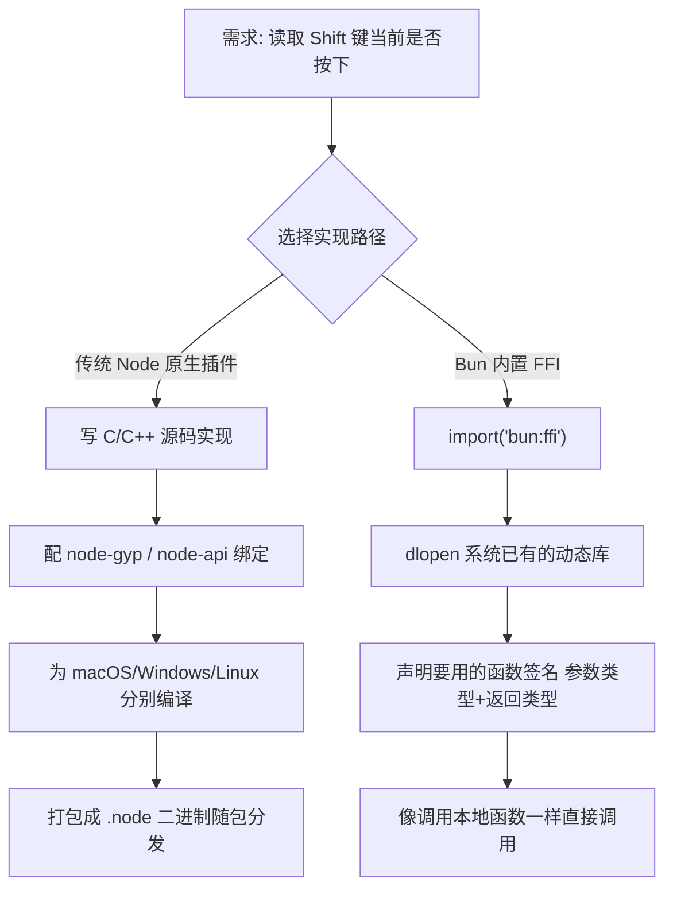
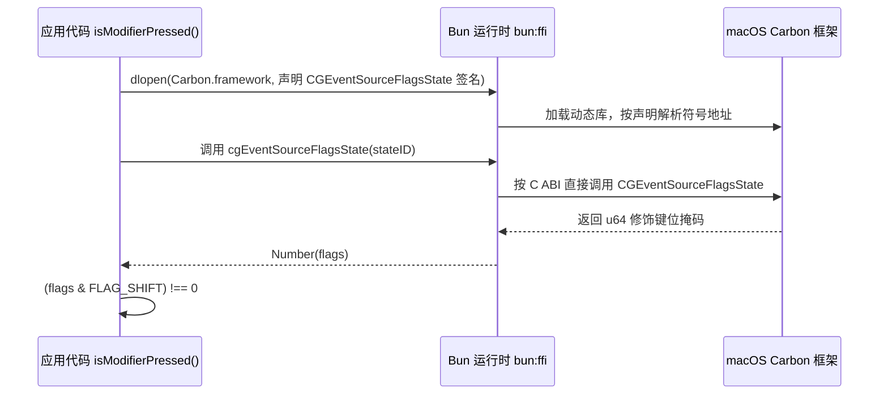
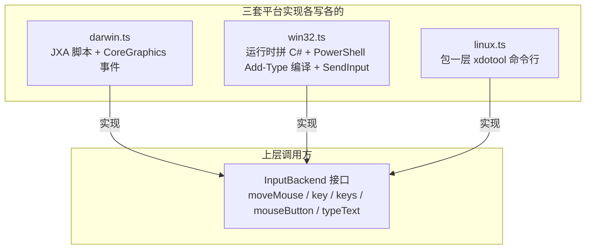

# JavaScript 用 FFI 直接调系统底层：Claude Code 里的两个真实案例

上一篇《claude --version 为什么 0 毫秒出结果》聊的是 Claude Code 在启动路径上的克制——能不加载的模块绝不提前加载，把简单命令的响应时间死死摁在毫秒级。这一篇换个方向：当它必须去做一件"底层活"——读取键盘上某个修饰键当前是否被按住——工程师做出了什么选择。

这活儿听着简单，实现起来却是 Node 生态里公认的硬骨头。JavaScript 运行在 V8 的沙箱里，天生摸不到操作系统的键盘状态；要拿到这类信息，历来的做法是写一个 Node 原生插件：C/C++ 源码、node-gyp 编译工具链、按平台各编一份二进制再随包分发。这条路又慢又重，任何一步配置不对，`npm install` 就会在用户机器上炸出一堆编译错误。

Claude Code 没走这条路。它用的是 Bun 运行时内置的 FFI（Foreign Function Interface，外部函数接口）能力，让 JavaScript 直接跟操作系统里已经装好的动态库对话——不写一行 C，不跑一次编译。这一节的任务是拆开这条路径的两个真实案例（读取 Shift 键状态、跨平台模拟键鼠操作），搞清楚 FFI 具体怎么用、它替代了传统方案的哪一段、以及这条路径本身的代价在哪。读完之后，你应该能自己写一个最小的 `bun:ffi` 脚本跑起来，并且知道什么场景该用这条路、什么场景不该用。

> 说明：本文引用的代码来自 Claude Code 客户端的一份可读源码整理（非官方发布的源码包），行号可能随版本迭代漂移，下文按文件路径 + 关键函数名定位，而非死记行号。

## 一、为什么要绕开传统的 Node 原生插件

### 1.1 传统路径的代价

在 `bun:ffi`之前，JavaScript 想调用系统底层能力，标准答案是 Node 原生插件（Native Addon）：用 C/C++ 写实现，通过 N-API 或 node-gyp 绑定成 `.node` 二进制文件，再针对 macOS/Windows/Linux 各编译一份、打进 npm 包里分发。这条链路有三个明确的代价：

- **工具链门槛高**：使用方机器上要有匹配的编译工具（Xcode Command Line Tools、Visual Studio Build Tools 等），否则装包就失败。
- **交付慢**：改一行 C 代码就要重新编译、重新打包、重新分发，反馈周期是分钟级而不是秒级。
- **体积和维护成本**：每个平台一份二进制，仓库里要维护多份构建产物和 CI 矩阵。

对于"读一次系统当前的修饰键状态"这种几十字节的需求，走这条链路明显是杀鸡用牛刀。

### 1.2 Bun 的另一条路：把 FFI 做成运行时内置能力

Bun 从设计上把 FFI 做成了运行时自带的能力：`import('bun:ffi')` 之后，代码可以用 `dlopen` 直接打开系统上已经存在的动态库（`.dylib` / `.dll` / `.so`），声明库里某个函数的参数和返回值类型，之后就能像调用一个本地 JS 函数一样调用它。这里的关键区别是：传统插件是"自己写一份实现、编译成二进制再分发"，FFI 是"借用系统里已经装好、稳定存在的实现，只声明一下调用约定"——不产生任何要编译、要分发的产物。

### 1.3 整体思路

两条路径的分岔点，整体如下：



这张图上有一条约束容易被忽略：FFI 路径省掉的是"编译+分发"这两步，不是"搞清楚函数签名"这一步——`dlopen` 时声明的参数/返回值类型必须跟系统库的真实 C ABI 完全对上，这一步没有编译器帮你查错，错了就是运行时才会暴露的问题（下文第四节展开）。下面用 Claude Code 里的两个真实案例看这条路径具体怎么走。

## 二、案例一：66 行代码读出 Shift 键状态

### 2.1 需求与实现规模

Claude Code 需要知道用户此刻有没有按住 Shift（用于某些交互的修饰行为）。承担这件事的是 `packages/modifiers-napi/src/index.ts`，全文只有 66 行，没有任何 C 源文件，也没有编译步骤。

### 2.2 第一步：dlopen 打开系统自带框架

macOS 系统自带的 Carbon 框架里有一个函数 `CGEventSourceFlagsState`，专门用来读取当前事件源的修饰键状态。整个实现的第一步就是用 `dlopen` 直接打开这个系统框架：

```typescript
// packages/modifiers-napi/src/index.ts
const ffi = await import('bun:ffi')
const lib = ffi.dlopen(
  `/System/Library/Frameworks/Carbon.framework/Carbon`,
  {
    CGEventSourceFlagsState: {
      args: [ffi.FFIType.i32],
      returns: ffi.FFIType.u64,
    },
  },
)
```

`dlopen` 第一个参数是系统框架在磁盘上的真实路径——不是 npm 包，是操作系统本来就装好的东西。第二个参数是一份声明：告诉 Bun 运行时，这个库里有一个叫 `CGEventSourceFlagsState` 的函数，它接受一个 `i32` 参数、返回一个 `u64`。这份声明就是 FFI 的核心——它替代了传统方案里"写头文件 + 编译绑定层"的工作。

### 2.3 第二步：像调本地函数一样调用

声明完之后，`lib.symbols.CGEventSourceFlagsState` 就是一个可以直接调用的 JS 函数：

```typescript
// packages/modifiers-napi/src/index.ts
cgEventSourceFlagsState = (stateID: number): number => {
  return Number(lib.symbols.CGEventSourceFlagsState(stateID))
}

// isModifierPressed() 内：
const currentFlags = cgEventSourceFlagsState(
  kCGEventSourceStateCombinedSessionState, // = 0
)
return (currentFlags & flag) !== 0
```

调用一次拿到的是当前所有修饰键状态压缩进的一个位掩码（`u64`），跟 Shift 对应的标志位 `FLAG_SHIFT = 0x20000` 做一次按位与，结果非零就是按住了。整个"读键盘物理状态"的核心逻辑，到这里已经结束——没有编译、没有二进制分发、没有跨平台构建矩阵。

调用链路展开看是这样的：



这条时序图上有一条容易被忽略的约束：`dlopen` 和"声明签名"只在 `loadFFI()` 第一次调用时执行一次（源码里用 `ffiLoadAttempted` 这个标记位卡住），之后每次 `isModifierPressed()` 调用都是直接走已经解析好的函数指针，不会重复触发 `dlopen`——这也是为什么这条路径的运行时开销可以忽略不计。

### 2.4 人工审查点

生成或照抄这类代码时，有两个点必须重点检查：

第一，**类型声明要跟系统函数的真实签名精确匹配**。`args`/`returns` 写错类型（比如把 `u64` 写成 `i32`），TypeScript 编译器不会报错——这是运行时才会暴露、甚至可能直接导致进程崩溃的问题，跟平时"类型不对编译就红线"的体验完全不同，必须对着系统文档核对，不能凭感觉猜。

第二，**优雅降级不是可选项**。源码里 `loadFFI()` 用 `try/catch` 包住整个 `dlopen` 过程，失败时把 `cgEventSourceFlagsState` 设为 `null`，之后 `isModifierPressed()` 直接返回 `false`，不抛异常、不崩程序。这是必须有的兜底——系统版本变化、安全策略调整都可能让 `dlopen` 在某台机器上失败，FFI 调用天生没有"包管理器帮你锁版本"这层保护。

### 2.5 动手验证

不需要 Claude Code 源码，也能验证 `bun:ffi` 这套机制本身是通的。写一个最小复现：调用系统 `libSystem` 里最常见的 `getpid`，验证 FFI 确实调用到了真实的系统函数。

```javascript
// verify-ffi.js —— 验证 bun:ffi 机制本身，不依赖 Claude Code 源码
import { dlopen, FFIType, suffix } from 'bun:ffi'

const { symbols } = dlopen(`libSystem.${suffix}`, {
  getpid: {
    args: [],
    returns: FFIType.i32,
  },
})

console.log('FFI 拿到的当前进程 PID:', symbols.getpid())
```

```bash
bun run verify-ffi.js
# 预期输出: FFI 拿到的当前进程 PID: <一个整数>

ps -p $$ | tail -1   # 对照系统命令查到的 PID，两者应该完全一致
```

看到两边 PID 对上，就说明 FFI 确实穿透到了操作系统层，而不是 JS 里模拟出来的假数据。

## 三、案例二：同一个功能，三套系统各说各的方言

### 3.1 需求：让 AI 模拟键盘鼠标操作电脑

比读键盘状态更硬核的是 Computer Use——让 AI 能模拟鼠标点击、键盘输入去操作电脑。这件事的难点不在"要不要调系统底层"（肯定要），而在于移动鼠标、按键这类操作在三个操作系统上根本没有统一的系统调用可言。Claude Code 的做法是：对上层暴露同一个 `InputBackend` 接口，背后按平台各写一套实现。

### 3.2 macOS：JXA 脚本 + CoreGraphics 事件

macOS 端用的是 JXA（JavaScript for Automation，通过 `osascript -l JavaScript` 执行），在脚本里直接调 CoreGraphics 的 API 造出一个鼠标事件，灌进系统事件流：

```typescript
// packages/@ant/computer-use-input/src/backends/darwin.ts
function buildMouseJxa(
  eventType: string,
  x: number,
  y: number,
  btn: number,
): string {
  return `ObjC.import("CoreGraphics");
    var p = $.CGPointMake(${x},${y});
    var e = $.CGEventCreateMouseEvent(null, $.${eventType}, p, ${btn});
    $.CGEventPost($.kCGHIDEventTap, e);`
}
```

键盘输入则更简单，走 `osascript` 直接给 System Events 发 `keystroke`/`key code` 指令，不需要额外造事件对象。

### 3.3 Windows：运行时拼 C# 代码，PowerShell 编译再跑

Windows 端没有现成的脚本层可以直接调 Win32 API，于是它反过来：在 JS 里拼出一段完整的 C# 源码字符串，通过 PowerShell 的 `Add-Type` 在运行期编译成可用的类型，再调用其中的 `SendInput`：

```typescript
// packages/@ant/computer-use-input/src/backends/win32.ts
const WIN32_TYPES = `
Add-Type -Language CSharp @'
using System.Runtime.InteropServices;
public class CuWin32 {
    [DllImport("user32.dll")] public static extern bool SetCursorPos(int X, int Y);
    [DllImport("user32.dll", SetLastError=true)]
    public static extern uint SendInput(uint n, INPUT[] i, int cb);
    // ...
}
'@
`

function ps(script: string): string {
  const result = Bun.spawnSync({
    cmd: ['powershell', '-NoProfile', '-NonInteractive', '-Command', script],
    stdout: 'pipe', stderr: 'pipe',
  })
  return new TextDecoder().decode(result.stdout).trim()
}
```

`[DllImport("user32.dll")]` 这一行就是 C# 里的 P/Invoke（Platform Invoke）声明，跟 `bun:ffi` 的 `dlopen` 是同一个思路——声明要用的系统函数签名，再直接调用。区别在于这里没有直接从 JS 调 `user32.dll`，而是让 JS 生成一段 C# 代码、交给 PowerShell 的 `Add-Type` 在运行期编译执行，多绕了一层。

### 3.4 Linux：包一层 xdotool

Linux 端走得最朴素，没有自己拼 C 调用，直接把成熟的命令行工具 `xdotool` 包了一层：

```typescript
// packages/@ant/computer-use-input/src/backends/linux.ts
export const moveMouse: InputBackend['moveMouse'] = async (x, y) => {
  run(['xdotool', 'mousemove', '--sync', String(Math.round(x)), String(Math.round(y))])
}

export const mouseButton: InputBackend['mouseButton'] = async (button, action, count) => {
  const btn = mouseButtonNum(button)
  if (action === 'click') {
    run(['xdotool', 'click', '--repeat', String(count ?? 1), btn])
  }
  // ...
}
```

### 3.5 对上层暴露同一接口

三套实现的调用方式天差地别——JXA 脚本、运行期编译的 C#、命令行工具——但三个文件都实现了同一份 `InputBackend` 类型（`moveMouse`/`key`/`keys`/`mouseButton`/`typeText` 等）。调用方拿到的是一个统一接口，不需要关心自己跑在哪个系统上：



这张图上真正的重点不是"三个文件"，而是箭头方向：平台差异被压在实现层，接口层看不到一点 macOS/Windows/Linux 的痕迹。这意味着调用方（比如驱动 AI 操作电脑的上层逻辑）只写一份代码，切换平台时不需要改一行调用方代码——这跟案例一"省掉编译分发"是同一种工程思路的两次应用：把复杂度封装到边界内部，而不是消灭它。

### 3.6 人工审查点

这里有一个坑需要提前说明：接口统一了，**运行门槛并没有跟着统一**。macOS 端的 `System Events` 调用依赖辅助功能（Accessibility）权限授权，没给权限脚本会静默失败；Windows 端要求 PowerShell 的执行策略允许运行脚本；Linux 端则要求运行环境提前装好 `xdotool` 这个系统包，容器镜像里默认通常没有。接口层的"同一个函数调用"掩盖不了三条环境依赖链——集成这类跨平台能力时，环境准备工作必须按平台分别核对，不能假设"接口一样,环境也一样"。

### 3.7 动手验证

三套实现各自的核心操作都可以脱离 Claude Code 单独验证：

```bash
# macOS：直接跑 JXA 片段，鼠标应该真的移动到 (200, 200)
osascript -l JavaScript -e '
ObjC.import("CoreGraphics");
var p = $.CGPointMake(200,200);
var e = $.CGEventCreateMouseEvent(null, $.kCGEventMouseMoved, p, 0);
$.CGEventPost($.kCGHIDEventTap, e);
'

# Windows：单独跑 P/Invoke 片段，确认 Add-Type 编译通过、光标真的移动
powershell -NoProfile -Command "
Add-Type -Language CSharp @'
using System.Runtime.InteropServices;
public class T { [DllImport(\"user32.dll\")] public static extern bool SetCursorPos(int X, int Y); }
'@
[T]::SetCursorPos(200, 200)
"

# Linux：确认 xdotool 已装好、能读到鼠标当前坐标
xdotool getmouselocation
```

三条命令分别对应三个后端文件里最核心的一行调用，跑通说明该平台上这条技术路径本身是成立的，不依赖任何私有代码。

## 四、FFI 不是免费的午餐：代价与边界

把两个案例放在一起看，能得出一个更有判断力的结论：FFI 省掉的是"写 C + 编译 + 分发二进制"这条链路的固定成本，换来的代价是**把类型安全的检查点从编译期挪到了运行期**。案例一里 `args: [ffi.FFIType.i32], returns: ffi.FFIType.u64` 这行声明写错了，TypeScript 不会报错，程序会在真正调用时才暴露问题，排查起来比编译错误绕得多。

案例二说明了另一件事：FFI/系统调用并不能消灭"到底层去"这件事本身自带的复杂度，只是把复杂度从"编译期的 C 工具链"搬到了"运行期的脚本拼接与命令行依赖"——三套后端各自还是要单独维护、单独适配，跨平台这道题没有被 FFI 解开，只是换了个更轻的解法。

这里的判断是：FFI 更适合"调用系统里已经确定存在、签名几十年不大改的成熟能力"（比如 Carbon 框架里的 `CGEventSourceFlagsState`），而不适合用来自己实现一整套复杂算法逻辑——后者用 C/Rust 写好、编译、走类型检查和单元测试的收益，远大于省下的那点"不用编译"的便利。判断一个场景该不该用 FFI，先问一句：我要调用的是系统本来就有、稳定存在的能力，还是要自己实现一段新逻辑？前者用 FFI 省链路，后者老老实实走编译型语言。

## 五、验证清单

| 结论 | 验证方式 | 预期结果 |
| --- | --- | --- |
| `bun:ffi` 能直调系统动态库，不写 C、不编译 | 本地跑 `verify-ffi.js` 调 `libSystem` 的 `getpid` | 打印出的 PID 与 `ps -p $$` 查到的完全一致 |
| Carbon 框架能读出修饰键状态 | 对照 `packages/modifiers-napi/src/index.ts` 的 `dlopen` + 声明手法 | `(flags & 0x20000) !== 0` 对应 Shift 是否按下 |
| macOS 键鼠模拟走 JXA + CoreGraphics | `osascript -l JavaScript` 单独跑 `buildMouseJxa` 生成的脚本 | 鼠标真的移动到指定坐标 |
| Windows 键鼠模拟走 PowerShell + C# P/Invoke | 单独跑 `Add-Type` + `SetCursorPos` 片段 | 编译通过，光标移动到目标坐标 |
| Linux 键鼠模拟走 xdotool | `xdotool getmouselocation` | 打印出当前鼠标坐标，确认依赖已装好 |

## 六、小结

实现过程中有几个决策值得记住：

- 检测 Shift 键状态没有走 Node 原生插件的老路，是因为要调用的系统函数（`CGEventSourceFlagsState`）签名稳定、路径已知——`bun:ffi` 省掉的正是"编译+分发"这段不产生额外价值的固定成本。
- 跨平台键鼠模拟没有幻想"一套代码走天下"，而是三套后端各写各的、对上层收敛成同一个 `InputBackend` 接口——平台差异被封装在实现层，而不是被假装不存在。
- 优雅降级（`dlopen` 失败时返回 `false` 而不是抛异常崩程序）是 FFI 类调用的标配，不是锦上添花：这条路径没有包管理器帮你锁版本，运行时失败必须有兜底。

关键产出文件：

+ `packages/modifiers-napi/src/index.ts` —— 用 `bun:ffi` 读 Shift 等修饰键状态，全文 66 行
+ `packages/@ant/computer-use-input/src/backends/darwin.ts` —— macOS 端 JXA + CoreGraphics 后端
+ `packages/@ant/computer-use-input/src/backends/win32.ts` —— Windows 端 PowerShell + C# P/Invoke 后端
+ `packages/@ant/computer-use-input/src/backends/linux.ts` —— Linux 端 xdotool 后端

能调系统底层，只说明"有这个能耐"；敢把这条路径放进生产环境天天跑，背后还得有一整套兜底逻辑——`try/catch` 只是最外层的一道。下一篇拆 Anthropic 工程师的防御性编程做到了什么程度：他们在哪些地方假设"这里一定会出错"，又是怎么把这些假设写进代码里的。
