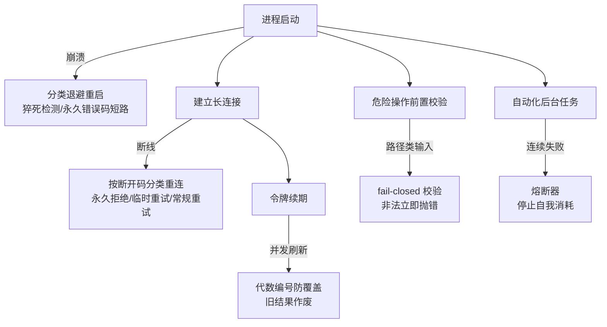
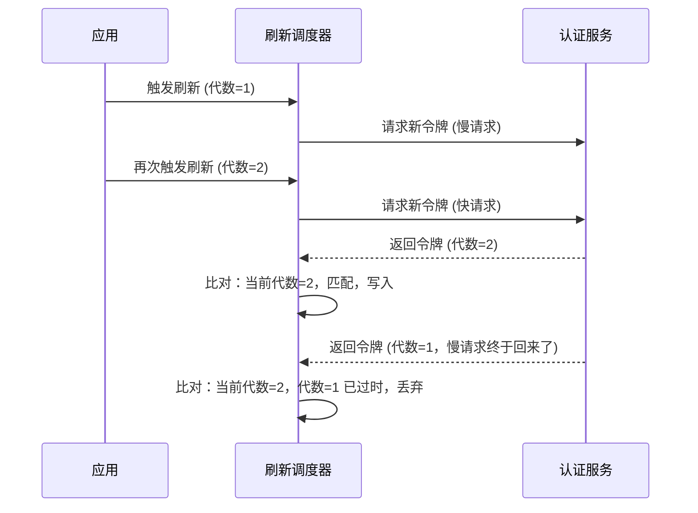

# 从 Claude Code 源码看防御性编程：5 个"万一"该怎么防

上一篇聊的是 Claude Code 为了检测你到底按没按住 Shift 键，直接调了一层 macOS 系统底层——那是一种"不放过任何输入细节"的偏执。这一篇要聊的是另一种偏执：不放过任何"万一"。

大多数业务代码覆盖的是"正常路径"：请求成功、连接稳定、用户输入合法、系统资源够用。但生产代码要多扛住一层——进程会崩、网络会断、异步请求会乱序返回、用户输入可能带着恶意路径、自动化系统可能在小概率场景下把自己拖进死循环。这些分支平时几乎跑不到，一旦跑到，处理不好就是线上事故。

把 Claude Code 源码里专门"防自己出错"的代码翻了一遍，挑出五类真实存在的防御模式，从进程崩溃重启，一路到自动化系统给自己装熔断器。这篇文章的任务，是把这五个模式从具体源码里抽出来，还原成可以直接搬到自己项目里用的套路。读完之后，你应该能：写一个脚本模拟带上限的指数退避、看懂"代数编号"是怎么防止旧数据覆盖新数据的、写出一个 fail-closed 的路径校验函数、给自己项目里的高频自动化调用点加上熔断器。每一节都配一段可以直接跑起来验证的代码。

## 一、demo 和产品之间，差的是"万一"分支

### 1.1 正常路径之外，还有多少种失败

业余代码和生产代码的分野，往往不在"能不能实现功能"，而在"功能失败时会发生什么"。一个后台进程崩了，是无脑立刻重启，还是判断一下值不值得重启？一条 WebSocket 断了，是无脑重连，还是先看一眼断开原因？一个异步请求还没返回，新请求已经发出去了，旧请求的结果回来时该不该采纳？一段拼接路径的代码，输入来源可控时，会不会被拐到别的目录？一套为了省钱而设计的自动化系统，会不会在某个边界场景下，自己把自己拖成一个不断重试、不断烧钱的黑洞？

这五个问题，分别对应五类真实存在的失败面：进程级崩溃、网络级中断、状态级竞态、输入级恶意、系统级自我耗竭。覆盖"正常路径"只解决了功能问题，覆盖这五类"万一"，才是生产代码和 demo 之间那道看不见的分界线。

### 1.2 整体思路：防御分层挂在哪个环节

把一次会话的生命周期铺开看，这五层防御分别挂在不同的环节上——有的挂在进程存活期，有的挂在连接维持期，有的挂在状态更新期，有的挂在危险操作前，有的挂在系统自身的资源消耗上。整体思路大致如下：



这五条边有一个共同的约束：**每一层都是"默认怀疑、按证据放行"**，而不是"默认信任、出了问题再兜底"。重启前先判断值不值得重启，重连前先看断开原因，覆盖状态前先比对代数，执行危险操作前先校验输入，自动重试前先看历史失败次数。下面四节，逐一拆开这五条边背后的具体实现。

## 二、崩溃后不是无脑重启：分类退避与"猝死"熔断

### 2.1 为什么无脑重启是个坑

后台进程崩溃后立刻重启，看起来是最直觉的做法，但会造成两个问题。第一，如果崩溃是因为配置错误（比如缺了一个必需的环境变量），无脑重启只会让进程原地反复崩溃，白白消耗资源还刷屏日志。第二，如果崩溃是瞬时的（比如内存抖动），固定间隔的重启会在高负载时段制造出一波接一波的重启风暴。

Claude Code 的守护进程对这两个问题各给了一个对策：**指数退避**处理"要不要立刻重启"，**猝死检测 + 永久错误码**处理"要不要继续重启"。退避从 2 秒起步，每崩一次翻倍，封顶 2 分钟——避免重启风暴；如果进程在启动后 10 秒内就崩了，算一次"猝死"，连续猝死 5 次直接放弃、不再自动重启；如果进程带着退出码 78 退出（这个数字来自 Unix `sysexits.h` 里的 `EX_CONFIG`，语义就是"配置错误"），代表重启也没用，当场停手，不走计数流程。

WebSocket 的断线重连用的是同一套思路，只是分类维度换成了"断开码"。断开码 4003 语义是"未授权/永久拒绝"，收到直接不重连；断开码 4001 语义是"会话找不到"，但这种情况经常发生在服务端压缩上下文的过程中，属于临时性的，给三次线性退避的重试机会；其它断开原因走固定两秒一次、最多五次的常规重连。三种断开码，三种对待方式，本质上是同一个模式的两个实现：**不是所有失败都值得用同一种方式重试**。

### 2.2 参考实现

进程重启的退避与猝死判断，简化后大致是这个结构：

```typescript
// 简化示意：进程守护的分类重启逻辑
const BACKOFF_INITIAL_MS = 2_000;
const BACKOFF_MULTIPLIER = 2;
const BACKOFF_CAP_MS = 120_000;
const RAPID_CRASH_THRESHOLD_MS = 10_000;
const MAX_RAPID_FAILURES = 5;
const EXIT_CODE_PERMANENT = 78; // EX_CONFIG，重启无意义

function onWorkerExit(worker: WorkerState, exitCode: number, backoffMs: number) {
  if (exitCode === EXIT_CODE_PERMANENT) {
    worker.parked = true; // 配置错误，直接停手
    return;
  }

  const runDuration = Date.now() - worker.lastStartTime;
  if (runDuration < RAPID_CRASH_THRESHOLD_MS) {
    worker.failureCount += 1;
    if (worker.failureCount >= MAX_RAPID_FAILURES) {
      worker.parked = true; // 连续猝死，放弃
      return;
    }
  } else {
    worker.failureCount = 0; // 跑够时长，重置计数
  }

  worker.backoffMs = Math.min(backoffMs * BACKOFF_MULTIPLIER, BACKOFF_CAP_MS);
  scheduleRestart(worker, worker.backoffMs);
}
```

WebSocket 的分类重连同理，核心是一张"断开码 → 处理策略"的映射表：

```typescript
// 简化示意：按断开码分类的重连策略
const PERMANENT_CLOSE_CODES = new Set([4003]); // unauthorized，不重连
const SESSION_NOT_FOUND_CODE = 4001;           // 压缩上下文期间的临时抽风
const MAX_SESSION_NOT_FOUND_RETRIES = 3;
const RECONNECT_DELAY_MS = 2000;
const MAX_RECONNECT_ATTEMPTS = 5;

function onClose(code: number, state: ReconnectState) {
  if (PERMANENT_CLOSE_CODES.has(code)) {
    return; // 永久拒绝，不再尝试
  }
  if (code === SESSION_NOT_FOUND_CODE) {
    if (state.sessionNotFoundRetries >= MAX_SESSION_NOT_FOUND_RETRIES) return;
    state.sessionNotFoundRetries += 1;
    // 线性退避：重试次数 × 固定延迟
    return scheduleReconnect(RECONNECT_DELAY_MS * state.sessionNotFoundRetries);
  }
  if (state.reconnectAttempts >= MAX_RECONNECT_ATTEMPTS) return;
  state.reconnectAttempts += 1;
  scheduleReconnect(RECONNECT_DELAY_MS); // 常规断线，固定间隔
}
```

这里有一个坑需要提前说明：不要把"指数退避"当成万能默认值直接套用到所有重连场景上。源码里 WebSocket 的常规重连用的是固定间隔而不是指数退避——这不是疏漏，而是场景决定的：进程重启的代价是启动开销，指数退避能有效抑制重启风暴；而 WebSocket 重连的代价相对小，固定间隔反而能让恢复更可预测。选哪种退避策略，要看失败的代价曲线，不是照抄一套模板。

### 2.3 验证

写一个最小脚本，把退避序列打出来，确认它符合"2 秒起步、每次翻倍、封顶 2 分钟"：

```bash
node -e "
let backoff = 2000;
for (let i = 0; i < 8; i++) {
  console.log(\`第\${i + 1}次重启，等待 \${backoff / 1000}s\`);
  backoff = Math.min(backoff * 2, 120000);
}
"
# 预期输出：2s → 4s → 8s → 16s → 32s → 64s → 120s → 120s（第7次起封顶）
```

看到序列在第 7 次触底封顶在 120 秒，说明退避曲线和猝死阈值的组合是对的——重启不会在短时间内无限制加速，也不会永远重试下去。

## 三、状态竞态：用"代数"编号防止旧数据覆盖新数据

### 3.1 为什么异步刷新会"越修越乱"

令牌续期是个典型的异步竞态场景：系统在令牌过期前 5 分钟就提前发起刷新请求，正常情况下新令牌会覆盖旧令牌。但网络请求的返回顺序不保证和发出顺序一致——如果某次刷新因为网络慢，比后面发出的刷新请求更晚返回，它带着一个"过时的"令牌回来，直接覆盖，就会把状态往回拖，用一个已经不是最新的令牌覆盖掉本该生效的新令牌。

这类问题不能靠"加锁"简单解决，因为刷新请求本身是异步网络调用，锁不住网络延迟。Claude Code 给每一次刷新分配一个递增的"代数"编号：发起刷新时记下当前代数，请求返回时先比对代数是不是还是最新的，不是最新的就判定为过时结果，直接丢弃，绝不写回状态。连续失败三次就彻底放弃，不再死磕。



图上关键的约束是顺序：**代数递增必须先于请求发出、比对必须在写入之前**。如果先写入再比对，或者代数在请求发出之后才递增，这套机制就会失效——过时的结果依然有机会覆盖新结果。

### 3.2 参考实现

```typescript
// 简化示意：带代数编号的令牌刷新调度
const generations = new Map<string, number>();
const MAX_REFRESH_FAILURES = 3;

function nextGeneration(sessionId: string): number {
  const gen = (generations.get(sessionId) ?? 0) + 1;
  generations.set(sessionId, gen);
  return gen;
}

async function doRefresh(sessionId: string, failures = 0) {
  const gen = nextGeneration(sessionId); // 发起前先递增代数
  try {
    const token = await requestNewToken(sessionId);
    if (generations.get(sessionId) !== gen) {
      return; // 比对不通过：已经有更新的刷新在途或已完成，丢弃
    }
    writeToken(sessionId, token);
  } catch {
    if (failures + 1 < MAX_REFRESH_FAILURES) {
      return doRefresh(sessionId, failures + 1);
    }
    // 连续失败达到上限，放弃，不再重试
  }
}
```

### 3.3 验证

模拟一个"旧代数"的回调在新代数之后到达，断言它被正确丢弃：

```bash
node -e "
const generations = new Map();
function next(id) { const g = (generations.get(id) ?? 0) + 1; generations.set(id, g); return g; }

const id = 's1';
const genOld = next(id);   // 代数=1，慢请求
const genNew = next(id);   // 代数=2，快请求先返回

// 快请求先写入
console.log('快请求写入:', generations.get(id) === genNew ? '接受' : '丢弃');
// 慢请求后到
console.log('慢请求写入:', generations.get(id) === genOld ? '接受' : '丢弃');
"
# 预期输出：快请求写入: 接受 / 慢请求写入: 丢弃
```

看到"慢请求写入: 丢弃"，说明代数比对逻辑生效了——旧结果不会覆盖新结果。

## 四、动手前先验证：fail-closed 的输入校验

### 4.1 为什么路径拼接是个高危动作

只要一段代码要把外部输入拼进文件路径，就存在目录穿越风险：输入里带 `..` 就可能跳出预期目录，输入里带非法字符可能绕过后续的字符串匹配，输入过长可能触发文件系统或下游逻辑的边界问题。Claude Code 在把隔离任务的工作目录名（slug）拼进路径之前，先做了一轮同步校验：带 `..` 想跳出目录的、夹带不在白名单字符集里的字符的、超过 64 个字符的，全部当场抛错，函数直接返回、根本不往下执行到路径拼接和文件操作那一步。

这是一个明确的 **fail-closed** 设计：校验函数的注释里写得很直白——调用方依赖这个校验必须在任何副作用发生之前跑完。换句话说，宁可对着一个其实无害的输入报错拒绝，也不要放过一个有一丝可疑的输入。校验不是"锦上添花"的健壮性优化，而是后续所有危险操作（比如 `git worktree remove --force` 这类会真删文件的命令）能安全执行的前提条件。

### 4.2 参考实现

```typescript
// 简化示意：fail-closed 的路径 slug 校验
const VALID_SLUG_SEGMENT = /^[a-zA-Z0-9._-]+$/;
const MAX_SLUG_LENGTH = 64;

function validateWorktreeSlug(slug: string): void {
  if (slug.length > MAX_SLUG_LENGTH) {
    throw new Error(`slug 超过 ${MAX_SLUG_LENGTH} 字符: ${slug}`);
  }
  const segments = slug.split('/');
  for (const seg of segments) {
    if (seg === '.' || seg === '..') {
      throw new Error(`slug 含目录穿越片段: ${slug}`);
    }
    if (!VALID_SLUG_SEGMENT.test(seg)) {
      throw new Error(`slug 含非法字符: ${slug}`);
    }
  }
  // 校验全部通过，函数正常返回；调用方在此之后才能安全地
  // path.join('.claude/worktrees', slug) 并执行后续文件操作
}
```

生成后人工审查两个重点。第一，白名单字符集是否覆盖了所有合法输入——过严会误伤正常用例，过宽则失去校验意义，需要根据实际的输入来源（用户输入 / 内部生成）定字符集宽严。第二，校验函数必须是同步抛错，不能是"校验完再异步通知调用方"——异步校验意味着调用方可能在校验结果返回之前就已经执行了危险操作，fail-closed 的前提是校验必须挡在副作用之前。

### 4.3 验证

列几个应该被拒绝的输入，断言全部抛错：

```bash
node -e "
const VALID = /^[a-zA-Z0-9._-]+\$/;
const MAX = 64;
function validate(slug) {
  if (slug.length > MAX) throw new Error('too long');
  for (const seg of slug.split('/')) {
    if (seg === '.' || seg === '..') throw new Error('traversal');
    if (!VALID.test(seg)) throw new Error('invalid char');
  }
}
const cases = ['../etc/passwd', 'foo/../bar', 'a;rm -rf', 'a'.repeat(65), 'valid-slug_123'];
for (const c of cases) {
  try { validate(c); console.log(c, '-> 通过'); }
  catch (e) { console.log(c, '-> 拒绝:', e.message); }
}
"
# 预期：前四个全部被拒绝，只有 valid-slug_123 通过
```

前四种输入应该全部被拒绝，只有最后一个合法 slug 能通过——如果有恶意输入漏过了校验，说明字符集或穿越检测有遗漏，需要回头补。

## 五、别让省钱系统变烧钱黑洞：给自动化任务装熔断器

### 5.1 为什么自动化系统需要"熔断"自己

Claude Code 有一套自动压缩上下文的机制（autocompact），目的是替用户省 token、省钱——上下文太长时自动摘要压缩，避免每次请求都把全部历史重新算一遍 token 费用。但这套机制本身也可能失败：如果压缩逻辑自己连续出错，系统会怎么处理？如果没有熔断机制，最直觉的做法是"失败了就再压缩一次"，这在小概率场景下会变成一个越跑越猛的重试循环——一个为了省钱而生的系统，反而变成了不断重试、不断消耗资源的黑洞。

源码注释里留了一组真实数据：曾经有 1,279 个会话遭遇过连续失败 50 次以上的情况，最严重的一个连续失败了 3,272 次。这不是假设的边界场景，是真实发生过的故障。对策是给这套自动化系统装一个简单但有效的熔断器：连续失败达到 3 次，直接停止重试；一旦某次成功，失败计数清零。熔断和第二节的退避重启看起来相似，但语义不同——退避解决的是"多久之后再试"，熔断解决的是"要不要继续试下去"，两者经常需要一起用。

### 5.2 参考实现

```typescript
// 简化示意：自动化任务的熔断器
const MAX_CONSECUTIVE_FAILURES = 3;

class CircuitBreaker {
  private consecutiveFailures = 0;

  get isOpen(): boolean {
    return this.consecutiveFailures >= MAX_CONSECUTIVE_FAILURES;
  }

  async run<T>(task: () => Promise<T>): Promise<T | null> {
    if (this.isOpen) {
      return null; // 熔断已跳闸，不再执行，避免持续消耗资源
    }
    try {
      const result = await task();
      this.consecutiveFailures = 0; // 成功，清零
      return result;
    } catch (err) {
      this.consecutiveFailures += 1;
      throw err;
    }
  }
}
```

审查点在于：熔断器一旦跳闸之后，系统要不要提供一个显式的恢复路径（比如人工重置、或者一段时间后自动尝试一次半开状态）。Claude Code 的 autocompact 熔断在源码层面是"跳闸后不再自动重试"，把决定权交回给上层，这也是一种克制——**不是所有失败都要在系统内部悄悄兜底，有些失败应该直接暴露出来，让人知道发生了什么**。

### 5.3 验证

模拟连续失败场景，断言在第 3 次失败后熔断跳闸、第 4 次调用被拦截：

```bash
node -e "
const MAX = 3;
let failures = 0;
function isOpen() { return failures >= MAX; }
function run(shouldFail) {
  if (isOpen()) { console.log('熔断已跳闸，跳过执行'); return; }
  if (shouldFail) { failures += 1; console.log('执行失败，累计', failures, '次'); }
  else { failures = 0; console.log('执行成功，计数清零'); }
}
run(true); run(true); run(true); run(true);
"
# 预期：前三次打印"执行失败"，第四次打印"熔断已跳闸，跳过执行"
```

看到第四次调用被拦截，说明熔断器在连续失败达到阈值后确实停止了消耗——这正是防止"省钱系统变烧钱黑洞"的关键一步。

## 六、验证清单与小结

五个模式对应的验证方式汇总一下：

| 模式 | 验证方式 | 预期结果 |
| --- | --- | --- |
| 分类退避重启 | Node 脚本打印退避序列 | 2s 起步、每次翻倍、封顶 120s |
| WebSocket 分类重连 | 按断开码走三条分支 | 4003 不重连 / 4001 线性重试 3 次 / 其它固定 2s 重试 5 次 |
| 代数编号防覆盖 | 模拟旧代数回调晚到达 | 旧结果被丢弃，不覆盖新状态 |
| fail-closed 路径校验 | 传入穿越/非法字符/超长输入 | 全部同步抛错，函数不往下执行 |
| 自动化任务熔断器 | 连续触发 4 次失败 | 第 4 次被熔断拦截，不再执行 |

实现过程中有几个决策值得记住：退避策略要看失败代价选，代价高（如进程重启）用指数退避抑制风暴，代价低（如常规断线）用固定间隔换取可预测性；状态竞态不能靠加锁解决异步乱序，代数编号是更轻量的方案；输入校验要 fail-closed、同步执行、挡在副作用之前；自动化系统自己也需要熔断器，不能假设"失败了再试一次"永远安全。这五个模式没有一个依赖框架或特定语言特性，可以直接搬进任何有后台进程、长连接、异步状态更新、危险文件操作或自动化重试逻辑的项目里。

防御做到这份上其实还没完。下一篇要聊的是 Prompt 缓存崩了之后的处理——如果说这一篇讲的是"怎么扛住万一"，下一篇讲的是防御往前一步的能力：万一真的发生了，系统怎么精确告诉你，到底是哪个工具干的。
