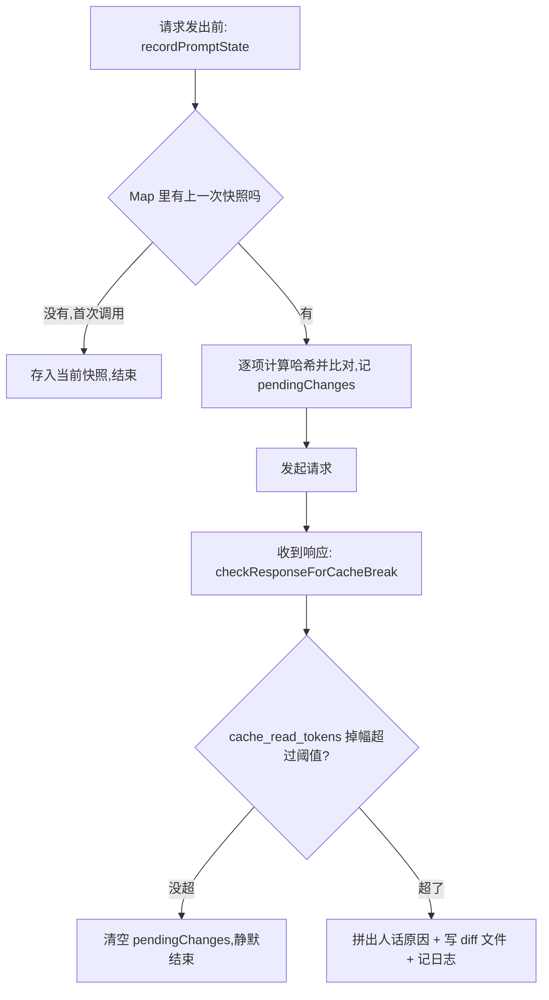

# Prompt 缓存崩了，Claude Code 怎么点名是哪个工具干的

上一篇拆的是 Claude Code 源码里"跟万一死磕"的五个防御设计——进程崩了不疯狂重启而是指数退避，令牌换新时靠一个"代数"编号防止旧请求把新令牌覆盖掉，删目录之前先把路径校验到寸步不让。这些防御有一个共同点：出问题的时候，代码自己知道"哪里"出了问题，不需要人去猜。

这一篇要拆的是另一类问题——它不报错、不崩溃、甚至不会让你的请求失败，但会让账单悄悄变贵：prompt 缓存崩了。Anthropic 的 prompt 缓存命中之后，那部分输入 token 的计费大约打到基础价的[一折](https://docs.anthropic.com/en/docs/build-with-claude/prompt-caching)（cache read ≈ 0.1×原价），对于系统提示词长、工具一大堆的 AI 应用来说，这是一笔实打实的成本。但缓存命中的前提极苛刻：这次请求的前缀必须跟上次一字节不差，系统提示、工具定义、模型、任何一个开关变了，缓存就整体作废。一个真实的 agent 请求里，同时活跃着几十个工具定义、十几个 beta 开关、一整段系统提示、模型、推理强度、缓存策略——缓存崩了之后想靠人肉排查是哪一项干的，等同于大海捞针。

Claude Code 的做法是给 prompt 缓存装一套黑匣子：每次请求前后各拍一次快照，逐项比对，崩了就精确点名到具体哪个工具、甚至能分清这锅该谁背。这篇要拆的就是这套黑匣子——`src/services/api/promptCacheBreakDetection.ts`（726 行）——怎么设计快照、怎么把"工具那块崩了"细化到"崩在哪个工具"、以及它怎么知道该不该报警。读完之后，你会知道去源码的哪个文件、哪一行，能亲手把这些结论过一遍。

## 一、为什么缓存需要一套专门的"验尸"系统

### 1.1 命中规则很死，噪音又很大

Prompt 缓存的命中判断本质上是一次前缀比对：服务端把这次请求的系统提示、工具定义、模型等信息拼起来，跟上次缓存的内容逐字节比对，只要完全一致就命中，只要有一个字符不同就整体作废。这个规则本身没有问题——但一个正在运行的 agent 系统里，能让这段前缀发生变化的因素并不只是"你主动改了 prompt"这一种：MCP 工具动态发现导致工具列表变了、某个 beta 开关被悄悄打开、上下文压缩策略切了一档、甚至只是服务端自己的路由或驱逐策略——这些都会让下一次请求的前缀跟上次对不上。

换句话说，缓存崩了本身不算稀奇事，稀奇的是"崩了之后你完全不知道是谁干的"。

### 1.2 人肉排查等于大海捞针

如果没有这套检测，你能看到的只有一个数字变化：这次请求返回的 `cache_read_tokens` 比上次低了一截，账单也跟着涨了一截。但请求体里塞着几十个工具的 schema、系统提示、模型参数、一串 beta 开关——想靠肉眼比对两次请求的差异，既没有基线可比，也没有工具能自动 diff。这正是黑匣子要解决的问题：把"缓存崩了"这个模糊信号，翻译成"哪一项变了、变成了什么样"这个具体信号。

### 1.3 整体思路：两阶段快照，逐项比对

黑匣子的设计思路很朴素，分两个阶段，分别挂在一次请求的前后：



这张图里有一个关键约束：阶段一（`recordPromptState`）只负责记录和比对，不产生任何日志或告警——它甚至不知道这次请求最后会不会真的崩缓存。真正的判断在阶段二（`checkResponseForCacheBreak`），要等服务端返回 `cache_read_tokens` 之后才能确认。这个拆分不是随意的：阶段一在请求发出前同步执行，不能等服务端响应；阶段二则必须拿到响应里的真实缓存命中数字才能下判断。两者靠一个按来源分区的 `Map` 传递状态，下一节具体拆这个 Map 里存的是什么。

## 二、请求前，把每个"嫌疑人"都拍成一张哈希快照

### 2.1 一次请求里到底有哪些嫌疑人

阶段一的核心是 `recordPromptState`（`promptCacheBreakDetection.ts:247-428`），它把一次请求里所有可能影响服务端缓存键的因素，各自计算一份哈希，存进 `PreviousState` 结构：

```typescript
// src/services/api/promptCacheBreakDetection.ts:28-69（节选关键字段）
type PreviousState = {
  systemHash: number          // 系统提示（剥离 cache_control 后）
  toolsHash: number           // 全部工具 schema 的聚合哈希
  cacheControlHash: number    // 系统提示块的 cache_control 单独哈希
  toolNames: string[]
  perToolHashes: Record<string, number>   // 每个工具单独一份哈希
  systemCharCount: number
  model: string
  fastMode: boolean
  globalCacheStrategy: string
  betas: string[]
  effortValue: string
  extraBodyHash: number
  cacheDeletionsPending: boolean
  buildDiffableContent: string
}
```

系统提示一个哈希、工具聚合一个哈希、模型、beta 开关列表、推理强度、缓存策略——每一项单独存一份，逐项比对时才能知道具体是哪一项变了，而不是笼统地知道"有什么东西变了"。

### 2.2 为什么 cache_control 要单独存一份

这里有一个坑源码专门做了处理：`systemHash` 在计算前会先剥离 `cache_control` 字段（`stripCacheControl`，`:160-168`），只对文字内容算哈希。但缓存的作用域（global/org）和有效期（1 小时/5 分钟）恰恰是写在 `cache_control` 里的，如果只看剥离后的 `systemHash`，那种"文字一个字没变，但作用域或有效期被悄悄翻转"的情况根本发现不了。所以源码又单独算了一份 `cacheControlHash`（`:279-281`），专门捕捉这类"内容没变、控制参数变了"的隐蔽情况，源码注释里写得直白：

> Catches scope/TTL flips (global↔org, 1h↔5m) that stripCacheControl erases from systemHash.

这是一处很典型的设计教训：同一份数据，为了不同的比对目的，值得算两次哈希，而不是图省事只算一次。

**验证**：打开 `promptCacheBreakDetection.ts:28-69` 确认 `PreviousState` 里 `systemHash` 和 `cacheControlHash` 是两个独立字段；再看 `:267-281`，确认 `systemHash` 用的是 `stripCacheControl` 之后的 `strippedSystem`，而 `cacheControlHash` 直接对 `system.map(b => b.cache_control)` 算哈希，两条计算路径互不复用。

## 三、逐工具单独哈希：把"工具那块崩了"细化到具体哪个工具

### 3.1 为什么不能把工具揉成一个哈希

如果只有一个聚合的 `toolsHash`，能知道的信息只有"工具这块变了"，具体是新增了工具、删除了工具，还是某个工具的描述改了一个字，完全分辨不出来。源码的做法是在聚合哈希之外，再给每个工具单独算一份哈希，存进 `perToolHashes`：

```typescript
// src/services/api/promptCacheBreakDetection.ts:187-196
function computePerToolHashes(
  strippedTools: ReadonlyArray<unknown>,
  names: string[],
): Record<string, number> {
  const hashes: Record<string, number> = {}
  for (let i = 0; i < strippedTools.length; i++) {
    hashes[names[i] ?? `__idx_${i}`] = computeHash(strippedTools[i])
  }
  return hashes
}
```

这份计算并不是每次请求都做——源码只在聚合的 `toolsHash` 确实发生变化时才触发逐工具哈希（`:283-286` 注释：常见情况是工具没变，这一步能省掉 N 次多余的 `jsonStringify`）。这是一处很朴素的性能考虑：逐工具哈希有额外开销，没必要在"工具压根没变"的绝大多数请求里都算一遍。

### 3.2 最阴的一种崩法：工具数量没变，schema 悄悄变了

为什么非要拆到逐工具这个粒度？源码注释里给出了理由，而且带了一个具体数字：

> Diffed to name which tool's description changed when toolSchemasChanged but added=removed=0 (77% of tool breaks per BQ 2026-03-22).

也就是说，"工具集合没增没减，但其中某个工具的描述或参数悄悄改了"——这种最难靠肉眼发现的崩法，占了工具类缓存崩溃的 77%。如果只有聚合哈希，你只知道"工具那块崩了"；有了逐工具哈希，比对逻辑能精确点名到具体哪个工具：

```typescript
// src/services/api/promptCacheBreakDetection.ts:366-376（节选）
const changedToolSchemas: string[] = []
if (toolSchemasChanged) {
  const newHashes = computeToolHashes()
  for (const name of toolNames) {
    if (!prevToolSet.has(name)) continue
    if (newHashes[name] !== prev.perToolHashes[name]) {
      changedToolSchemas.push(name)
    }
  }
  prev.perToolHashes = newHashes
}
```

逻辑很直接：只在工具集合里同时存在于新旧两次请求的工具（`prevToolSet.has(name)`）里找哈希不一致的，新增或删除的工具不算在"schema 变了"里——这两类原因在后面拼人话的时候是分开描述的，一个是"工具集变了"，一个是"工具集没变、内容变了"。

**验证**：打开 `:187-196` 确认 `computePerToolHashes` 对每个工具单独调用一次 `computeHash`；再看 `:366-376`，确认 `changedToolSchemas` 只收集"新旧都存在但哈希不同"的工具名，跟"新增/删除的工具"是两条不同的判断路径。

## 四、崩没崩：先看阈值，再拼人话，最后写一份"验尸报告"

### 4.1 阈值：小波动不算崩

阶段一只负责记录"哪些东西变了"，真正判断"缓存到底崩没崩"发生在阶段二 `checkResponseForCacheBreak`（`:435-665`），依据是服务端返回的 `cache_read_tokens`。这里有一个设计上不能省的环节：不是只要这个数字比上次低，就直接报警。缓存命中数字本身存在正常波动，源码设了两道阈值：

```typescript
// src/services/api/promptCacheBreakDetection.ts:120,482-491（节选）
const MIN_CACHE_MISS_TOKENS = 2_000

const tokenDrop = prevCacheRead - cacheReadTokens
if (
  cacheReadTokens >= prevCacheRead * 0.95 ||
  tokenDrop < MIN_CACHE_MISS_TOKENS
) {
  state.pendingChanges = null
  return
}
```

必须同时满足两个条件才算真崩：相对跌幅超过 5%，且绝对掉量至少 2000 个 token。只满足其中一个不够——一个原本命中 3 万 token 的大请求，掉 4% 也可能绝对值破千但没到 2000，噪音就被过滤掉了；一个原本只命中几百 token 的小请求，哪怕跌了 90%，绝对值也远够不到 2000，同样不报警。这种双阈值设计是为了不让告警系统天天响，把注意力留给真正值得看的那些崩溃。

### 4.2 拼成人话：不是甩一堆布尔值，而是一句能读的话

确认真崩了之后，源码把阶段一记录的 `pendingChanges`（各项是否变化的一堆布尔值和差值）拼装成一句人能直接读的话：

```typescript
// src/services/api/promptCacheBreakDetection.ts:511-516（节选）
if (changes.toolSchemasChanged) {
  const toolDiff =
    changes.addedToolCount > 0 || changes.removedToolCount > 0
      ? ` (+${changes.addedToolCount}/-${changes.removedToolCount} tools)`
      : ' (tool prompt/schema changed, same tool set)'
  parts.push(`tools changed${toolDiff}`)
}
```

同样的判断逻辑覆盖了系统提示（带字符增减量）、模型、beta 开关（带新增/移除的具体名单）、缓存策略、推理强度等十来项（`:494-562`）。多个原因会拼在一起，比如"model changed (...), tools changed (+2/-0 tools)"——这条消息最终会跟着一次 `logForDebugging` 一起落进日志（`:657-659`），排查的人不需要再去猜，读一行日志就知道大致方向。

### 4.3 diff 验尸报告：连字都能看到

如果只知道"工具变了"还不够精确，源码还留了一层更细的手段——把崩溃前后完整的 prompt 状态（系统提示 + 全部工具的 name/description/schema，`buildDiffableContent`，`:206-222`）各存一份，用标准的 diff 库生成补丁文件写到磁盘：

```typescript
// src/services/api/promptCacheBreakDetection.ts:707-726
async function writeCacheBreakDiff(
  prevContent: string,
  newContent: string,
): Promise<string | undefined> {
  try {
    const diffPath = getCacheBreakDiffPath()
    await mkdir(getClaudeTempDir(), { recursive: true })
    const patch = createPatch(
      'prompt-state',
      prevContent,
      newContent,
      'before',
      'after',
    )
    await writeFile(diffPath, patch)
    return diffPath
  } catch {
    return undefined
  }
}
```

这份 diff 文件的路径会一并写进日志摘要（`:656-657`），开 `--debug` 就能翻出来，逐字看到底是哪几行变了——相当于给每一次缓存崩溃留了一份可复盘的验尸报告，而不只是一句"工具变了"的结论。

### 4.4 诚实标注：不是每次都能甩锅给你

黑匣子最容易被做歪的地方，是把所有崩溃都算成"用户/代码的锅"。源码在这里的处理很诚实：如果逐项比对下来客户端这边什么都没变（`parts` 是空的），再看时间间隔有没有超过缓存的 TTL——源码里定义了两档：5 分钟和 1 小时（`CACHE_TTL_5MIN_MS`/`CACHE_TTL_1HOUR_MS`，`:125-126`）。源码注释给出了一个基于真实数据的判断：

> Post PR #19823 BQ analysis: when all client-side flags are false and the gap is under TTL, ~90% of breaks are server-side routing/eviction or billed/inference disagreement.

也就是说，客户端所有标志位都没变、时间间隔又在 TTL 以内的情况下，大约九成的崩溃是服务端自己的路由或驱逐策略导致的，不该甩锅给客户端。这种情况下，`reason` 直接标注为"likely server-side (prompt unchanged, <5min gap)"，而不是含糊地说"缓存崩了，原因不明"（`:576-587`）。这套黑匣子的价值不只是能抓你写的 bug，反过来也能替你的代码洗清嫌疑。

顺带一提，源码里还有一处容易被忽略但同样重要的处理：如果这次缓存读数下降是 cached microcompact 主动删除部分缓存内容导致的（`notifyCacheDeletion`，`:672-681`），黑匣子会提前标记 `cacheDeletionsPending`，下一次比对时直接跳过、不报警（`:472-480`）——这是"预期内的下降"，不该跟真正的意外崩溃混在一起。

**验证**：打开 `:482-491` 确认双阈值判断（5% 相对跌幅 + 2000 token 绝对值）用的是 `||` 而不是 `&&`，即两个条件命中任意一个就不报警，必须同时不满足才算真崩；再看 `:572-587`，确认 `reason` 的判断顺序是先看 `parts` 是否为空，再看 TTL 时间窗口，最后才落到"unknown cause"兜底。

## 五、退一步看：黑匣子的设计不是为了抓你

把四节拼起来看，这套黑匣子的核心思路其实只有一句话：把"缓存崩了"这个模糊的账单信号，拆成一组可对比的哈希，逐项比对、逐工具点名、拼成人话、必要时落一份 diff 文件，最后还得诚实地区分客户端和服务端各自的责任。它不是一套用来问责的监控，而是一套用来定位问题的诊断工具——这个区别决定了它愿不愿意在没有证据的时候说"这大概不是你的问题"。

对做 AI 应用的人来说，这套思路值得直接搬：把缓存命中率做成系统里一个正经的监控指标，而不是等账单涨了才后知后觉。真出问题时，能定位到具体哪个工具、哪一行 diff，远比对着一堆布尔值猜要靠谱。

### 验证清单

想自己去源码里把这些结论过一遍，可以按这张表逐条核对：

| 结论 | 验证位置（文件:行号） | 预期确认结果 |
| --- | --- | --- |
| 系统提示/cache_control 分开算哈希 | `promptCacheBreakDetection.ts:267-281` | `systemHash` 用剥离后的内容，`cacheControlHash` 单独对 cache_control 字段算 |
| 每个工具单独一份哈希 | `:187-196` | `computePerToolHashes` 对每个工具调用一次 `computeHash`，存进以工具名为 key 的对象 |
| schema 变了但工具集没变，能精确点名 | `:366-376` | `changedToolSchemas` 只收集"新旧都存在但哈希不同"的工具名 |
| 双阈值判断，缺一不可 | `:120,482-491` | 相对跌幅 ≥5% 且绝对掉量 ≥2000 token 才判定为真崩 |
| 崩溃原因拼成可读的一句话 | `:494-562` | `parts` 数组按模型/系统提示/工具/betas 等逐项拼接，`join(', ')` |
| diff 文件落盘、路径进日志 | `:648-660,707-726` | `writeCacheBreakDiff` 用 `createPatch` 生成补丁并 `writeFile`，路径出现在 `summary` 里 |
| 无客户端变更时不甩锅 | `:572-587` | `parts` 为空时按 TTL 窗口判断，标注 "likely server-side" 而非默认归咎客户端 |
| 缓存主动删除不算崩 | `:472-480,672-681` | `cacheDeletionsPending` 为真时直接清空 `pendingChanges`，不进入报警分支 |

### 小结

拆完这套黑匣子，有几个决策值得记住：请求前后拆成两个独立阶段，阶段一只记录不判断，阶段二拿到真实响应数字才下结论，因为"变了什么"和"是否真的崩了"本来就是两件事；工具哈希拆到逐个粒度是整套设计里投入产出比最高的一步——77% 的工具类崩溃靠聚合哈希根本发现不了；双阈值判断是为了让告警只在真正值得看的时候响；诚实标注服务端责任，是这套系统没有被做成"甩锅工具"的关键一步。

关键产出（源码位置，供后续复查）：

+ `promptCacheBreakDetection.ts:247-428` —— 阶段一 `recordPromptState`，逐项哈希与比对
+ `promptCacheBreakDetection.ts:187-196,366-376` —— 逐工具哈希与 schema 变更点名
+ `promptCacheBreakDetection.ts:435-665` —— 阶段二 `checkResponseForCacheBreak`，阈值判断与责任归因
+ `promptCacheBreakDetection.ts:707-726` —— `writeCacheBreakDiff`，崩溃前后的 diff 验尸报告

这个系列拆到这里是第十四篇，也是最后一篇"拆别人代码"的文章。下一篇不再拆源码，而是反过来：用两百行代码，自己动手写一个迷你版 Claude Code——完结篇，把这十四篇里拆过的核心机制，浓缩到一个能跑起来的最小实现里。
