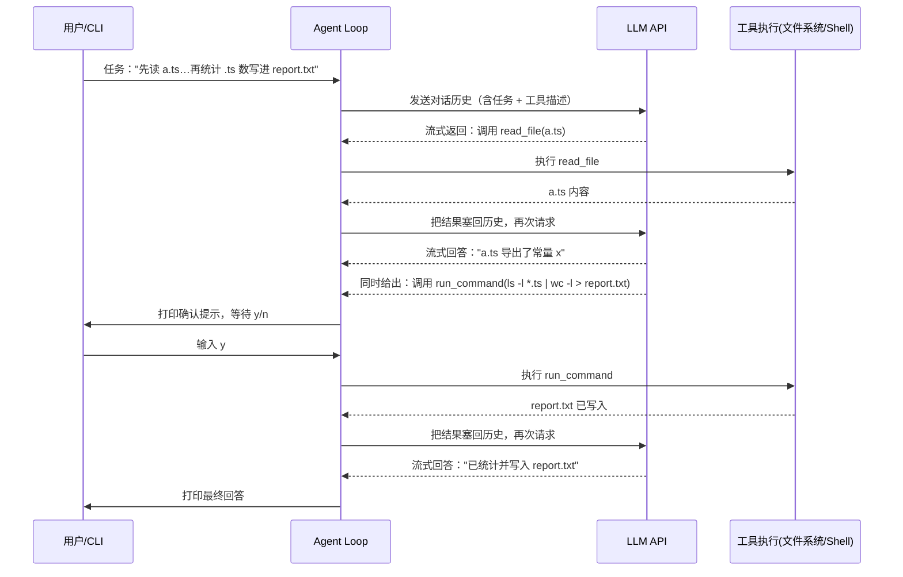

# 两百行代码，手写一个迷你 Claude Code

上一篇拆的是 Claude Code 的缓存黑匣子——请求前给系统提示、工具、模型这些可能搞崩缓存的因素逐项拍哈希快照，崩了之后逐项比对，精确到是哪个工具的 schema 把缓存搞崩的。那一篇是系列拆到第十四集才会长出来的东西：一套完整的自检机制，几百行代码，专门用来解决"缓存说崩就崩、崩了不知道为什么"这一个问题。

拆了十四集别人的工程代码，容易落进一个误区：以为一个能用的 agent，天生就得是这么厚的一摞。但压缩、并发调度、缓存自检、防御性兜底，这些统统是补丁——是系统跑起来之后，为了应付某个具体的失败场景才长出来的。补丁再多，也不是骨架本身。如果现在要你抛开这些补丁，从零手写一个真正能用的 agent，你能不能说清楚，到底哪几样东西是不可再少的？

这一篇的任务是给出一个可验证的答案：不依赖任何 agent 框架，只用 Node 自带的能力，手写一个跑得起来的迷你 agent——它要能读文件、能跑命令、能自己决定下一步干什么，代码量控制在两百行以内。写完之后拿一个真实任务跑一遍，你会看到它完整走一次"调用模型 → 决定要不要调工具 → 危险动作先问权限 → 执行 → 流式打字机式回话"的全过程，产物文件里的数字要和目录里的真实文件数对得上。这就是本文的验收标准，也是整个系列最后一集的收尾方式。

## 一、为什么两百行就够

### 1.1 根本问题：工程代码的体量，掩盖了骨架的体量

一个容易产生的错觉是：Claude Code 源码几万行，那么一个"够用"的 agent，怎么也得是大几千行起步。但把工程外壳一层层剥掉——不算上下文压缩、不算多工具并发调度、不算缓存自检、不算各种边界情况的防御性兜底——剩下的核心逻辑，其实只有四样东西：一个循环、几个工具、一道权限闸、流式输出。这四样东西加起来，两百行以内可以写完，而且不需要引入任何第三方框架。

工程代码之所以厚，是因为它要在"骨架能跑"的基础上再解决一堆真实世界的问题：十个工具并发执行时如何不互相写坏文件、上下文塞满了怎么压缩、缓存崩了怎么定位到具体原因。这些问题都成立、都值得拆，但它们回答的是"骨架跑起来之后还会遇到什么"，不是"骨架本身是什么"。本文只回答后一个问题。

### 1.2 这一版忠于接口，不是简化到失真的玩具

迷你版不是凭空发明的简化模型，字段设计直接对照 Claude Code 源码里的真实接口：工具定义对照 `src/Tool.ts` 的字段集合（`name`、`inputSchema`、`description`、执行入口 `call`），agent 循环对照 `src/query.ts` 里 `query` 函数下沉之后的那个 `while (true)`。裁掉的是工程加固，保留的是接口形状——这样写出来的迷你版，才经得起拿去和源码逐条对照。

模型这一端也是刻意选的：迷你版走的是 OpenAI 兼容协议（`chat/completions` + function calling + SSE 流式），实测时指向的是 Gemini 的兼容端点，换一个 `BASE_URL` 和 `MODEL` 就能切到别家。这印证的是系列第九集拆过的结论——agent 的核心是这个循环本身，跟具体接的是哪一家模型无关。

### 1.3 整体工作流

四个部件怎么咬合在一起，整体流程大致如下：

```mermaid
flowchart TD
    A[用户给一个任务] --> B[while 循环: 把对话历史发给模型]
    B --> C[流式读取模型返回]
    C --> D{模型要调用工具吗?}
    D -->|不要, 只是回答| E[打印最终回答, 循环结束]
    D -->|要, 给出工具名+参数| F{这个工具需要权限吗?}
    F -->|只读, 不需要| H[直接执行工具]
    F -->|会改动机器, 需要| G[打印确认提示, 等用户 y/n]
    G -->|拒绝| I[把"用户拒绝"塞回历史]
    G -->|同意| H
    H --> J[把执行结果塞回对话历史]
    I --> B
    J --> B
```

这张图里有两个不能乱的约束。第一，工具执行结果必须先塞回对话历史、再进入下一轮循环——模型看不到工具真实返回了什么，就没法基于结果决定下一步，agent 就退化成一次性问答。第二，权限判断卡在"决定要调用"和"真正执行"之间，而不是卡在别的位置——判断早了，模型还没说清参数就打断；判断晚了，命令已经跑完再问就没有意义。这也是为什么权限闸必须挂在循环体内部，而不是循环外面统一拦一次。

## 二、骨架的两大件：循环与工具

### 2.1 第一步：while 循环 —— agent 的心脏

**为什么**：没有循环，agent 就只是一次性问答——问一句、答一句，答完就结束，不存在"自己决定下一步"这件事。要让模型能读完一个文件之后，接着决定还要不要跑命令，就必须允许它把"调用工具"当成一轮对话的合法输出，而不是终点。

**怎么做**：逻辑很朴素——把对话历史发给模型，看它这一轮想干什么。如果它只是说话，那就是最终答案，循环结束；如果它说"我要调个工具"，就去执行，把结果按 `tool_call_id` 塞回对话历史，再发起下一轮请求。直到某一轮模型不再要工具为止。

```typescript
// demo/mini-agent.ts —— agent loop 核心
async function agentLoop(task: string) {
  const messages: any[] = [
    { role: "system", content: "你是一个跑在用户终端里的编码助手……" },
    { role: "user", content: task },
  ];

  while (true) {
    const reply = await streamTurn(messages);
    messages.push(reply);

    // 没有要调的工具 → 这一轮就是最终回答，循环结束
    if (!reply.tool_calls?.length) return;

    // 有工具要调：逐个执行，结果按 tool_call_id 塞回历史
    for (const call of reply.tool_calls) {
      const tool = tools.find((t) => t.name === call.function.name);
      const args = JSON.parse(call.function.arguments || "{}");
      const result = await tool!.execute(args);
      messages.push({ role: "tool", tool_call_id: call.id, content: result });
    }
  }
}
```

这个 while 循环加上里面的判断分支，二十行写完。Claude Code 满血版的 `query` 函数，扒到底层的执行核心，也是同一个 `while (true)`：模型输出里出现 `tool_use` 类型的内容块就提取执行、结果回填对话；工程加的都是循环之外的东西——多轮压缩、并发调度、异常兜底，循环本身没有变。

**验证**：给它一个不需要工具、能直接回答的任务（比如"你好，你能做什么"），跑起来应该在第一轮就打印回答并结束，不会进入工具执行分支——这说明"没有 tool_calls 就退出循环"这条终止条件生效了。

### 2.2 第二步：工具 —— 最小必要就三样

**为什么**：光有循环，模型也无从下手——它不知道自己"有什么手脚可以用"。工具这一层要解决的问题是：把"我能做什么"用模型看得懂的格式描述清楚，模型才能在需要时主动说"我要调这个，参数是这些"。

**怎么做**：对照 Claude Code 的 `Tool` 接口，一个工具最小必要的字段就三样——叫什么名字（`name`）、参数长什么样（`parameters`，一份 JSON Schema）、真正干活的那段代码（`execute`）。迷你版给了两个工具：只读的 `read_file`，和会改动机器状态的 `run_command`。

```typescript
// demo/mini-agent.ts —— 工具定义
type Tool = {
  name: string;
  description: string;
  parameters: Record<string, unknown>;
  needsPermission: boolean; // 危险动作（跑命令）执行前要问一句
  execute: (args: any) => Promise<string>;
};

const tools: Tool[] = [
  {
    name: "read_file",
    description: "读取一个文件的文本内容",
    parameters: {
      type: "object",
      properties: { path: { type: "string", description: "文件路径" } },
      required: ["path"],
    },
    needsPermission: false, // 只读，不用问
    execute: async ({ path }) => {
      const { readFile } = await import("node:fs/promises");
      return await readFile(path, "utf8");
    },
  },
  {
    name: "run_command",
    description: "在 shell 里执行一条命令并返回输出",
    parameters: {
      type: "object",
      properties: { cmd: { type: "string", description: "要执行的命令" } },
      required: ["cmd"],
    },
    needsPermission: true, // 会改你的机器，执行前必须问
    execute: async ({ cmd }) => {
      const { execSync } = await import("node:child_process");
      return execSync(cmd, { encoding: "utf8", timeout: 15000 });
    },
  },
];
```

两个工具各十几行。真正传给模型的，只是把 `name`、`description`、`parameters` 打包成 function calling 格式塞进请求体——`execute` 和 `needsPermission` 是迷你版自己内部要用的字段，模型看不到也不需要看到。这一段设计对照的是 `src/Tool.ts` 里的字段集合：`name`、`inputSchema`、`description` 这几个描述性字段决定模型"知道什么"，`call`（对应这里的 `execute`）决定实际"干什么"，权限相关的 `prompt` 字段对应下一节要写的权限闸。

**产物**：这份描述会被打包进请求体的 `tools` 字段（`type: "function"`），随对话历史一起发给模型；模型判断当前这一步需要用工具时，会在返回里带上 `tool_calls`，里面就是它自己选中的工具名和它自己拼出来的参数 JSON。

**验证**：跑一个"帮我看看 a.ts 导出了什么"这类任务，终端应该先打印出 `▶ read_file {"path":"a.ts"}`，再打印模型基于文件内容给出的回答——出现这一行，说明模型确实读懂了工具描述，并且主动选中了正确的工具。

## 三、把两件不该省的事做对：权限闸与流式输出

### 3.1 第三步：权限闸 —— 危险动作落地前，把决定权交还给人

**为什么**：`read_file` 只读不写，出错顶多是读错文件，无所谓；但 `run_command` 会真的改你的机器——删文件、装包、改配置，一旦执行完就回不去了。这里有一个坑需要提前说明：如果权限判断只是"打印一句提示后照常往下走"，那和没有权限闸没有区别，真正的拦截必须能让执行流程停下来等答复。

**怎么做**：执行前加一道拦截，只对标了 `needsPermission: true` 的工具生效——把要跑的命令和参数打印出来，等用户输入 `y` 才放行；输入其他内容，就把"用户拒绝了这次执行"作为工具结果塞回对话历史，让模型知道这条路走不通，改主意想别的办法。

```typescript
// demo/mini-agent.ts —— 权限询问
async function askPermission(tool: Tool, args: any): Promise<boolean> {
  if (!tool.needsPermission) return true;
  const q = `\n  ⚠️  要执行 [${tool.name}] ${JSON.stringify(args)}\n  允许吗？(y/n) `;
  if (!stdin.isTTY) {
    // 非交互（CI / 录屏）模式：打印提问后自动批准，决定权仍显式落地
    process.stdout.write(q + "y  (非交互模式自动批准)\n");
    return true;
  }
  const ans = await rl.question(q);
  return ans.trim().toLowerCase().startsWith("y");
}
```

五行代码而已。一个 agent 敢在你的电脑上跑命令，底气不是它多聪明，而是这道"先问你一句"的闸——`read_file` 因为 `needsPermission` 是 `false` 直接放行，`run_command` 每次都要走这道询问。这一段设计是向系列第五集拆过的权限管线致敬：权限判断不是可有可无的装饰，是危险动作和用户意图之间唯一的一道闸。

**人工审查点**：非交互模式（CI、录屏这类场景）下自动批准的分支要小心对待——它是为了让流程能跑通而设计的降级路径，不是"权限闸形同虚设"。关键在于它仍然打印出了完整的确认提示和"自动批准"的说明，决定过程是显式记录下来的，不是悄悄跳过。

**验证**：跑一个包含"跑命令"这一步的任务，终端应该在真正执行命令之前，先打印出 `⚠️ 要执行 [run_command] {...}` 和 `允许吗？(y/n)` 的提示——出现这一行，且命令还没有真正跑完，说明权限闸卡住了执行流程，而不是走个形式。

### 3.2 第四步：流式输出 —— 打字机效果怎么来的

**为什么**：模型生成一段回答可能要几秒甚至更久，如果等它整段写完再一次性打印，用户盯着空白屏幕的体验很差。流式输出要解决的是这个体验问题：模型一边想，就一边把已经想出来的部分打到屏幕上。

**怎么做**：请求体里带上 `stream: true`，返回的是一段 SSE（Server-Sent Events）流。用 `for await` 逐块读 `resp.body`，每块解出 `delta.content` 就立刻 `process.stdout.write` 打印，同时把内容累加成完整文本。工具调用信息也是分片到达的，需要按 `index` 把碎片拼回完整的 `name` 和 `arguments`。

```typescript
// demo/mini-agent.ts —— 流式解析（节选）
for await (const chunk of resp.body as any) {
  buf += decoder.decode(chunk, { stream: true });
  const lines = buf.split("\n");
  buf = lines.pop() ?? "";
  for (const line of lines) {
    if (!line.startsWith("data: ")) continue;
    const data = line.slice(6).trim();
    if (data === "[DONE]") continue;
    const delta = JSON.parse(data).choices?.[0]?.delta;
    if (delta.content) {
      process.stdout.write(delta.content); // ← 流式打印
      text += delta.content;
    }
    for (const tc of delta.tool_calls ?? []) {
      const idx = tc.index ?? 0; // 有的端点不发 index，默认按 0 处理
      const slot = (toolCalls[idx] ??= { id: "", function: { name: "", arguments: "" } });
      if (tc.function?.name) slot.function.name += tc.function.name;
      if (tc.function?.arguments) slot.function.arguments += tc.function.arguments;
    }
  }
}
```

**人工审查点**：这里有一个坑需要提前说明——工具调用的参数是分片流式到达的，`arguments` 字段不能直接覆盖赋值，必须用字符串拼接（`+=`），因为一个完整的 JSON 参数经常会被切成好几个 chunk 发过来，中途任何一次覆盖都会把之前拼好的部分丢掉。另外要按 `index` 归位，不能假设每次只有一个工具调用在流式返回。

**验证**：跑起来观察终端——模型的回答文字应该是逐字符或逐词吐出来的效果，而不是等待几秒后一次性刷出一整段。这个逐块打印的现象，就是你平时在 Claude Code 或类似工具里看到的"打字机效果"的来源。

## 四、跑起来：一次真实调用穿过全部四步

四步分开看都不复杂，串起来才是完整的 agent。这一节给它一个真实任务，看四个部件怎么在一次调用里配合。任务是："先读 a.ts 的内容告诉我它导出了什么，再统计目录里有几个 .ts 文件并写进 report.txt"——一句话，涉及一次只读操作和一次会改动机器状态的操作，覆盖了权限闸的两条分支。

整条调用的数据流大致如下：



这张图里有一个容易忽略的约束：`read_file` 和 `run_command` 是在两轮不同的循环里分别触发的，模型不是一次性把两个工具调用都列出来再执行——它是先看到 `read_file` 的结果、基于这个结果说出"导出了常量 x"，然后才决定下一步要跑统计命令。这正是循环存在的意义：如果只是把任务一次性拆解成固定步骤顺序执行，那不需要模型参与决策，写个脚本就够了；agent 的价值在于每一轮都能根据上一轮的真实结果，重新决定下一步干什么。

真实运行时终端的输出是这样的：

```text
任务：先读 a.ts 的内容告诉我它导出了什么，再统计目录里有几个 .ts 文件并写进 report.txt

[assistant]
  ▶ read_file {"path":"a.ts"}

[assistant] a.ts 导出了常量 x。

  ⚠️  要执行 [run_command] {"cmd":"ls -l *.ts | wc -l > report.txt"}
  允许吗？(y/n) y  (非交互模式自动批准)

  ▶ run_command {"cmd":"ls -l *.ts | wc -l > report.txt"}

[assistant] 我统计了当前目录下 .ts 文件的数量并写入了 report.txt。
```

这次运行的沙盒目录里实际有 `a.ts`、`b.ts`、`c.ts` 三个 `.ts` 文件，`report.txt` 里写入的数字是 3，跟实际文件数完全对得上——读文件、问权限、跑命令、流式回话，四步一个不少，产物也经得起核对。

**验证**：在一个你能确认真实文件数的目录里，用类似任务跑一遍：

```bash
node --experimental-strip-types mini-agent.ts "统计当前目录有几个 .ts 文件，把数量写进 report.txt"
# 预期：终端先打印 [assistant]，再打印 ▶ run_command 和确认提示；
# 确认后 report.txt 落地，cat report.txt 里的数字应等于 ls *.ts | wc -l 的结果
```

## 五、验证清单与小结

四个部件分别验证过，串起来再核对一遍完整链路：

| 部件 | 验证方式 | 预期结果 |
| --- | --- | --- |
| agent loop | 跑一个不需要工具、能直接回答的任务 | 第一轮打印回答后循环即结束，不进入工具分支 |
| 工具定义 | 跑一个需要读文件的任务 | 终端打印 `▶ read_file`，模型基于文件真实内容作答 |
| 权限闸 | 跑一个包含 `run_command` 的任务 | 命令执行前先打印确认提示，非交互模式下自动批准也保留显式记录 |
| 流式输出 | 观察任意一次调用的终端输出 | 文字逐块吐出，而不是等待整段生成完再一次性显示 |
| 全链路 | `node --experimental-strip-types mini-agent.ts "先读 a.ts…再统计…写进 report.txt"` | 依次出现 read_file → 权限确认 → run_command → report.txt 落地，数字与真实文件数一致 |

实现过程中有几个决策值得记住：零框架依赖是有意为之——只用 `node:readline/promises`、`node:fs/promises`、`node:child_process` 和内置 `fetch`，这样才能看清骨架本身，不被框架的抽象层挡住视线；模型端选 OpenAI 兼容协议而不是绑死某一家 SDK，是为了印证"循环跟具体接哪家模型无关"这个系列反复出现的论点；工具只给两个而不是十个，是因为骨架要验证的是"循环-工具-权限-流式"这四个部件怎么咬合，工具数量本身不影响这个验证。

关键产出文件：

+ `mini-agent.ts` —— 197 行单文件，跑通全部四步
+ `run-transcript.txt` —— 一次真实调用的完整终端记录，本文第四节的数据来源

那它跟真的 Claude Code 差在哪？差的是那一层厚厚的工程外壳——上下文压缩、十个工具并发不打架、缓存崩了能定位到具体是哪个工具、各种边界情况的防御性兜底。这些都是系列前面拆过的真实机制，每一片外壳解决的都是骨架跑起来之后才会暴露的具体问题，不是骨架本身缺的东西。两百行是骨架，工程是壳——现在骨架已经在你手里了，从这里往下走，你可以自己动手试着往这个迷你版上加一片外壳：比如让它能并发执行多个工具调用而不互相踩踏（系列第六集拆过并发调度怎么做），或者在对话历史涨到一定长度时做一次压缩（系列第七集拆过压缩策略）。这个系列到这里拆了十五集，从"agent 的本质是一个 while 循环"这句话开始，到今天用两百行代码把这句话变成一个真正能跑起来、能读文件、能跑命令、能自己决定下一步的东西——一个看着很玄的系统，拆到底其实经得起你自己动手搭一遍。
