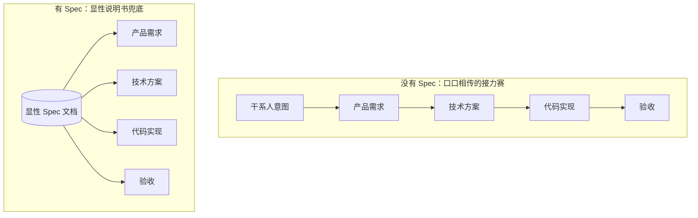
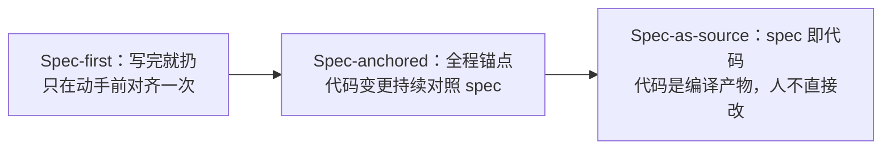

# AI圈突然都在说的 Spec Coding，到底在解决什么问题

这半年，GitHub、亚马逊、Tessl 几家背景完全不同的公司，不约而同在推同一个词：Spec Coding（也叫 Spec-Driven Development，缩写 SDD）。核心动作很朴素——写代码前，先让 AI 把"要干什么"写成一份说明书，人和 AI 都照着这份说明书来，不再是甩一句话的需求描述，让 AI 自己脑补去写。

但这个词火起来的速度，比大多数工程师理解它的速度快。很多人只在时间线上刷到过这个名字，追问一句"具体解决了什么问题、该不该现在就上"，答不上来。更麻烦的是，这类新概念天然自带两种坑：要么被过度神化，当成"AI 乱写代码"的万能解药直接全套照搬；要么被当成又一个昙花一现的框架热词，连它背后的方法论价值都被一起无视。这两种反应都建立在没搞清楚问题本质的基础上。

这篇文章的任务是把 Spec Coding 从"听过"变成"能判断"——讲清楚它到底在解决 AI 写代码时的哪个根本问题、现在四家主流方案各自走的是哪条路、以及一线工程师现在该怎么落地而不被工具的重量拖垮。读完之后，你应该能回答三个问题：AI 写代码为什么需要一份显性的说明书、GitHub Spec Kit / Kiro / Tessl / OpenSpec 分别适合什么场景、以及不管用不用现成工具，今天就能开始做的最小实践是什么。

## 一、为什么现在都在提 Spec Coding

### 1.1 AI 写代码的两个老毛病

先说第一个毛病：过度自信。AI 拿到一句简短需求就敢动手，写错了还嘴硬说"已经修好了"——[Tessl 官方博客](https://tessl.io/blog/how-tessls-products-pioneer-spec-driven-development/)对这个现象的原话是，agent "很快就会道歉，但极有可能坚称问题已经解决，哪怕它'压根没解决'"。遇到不熟悉的冷门开源库，这种自信会进一步演变成编造——它会凭感觉编一个不存在的函数出来，因为在它的语言模型里，"这个库应该有这么个函数"和"这个库真的有这个函数"是两件分不清的事。

第二个毛病更隐蔽：代码库越大，AI 为了完成你交代的这一个任务，越可能悄悄把别的功能改坏。这个行为在 Tessl 的论证里被称为"reward-seeking"——为了拿到"任务完成"这个奖励信号，先把眼前的活干完，不太在乎牵连了什么。可以类比装修：工人为了赶在今天把这个房间刷完漆，可能顺手碰断了隔壁房间的电线也不上报——目标是"这个房间完工"，不是"整套房子完好"。这不是模型不够聪明，而是任务本身给它的激励就是局部的。

### 1.2 更本质的问题：意图传递损耗

比起上面两个"AI 不靠谱"的表层问题，还有一个更本质的问题：需求从你脑子里到写成代码，要经过好几次转手。[微软开发者博客](https://developer.microsoft.com/blog/spec-driven-development-ai-native-engineering)在 2026 年 6 月的一篇文章里说得直白：干系人意图、产品需求、技术方案、代码实现、验收标准——这五个阶段之间存在四次转手，每一次转手都可能走样。过去团队规模小、迭代慢，靠聊天记录和口头对齐还能撑住；一旦复杂度上去，"我以为你说的是……"这种对不上号的场景必然出现，而且随项目规模线性增多。

Spec 要解决的正是这个环节——把这份说明书显性地留下来，变成人和 AI 共同的真相来源（single source of truth），而不是依赖每个人脑子里那份可能已经不一致的理解。

### 1.3 Spec 改变的是信息传递的结构

把上面两节合起来看，Spec Coding 解决的不是"让 AI 更聪明"，而是"让意图传递的路径变短、变透明"。整体思路上的差异，画出来大致是这样：

这张图里的关键区别不是步骤变少了，而是参照系变了。左边每一步只能参照上一步的产出，信息损耗是累加的——需求理解错了，方案跟着错，代码再跟着错，到验收时才发现，返工成本已经摊在了三个环节上。右边每一步都直接对照同一份 spec，哪怕某一步的执行者理解偏了，也能随时拿 spec 校准，损耗不会累加传递到下一环。这就是为什么四家公司路子不同，但都不约而同选择了"先写说明书"这个共同动作。

## 二、四条路子，四种成熟度

不是所有打着 Spec Coding 旗号的工具都在做同一件事。往深了看，spec 在工程里能扮演的角色其实有一个从松到紧的递进关系：

这条线越往右，spec 对代码的约束力越强，团队要付出的纪律成本也越高。目前主流的四家工具里，只有 Tessl 明确表态要往最右边走；其余几家的流程设计更接近前两层——多数工具，包括看起来最规范的 GitHub Spec Kit，实际落地时还是停在"写完对齐一次"或者"持续参照"的阶段，没有真正做到 spec 和代码强绑定。

### 2.1 GitHub Spec Kit：宪法先行，最重最规范

**为什么选它**：如果团队人数多、协作链路长，需要一套可审查、可追溯的产出物，Spec Kit 的完整度是四家里最高的。

**怎么做**：流程分七步——Constitution（先立"宪法"，定死项目级不可违反的原则）→ Specify（写需求）→ Clarify（消歧义）→ Plan（出技术方案）→ Tasks（拆任务）→ Implement（实现）→ Validate（验收）。宪法先行是这套流程和其他三家最大的区别——别的工具直接从需求开始写，Spec Kit 要求先把"不管需求怎么变都不能违反的原则"钉死，相当于给后面每一步都设了一道闸门。

**产物长什么样**：跑完一整套，落地文档数量不小——根据 Fowler 的实测记录，大致会产出 spec、plan、tasks、data-model、research、api、component 等七份左右的文档，外加一个 contracts 目录。

**审查点**：文档一多，人工审查不该追求逐字读完，而要盯两类矛盾点。第一，宪法条款有没有和当前这次的具体需求冲突——宪法是死的，需求是活的，冲突迟早出现；第二，spec 和 plan 之间有没有互相打架的表述——矛盾往往就藏在两份文档的交界处，只看单独一份文档发现不了。

**验证**：找一个中等复杂度的功能（不是玩具级 CRUD，也不是牵一发动全身的核心模块）跑一遍全流程，跑完问自己一句：这七八份文档，我是不是真的会去读、去维护？如果答案是不会，说明这套重量级流程和团队当前阶段不匹配，具体步骤以[官方仓库](https://github.com/github/spec-kit)为准。

### 2.2 AWS Kiro：IDE 里的 spec + Hooks 自动化

**为什么选它**：想要 spec 不只是一份静态文档，还能直接触发自动化动作的场景。

**怎么做**：流程比 Spec Kit 轻，只有三步——Requirements（需求）→ Design（设计）→ Tasks（任务）。它最大的差异化在"hooks"——存文件、提交代码这些动作可以自动触发检查，比如自动扫描代码里有没有漏掉的密钥泄露。

**审查点**：hooks 能保证的是"检查一定跑了"，不能保证"检查规则本身是对的"——自动化规则本身也需要人工审一遍，否则一条写错的扫描规则会一直误报或者一直放行，没人会发现。

**验证**：配一条最简单的 hook（比如提交前扫描密钥），故意在测试分支里塞一个假密钥，看它是否真的拦截下来。具体配置以[官方博客](https://kiro.dev/blog/introducing-kiro/)为准。

### 2.3 Tessl：让 spec 直接变成代码

**为什么选它**：想要 spec 和代码不会失步的场景——传统模式下 spec 写完，人接着改代码，过一阵 spec 和代码就对不上了，Tessl 想从根上堵住这个漂移。

**怎么做**：走的是 spec-as-source 路线，人只改说明书，代码顶部标注"GENERATED FROM SPEC - DO NOT EDIT"，代码本身变成编译产物——这个思路和 TypeScript 编译出 JavaScript 有点像，源码是人改的那份，编译产物不建议手动碰。为了配合这个模式，Tessl 还建了一个 Spec Registry，收录了一万多条开源库的精确用法说明书，专治前面 1.1 节提到的"AI 瞎编 API"这个老毛病。

**审查点**：这个模式对团队的约束是四家里最强的——一旦有人手改了那份"禁改代码"，spec 和代码的映射关系就断了，后续的自动生成会覆盖掉手改的内容，或者两者永久分叉。落地门槛也是四家里最高的，需要团队有足够的纪律。

**验证**：找一个小型独立模块，试着完全通过改 spec 来驱动一次功能变更，全程不碰生成代码，看这套流程在自己的技术栈上跑不跑得通，参考[官方博客](https://tessl.io/blog/how-tessls-products-pioneer-spec-driven-development/)。

### 2.4 OpenSpec：给存量项目补的轻量选项

前面三家的教程和案例大多默认从零建新项目，但真实工作里大部分时间是在改老代码——这个缺口需要单独的方案来补。OpenSpec 定位很明确：开源、轻量，明确表态自己是给"brownfield"（存量项目）用的，不只是给"greenfield"（新项目）用的。它不追求 Spec Kit 那种规范完整度，也不像 Tessl 那样强绑定代码生成，目标就是让改老代码的人也能用上 spec-first 这个习惯，具体见[官方仓库](https://github.com/Fission-AI/OpenSpec)。

### 2.5 四家一览

| 工具 | 流程 | 核心差异化 | 适合场景 | 更接近哪一层 |
| --- | --- | --- | --- | --- |
| GitHub Spec Kit | 7步：宪法→需求→消歧义→方案→任务→实现→验收 | 全流程最规范，一次产出七八份文档 | 新项目、多人协作、需要可审查产出 | spec-anchored |
| AWS Kiro | 3步：需求→设计→任务 | Hooks 自动触发检查（如密钥扫描） | 想要 spec 驱动自动化的 IDE 场景 | spec-anchored |
| Tessl | spec-as-source | 代码由 spec 生成，Spec Registry 治理 API 幻觉 | 追求 spec 与代码零漂移，能接受高约束 | spec-as-source |
| OpenSpec | 轻量流程 | 明确定位专攻存量项目（brownfield） | 改老代码而非从零建新项目 | spec-first |

除 Tessl 官方明确自称 spec-as-source 外，表格最后一列是根据各家流程特征做的归类，不是官方自称，仅供参考。

## 三、现实检验：工具还很糙，但理念站得住

### 3.1 大锤砸核桃：一个小 bug 测出 16 条验收标准

理念说得再好，工具现在的成熟度是另一回事。[Fowler 的实测记录](https://martinfowler.com/articles/exploring-gen-ai/sdd-3-tools.html)里有个例子很扎心：他拿一个很小的 bug 去测 Kiro，结果被拆成了 4 个用户故事、总共 16 条验收标准。他自己的评价是"用大锤砸核桃"——本该三两分钟改完的小问题，套上完整的 spec 流程之后反而办得更慢。这不是工具的 bug，而是流程本身的重量和问题的重量不匹配时必然发生的事。

### 3.2 spec 不是免费午餐：agent 照样不听话

Fowler 用 Spec Kit 测了一个中等复杂度的功能，产出七八份 markdown 文档要他审查，他说了句大实话：我宁愿直接看代码（"I'd rather review code"）。更值得注意的是一个具体案例——即便写了这么多规则，agent 依然会挑着不听，他记录到 agent 把项目里已经存在的代码当成新需求重新生成了一遍，造成了功能重复。这类问题的根源不是"规则没写清楚"，而是约定本身没有任何机制能保证它一定被 AI 遵守——上下文窗口变大，不代表模型真的把全部内容都当回事去执行。

### 3.3 但也有实打实的效果——前提是看清楚是谁的案例

不过 spec 化确实能带来实际收益。微软有一个内部案例：某类资产以前每次新增都要从头重写一遍相关代码，后来把这个流程做成了模板化的 spec，交付周期从两三周压缩到了几天。这个数字值得记住，但也要加一个限定——这是厂商自己披露的案例，效果因团队规模、技术栈、原有流程成熟度而异，不能直接照搬预期套到自己团队头上。

## 四、落地建议：不神化，但值得从今天开始做

### 4.1 结论先行

把前三节合起来看，结论其实很清楚：写代码前把"要干什么"讲清楚，这件事本身永远有价值——过度自信、reward-seeking、意图传递损耗这三个问题都是真实存在的，spec 化是对症的解法。但工具层面还早期，四家产品都还在快速迭代，规则再多也挡不住 agent 挑着不听，文档量一大审查成本本身就会失控。这两件事不矛盾：理念对，不代表现在就要把最重的那一套工具全盘搬进生产流程。

### 4.2 最小实践：不用等工具成熟

不管用不用现成工具，都可以先养成"写 spec-first 意图"的习惯——写代码前用几句话或者一个简短文档，把"要实现什么、边界在哪里、验收标准是什么"讲清楚，让人和 AI 在动手前对齐一次，不需要一步到位上最重的流程。这个习惯本身就能挡掉 1.1 节提到的大部分过度自信和牵连性破坏，因为大多数走样是在"需求本来就没讲清楚"这一步就发生的，跟用不用某个具体工具关系不大。

### 4.3 决定要不要上工具，先过这张自检表

| 检查项 | 自检方式 | 建议方向 |
| --- | --- | --- |
| 团队规模较大、协作链路长，需要可审查的产出物 | 是否有多人依赖同一份需求做并行开发 | 考虑 GitHub Spec Kit |
| 想要 spec 触发自动化检查 | 是否已有明确、可自动化的规则（如密钥扫描） | 考虑 AWS Kiro |
| 追求 spec 与代码零漂移，团队能接受高约束 | 是否愿意禁止直接手改生成代码 | 考虑 Tessl |
| 主要工作是维护存量代码而非新建项目 | 项目是 greenfield 还是 brownfield | 考虑 OpenSpec |
| 以上都不确定，或团队还没有写 spec 的习惯 | — | 先从"写清楚再动手"这个习惯开始，暂不上工具 |

## 小结

这次拆解下来，有几个判断值得记住：

- Spec Coding 解决的根本问题是意图传递损耗，不是"让 AI 更聪明"——这个定位决定了它的价值不会因为工具不成熟而消失。
- 四家工具走的是四条不同的路，从轻到重、从松绑到强绑定，没有哪一家是通用最优解，选择应该跟着团队规模、项目新旧、约束接受度走，而不是跟着谁声量大。
- 工具目前的糙，体现在"审查成本可能比编码成本还高"这一点上——小问题被小题大做，agent 依然会挑着不听规则，这是现阶段的真实局限，不是危言耸听。
- 微软案例证明理念在合适场景下确实有效，但厂商自述案例不能直接当成自己团队的预期。

从这里往下走，接下来自然会遇到几个方向：想深入某一家工具的，直接去读对应的官方 quickstart 比看二手转述靠谱；想验证 spec-driven 对自己团队是否真的有效，比较扎实的做法是找一个中等功能做一次 A/B——同一类任务，一次带 spec、一次不带，对比返工次数和审查耗时；另外这几家工具眼下都在快速迭代，这篇文章里的流程细节和数字，半年后大概率会有变化，跟进的时候记得去看最新的官方文档，而不是停在这篇文章的时间点上。
