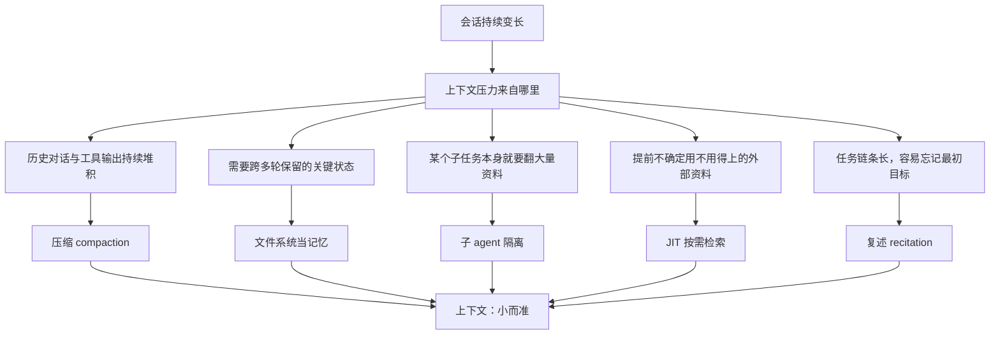
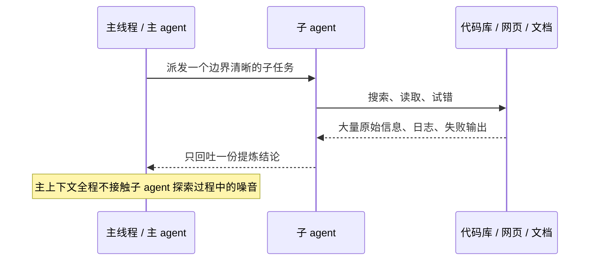

# 上下文工程：把 AI 会话的上下文从十万 token 收敛到两万量级，还不丢关键信息

用 Claude Code、Cursor 或者自己搭的 agent 写代码，大概率都遇到过这种时刻：聊到一半，模型突然"失忆"——前面商量好的技术方案、定下的接口约定，它像是从没听过；同时你会明显感觉到它变慢了，账单也在不知不觉中往上涨。多数人第一反应是模型不行，或者干脆换一个窗口更大的模型。

但窗口大小很可能从一开始就不是问题所在。现在主流模型的上下文窗口普遍在十万甚至百万 token 量级，可窗口大不等于模型真的"记得住"——上下文被无关信息塞满之后，模型照样会编出一个从没提过的 API，或者把前面已经拍板的架构决定忘得一干二净。这不是玄学，背后有明确的机理：注意力是一种会被消耗的资源，塞进去的东西越多，模型从里面准确捞回关键信息的能力反而在下降。

这篇文章讲清楚两件事：为什么"窗口越大越好"是一种错觉；以及一套能把上下文体量从十万 token 量级收敛到两万 token 量级、同时不丢关键信息的五招打法（这里的"十万到两万"是这套打法能达到的量级示意，不是某一次实测的精确压缩率，具体压到多少取决于任务本身）。读完之后，你应该能判断自己的 agent 该在什么时候压缩、用哪一招压、以及压缩时最容易踩的坑是什么。

## 一、为什么不是"窗口越大越好"

### 1.1 Context rot：塞得越多，记得越差

Chroma 有一项专门研究这个现象的工作，叫 context rot（上下文腐坏），结论直白：

> "as the number of tokens in the context window increases, the model's ability to accurately recall information from that context decreases"
> ——[Chroma, Context Rot](https://research.trychroma.com/context-rot)

翻译过来就是，上下文窗口里的 token 越多，模型从中准确回忆信息的能力反而越差。可以把上下文想象成一张越写越满的白板——白板的物理尺寸（窗口大小）没变，但字迹密密麻麻堆在一起之后，你想在上面找到某一条关键信息，要扫过的干扰项也越来越多。窗口大，只是保证"塞得下"，不保证"记得住"。

### 1.2 注意力是有限预算，目标是塞得准而不是塞得多

Anthropic 的工程博客把这件事讲得更直接：

> "LLMs have an 'attention budget'... Every new token introduced depletes this budget."
> ——[Anthropic, Effective context engineering for AI agents](https://www.anthropic.com/engineering/effective-context-engineering-for-ai-agents)

模型和人一样，注意力是有预算的，每多塞一个 token，都会从这份预算里扣掉一点。这条博客给出的工作目标也很明确：

> "find the smallest set of high-signal tokens that maximize the likelihood of your desired outcome"

翻译过来，上下文工程要做的不是让模型看到更多信息，而是找到那一小撮信息密度最高的 token，让模型更容易命中你想要的结果。想清楚这一条，后面讲的五招才有共同的落脚点——它们的目标都是同一件事：在保住关键信息的前提下，把噪音挤出去。

### 1.3 整体思路：上下文工程的五个杠杆

上下文压力不是单一来源，历史对话会越堆越多，长期状态需要跨轮次保留，某些子任务本身就要翻大量资料，有些资料提前不知道用不用得上，任务链条一长又容易忘掉最初的目标。针对这五类不同的压力来源，对应着五个不同的杠杆，整体思路大致如下：



这五招不是互相替代的选项，而是对应五种不同场景的组合拳——压缩处理的是"历史已经堆多了怎么办"，文件系统当记忆处理的是"状态要跨轮次留住怎么办"，子 agent 隔离和 JIT 检索处理的是"这部分内容到底该不该进主上下文"，复述处理的是"任务拉长之后目标会不会被挤到注意力盲区"。下面按对实现成本从低到高的顺序，把这五招逐一拆开讲。

## 二、先做能立刻见效的两招：压缩与清理

### 2.1 压缩 compaction：总结历史，重开一扇干净窗口

**为什么**：一个长会话里，工具调用的原始返回值——文件内容、命令输出、中间试错过程——往往占了 token 消耗的大头，但这些原始内容里，真正后续还有用的只是其中的结论。如果什么都不处理，上下文会随对话轮数线性增长，迟早撞到窗口上限，而且撞线之前很久，context rot 就已经在拖累模型的表现了。

**怎么做**：会话快撑满时，让模型把前面的历史总结成一份摘要，再拿这份摘要开一个干净的窗口接着聊。Anthropic 博客里描述 Claude Code 的做法是：

> "summarizing its contents, and reinitiating a new context window with the summary"

并且明确了摘要要保留什么、丢什么：

> "preserves architectural decisions, unresolved bugs, and implementation details while discarding redundant tool outputs"

也就是保留架构决策、未解决的 bug、关键实现细节，丢掉冗余的工具输出。落到你自己的 agent 上，可以把这条原则组织成一份总结指令——下面是一个示意结构，不是官方原文提示词，你需要按自己的任务场景调整：

```plain
把当前会话之前的内容压缩成一份摘要，用于开启一个新的上下文窗口继续这次任务。要求：
1. 保留所有已经做出的架构决策和选型理由
2. 保留仍未解决的 bug、报错信息、复现步骤
3. 保留已经完成的关键实现和接口约定
4. 丢弃工具调用返回的原始日志、中间试错过程、已被后续步骤覆盖的旧方案
5. 摘要控制在能一次读完的长度，不要逐字复述被丢弃的内容
不要引入这次会话之外的新信息，也不要替我做还没做的决策。
```

**审查点**：压缩之后，重点检查两件事。第一是架构决策有没有被误当成"细节"一起丢掉——这类信息一旦丢了，后续容易做出跟之前矛盾的选型。第二是未解决的 bug 有没有完整保留报错信息和复现步骤，只留一句"有个 bug 还没修"等于没保留。

### 2.2 工具结果清理：最省事也最安全的压缩

**为什么**：一个工具调用完成之后，那一大坨原始返回值——尤其是读文件、跑命令这类体积不可控的输出——如果没有后续步骤要复用，没必要一直挂在上下文里占预算。

**怎么做**：用过就清。Anthropic 博客把这归为压缩里最轻量、风险最低的一种：

> "One of the safest lightest touch forms of compaction is tool result clearing, most recently launched as a feature on the Claude Developer Platform."

这一步不需要总结、不需要模型参与判断，只是把已经用完的原始输出从上下文里摘掉——因为这一步风险最低、收益立竿见影，是五招里最值得优先落地的一个，Anthropic 的开发平台已经把它做成了现成功能。如果你在自建 agent，可以直接照抄这个思路：给每次工具调用的结果加一个"是否已被后续消费"的标记，消费完就清。

## 三、隔离脏活：子 agent 与按需检索

主上下文里最容易被污染的，是那些"过程复杂但结论简单"的环节——为了找到一个答案，可能要翻十几个文件、跑好几次失败的尝试，但真正有用的只是最后那一句结论。这一章讲的两招，思路是一致的：把探索过程挡在主上下文之外，只留下你真正需要的那一点信号。子 agent 隔离场景下，主线程和子 agent 之间的数据流大致如下：



这条链路里唯一跨越主子上下文边界的，是最后那一步"回吐提炼结论"——探索过程中产生的大量原始信息、日志、失败输出，全部留在子 agent 自己的上下文里，子任务结束后随之丢弃，不会反向污染主线程。这个边界不能反过来：如果子 agent 把原始探索过程也带回主线程，隔离就失去了意义。

### 3.1 子 agent 隔离：让脏活留在子上下文里

**为什么**：如果让主线程自己去翻文档、试错、反复读文件，这些过程产生的 token 会直接堆进主上下文，即便最终只用得上一句结论，代价也已经付出去了。

**怎么做**：让专门的子 agent 顶着一份干净的上下文去啃某个具体细活，主线程只需要给它一个边界清晰的任务描述。Anthropic 博客给出的量级是：

> "Each subagent might explore extensively, using tens of thousands of tokens or more, but returns only a condensed, distilled summary of its work (often 1,000-2,000 tokens)."

子 agent 自己可能烧掉几万 token 到处翻，但往主线程回吐的只有一两千 token 的提炼结论——数量级上能差出十倍以上。脏活累活留在子 agent 的上下文里，随着这次子任务结束就一起丢掉，主线程始终保持干净。

**审查点**：给子 agent 的任务描述要足够具体，边界不清楚的任务容易让子 agent 探索范围失控，烧的 token 更多，回吐的结论质量反而不稳定。子 agent 回吐的结论也要过一遍——它已经是主线程唯一能看到的信息，如果结论本身漏了关键细节，主线程没有办法回头去翻子 agent 探索过程中的原始数据。

### 3.2 JIT 按需检索：只留指针，用到才拉

**为什么**：如果把所有可能用得上的资料提前一股脑塞进上下文，大概率有一大半根本用不上，白白占了预算，还稀释了真正有用信息的密度。

**怎么做**：只在上下文里留轻量的指针——文件路径、一个查询语句、一个链接——真正用到时再通过工具把内容拉进来。Anthropic 博客的描述是：

> "maintain lightweight identifiers (file paths, stored queries, web links...) and use these references to dynamically load data into context at runtime"

并且点出了这个思路在 Claude Code 里的具体落地：

> "primitives like glob and grep allow it to navigate its environment and retrieve files just-in-time"

glob 和 grep 就是这个思路的典型实现——不预先把整个代码库读进上下文，而是现查现用，需要哪个文件的哪部分，当场检索、当场加载。这和上一节的子 agent 隔离经常配合使用：子 agent 内部翻资料的过程本身，也应该走按需检索，而不是把整个知识库一次性塞进子 agent 的上下文。

## 四、对抗长任务遗忘：复述，以及别压过头

前面三招解决的都是"怎么把不该留的东西挤出去"，这一节讲的是另一个方向的问题：任务链条一旦拉长，即便上下文里信息量控制得不错，模型也可能顾此失彼，把最初的目标挤到注意力不敏感的区域。

### 4.1 复述 recitation：把目标反复写回上下文末尾

**为什么**：长任务执行到中途，模型对上下文中段信息的关注度天然会打折扣，这就是常说的"lost in the middle"——就像开会时如果没人时不时把议题重新念一遍，讨论很容易越跑越偏，最初要解决的问题反而被埋没在中途的细节讨论里。

**怎么做**：Manus 的做法是给复杂任务建一个 todo 文件，每完成一步就重写一遍：

> "By constantly rewriting the todo list, Manus is reciting its objectives into the end of the context...avoiding 'lost-in-the-middle' issues."

这不是形式主义，而是故意把当前目标反复推到上下文末尾——模型对上下文末尾的内容天然更敏感，复述相当于把目标持续顶进这块高敏感区，专治长任务执行到后期开始偏题、忘记最初要干什么。

**审查点**：这一招真正的价值不在"写了一个 todo 文件"，而在"每完成一步就重写"——只在任务开始时写一次、后面不再更新，起不到把目标顶进注意力末端的效果，等于白做。

### 4.2 别压过头：压缩要留有余地

前面几招都在讲怎么把上下文往小压，但这里有一个坑需要提前说明：压得太狠，会把当时看起来无关紧要、走到后面才发现关键的信息一并丢掉。Anthropic 和 Manus 在各自的博客里都提到了这个风险。Anthropic 的说法是：

> "overly aggressive compaction can result in the loss of subtle but critical context whose importance only becomes apparent later"

Manus 说得更绝对一些：

> "any irreversible compression carries risk"

也正因为这样，Manus 强调自己的压缩策略始终设计成可恢复的：

> "compression strategies are always designed to be restorable"

这也是第二章"文件系统当记忆"这个思路的价值所在——丢掉一个网页的正文，只要 URL 还留着，需要时随时能重新拉取；丢掉一份文档的内容，只要路径还在，同样可以随时找回来。信息没有真的消失，只是从上下文里挪到了外部存储。所以这里的判断标准不含糊：能不能压，不取决于这份信息现在看起来重不重要，而取决于丢掉之后能不能恢复——宁可多留一个指针，也不要一刀切干净。

### 4.3 成本视角：这件事到底值不值得做

给一个具体的成本感知。上下文塞得越满，不止是响应变慢，账单也在同步涨——每个 token 都要花钱传输和预填充，这一点在长会话里体现得尤其明显。Manus 给过一组具体数字：

> "cached input tokens cost 0.30 USD/MTok, while uncached ones cost 3 USD/MTok — a 10x difference."

命中缓存和没命中，同样的输入成本能差出十倍。这个数字是 Manus 博客里引用的 Claude Sonnet 缓存定价示例，不是普适的定价承诺，具体费率以你所用模型厂商的官方定价为准，但它说明了一件事：经营好上下文，省下来的是实打实的账单，而不只是响应速度上的体感差异。上下文越干净、结构越稳定，缓存命中率也越容易维持住，这五招不只是"让模型记得住"，也是在直接控制成本。

## 五、落地清单与下一步

把这五招落到自己的 agent 上时，可以用下面这张表自查——每一招不是看"做没做"，而是看能不能在具体场景里给出判断：

| 招数 | 怎么判断你做对了 | 常见反例 |
| --- | --- | --- |
| 压缩 compaction | 压缩后的摘要里，架构决策、未解决 bug、关键实现三类信息都能找到 | 摘要只留了"聊了什么"的流水账，决策和 bug 状态没被单独摘出来 |
| 工具结果清理 | 已经被后续步骤消费过的原始工具输出，不再出现在当前上下文里 | 图省事把所有工具结果原样保留到会话结束 |
| 文件系统当记忆 | 丢弃的内容能通过留下的路径 / URL 随时恢复 | 只删内容不留指针，丢了就真丢了 |
| 子 agent 隔离 | 子 agent 的任务边界清晰，主线程只看到提炼结论，看不到探索过程 | 子任务描述模糊，子 agent 探索范围失控，回吐内容依然冗长 |
| JIT 按需检索 | 上下文里出现的都是"当前这一步用得上"的信息，没有预塞的备用资料 | 一开始就把可能用到的文档、代码全部读进上下文 |
| 复述 recitation | 长任务执行到后期，目标描述依然会被重写一遍推到上下文末尾 | 只在任务开始时写一次 todo，中途不再更新 |

几个决策值得在落地前想清楚：压缩要保留决策和未解决问题，丢弃的是冗余过程，不是随便"总结一下"；子 agent 和 JIT 检索的共同点，是把"该不该进主上下文"的判断挪到了运行时而不是提前一次性决定；而所有的压缩动作，前提都是可恢复——留一个指针的成本，远低于事后发现关键信息已经丢了。

如果你要开始落地，不用五招一起上，先从门槛最低的两招入手：调用完的工具结果随手清掉，关键状态和进度写进一个文件。这两样几乎零成本，见效也最直接。剩下的子 agent 隔离、JIT 检索、复述，可以在遇到具体场景（子任务过重、资料量不确定、任务链条变长）时再针对性加上。

从这里往下走，有三个方向可以继续深入：一是去读 [Anthropic 原文](https://www.anthropic.com/engineering/effective-context-engineering-for-ai-agents)里关于 structured note-taking / memory tool 的部分，那是"文件系统当记忆"更完整的工程实现；二是去读 [Manus 原文](https://manus.im/en/blog/Context-Engineering-for-AI-Agents-Lessons-from-Building-Manus)，里面对 KV-cache 命中率的分析比本文引用的更细；三是回头看看自己现在用的 agent 工具，账单里的缓存命中率是多少——这是最直观的一个信号，能告诉你上下文经营得好不好。模型还会一代代迭代，但把上下文当稀缺资源来经营这套思路，短期内不会过时。

## 参考资料

- Anthropic, [Effective context engineering for AI agents](https://www.anthropic.com/engineering/effective-context-engineering-for-ai-agents)
- Manus, [Context Engineering for AI Agents: Lessons from Building Manus](https://manus.im/en/blog/Context-Engineering-for-AI-Agents-Lessons-from-Building-Manus)
- Chroma, [Context Rot](https://research.trychroma.com/context-rot)
