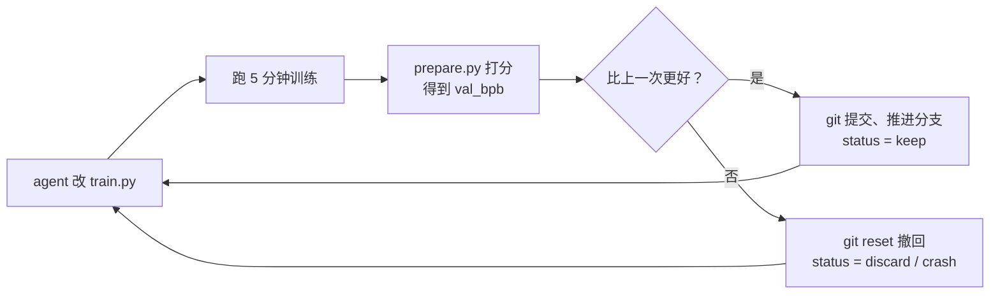
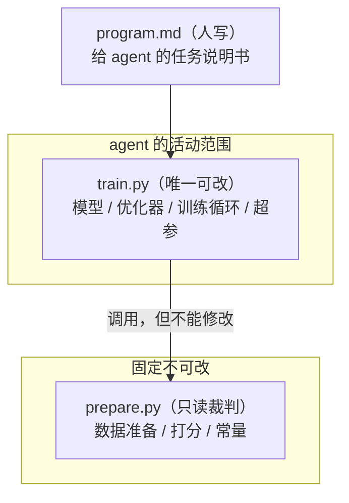

# 拆解 karpathy 新仓 autoresearch：三个文件，怎么让 AI 整夜自己做 AI 研究

用 AI agent 自主写代码、自主跑训练，这个方向这两年很多团队都在摸索，但摸到最后经常卡在同一个问题上：没有一个"可比较"的实验框架。今天调完一版参数跑出一个分数，明天换了个模型结构又跑出一个分数，两次结果压根没法放在一起比——变量太多，谁也说不清是哪一处改动带来的差异。更麻烦的是没人愿意把训练代码完全交给 agent 通宵跑：万一它顺手把评测脚本改了，分数好看了但其实是作弊；万一某次改动把模型跑挂了却没人发现，一晚上的算力就打了水漂。

这就是为什么"AI 自主做研究"听起来很美好，落地时大多数人还是选择每一步都盯着。真要放手让它跑一整夜，至少得先解决两件事：怎么保证每一次实验都能公平地比较，怎么保证乱改不会污染结果、也不会没有留痕地丢失好的实验。

这篇文章要讲清楚的是 karpathy 上个月开源的一个小仓库 [autoresearch](https://github.com/karpathy/autoresearch)，怎么用三个文件、几条硬约束，把"AI 自主做研究"做成一个真的能跑一整夜、且结果可信的闭环——给 AI agent 一个小但真实的 LLM 训练环境，让它自己改代码、跑训练、看分数，好的实验留下、差的实验删掉，一晚上循环上百次。人醒来的时候，桌上多了一份完整的实验记录，和一个更强的模型。读完这篇，你能看懂这三个文件为什么这么分工、三条关键设计各自解决了什么问题，以及这套"固定预算 + 单一指标 + git 留痕 + 简单优先"的骨架，怎么套到你自己的迭代任务上。

## 一、为什么需要这样一个仓库

### 1.1 根本问题：自由度和可比性是一对矛盾

把训练代码整个交给 agent 改，本质上是在给它极大的自由度——它可以调学习率，可以换激活函数，甚至可以重新设计整个网络结构。自由度越大，理论上能探索到的好方案就越多。但自由度一旦不受控制，就会直接吃掉可比性：这一轮改了模型结构，下一轮又顺手改了训练步数，两次实验的分数差异到底来自哪个改动，根本说不清楚。没有可比性，"整夜跑一百个实验"就只是产生一百个互相矛盾的数字，不会沉淀出任何可靠结论。

autoresearch 要解决的正是这对矛盾：既要让 agent 有足够的自由度去改模型、改超参，又要保证每一次改动跑出来的分数能够被公平地放在一起比较。

### 1.2 karpathy 的解法：把"能改的"和"不能改的"物理隔开

思路并不复杂——与其在运行时加各种检查和沙箱，不如从文件层面直接把"agent 能碰的"和"agent 不能碰的"分开。整个仓库只有三个文件：一个只读的裁判（数据、评测、常量），一个 agent 唯一被允许修改的训练代码，一个人写的任务说明书。裁判定好规则之后全程锁死，agent 在训练代码这一个文件里怎么折腾都行，但改动能不能留下来，最终要看裁判打的分。

### 1.3 整体工作流

整条循环大致长这样：



这个循环里有一条不能乱的顺序：先跑完固定时长的训练，再打分，再决定留还是弃，最后才能开始下一轮改动——如果反过来，比如还没跑完就先改下一版，或者打分之前就先决定要不要保留，整条实验记录就会失真。按 [README](https://github.com/karpathy/autoresearch) 里的说法，这样一晚上大致能跑约 100 次实验，人醒来看到的是一份完整的、每一步都有据可查的实验日志。

## 二、三个文件怎么分工

### 2.1 为什么要把权限拆到文件级别

如果只是口头告诉 agent "别改评测代码"，靠的是它自觉遵守指令——而 agent 会不会不折不扣地照做，本身就是不确定的。更稳妥的做法是把"不能改的东西"物理上放到 agent 权限之外，让约束不依赖于 agent 是否听话，而是从一开始就没有给它修改评测逻辑的入口。

三个文件的权限边界大致是这样：



这张图里唯一的重点是那条"调用，但不能修改"的边——agent 每次训练都要用到 prepare.py 提供的数据和评分逻辑，但它对这个文件没有写权限。这保证了不管 agent 怎么折腾 train.py，评分的规则本身是恒定的，两次实验的分数才有可比性。

### 2.2 prepare.py：只读裁判

这个文件负责数据怎么准备、成绩怎么打分、有哪些固定常量，agent 一个字都不许改。可以把它理解成裁判——它的作用不是参与训练，而是保证每一场实验的规则都一模一样。如果裁判本身也能被改，"分数变好了"这件事就失去了意义，因为你没法排除是不是评分标准变松了。

### 2.3 train.py：agent 唯一能动的文件

这是唯一让 agent 动手改的文件，约 630 行，把整个 GPT 模型定义、优化器、训练循环，还有一堆超参，全塞进了这一个文件——连命令行参数都没有，想调哪个超参就直接在文件里改哪一行。agent 干活，就跟这一个文件死磕，不用在多个文件之间跳来跳去理解调用关系，这也顺带降低了它"不小心改到不该改的地方"的概率。

### 2.4 program.md：写给 agent 的说明书

第三个文件是人写的，给 agent 的任务说明。karpathy 自己管它叫"一个超轻量的 skill"——不是代码，是一份指导 agent 怎么开展整晚实验的流程文档。分工到这一步就很清楚了：人编写 program.md，agent 编写 train.py，裁判 prepare.py 谁都不碰。

**验证**：把这三个文件的边界自己核实一遍。

```bash
git clone https://github.com/karpathy/autoresearch.git
cd autoresearch
wc -l train.py      # 预期：约 630 行，是 agent 唯一被允许改的文件
wc -l prepare.py    # 只读裁判，全程不应有改动
head -n 50 program.md   # 看人写给 agent 的任务说明书长什么样
```

预期看到 train.py 行数落在 600+ 这个量级，且里面包含模型定义、优化器和训练循环——这是判断"权限拆分是否真的落到了文件粒度"最直接的方式。

## 三、三个关键设计，决定它真能跑起来

光把文件权限拆开还不够，autoresearch 真正能整夜自主运行、还能产出可信结果，靠的是三条具体设计。

### 3.1 固定 5 分钟预算，让实验可比

不管这一版改大改小，每次训练都只跑固定的 5 分钟。这个设计的好处很直接——两个实验能直接放在一起比较，不用去纠结"是不是谁多训了一会儿才赢的"。固定预算把"训练时长"这个变量从比较里彻底去掉了，剩下的分数差异只能来自代码改动本身。按这个节奏，一晚上大概能跑到约 100 个实验。

### 3.2 只认一个指标：val_bpb

不管 agent 怎么改模型结构，最终只看一个分数，越低越好，衡量的是模型压缩数据的能力。这个指标的妙处在于它跟词表大小无关——所以哪怕 agent 把词表大小或者模型架构整个改一遍，两次实验的分数依然能公平地比。如果换成一个跟词表大小挂钩的指标，agent 稍微调一下词表就能"刷分"，而这种刷分跟模型真实能力毫无关系。这里需要说明的是：具体的 val_bpb 数值随每次实验、每个模型架构变化很大，本文不引用任何具体分数，只讲这个指标的性质——它是干什么用的、为什么能公平比较。

### 3.3 每个实验就是一次 git 提交，好留差弃

每跑完一次实验，先看分数有没有变好：变好了，就把改动提交、把分支往前推，标记为 keep；没变好或者更差，直接 git reset 回到上一个状态，标记为 discard；如果训练过程中崩了，标记为 crash。改了什么、跑出多少分、最后留还是弃，全部记在一张 results.tsv 表里，字段包括 commit、val_bpb、显存占用、status（keep / discard / crash）、改动描述——一目了然。

这张表大致长这样（下面是示意结构，不是真实实验数据，实际数值以你自己跑出来的为准）：

| commit | val_bpb | memory | status | description |
| --- | --- | --- | --- | --- |
| a1b2c3d | 基线 | ~24GB | keep | baseline 初始跑分 |
| e4f5g6h | 低于基线 | ~24GB | keep | 调小 learning rate |
| i7j8k9l | 高于基线 | ~26GB | discard | 换了激活函数，效果变差 |
| m1n2o3p | — | OOM | crash | batch size 调大后显存爆了 |

这个设计的关键不在于表格本身，而在于"git 提交 = 实验记录"这个绑定——好的改动会自然沉淀成一条条 commit，形成一条可以回溯的分支历史；差的改动会被 reset 掉，不会污染这条历史。人不需要再单独维护一份实验日志，git log 本身就是日志。

**验证**：确认这条设计确实写在项目文档里，而不是转述失真。

```bash
grep -i "time budget" program.md    # 预期能看到"固定 5 分钟预算"相关描述
grep -i "val_bpb" README.md         # 预期能看到该指标"越低越好、与词表大小无关"的说明
grep -A 5 "Logging results" program.md   # 预期能看到 results.tsv 的字段定义
```

## 四、约束卡死，是为了让"简单"赢

### 4.1 三条不能做的事

它的约束卡得很死：不准改裁判（prepare.py）、不准装新包、不准动评测逻辑。这三条约束划定的是一个很小的"合法改动空间"——agent 所有的创造力都只能发挥在 train.py 这一个文件里，不能靠改评测规则或者引入新依赖来取巧。约束越窄，实验之间的可比性越有保障，这跟第三章的固定预算、单一指标是同一个思路的延伸。

### 4.2 简单性准则：删代码拿到同样的分，是大胜

还有一条准则很值得记住：同等效果下，越简单越好。如果 agent 删掉一段代码，分数还能跟原来一样甚至更好，这不算亏，这叫大胜。这条准则的价值在于，它给了 agent 一个明确的、跟"删减"而不只是"堆砌"挂钩的正反馈——很多自动化调参系统只会鼓励模型往复杂方向长，而这里把"简化"也算作一种可以拿到奖励的改动。

### 4.3 你真正在编程的是"说明书"，不是 Python

最妙的一点是这句话：你不是在调 Python，你是在"编程那份说明书"。program.md 里写的东西，本质上是"一个研究团队该怎么运转"——固定预算怎么定、指标怎么选、留弃标准怎么判、约束怎么划。人往后退一步，退到设计流程这一层，把具体的代码执行，整个外包给 AI。这是这套设计里最值得带走的范式转变：当你想让 AI 自主完成一整套"改一版、跑个分、好就留差就弃"的迭代工作时，你要花心思打磨的不是某一次的代码改动，而是这套流程本身的规则——规则设计得越清楚，agent 能自主运行的时间就越长。

**验证**：把约束和准则在文档里核实一遍，确认没有转述走样。

```bash
grep -B 2 -A 8 "CANNOT do" program.md    # 预期能看到"不改裁判/不装包/不改评测"三条约束
grep -i "simplicity" program.md          # 预期能看到简单性准则的原文描述
```

## 五、验证清单与小结

把前面几章的关键设计放在一起，读完这篇文章之后应该能自己核实以下几件事：

| 检查项 | 验证方式 | 预期结果 |
| --- | --- | --- |
| 三个文件的权限边界 | `wc -l train.py` / `wc -l prepare.py` | train.py 约 630 行且含模型/优化器/训练循环；prepare.py 全程无改动 |
| 固定 5 分钟预算 | `grep -i "time budget" program.md` | 能找到固定训练时长的描述 |
| 单一指标 val_bpb | `grep -i "val_bpb" README.md` | 能找到"越低越好、与词表无关"的说明 |
| git 留痕机制 | `grep -A 5 "Logging results" program.md` | 能找到 results.tsv 的字段定义（commit/val_bpb/memory/status/description） |
| 三条约束 | `grep -A 8 "CANNOT do" program.md` | 能找到"不改裁判/不装新包/不改评测"三条 |

回顾一下这套设计里几个值得记住的决策：把"能改的"和"不能改的"拆到文件粒度而不是靠 agent 自觉；用固定时长预算换取实验之间的可比性；只认一个跟架构改动无关的单一指标；把每次实验的取舍直接绑定到 git 提交，让版本历史本身就是实验日志；用简单性准则鼓励删减而不是无限堆砌复杂度。这五条放在一起，本质上是在回答同一个问题：怎么让"自由改动"和"结果可信"这两件事同时成立。

这篇文章提到的三个核心文件：

+ `prepare.py` —— 只读裁判，数据准备 / 打分逻辑 / 固定常量，agent 无权限修改
+ `train.py` —— agent 唯一可改的文件，约 630 行，模型定义 + 优化器 + 训练循环 + 超参
+ `program.md` —— 人写的任务说明书，定义整晚实验循环怎么跑

需要提前说明一点：官方文档给出的硬件要求是单张 NVIDIA GPU（测试环境是 H100），这不是一个人人都随手能跑的门槛。不过 README 的 Notable forks 部分也列出了社区在 MacOS、Windows 等平台上的适配尝试，如果手头没有对应的显卡，可以先从这些分支入手感受一下整个流程，而不必等到有 H100 才动手。

从这里往下走，这套骨架的价值不止于训练 LLM。任何一个你想交给 AI 自主迭代的优化任务——不管是调参数、改 prompt 还是优化一段业务逻辑——只要能满足"改动可以量化打分、每次评测的规则能固定下来"这两个前提，就可以照搬这五条设计：给它一个能改的文件、一份说明书、一个固定的评测预算、一个单一指标、以及用版本控制留痕的留弃机制。剩下要做的，就是像 karpathy 在这个仓库里做的那样，把"人该管什么、AI 该管什么"这条边界想清楚，写进你自己的那份 program.md 里。
