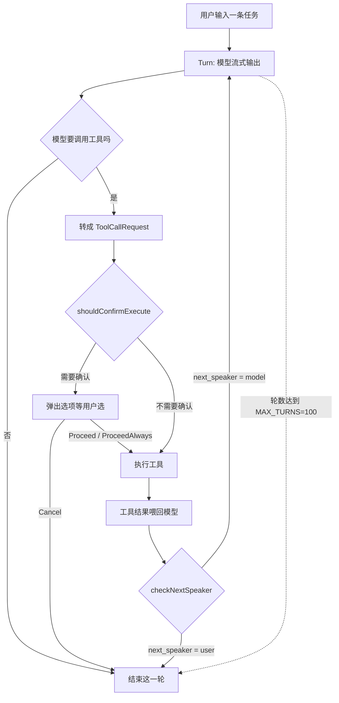
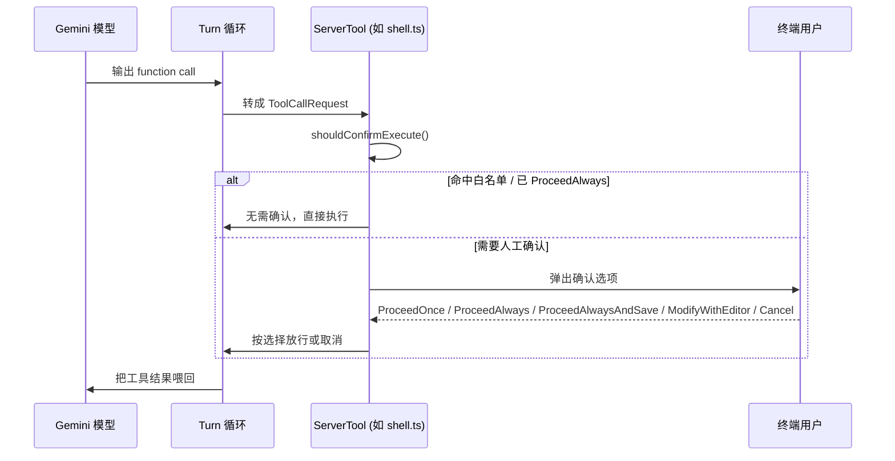

# 读源码学 Agent 架构：从 Gemini CLI 拆一遍终端编码 agent 的标准骨架

终端编码 agent 这两年冒出了一批：能自己读代码、自己改文件、自己跑命令的命令行 AI，Claude Code 是其中最出圈的一个。但它的工程实现一直是个黑箱——官方只发一坨压缩混淆过的打包 JS，想搞懂它内部怎么组织 agent 循环、怎么管工具调用、怎么做权限确认，只能对着行为反推，没法对着代码看。

Google 在 2026 年把 Gemini CLI 全部开源了，Apache-2.0 协议，代码干干净净。这给了一个难得的机会：同一道题——「做一个住在终端里、能自主调用工具完成软件工程任务的 AI agent」——现在有一份可以逐行读的公开答案。读一遍会发现，终端编码 agent 这类系统已经收敛出一套相当标准的骨架：一个带上限的循环、一组读写文件加执行命令的工具、一道钉死在工具接口里的权限确认、外加一条向 MCP 扩展的口子。这不是巧合，而是这类系统解决同一批工程约束（安全、可控、可扩展）之后自然收敛的结果。

这篇文章带你对着 `google-gemini/gemini-cli` 的源码（Apache-2.0，本文基于 2026-07-11 shallow clone 到的 nightly 版本 0.52.0，后续版本目录结构可能有调整）走一遍这套骨架：agent 循环怎么写、工具怎么定义、权限确认怎么落到接口层，以及它在这套通用骨架之上做了哪几处不同的工程选择。读完你应该能做到：在自己 clone 的仓库里独立定位到 `Turn` 循环、`MAX_TURNS` 上限、`ToolConfirmationOutcome` 权限枚举这几处核心结构，并能说清 `core` 包和 `cli` 包为什么要分开——这些是后面自己动手写一个终端 agent 雏形，或者读懂其他同类系统（Cursor CLI、Aider 等）时都能直接复用的知识。

## 一、为什么要啃一遍开源 agent 的源码

### 1.1 黑箱调 agent 和读源码调 agent，成本差一个量级

如果只把 Claude Code 这类工具当黑箱用，遇到"它为什么这一步要确认""为什么有时候不继续往下推"这类问题，只能靠试错和猜测——改一下 prompt，看行为变没变，费时间还不一定猜对。根因是没有实现代码可读，任何关于内部机制的判断都只是外部观察的归纳，置信度有限。

gemini-cli 把这层黑箱去掉了。它是同一类系统（终端里跑、能调用工具、需要处理权限确认、要对接 MCP），实现细节全部公开，逐行可读、逐条可验证。读它不是为了抄一份实现，而是把"终端编码 agent 到底是怎么搭起来的"这个问题，从行为推测降级成可以直接对着源码回答的问题。

### 1.2 它给出的是一份工程共识，不是一份孤立设计

读完会发现一个更有价值的信号：gemini-cli 的核心结构——循环、工具集、权限确认这三块——跟 Claude Code 对外表现出来的行为高度一致。这不是说 Gemini 团队"抄"了谁的代码（两边代码库完全独立，Gemini CLI 全部是 Apache-2.0 原创实现），而是说面对同一批约束（要能自主推进多轮、要能安全地碰用户文件系统、要能扩展第三方能力），不同团队独立设计会收敛到相似的结构。这类收敛出的结构，比任何单一实现都更值得当成"标准答案"来学——它经过了至少两个独立团队的验证。

### 1.3 整体路径：从循环读到差异

拆解顺序按依赖关系排：先看最外层的循环骨架（agent 的心跳），再看循环里跑的工具（agent 的手），再看工具执行前的权限确认（agent 的刹车），最后看 gemini-cli 在这套通用骨架之上做了哪些不同的工程选择。整条阅读路径大致如下：



这张图里有个容易读漏的约束：`checkNextSpeaker` 和 `MAX_TURNS` 是两道独立的刹车，缺一不可——没有 `MAX_TURNS` 上限，模型一旦陷入自我对话式的死循环就刹不住车；没有 `checkNextSpeaker`，即便轮数没到上限，模型也可能在已经把任务做完的情况下继续空转。这两处细节在第二章会展开讲。

## 二、同一套骨架：循环 + 工具 + 人设

### 2.1 为什么先看循环

一个 agent 的本质就是一个循环：模型开口说话、判断要不要调工具、把工具结果喂回去、再让模型接着说，直到它不再需要调工具为止。这个循环设计得好不好，直接决定了 agent 是"聪明地知道什么时候该停"还是"要么一步都不敢往前走，要么刹不住车瞎跑"。所以读任何一个 agent 系统的源码，第一件事永远是找它的循环入口在哪。

### 2.2 怎么找：Turn 类 + 外层递归

gemini-cli 把"一轮"这个概念直接做成了一个类。`packages/core/src/core/turn.ts:240` 处，源码注释写得很直白：

```typescript
// packages/core/src/core/turn.ts:240（节选，按源码注释与结构改写）
// "A turn manages the agentic loop turn within the server context"
class Turn {
  // Turn.run 是 async generator：
  // for await (const streamEvent of modelStream) { ... }
  // 流式接住模型输出，遇到 function call 就调用
  // handlePendingFunctionCall，把它转成 ToolCallRequest 事件
  // 对应源码位置：turn.ts:257 / turn.ts:281 / turn.ts:368
}
```

`Turn` 只管"这一轮"：接模型流式输出、识别 function call、转成工具调用请求。真正让 agent "转起来"的是外层——`packages/core/src/core/client.ts:79` 定义了一个上限常量：

```typescript
// packages/core/src/core/client.ts:79
const MAX_TURNS = 100;

// client.ts:910 / 960 / 1026
// sendMessageStream(...) 内部在满足条件时递归调用自身，
// 每次传入 turns 参数逐步逼近 MAX_TURNS 上限
```

值得说清楚的是，这不是一个裸的 `while (true)`——它是一个带上限的递归。每完成一轮，`client.ts:880–896` 还会跑一次 `checkNextSpeaker`，只有返回结果是 `next_speaker === 'model'` 的时候才会继续下一轮递归，否则循环停在这一轮，把话筒交还给用户。这跟很多人对"agent 循环"的直觉——一个无限 while 加个计数器——不太一样：它是"每一步都要重新证明自己该继续"，而不是"默认继续，除非报错"。

### 2.3 工具集：几乎一比一，但不是巧合

再看它往模型这边挂的工具。`packages/core/src/tools/` 目录下能直接看到：`read-file.ts`、`write-file.ts`、`edit.ts`（读写改文件）、`shell.ts`（跑命令）、`glob.ts`（按文件名找）、`grep.ts` 和 `ripGrep.ts`（按内容搜）、`ls.ts`、`web-fetch.ts`、`web-search.ts`（联网查）。这跟 Claude Code 对外表现出的工具能力几乎一一对应。

更值得注意的是,近两年 Claude Code 陆续加上的几个特性,gemini-cli 里都能找到对应的实现文件:

| Claude Code 能力（公开可观察行为） | gemini-cli 对应实现 |
| --- | --- |
| TodoWrite（待办清单） | `write-todos.ts`（`WriteTodosTool`） |
| 计划模式 | `enter-plan-mode.ts` / `exit-plan-mode.ts` |
| Skills 技能系统 | `activate-skill.ts` + `packages/core/src/skills/` |
| MCP 扩展 | `mcp-client.ts` + `packages/core/src/mcp/` |
| Sub-Agents / Hooks / Task Tracker | 系统提示里对应的渲染节（`prompts/snippets.ts`） |

这里要澄清一个容易踩的判断误区：这张表说明的是"能力对齐"，不是"实证抄袭"。两边代码库完全独立，`packages/tools` 下的实现都是 Apache-2.0 原创代码，没有任何证据表明存在代码级复制。合理的解释是：这几项能力（待办拆解、先计划后执行、可复用技能、外部工具协议）解决的是同一类"多轮任务如何保持可控"的工程问题，Claude Code 作为先行者较早把这些模式验证成熟，后来者在独立实现时收敛到同一批能力上——这是设计趋同,不是代码抄袭。

### 2.4 连语气都像：系统提示里的人设

再往细看,连给模型的人设开场白都撞了。`packages/core/src/prompts/snippets.ts:192`：

```
You are Gemini CLI, an interactive CLI agent specializing in
software engineering tasks. Your primary goal is to help users
safely and effectively.
```

（`:195` 续写"safely and effectively"；旧版 `snippets.legacy.ts:171` 用词更接近"safely and efficiently"，属于同一模板的迭代措辞。）

这句开场白——"你是一个专做软件工程任务的命令行 agent，首要目标是安全又高效地帮到用户"——跟做过编码 agent 系统提示的人应该很熟悉这个口吻：先定角色边界（命令行、软件工程），再定优先级（安全先于效率）。这也是一种收敛：给 agent 立人设时，"安全"几乎总是要放在"能力"前面说,这不是哪家公司的专利句式,而是给自主执行能力的系统写系统提示时的通用共识。

### 2.5 验证：自己在源码里定位这几处

想验证上面这几处结论，不需要读完整个仓库，clone 下来定位几个文件就够：

```bash
git clone --depth 1 https://github.com/google-gemini/gemini-cli.git
cd gemini-cli

# 找 Turn 循环入口
grep -n "class Turn" packages/core/src/core/turn.ts
# 预期：能定位到 turn.ts 里 Turn 类的声明行

# 找外层轮数上限
grep -n "MAX_TURNS" packages/core/src/core/client.ts
# 预期：看到 const MAX_TURNS = 100（具体数值以你 clone 到的版本为准）

# 看工具目录有多少个内置工具
ls packages/core/src/tools/
# 预期：read-file.ts / write-file.ts / edit.ts / shell.ts / glob.ts / grep.ts 等一批文件
```

看到这三处输出，说明你已经摸清了 gemini-cli 的循环骨架和工具边界——这是读懂后面权限确认那一章的前提。

## 三、都最上心的一关：权限确认怎么钉进接口

### 3.1 为什么这是两家都最重视的一关

给 agent 装上读写文件、跑命令的能力,最大的风险不是"它做不好",而是"它把你电脑搞坏"——误删文件、跑了一条有副作用的命令、改坏了不该改的配置。这也是为什么几乎所有终端编码 agent 都会在"要不要执行"这一步设一道人工确认关卡。gemini-cli 的做法值得细看,因为它没有把这道关卡做成一个全局开关,而是直接钉进了每个工具的接口定义里。

### 3.2 怎么做：接口层面的强约束

`packages/core/src/tools/tools.ts` 定义的 `ServerTool` 接口带一个方法：`shouldConfirmExecute()`（`turn.ts:41–53` 也复述了这个接口）。这意味着每个工具从被定义的那一刻起，就必须回答一个问题：我这次执行，该不该先停下来问用户一声。这不是一个可选的横切逻辑，而是接口契约的一部分——写一个新工具却不处理这个方法，代码层面就不完整。

真正拦下来的时候，给用户的选项由一个枚举定义，`tools.ts:1094`：

```typescript
// packages/core/src/tools/tools.ts:1094-1101
enum ToolConfirmationOutcome {
  ProceedOnce,          // 只放行这一次
  ProceedAlways,         // 这条命令以后都放行
  ProceedAlwaysAndSave,  // 永远允许，并记下来
  ProceedAlwaysServer,
  ProceedAlwaysTool,
  ModifyWithEditor,      // 我先改改再跑
  Cancel,                 // 取消
}
```

以 `shell.ts:272` 里 shell 工具自己实现的 `shouldConfirmExecute` 为例，选了 `ProceedAlways` 之后，具体是往一份命令白名单里加一条（`shell.ts:257–258`），后续同类命令就不用再问了。这跟很多人用 Claude Code 时遇到的"允许一次 / 一直允许"弹窗是同一个思路——把用户的确认动作，按粒度拆成"只这一次"和"以后都记住"两档，而不是简单的是/否。

### 3.3 数据流：一次确认背后走了几步

整条确认链路，从模型输出到用户点头再到工具真正执行，大致如下：



这张图里有一处容易忽略的约束：`shouldConfirmExecute()` 是在工具即将执行前、结果还没喂回模型之前被调用的——也就是说，确认这道关卡挡在"模型决定要做什么"和"这件事真的发生"之间，模型本身没有绕过这一步的办法。白名单（`ProceedAlways` 之后记下的那份列表）是进程内状态，只在当前会话生效，不会自动跨会话继续放行，除非用户显式选了 `ProceedAlwaysAndSave` 这种带持久化语义的选项。

### 3.4 人工审查点

如果你打算照着这套思路给自己的工具加确认逻辑，有两个地方值得对照检查：第一，是不是每个有副作用的工具（写文件、执行命令）都实现了 `shouldConfirmExecute`，而不是全局用一个开关兜底——接口层面的强约束比运行时的 if 判断更难被漏掉。第二，白名单/放行记录的作用域要想清楚：是只在这次会话生效，还是要持久化到下次启动依然记得，这两种语义对用户的信任模型完全不同，`ProceedAlways` 和 `ProceedAlwaysAndSave` 之所以拆成两个选项，就是在明确区分这一点。

### 3.5 验证

```bash
# 确认 ServerTool 接口带 shouldConfirmExecute
grep -n "shouldConfirmExecute" packages/core/src/tools/tools.ts
# 预期：能看到接口声明处，以及 shell.ts 等具体工具的 override 实现

# 看确认结果枚举有几档
grep -n "enum ToolConfirmationOutcome" -A 10 packages/core/src/tools/tools.ts
# 预期：看到 ProceedOnce / ProceedAlways / ProceedAlwaysAndSave / ModifyWithEditor / Cancel 等值
```

## 四、它亲手改了什么：分包、刹车、沙箱、本地模型

以上这套循环、工具、权限确认，都是两家系统都有的通用骨架。但 gemini-cli 也做了几处不一样的工程选择，这些差异比"撞了什么"更值得记住,因为它们是可以直接借鉴的具体决策。

### 4.1 干净分包：引擎和界面彻底分家

Claude Code 给不了你的一样东西是——干净的分包。gemini-cli 把"引擎"和"界面"拆成了两个独立的包：`packages/core`（`package.json` 里 name 是 `@google/gemini-cli-core`，描述就是 "Gemini CLI Core"）是纯引擎，不带任何界面代码，理论上任何程序都能直接依赖它；`packages/cli` 才是那层终端画面，用 React + Ink 画的（`packages/cli/src/interactiveCli.tsx:8` 直接 `import { render } from 'ink'`，UI 代码全部收在 `cli/src/ui/` 下）。

这个决策的价值不在"好看"，而在可复用性——芯是芯，皮是皮，意味着有人可以拿 `@google/gemini-cli-core` 去接一个 Web 界面、一个 VS Code 插件，甚至一个纯 API 服务，完全不用碰终端渲染那层代码。这对闭源打包成一坨的系统来说是不可能做到的，因为外部根本拿不到那层"芯"。

### 4.2 循环有刹车,不是裸奔

前面第二章提到过，`MAX_TURNS = 100`（`client.ts:79`）加上每轮都跑一次的 `checkNextSpeaker`（`client.ts:880–896`），组合起来让这个循环"不是没头没尾地空转"。多说一句为什么这值得单独拎出来当"改动"看：很多简单的 agent 实现图省事,只用一个轮数上限兜底,模型自己什么时候该停完全靠它自己判断。gemini-cli 多加的这道 `checkNextSpeaker`,相当于每转完一圈都要额外问一句"接下来该谁说话",只有模型真的还想接着干,才会进入下一轮递归——这是在轮数上限之外,又给模型的"继续意愿"单独设了一道刹车,防止它在任务其实已经做完的情况下继续空转消耗轮数。

### 4.3 对沙箱更偏执：系统提示里直接摊牌

对沙箱这件事，gemini-cli 处理得更直白。系统提示（`prompts/snippets.ts:438+`，旧版对应 `snippets.legacy.ts:325–333`）直接告诉模型自己在什么环境里跑：

```
You are running under macos seatbelt / in a sandbox container...
If a command fails, first consider whether it could be due to
sandboxing before retrying...
```

也就是说,模型在推理"一条命令为什么失败了"的时候,系统提示已经预先给它埋了一条排查线索:先怀疑是不是被沙箱拦下来的,而不是无脑重试或者误判成命令本身写错了。配合仓库里实际存在的 `core/src/sandbox/` 目录,这不只是一句提示词,背后有真实的沙箱执行环境撑着。这个设计的好处是明显的——减少模型在"命令失败"这个模糊信号上做出错误归因的概率。

### 4.4 留了一条本地模型的路

最后一处差异，云端闭源的系统目前给不了：`packages/core/src/core/localLiteRtLmClient.ts` 是一个专门连本地小模型的客户端，构造函数里 `apiKey` 字段直接写死成 `'no-api-key-needed'`，注释说明"本地端点不需要认证"。配合 `core/src/routing/` 和 `modelMappingContentGenerator.ts` 做的模型路由/回退逻辑，这意味着 gemini-cli 理论上可以在本地小模型和云端模型之间切换或兜底——这是一条云端闭源系统目前无法提供的路径，因为它天然要求客户端能直接对接本地推理服务。

### 4.5 验证

```bash
# 确认 core 包是纯引擎(不依赖任何 UI 框架)
cat packages/core/package.json | grep '"name"'
# 预期：@google/gemini-cli-core

# 确认 cli 包用 React + Ink 画终端界面
grep -n "from 'ink'" packages/cli/src/interactiveCli.tsx
# 预期：import { render } from 'ink'

# 确认本地模型客户端存在
ls packages/core/src/core/localLiteRtLmClient.ts
# 预期：文件存在，说明本地模型路由确实是仓库里的真实代码,不是文档画大饼
```

## 五、验收清单与小结

读完这份源码,能不能说"读懂了"，用下面这张表自查——每一项都能在你自己 clone 的仓库里跑一遍验证命令，不是靠记忆背结论：

| 模块 | 验证方式 | 预期结果 |
| --- | --- | --- |
| Turn 循环入口 | `grep -n "class Turn" packages/core/src/core/turn.ts` | 定位到 `turn.ts:240` 附近的类声明 |
| 外层轮数上限 | `grep -n "MAX_TURNS" packages/core/src/core/client.ts` | 看到 `const MAX_TURNS = 100` |
| 内置工具集 | `ls packages/core/src/tools/` | 看到 read/write/edit/shell/glob/grep/ls/web-fetch/web-search 等文件 |
| 权限确认接口 | `grep -n "shouldConfirmExecute" packages/core/src/tools/tools.ts` | 找到接口声明与至少一处 override 实现 |
| 确认结果枚举 | `grep -n "enum ToolConfirmationOutcome" -A 10 packages/core/src/tools/tools.ts` | 看到 ProceedOnce/ProceedAlways/ProceedAlwaysAndSave/ModifyWithEditor/Cancel 等值 |
| core/cli 分包 | `cat packages/core/package.json \| grep name` | 看到 `@google/gemini-cli-core` |
| 本地模型客户端 | `ls packages/core/src/core/localLiteRtLmClient.ts` | 文件存在 |

拆完这一遍，有几个判断值得记住：

- **终端编码 agent 的核心骨架已经收敛成事实标准**——一个带上限的循环、一套读写文件加跑命令的工具、一道钉进接口层的权限确认、再用 MCP 往外接第三方能力，不同团队独立实现会收敛到相似结构，这不是巧合，是同一批工程约束下的必然结果。
- **"抄"是个不准确的说法，"趋同"才是**——gemini-cli 是 Apache-2.0 独立实现，没有证据表明存在代码级复制；但它确实印证了 Claude Code 较早验证过的几个模式（TodoWrite、计划模式、Skills、MCP）具备跨团队复现的通用价值。
- **能读到实现代码和只能观察行为，是两种完全不同的学习效率**——同一套骨架，闭源只能靠试错反推，开源可以直接对着 `shouldConfirmExecute`、`checkNextSpeaker` 这些具体函数验证每一个假设。

从这里往下走，有几个方向可以继续深入：一是把 `@google/gemini-cli-core` 单独跑起来，接一个自己写的简单界面，验证"引擎和界面分家"这个设计到底有多大的复用空间；二是照着 `ToolConfirmationOutcome` 这套枚举的思路，给自己项目里任何一个有副作用的操作（部署脚本、数据库迁移）设计一套分档位的确认机制；三是深入 `core/src/routing/` 和 `localLiteRtLmClient.ts`，摸清云端模型和本地模型之间的路由/回退具体是怎么判断切换时机的。这三个方向都不需要再读完整个仓库，顺着本文给的文件路径进去，一个下午基本能摸清楚。
