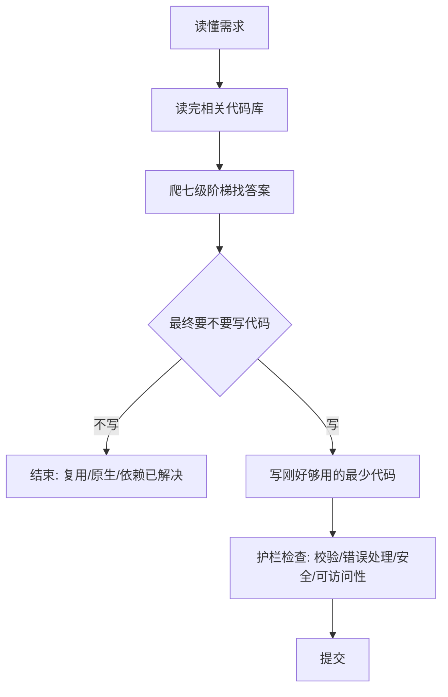
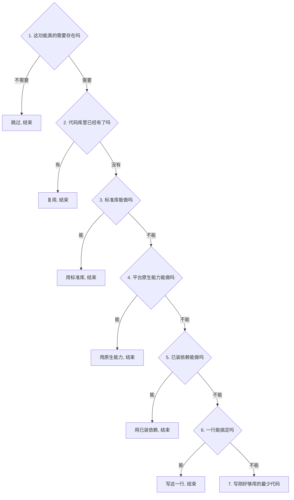

# 给 AI 装一个「最懒高级工程师」：用 ponytail 的七级阶梯教会它别乱写代码

你让 AI 帮你写一个日期选择器。它二话不说，装了个第三方库，写了个包装组件，加了张样式表，然后开始跟你讨论时区该怎么处理。这不是个别翻车案例——大多数 AI coding agent 的默认路数就是把「完成需求」理解成「尽量周全地实现」，而不是先停下来问一句「这真的需要写吗」。而一个干了十几年的高级工程师看到同一个需求，往往一行就搞定：一个 `input`，类型写成 `date`，浏览器自带的选择器就出来了。

问题是，这种「该不该写」的判断力长在老工程师的直觉里，没法直接复制给 AI。你在 prompt 里写「保持简洁」「不要过度设计」，效果通常有限——AI 依然会在遇到具体任务时把一整套「完整实现」搬出来，因为它没有一套可执行的检查顺序来判断「到底要不要写」。有个开源项目叫 ponytail，干的就是这一件事：把「最懒的高级工程师」这套判断力，做成一套可以直接塞进 AI agent 的规则。

本文的任务是把 ponytail 讲清楚：它改的到底是什么、那套七级判断阶梯长什么样、它在真实会话上量出来的数字是否可信，以及它的边界在哪。读完之后，你应该能做到两件事：把七级阶梯抄进自己的 AI agent 规则里；用一个具体任务验证它有没有真的生效。

## 一、为什么 AI 需要一套「不写代码」的判断力

### 1.1 热心过度的真实代价

日期选择器是个很典型的例子，但代价不止于「多写了几个文件」。装第三方库意味着多一个依赖需要维护和升级；包装组件意味着以后每次原生 `input` 行为变化都要同步改这层包装；样式表意味着多一份需要跟主题保持一致的 CSS；跟你讨论时区，则是把一个本该由浏览器处理的问题，升级成了一个需要人工决策的问题。这些代码不是因为需求复杂才存在的，而是因为 AI 默认选择了「更周全」而不是「更必要」的实现路径——每一处都是后续维护成本，而且是线性累积的：改一次需求，就要同时改组件、改样式、改依赖版本。

### 1.2 它改的不是省字，是决策

ponytail 的核心信条只有一句话：最好的代码，是不写的代码。这里要先说清楚一件事，它不是让 AI 少打字、省 token——那是表面结果，不是目标。它给 AI 的，是一套「该不该写」的判断依据，作用在写代码之前的决策环节，而不是写完之后的压缩环节。

但它划了一条明确的底线：校验、错误处理、安全、可访问性，这四项一个都不许砍。代码变少，是因为本来就不需要那么多代码去实现同一个功能——比如原生 `input type="date"` 自带了浏览器级的校验和可访问性支持，根本不需要额外再写——而不是把这些本该有的防护逻辑当成「冗余」一并删掉。这条边界很关键：它区分了「做减法的判断力」和「偷工减料」。

### 1.3 整体工作流

整条判断链路的顺序大致如下：



这条链路有一个容易被忽略的顺序约束：阶梯判断（C）必须排在「读懂需求」和「读完相关代码库」之后，不能跳过前两步直接开始做减法——原因下一节会展开。另一个约束是无论最终走到哪个分支，护栏检查（G）都不能跳过——它不属于「要不要写代码」的判断范围，而是独立于阶梯之外的硬性底线，即使最终判断是「不写代码，直接复用平台原生能力」，校验和可访问性也依然要在实现里保留（原生 `input` 本身就自带这两项，这也是它被优先选中的原因之一）。

## 二、七级阶梯：一套可以直接抄进规则里的判断框架

ponytail 最值钱的部分不是这个工具本身，而是它内置的一套七级阶梯。就算你完全不安装这个项目，把这套阶梯原样搬进你给 AI 的规则文件里，照样有用——这也是它作为一份可复用 prompt 资产的价值所在。

### 2.1 从「需要存在吗」到「最少代码」

判断顺序如下，AI 动手写代码之前从上往下问，停在第一个成立的台阶：



七级依次是：第一级判断这个功能是不是压根不需要存在（YAGNI 原则）；第二级看代码库里是不是已经有现成实现，有就复用不重写；第三级问语言/框架的标准库能不能做到；第四级问平台原生能力能不能做到（日期选择器的例子就停在这一级）；第五级看项目里已经装好的依赖能不能顺手解决，不新增依赖；第六级判断一行代码能不能搞定；只有前六级全部不成立，才走到第七级，写一份刚好够用、不多不少的最少代码。

阶梯越往下台阶越窄——前几级筛掉的是「压根不用写」和「不用新写」的情况，真正落到「需要写代码」的场景，往往已经被压缩到很小的范围。

### 2.2 前提：先读懂，再爬梯子

关键约束在这一句：这架梯子是在 AI 读懂问题、读完相关代码之后才开始爬的，不能代替思考直接套用。用项目自己的话说——「Lazy about the solution, never about reading.」（对方案偷懒，对读代码，从不偷懒。）如果跳过读代码这一步直接爬阶梯，第二级「代码库里是不是已经有了」根本无法判断，阶梯本身就会失效，退化成一套空洞的口号。这也是为什么 1.3 节的工作流图里，「读懂需求」和「读完相关代码库」必须排在阶梯判断之前——顺序一旦颠倒，后面几级的判断全部失去依据。

### 2.3 落地：把它写进你的 agent 规则

不需要安装 ponytail 本身，也可以把这套判断顺序整理成一段自定义指令，加到你的 AI agent 的规则文件里（比如 CLAUDE.md、Cursor 的 rules，或任何支持系统提示的 agent 配置）：

```plain
在动手写代码之前，从上到下检查以下 7 条，停在第一个成立的地方：

1. 这个功能真的需要存在吗？不需要就不写。
2. 代码库里是不是已经有了？有就复用，不要重写。
3. 标准库能做到吗？能就用标准库。
4. 平台原生能力能做到吗？能就用原生能力
   （比如 <input type="date"> 而不是装第三方日期选择器）。
5. 已经装好的依赖能做到吗？能就直接用，不要新增依赖。
6. 一行代码能搞定吗？能就写这一行。
7. 以上都不行，才写刚好够用的最少代码。

前提：以上判断必须在你读懂需求、读完相关代码之后才开始，
      不能代替思考直接跳到某一级。
底线：校验、错误处理、安全、可访问性，四项不许因为"少写"而省略。
```

生成后有一个审查点要重点看：AI 有没有在第一版回复里就直接跳到「写代码」，完全没有提及前面几级为什么不成立。一个真正照阶梯走的回复，通常会顺带说一句「标准库/平台原生能力不支持 xxx，所以走到第 N 级」，这句话本身就是它确实做过判断的证据；如果它一声不吭直接甩出一堆新文件，说明规则没有生效，需要检查规则文本是否被其他更强的系统指令覆盖了。

验证方式：把这段规则加进 agent 的自定义指令，扔给它一个容易被过度设计的任务，比如「加一个日期选择器」。检查它给出的第一版 diff——没有碰 `package.json`（没有新增依赖），`input` 类型直接改成 `date` 而不是引入组件库，说明规则生效了；如果 diff 里出现了新依赖、新组件文件，说明规则没有真正约束住它的行为，需要回头检查指令的措辞和优先级。

## 三、数据说话：在真实会话上量出来的四个数字

光讲理念没有说服力，这套阶梯到底有没有用，需要看实测数据。项目方给出的实验不是靠拍脑袋，而是在真实的 Claude Code 会话上测的：改一个真实的开源项目 tiangolo/full-stack-fastapi-template（前端 React、后端 FastAPI），设计十二个功能任务，同一个 agent 分别在「开启这套规则」和「不开启」两种条件下各跑一遍，模型固定为 Haiku 4.5，每组重复 4 次（n=4）取平均，做 A/B 对照。

结果相对于不开规则的基线：

| 指标 | ponytail（本文阶梯规则） | caveman 对照组 | "YAGNI+one-liners" prompt 对照组 |
| --- | --- | --- | --- |
| 代码量（LOC） | -54% | -20% | -33% |
| Token 消耗 | -22% | 反升 | 未披露具体值 |
| 成本 | -20% | 反升 | 未披露具体值 |
| 耗时 | -27% | 反升 | 未披露具体值 |
| 安全项完整度 | 100%（无一项被砍） | 未披露具体值 | 降到 95% |

四项效率指标同时下降，安全项还保持满分不降——在项目方对比的几种做法里，只有这一档同时满足这两个条件。「caveman」这类更粗暴的极简指令虽然也能压代码量，但 token、成本、耗时反而不降反升，说明单纯要求 AI「少写」并不会自动带来效率提升，甚至可能因为 AI 反复纠结怎么写才算少而消耗更多资源；而单纯在 prompt 里塞一句「遵守 YAGNI，能一行不写两行」的对照组，虽然代码量压下去了，但安全项完整度掉到了 95%——说明没有底线约束的「做减法」指令，有一定概率会连不该砍的部分一起砍掉。这组对比恰好印证了 1.2 节的判断：把「省字」和「决策+底线」分开来看，效果是不一样的。

实验的完整设置和逐项数据记录在 ponytail 仓库的 `benchmarks/results/2026-06-18-agentic.md` 文件里，想核实细节的可以直接去仓库翻。验证方式：打开这个文件，核对里面逐任务列出的 LOC/token/成本/耗时变化，以及 n=4、模型 Haiku 4.5 等实验条件，是否和本文引用的数字一致——一致才说明这组数字有完整记录可查，不是只停留在营销页面上的结论。

## 四、一个敢认错的 benchmark，反而更可信

但真正让这份数据显得靠谱的，不是这几个百分比本身，而是另一件事。

### 4.1 早期的「80–94%」是怎么来的

ponytail 项目早期宣传的数字是「少写 80% 到 94% 的代码」，比第三节里的 -54% 夸张得多。这个数字来自单发生成（single-shot）测试——让裸模型一次性生成代码，不经过完整的 agent 会话流程，而对照基线用的是「什么额外约束都不给」的裸模型输出，这种基线本身就容易在没有任何简洁要求的情况下，堆出大量解释性文字和不必要的可选项来撑体积，导致相对省下的比例被人为放大。

### 4.2 issue #126 捅破了什么

后来有人在 GitHub 上提了一个 issue（编号 #126），指出这组数字站不住脚：单发生成和完整 agent 会话是两种完全不同的场景，裸模型基线本身就灌了大量废话（prose、多余的可选项说明），拿这种虚高的基线去对比，省下的比例自然显得夸张。项目方认下了这个问题，把宣传数字从「80–94%」回撤成了第三节里更保守、也更贴近真实使用场景的 agentic -54%。这段回撤过程记录在仓库 README 的「Older single-shot numbers」折叠段里，连同 issue #126 的讨论一起可以查到。

### 4.3 这给我们的启示：先问基线

一个敢当众砍掉自己一半宣传数字的项目，反而比死守漂亮数字的项目更可信——这不是因为数字变小了值得同情，而是因为它证明了这个项目愿意接受第三方核实、并且核实之后真的改了口径。这也是本文想顺带提醒的一个习惯：以后再看到哪个 AI coding 工具喊出「省 80%」「省 90%」这类特别漂亮的整数数字，不要急着被说服，可以按这个顺序问三句：

1. 这个数字是单发生成测出来的，还是完整的 agent 会话流程测出来的？两者场景差异很大，不能直接类比。
2. 对照基线是「什么约束都不给的裸模型」，还是「有经验的人类工程师的正常产出」？基线定义不同，比例本身就没有可比性。
3. 有没有第三方（issue、PR、独立复现）核实过这个数字，作者是否公开认过账、给过修正后的版本？

这三句话不需要专业背景就能问出口，但能过滤掉大部分靠虚高基线撑出来的营销数字。

验证方式：打开 ponytail 仓库 README 的「Older single-shot numbers」折叠段，对照 issue #126 的讨论内容，确认「80–94%」这个早期数字、它的单发生成测法、以及回撤为 -54% 的说明是不是都公开可查——能查到完整的修正记录，才算是这次数字真的经得起核实，而不是只在文中口头说说。

## 五、边界：它不是银弹

省成本、省时间，本质上是「模型愿意照阶梯走」的副作用，不是阶梯规则本身能保证的结果。如果换成一个特别啰嗦的推理模型，情况可能会反过来——项目方自己在文档里承认，在类似 GPT-5.5 这样的模型上，模型会花大量思考 token 去纠结「到底该停在第几级」，这部分多花的思考成本，可能会把原本省下来的执行成本重新烧回去。

换句话说，这套阶梯的收益依赖于两个前提：模型本身推理链条不会过度冗长，以及模型确实会把这套规则当成硬约束去执行，而不是当成一条可以顺带参考、随时可以绕过的软建议。用之前最好先在自己实际用的模型上跑一次小规模对照，而不是默认它在任何模型上都有效。

## 六、验收清单与下一步

把这套阶梯真正用起来，可以按下面几项自查：

| 环节 | 验证方式 | 预期结果 |
| --- | --- | --- |
| 七级阶梯规则是否生效 | 加入 agent 自定义指令后，喂一个容易被过度设计的任务（如「加个日期选择器」） | 第一版 diff 不新增依赖，直接用平台原生能力 |
| 护栏底线是否守住 | 检查生成代码里校验/错误处理/安全/可访问性四项 | 没有一项因为「精简」被顺带删掉 |
| 数据可信度 | 查 ponytail 仓库的 `benchmarks/results/2026-06-18-agentic.md` 与 issue #126 讨论 | 能看到 agentic -54% 的完整实验记录，以及早期数字的回撤说明 |
| 模型是否适配 | 换一个偏啰嗦的推理模型跑同一任务，对比 token 消耗 | 判断自己常用的模型是否属于「阶梯反而费 token」的少数情况 |

小结几个值得记住的判断：第一，这套阶梯改的是「该不该写」的决策环节，不是写完之后的压缩环节，两者效果不一样；第二，做减法必须配一条不可动摇的底线（校验/错误处理/安全/可访问性），否则「少写」和「偷工减料」会变得难以区分；第三，评估任何效率类 benchmark 时，先确认基线定义，再看数字本身。

从这里往下走，如果你想更深入，有几个方向可以自己接着挖：去 ponytail 的仓库（[github.com/DietrichGebert/ponytail](https://github.com/DietrichGebert/ponytail)）看完整的 skill 实现，对照它是怎么把这套阶梯转成 20 个不同 agent 都能读懂的指令格式的；或者把第二节的七级阶梯规则真的加进你日常用的 agent 配置里，跑一周观察生成代码的依赖增长速度有没有变慢；又或者针对你自己常用的模型，重新做一遍第三节这种 A/B 对照，看看这套规则在你的实际场景里，收益是不是也和项目方测出来的数字方向一致。
