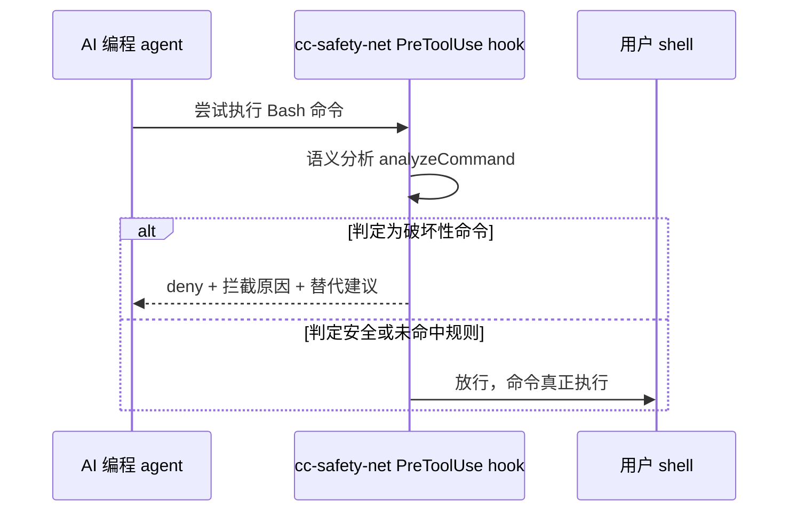
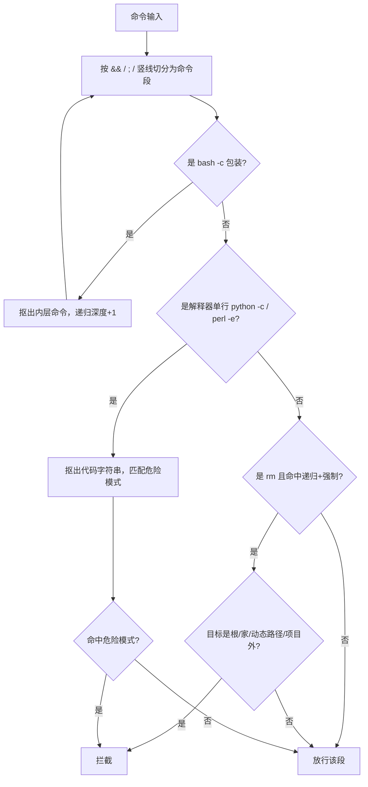

# 给 AI 编程 agent 装一张安全网：cc-safety-net 如何用语义解析拦住 rm -rf

AI 编程 agent 现在几乎都拿到了执行终端命令的权限——写代码、跑测试、装依赖，很多时候都要靠它自己敲命令。开源项目 [cc-safety-net](https://github.com/kenryu42/cc-safety-net) 的作者就实打实踩过一次坑：某次任务里，AI agent 自己拼出一条 `rm -rf ~/`，几个小时的工作连同整个 home 目录一起没了（这段经历见于该仓库 README 自引的一篇 Reddit 帖子）。

很多人第一反应是在 `CLAUDE.md` 或 `AGENTS.md` 里加一条"不要执行破坏性命令"的规则。这个办法并不可靠——这类文件里的约定本质是给模型看的自然语言提示，模型今天遵守不代表明天还记得遵守；一旦上下文变长、任务变复杂，它依然可能把一条删库命令原样发给终端，而这时候已经没有人能在按下回车前拦一下了。

这篇文章要拆的是 cc-safety-net 这个开源 hook（`github.com/kenryu42/cc-safety-net`，MIT 协议，v1.0.6）怎么把"拦截破坏性命令"从一句软规则变成一道硬约束：它挂在 AI agent 和真实 shell 之间，命令真正执行前必须先过一遍语义分析。这一节的任务是讲清楚三件事：为什么简单的关键词黑名单挡不住 AI；它是怎么在 `bash -c`、解释器单行、flag 换序这些绕过手法下依然认出危险命令的；以及当它自己都分析不出结果时，它选择放行还是拦截，为什么这么选。读完之后，你应该能对着它的源码文件，逐条核对本文每一个结论。

## 一、为什么软规则挡不住 AI

### 1.1 一条真实事故

cc-safety-net 的动机不是抽象的安全焦虑，而是一次真实事故：作者的 AI agent 在一次任务中自行执行了 `rm -rf ~/`，整个 home 目录被清空。README 的 "Why this exists" 一节把复盘结论写得很直接——CLAUDE.md 或 AGENTS.md 里的**软规则**（soft rules）替代不了**硬技术约束**（hard technical constraints）。这不是谁的失误，而是约定本身没有任何机制保证它被遵守。

### 1.2 软规则 vs 硬约束

软规则和硬约束的区别不在措辞严不严厉，而在谁来执行拒绝。CLAUDE.md 里写的规矩是自然语言，最终要靠模型"自觉"去遵守；cc-safety-net 的做法是把拒绝这件事从模型的自觉挪到工具调用层面。具体接入方式是一个 `PreToolUse` hook：`hooks/hooks.json` 注册了 `PreToolUse` 事件、`matcher: Bash`，命中时执行 `dist/bin/cc-safety-net.js hook --claude-code`。接入 Claude Code 时，一旦判定为危险命令，hook 会返回 `{ permissionDecision: 'deny', permissionDecisionReason: message }`（`src/bin/hook/claude-code.ts:7-12`），Claude Code 拿到这个返回值就会直接拒绝执行这条 Bash 调用——命令根本没有机会被派发到真实 shell。

想跟着往下读源码，先把仓库拉下来、锁定本文引用的版本：

```bash
git clone https://github.com/kenryu42/cc-safety-net.git
cd cc-safety-net && git checkout v1.0.6
grep -E '"name"|"version"|"license"' package.json   # 预期看到 cc-safety-net / 1.0.6 / MIT
```

### 1.3 整体工作流

整条拦截链路的时序大致如下：



图上的关键约束是这一步发生在命令**真正执行之前**——`PreToolUse` 是执行前置钩子，一旦分析给出 `deny`，这条 Bash 调用就不会被派发到真实 shell，命令永远没有机会跑起来。这也是它和"记日志报警""执行后再撤销"这类事后补救方案的根本差别：事后方案能挽回的是代价，这里挡的是代价本身。

## 二、机制：为什么关键词黑名单没用，它怎么读懂命令语义

### 2.1 为什么关键词黑名单会碎

最直觉的做法是搜关键词——命令里出现 `rm -rf` 就拦。这个思路在人手写命令时也许够用，但 AI 生成的命令会主动或无意地绕开固定字符串。举例来说，把命令包一层 `bash -c "rm -rf ~"`，关键词还在，但已经被包在字符串参数里，简单的命令名匹配抓不到它；换成 `python -c "import os; os.system('rm -rf ~')"` 这类解释器单行，`rm -rf` 干脆不出现在 shell 命令本身里；再或者把 `-rf` 拆成 `--recursive --force`、颠倒成 `-fr`，只认固定字符串的黑名单一样会漏网。

链路总览如下：



图里有两条不能乱的顺序依赖：一是"拆壳"必须在"判危险"之前——不先把 `bash -c` 或解释器单行里的内层命令抠出来，后面所有基于命令名和 flag 的判断都无从谈起；二是拆壳是递归的，抠出来的内层命令要重新回到切分这一步，因为壳可能套好几层。

### 2.2 怎么做：解析语义 + 递归拆壳

入口是 `analyzeCommand` 调用 `analyzeCommandInternal`（`src/core/analyze/analyze-command.ts:26-35`），先按 `&&`、`;`、`|` 把整条命令切成若干段，逐段分析：

- **shell 包装拆开**：`extractDashCArg` 从 `bash -c "…"`（含组合短选项写法）里抠出内层命令，交给 `analyzeNested` 递归再分析一遍，深度加一（`src/core/analyze/shell-wrappers.ts:1-17`、`analyze-command.ts:83-97`）。
- **解释器单行拆开**：`extractInterpreterCodeArg` 从 `python -c` / `perl -e` 里抠出代码字符串，对 `DANGEROUS_PATTERNS` 逐条匹配（`src/core/analyze/interpreters.ts:3-30`）。
- **递归封顶**：`MAX_RECURSION_DEPTH = 10`（`src/types.ts:161`），一旦递归到这个深度还没分析完，直接判定拦截，而不是放行（`analyze-command.ts:31-33`）。这是刻意的设计——递归拆壳本身也可能被用来拖垮分析器，与其无限拆下去，不如设个上限，顶到了就当危险处理。

### 2.3 flag 检测：不是记两个字母，是逐字符去数

`hasRecursiveForceFlags`（`src/core/analyze/rm-flags.ts:1-19`）判断的依据不是记住"`-rf` 这个固定写法"，而是对每个参数 token 做字符级别的包含检测：有没有 `r`（或 `--recursive`）、有没有 `f`（或 `--force`），两者都命中才算强制递归删除。这样不管写成 `-rf`、`-fr`，还是拆成 `--recursive --force`，判断结果一致。

| 命令写法 | 只认固定字符串的黑名单 | cc-safety-net 语义解析 |
| --- | --- | --- |
| `rm -rf ~/project` | 命中 | 命中 |
| `rm -fr ~/project` | 不命中（顺序变了） | 命中 |
| `rm --recursive --force ~/project` | 通常漏（写法变了） | 命中 |
| `bash -c "rm -rf ~/project"` | 不命中（关键词被包了一层字符串） | 命中（拆壳后递归分析） |

验证方式：打开 `src/core/analyze/rm-flags.ts` 第 1-19 行，看 `hasRecursiveForceFlags` 的实现，对着上表几种写法在草稿里过一遍逻辑，确认每一行输入最终都会被判定为"递归+强制"。这是一篇源码解读文章，验证手段就是照着 file:line 去读代码、核对结论，而不是本地跑一条命令。

## 三、目标分类：删的是哪，值不值得拦

### 3.1 为什么只判断"强制递归删除"还不够

一条 `rm -rf` 命令危不危险，还要看删的目标。删项目自己的 `build` 目录和删 home 目录，严重程度完全不同——不做目标区分，要么误伤真实需要清理的场景，要么放过真正致命的删除。

### 3.2 怎么做：rm.ts 里的目标分类

`src/core/analyze/rm.ts:69-202` 把 rm 的删除目标按语义分成几类：

- `isDangerousRootOrHomeTarget`（`rm.ts:180-202`）：目标是 `/`、`~`、`$HOME`、`${HOME}`（及带 `/`、`/*` 的变体）时恒判危险，不管前面的 flag 写法。
- `isDynamicTarget`：目标里带 shell 变量、分析阶段算不出具体值的动态路径，判定为 `REASON_RM_RF_DYNAMIC_TARGET`，拦截。
- 目标落在当前项目目录（anchored cwd）之外的，判定为 `REASON_RM_RF`，拦截。
- 当前 cwd 本身就是 home 目录时删东西，判定为 `REASON_RM_HOME_CWD`，也拦。
- 目标老老实实落在当前项目目录内部、且不是 paranoid 模式，才放行。

| 删除目标 | 判定结果 | 依据 |
| --- | --- | --- |
| `/`、`~`、`$HOME`、`${HOME}` | 拦截 | `isDangerousRootOrHomeTarget` |
| 含 shell 变量的动态路径 | 拦截 | `isDynamicTarget` |
| 当前项目目录外的路径 | 拦截 | `outside_anchored_cwd` |
| cwd 本身就是 home 目录 | 拦截 | `REASON_RM_HOME_CWD` |
| 当前项目目录内部路径（非 paranoid） | 放行 | `within_anchored_cwd` |

这里有一个坑需要提前说明：所谓"当前项目目录"由 anchored cwd 决定，如果 agent 本来就是在 home 目录下直接开工，没有先进到某个项目子目录，cwd 就等于 home，这时候即便删的是"当前目录下的东西"，也会被 `REASON_RM_HOME_CWD` 拦住。这是刻意的保守设计，不是误判。

验证方式：打开 `src/core/analyze/rm.ts` 第 69-202 行，对照上表的几种路径写法（`/`、`~`、`$HOME`、带变量的路径、项目内路径），确认每个分支返回的判定原因（reason）和表格一致。

## 四、兜底哲学：分析崩了就拦，拦了还教你，跨 7 个 CLI

### 4.1 为什么分析失败时选择拦截而不是放行

安全工具的默认行为很关键。如果分析器遇到没见过的写法、解析报错时选择"放行"（fail open），那么最刁钻、最没被测试覆盖到的命令反而最容易蒙混过关——这跟安全工具的初衷正好相反。cc-safety-net 的选择是 fail closed：`src/index.ts:40-48` 里，分析过程一旦抛出异常，直接 `throw` 阻断，拦截原因会写成"CC Safety Net failed closed because command analysis failed unexpectedly"；strict 模式下，连引号没闭合这种解析不完整的情况也按拦截处理（`analyze-command.ts:42-50`）。宁可错杀，不放一条自己没看懂的命令进去，这是安全工具该有的默认姿势。

### 4.2 拦了不是甩一句冷冰冰的报错

`src/core/format.ts:12-40` 的 `formatBlockedMessage` 给出结构化的拦截信息：`BLOCKED by CC Safety Net` / `Reason` / `Command` / `Segment`，末尾附一句——如果确实需要这个操作，让用户手动运行。git 的破坏性操作还有独立规则库（`src/core/git/rules.ts:4-41`），每条都配了替代建议：

| 危险 git 操作 | 建议替代 |
| --- | --- |
| `git reset --hard` | 先 `git stash` |
| `git checkout --` | 先 `git stash` |
| `git clean -f` | 先 `git clean -n` 预览 |

危险模式清单（`src/types.ts:181-191`）覆盖的范围不只是 rm，还包括 `git reset --hard`、`git checkout --`、`git clean -f`、`git stash drop`/`clear`、`dd of=/dev/…`、`mkfs`、`shred`、`find … -delete`。

### 4.3 一套 hook，七个 CLI 通用

README 的 "Supported agents" 一节列出了 Claude Code、Codex、Gemini CLI、GitHub Copilot CLI、Kimi Code、OpenCode、Pi 七家，`src/bin/hook/` 目录下能看到对应各家的适配文件（`claude-code.ts`、`gemini-cli.ts`、`copilot-cli.ts`、`kimi-code.ts` 等），外加一个 `install/` 安装器。分析引擎只写一份，各家 CLI 只是接口层适配——这也是为什么换个 agent 干活，这套防护不用重新配一遍。

验证方式：打开 `src/bin/hook/` 目录，数一下里面有几个适配文件，和 README "Supported agents" 列出的七家逐一对上；再打开 `src/index.ts` 第 40-48 行，确认 catch 块里是 `throw` 而不是放行。

## 五、验证清单与小结

| 结论 | 验证方式 | 预期结果 |
| --- | --- | --- |
| hook 挂在 PreToolUse，命令执行前拦截 | 读 `hooks/hooks.json` + `src/bin/hook/claude-code.ts:7-12` | 命中时返回 `permissionDecision:'deny'` |
| 黑名单绕不过 shell 包装/解释器单行 | 读 `shell-wrappers.ts:1-17` + `interpreters.ts:3-30` | `bash -c` / `python -c` 内层命令被抠出并递归分析 |
| flag 换序/组合/长写都能识别 | 读 `rm-flags.ts:1-19` | `-rf`/`-fr`/`--recursive --force` 判定一致 |
| rm 目标按语义分类 | 读 `rm.ts:69-202` | 根/家/动态路径/cwd 外拦，cwd 内放行 |
| 分析失败时拦截而非放行 | 读 `src/index.ts:40-48` | 异常直接 `throw` 阻断，不放行 |
| 跨 7 个 CLI 通用 | 数 `src/bin/hook/` 下适配文件 | 与 README Supported agents 七家一一对应 |

实现过程中有几个决策值得记住：

- 硬约束优于软规则的核心不是"多写一条提示词"，而是把拒绝的决策点从模型的自觉挪到执行前的物理闸口——PreToolUse 挡在 AI 和 shell 之间，deny 就是 deny，不看模型当时想不想遵守。
- 语义解析比关键词黑名单贵，但黑名单在 AI 生成命令的场景下几乎必输，因为生成端本身就会无意或有意地写出黑名单没覆盖的变体，`bash -c`、解释器单行、flag 换序都是现成的例子。
- fail closed 是安全工具该有的默认姿势：分析不出来时"宁可错杀"，比"放过一次"代价小得多。

从这里往下走，有几个方向值得看：

- 如果你的 `CLAUDE.md` / `AGENTS.md` 里现在还写着"不要执行危险命令"这类软规则，可以对照本文的判定逻辑，想想哪些场景值得升级成 hook 级别的硬约束。
- 想亲眼看拦截效果，可以在自己机器上接入 cc-safety-net，试着拼几条 `bash -c` 包装或 flag 换序的命令，看拦截提示是不是如预期弹出来。
- 关注它的 git 规则库（`src/core/git/rules.ts`）后续会不会覆盖更多破坏性操作，这是判断这个项目是否持续维护的一个信号。
