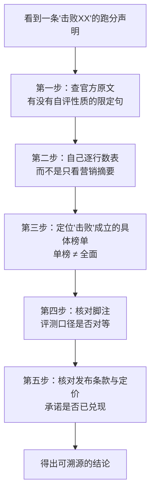
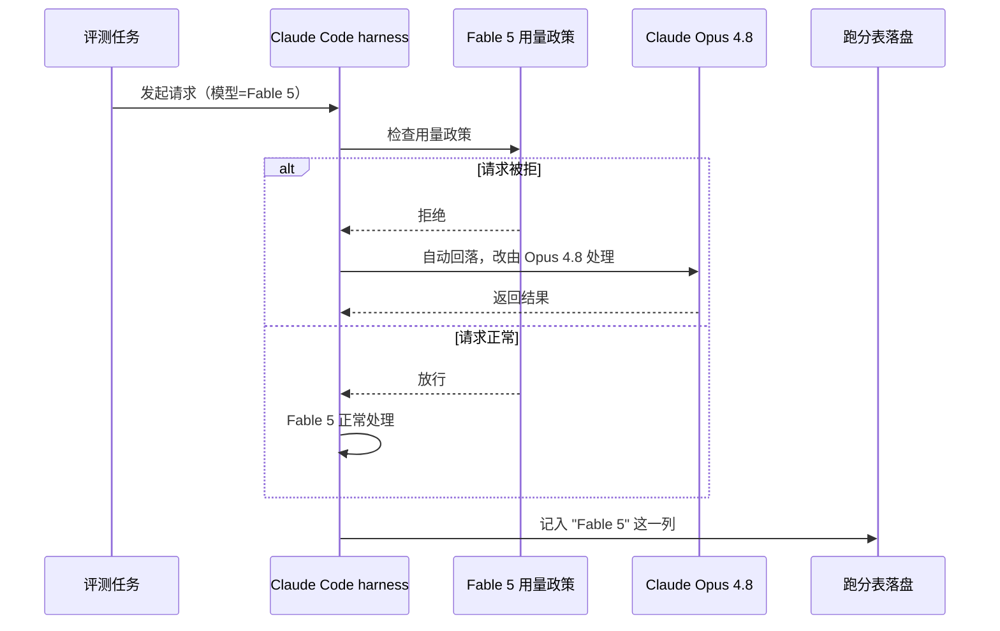

# 一份跑分表要读多细：从「Kimi K3 击败 Claude Fable 5」的传闻说起

2026 年 7 月 16 日，Moonshot 发布 Kimi K3，X 上很快传开一个说法：国产开源模型击败了 Claude Fable 5。转发的人一个比一个激动，配图基本都是同一张官方跑分表的截图，但截图往往只截了表的一角。把 Moonshot 官方博客那张完整的 Full Benchmark Table（35 行，覆盖编程、智能体、推理、视觉四大块）逐行读一遍，会看到博客第二段官方自己写的原话：K3 的整体表现，仍然落后于最强的闭源模型 Claude Fable 5 和 GPT 5.6 Sol。这句话是 Moonshot 自己写的，不是哪个竞争对手替它说的。

大部分人判断一条模型跑分新闻，链路止步于标题和转发配图，很少有人回到官方原始文档核对一遍。这不是懒——是三十几个子榜单逐行核对的成本确实不低。但代价也很实在：这次「击败 Fable 5」的说法，成立的部分只是 Arena.ai 前端代码单一榜单里的一项，被裁剪成了标题里的「全面击败」；这类「单榜第一被包装成全面第一」的裁剪，几乎每次模型发布都会重演一遍，读者永远慢一步才反应过来自己被摆了一道。

这篇文章的任务，是把「读一份 AI 模型跑分表、核实一条『击败 XX』的说法」变成一套可复现的检查流程，以 Kimi K3 这次的官方跑分表为例，一步步走一遍。走完之后，你应该能独立做到五件事：在官方原文里定位到那句最关键的自评；自己重新数一遍表格，得到跟本文一致的统计结果；找到「击败」说法真正成立的那个具体榜单；找到脚注里决定分数是否可比的关键条款；核对「开源」「便宜」这类隐含预期是否还站得住。这套流程不专属于 Kimi K3，下次任何模型发布带着「击败」「超越」这类标题出现时，都可以原样套用。

## 一、为什么「击败」两个字经常靠不住

### 1.1 跑分新闻的裁剪机制

一次模型发布通常会附带几十个子榜单的成绩——编程、推理、智能体、视觉、多语言各占一块。只要模型在其中任意一个榜单上排到第一，转发者就有了写「击败 XX」标题的合法理由，即便剩下的二三十个榜单里它输多赢少。这不是造假——Kimi K3 确实在 Arena.ai 的前端代码榜单上登顶、确实排在 Claude Fable 5 前面，这一条是真的。问题在于「一个榜的第一」被转述成了「全面第一」，读者接收到的不是假消息，而是一条被裁剪过的真消息。这个机制不针对哪一家实验室，是所有跑分新闻的通病：三十几个榜，赢一个，标题就只留那一个。

### 1.2 核验这件事，普通读者也能做

拆穿这类裁剪不需要一手实测，也不需要跑分工具——Moonshot 把完整跑分表和评测脚注都公开在了官方博客里，核验的成本就是花几分钟把公开材料读完。这也是本文选 Kimi K3 做示例的原因：所有结论都能对着 [kimi.com/blog/kimi-k3](https://www.kimi.com/blog/kimi-k3) 这一篇博客复现，不依赖任何非公开信息。

### 1.3 整体核验流程

把「核实一条模型跑分声明」拆开，大致是下面五步，缺一步都可能被带偏：

这五步有严格的顺序依赖：第一步先定调——如果官方自己都没说「击败」，后面几步就是在核实一个从一开始就不成立的转述；第二步和第四步不能颠倒，因为脚注里的评测口径直接决定第二步数出来的分数能不能直接拿来比较，跳过脚注直接下结论，等于拿两把长度不一样的尺子在量同一件东西。下面逐步过一遍。

## 二、第一步：先去官方原文核对自评句，而不是转发文案

### 2.1 为什么

转发链路上，限定语是最先被丢掉的部分。「K3 在多项评测中表现出前沿水平，但整体仍落后于最强闭源模型」这种带转折的完整句子，传到第三层转发时，大概率只剩下「K3 表现出前沿水平」，转折之后的内容悄悄消失了。这不是转发者故意断章取义，长句子在社交媒体的转述里天然会被压缩，压缩时被舍弃的往往就是限定和让步部分。

### 2.2 怎么做

不看任何转发和二手解读，直接打开模型发布方的官方博客，找那句通常出现在开头一两段的自我定位陈述——这类陈述里经常带着「虽然/but/仍然/still」这种转折词，转折之后的内容就是官方自己承认的短板，也是判断一切「击败」类标题是否成立的地基。

### 2.3 产物：官方原句

Kimi K3 官方博客第二段，原文如下：

> "While its overall performance still trails the most powerful proprietary models, Claude Fable 5 and GPT 5.6 Sol, Kimi K3 demonstrated frontier-level performance across our evaluation suite."

翻成中文就是：虽然整体表现仍然落后于最强的闭源模型 Claude Fable 5 和 GPT 5.6 Sol，K3 在我们的评测集里展现出了前沿水平的表现。官方从没有说自己「击败」了 Fable 5，反而是主动承认了整体仍落后这件事。

### 2.4 审查点

生成或摘录这类自评句后，重点检查两件事：一是转折词前后的内容是否都被保留——只截前半句会得出「K3 前沿水平」这种误导性结论；二是这句话出现的位置——放在博客开头一两段的通常是官方主动定调的自我评价，比藏在末尾角落的免责声明更能代表官方的真实判断。

### 2.5 验证

打开 [kimi.com/blog/kimi-k3](https://www.kimi.com/blog/kimi-k3)，用「trails」或「仍然落后」做关键词定位，确认这句话原文还在、上下文完整、没有被后续版本悄悄删改。能定位到，第一步就算做完。

## 三、第二步：自己把整张表逐行数一遍

### 3.1 为什么

摘要和媒体通稿只会挑对结论有利的那几行放大展示，完整的原始数据表才是唯一不会撒谎的材料。跳过这一步、只信摘要，等于把「哪些行赢、哪些行输」的判断权交给了写摘要的人。

### 3.2 怎么做

把官方 Full Benchmark Table 的每一行都记下来，标注三列：K3 是否第一或并列第一、K3 对 Fable 5 是赢/平/输、K3 对 GPT 5.6 Sol 是赢/平/输。这一步没有捷径，就是逐行核对——但也正因为没有捷径，数出来的结果才可信。

### 3.3 产物：统计结果

Kimi K3 官方 Full Benchmark Table 一共 35 行，覆盖编程、智能体、推理、视觉四大块，逐行统计结果如下（下面这组数字是本人按官方表逐行计数得出，不是引用任何第三方结论）：

| 统计项 | 结果 |
| --- | --- |
| 全表总行数 | 35 行 |
| K3 拿第一或并列第一 | 8 行（含 ZeroBench_main 23.0 一行为平手，严格独占第一为 7 行） |
| 对 Claude Fable 5：K3 赢或平 | 13 / 35 行 |
| 对 GPT 5.6 Sol：K3 赢或平 | 20 / 34 行（其中一行 Sol 无数据，分母相应减一） |

K3 拿第一的 8 行分别是：Program Bench（77.8）、SWE Marathon（42.0）、BrowseComp（91.2）、DeepSearchQA（95.0）、Automation Bench（30.8）、SpreadsheetBench 2（34.8，比第二名的 34.7 只高 0.1）、ZeroBench_main（23.0，平手）、OmniDocBench（91.1）。这组数字对照官方博客第 2 段的自评句——「整体仍落后」——完全对得上：赢 GPT 5.6 Sol 的行数明显多于赢 Fable 5，输 Fable 5 的行数明显多于输 Sol，K3 的短板主要集中在跟 Fable 5 的对比上。

表里最能说明问题的一行是 `Kimi Code Bench 2.0 (Internal)`——这是 Moonshot 自己的内部编码评测榜，K3 得分 72.9，Fable 5 得分 76.9。在自己主场设计的榜单上输给对手，还老老实实把这一行原样印在官方表里，这个细节比任何一行「K3 第一」都更能说明这张表的可信度。

### 3.4 审查点

自己动手统计时，务必分清哪些数字是官方原文直接给出的、哪些是自己算出来的——本文里「35 行」「第一 8 行」「13/35」「20/34」这四个数字都是本人逐行核算的结果，不是官方结论，混为一谈会误导别人以为官方自己下了这个统计。另外要特别小心指标之间打架的情况：这次核实过程中发现另有一项第三方 Elo 类指标，不同来源给出的数值互相不一致——遇到这种情况，正确做法是这个数字全篇都不用，而不是三选一凑合，凑合出来的结论没法溯源。

### 3.5 验证

拿官方博客的 Full Benchmark Table，任选 5-10 行独立核对一遍：K3 那一列的数值是否确实是这几行里的最高分（或并列最高），对 Fable 5、对 Sol 的胜负关系是否跟上面的统计表对得上。对不上，回去重新核对原表；对得上，第二步完成。

## 四、第三步：定位「击败」成立的具体榜单——该给的公道要给

### 4.1 为什么

只拆穿标题党，不指出标题党里哪一部分是真的，本身也会变成另一种误导。「击败 Fable 5」这个说法不是凭空编的，它确实有成立的地方，只是被过度泛化了。找到它真正成立的边界，是核验流程里容易被跳过、但同样重要的一步。

### 4.2 怎么做

回到原始信息源确认「击败」说法最初的出处——通常是某个具体第三方评测平台的官推或公告，而不是转发者自己的判断。

### 4.3 产物

Kimi K3 确实在 Arena.ai 的 Frontend Code arena（前端代码榜）登顶，确实排在 Claude Fable 5 前面。这一条信息来自 Simon Willison 在 [simonwillison.net/2026/Jul/16/kimi-k3](https://simonwillison.net/2026/Jul/16/kimi-k3/) 一文中引用的 Arena 官方推文："now the leading model on Arena.ai's Frontend Code arena, surpassing even Claude Fable 5"。这是这次「击败」说法里唯一站得住的部分。

### 4.4 判断

这里要给一个明确的结论：K3 在前端代码这个细分场景里确实排到了 Fable 5 前面，这一点不该被抹掉；但这只是三十五个子指标里的一个，把它泛化成「全面击败」，是转发链路上发生的裁剪，不是官方或 Arena 平台的说法。核验的目的不是把新模型一棍子打死，而是把「哪部分真、哪部分被夸大」分清楚——不唱衰也不捧杀，才是可信的判断。

### 4.5 验证

搜索「击败」说法最初的信息源（通常是某条被广泛转发的原始推文或公告），确认里面提到的具体榜单名称，再回官方表核对 K3 在这个具体榜单上的名次是否属实。属实，说明这条声明有真实依据，只是范围被放大了；查无实据，才是真正的假消息。

## 五、第四步：脚注才是数据的正文——核实评测口径是否对等

### 5.1 为什么

表格正文的数字看起来是在直接比较模型能力，但很多跑分表会在脚注里注明一个容易被忽略的前提：不同模型在测试时用的评测脚手架（harness）并不相同。同一个模型换一套脚手架，分数能差出一截——评测里，模型和跑它的那套工具链是绑在一起的，只看分数以为是在比模型本身，实际上比的是「模型 + 它的运行方式」这个整体。跳过脚注直接比较分数列，是这类核验流程里最容易踩的一个坑。

### 5.2 怎么做

跳过表格正文，直接看表格底部的脚注部分，重点找两类信息：不同模型分别用了哪套评测脚手架、有没有关于「拒绝请求如何处理」这类结算规则的说明。

### 5.3 产物

Kimi K3 官方表格脚注 1/2/3/5 写明：Kimi K3 使用自家的 KimiCode harness 评测（原文："Kimi K3 is evaluated with the KimiCode harness…"），而其余对比模型使用 Claude Code 或 Codex 这两套第三方脚手架评测。也就是说，表格里的每一列分数，背后其实是三套不同的运行环境跑出来的结果，不是同一套流水线跑不同模型得到的。

更绕的一条藏在脚注 6 里：Fable 5 那一列标注着 `(max, with fallback)`。脚注说明，在 Claude Code 这套脚手架下，凡是被 Fable 5 用量政策拒绝掉的请求，会自动回落（fallback）给 Claude Opus 4.8 来完成（原文："requests refused by Claude Fable 5 due to its usage policy automatically fall back to Claude Opus 4.8"）。这意味着 Fable 5 那一列的分数，也不是纯粹由 Fable 5 一个模型跑出来的——这一刀两边都砍：K3 用自家脚手架跑，Fable 5 那一列混进了另一个模型的成绩，两列数字都不是干净的单一模型对照。

整条评测链路的关键节点，用一次请求的处理过程来表达会更直观：

图上关键的一点是：无论请求最终是被 Fable 5 处理还是被回落到 Opus 4.8 处理，结果都会不加区分地记入表格里「Fable 5」这一列——阅读表格的人完全看不出这一列里有多少比例其实来自另一个模型。这也是为什么脚注必须先读：它决定了正文的分数列到底能不能拿来直接比较。

### 5.4 审查点

看到任何跨模型的跑分对比表，先扫一遍脚注，确认两件事：所有列是否用的是同一套评测脚手架；有没有类似 fallback 这样的结算规则会让某一列的分数混入其他模型的结果。两条里只要有一条不满足，这张表上的横向比较就不能直接采信，只能作为参考。

### 5.5 验证

回到官方博客，定位脚注区块，逐条读完标注在表头或列名旁边的角标（如脚注 1、脚注 6），确认每个模型对应的评测脚手架名称，以及是否存在类似 fallback 的特殊规则。读完脚注后，如果发现表格里几列用的评测口径不一致，就应该在结论里明确指出这一点，而不是假装表格里的分数天然可比。

## 六、第五步：核对发布条款与定价——「开源」和「国产更便宜」是否还成立

### 6.1 为什么

模型标题里经常带「开源」标签，但这个标签在发布当天描述的到底是「权重已经放出来」还是「承诺会放出来」，是两回事；同理，「国产模型更便宜」是过去几代模型建立起来的默认预期，但这个预期不会自动延续到每一代新模型上，需要每次单独核对。

### 6.2 怎么做

在官方发布说明里找到「Availability」或类似的可用性章节，核对权重发布的具体日期和当前实际可用的接入方式；再找到定价表，跟上一代同系列模型的价格做对比。

### 6.3 产物

Kimi K3 官方发布说明写明，完整模型权重承诺在 2026 年 7 月 27 日之前发布（"The full model weights will be released by July 27, 2026."），发布当天用户只能通过 API 或网页使用——所谓「开源」，眼下是一张还没兑现的期票，不是已经落地的事实。

定价方面，K3 的价格是每百万 token 输入 3 美元、输出 15 美元（缓存命中的输入价格为 0.3 美元）。上一代 K2.6 的定价是每百万 token 输入 0.95 美元、输出 4 美元，K3 相当于涨了 3 倍多。这是中国实验室迄今为止发布过的最贵模型，价位跟 Anthropic 的 Sonnet 系列站在同一档——这是 Simon Willison 在原文里给出的判断，也是本文引用这一结论的出处。「国产等于便宜」这个默认预期，这一代不成立了。

### 6.4 该给的公道

只讲短板不讲长处，同样是一种失真。核实过程中同样能在公开材料里找到 K3 站得住的地方：它是首个开放 3T 参数级的模型（"the world's first open 3T-class model"）；官方表里 Terminal Bench 2.1 这一行，K3 得分 88.3，确实超过 Fable 5 的 84.6（但低于 GPT 5.6 Sol 的 88.8）；第三方机构 Artificial Analysis 的私测数据显示，在长时程知识工作这类任务上，K3 仅次于 Fable 5 一家，且每个任务的成本约为 Opus 4.8 的一半（0.94 美元 对 1.80 美元）。这是一个很强的模型，只是没强到「全面击败」这个程度，而官方自己也从没这么说过。

### 6.5 验证

在官方发布说明里搜索「Availability」或权重发布相关段落，确认承诺日期和当前实际可用方式；在定价表里核对当前价格与上一代模型价格的具体数字，自己算一遍涨幅倍数，而不是照抄任何二手总结里的说法。

## 七、验收：把五步核验流程走一遍之后的结论

把前面五步套在这次「Kimi K3 击败 Fable 5」这条传闻上，结论是：官方从未说过「击败」，反而主动承认整体仍落后；35 行表里 K3 只拿到 8 行第一，对 Fable 5 是输多赢少，35 行里只有 13 行赢或平；「击败」说法在 Arena 前端代码单一榜单上确实成立，但被泛化成了全面第一；表格里不同模型用的评测脚手架并不相同，Fable 5 那一列还混入了回落到 Opus 4.8 的结果；「开源」目前是一张 7 月 27 日到期的期票，「国产更便宜」这个预期在这一代模型上也不成立。同时，K3 在前端代码、终端任务、长时程知识工作这几个具体场景里的表现确实扎实，成本控制也确实有优势——它是一个很强的模型，只是没强到标题说的那个程度。

五个核验步骤逐条对照，结果如下：

| 核验步骤 | 验证方式 | 本次结果 |
| --- | --- | --- |
| 官方原文自评句 | 打开官方博客定位转折句 | 官方自认整体仍落后 Fable 5 与 GPT 5.6 Sol |
| 逐行统计跑分表 | 独立复核 35 行数据 | K3 第一 8 行；对 Fable 5 赢或平 13/35；对 Sol 赢或平 20/34 |
| 「击败」成立的具体榜单 | 定位说法最初来源 | Arena 前端代码榜单登顶属实，非全面第一 |
| 脚注里的评测口径 | 读表格底部脚注 | 脚手架不统一（KimiCode vs Claude Code/Codex）；Fable 5 列混入 Opus 4.8 回落结果 |
| 发布条款与定价 | 核对 Availability 章节和定价表 | 权重承诺 7/27 前放出，当前仅 API/网页；价格较上代涨 3 倍多，为国产最贵 |

实践过程中有几点值得记住：官方博客往往比转发它的人更诚实——K3 官方不仅自己写了「整体仍落后」，还把自家内部编码榜输给对手的那一行原样印在了表里；跑分表的可信部分不在正文的粗体数字，而在容易被跳过的脚注和 Availability 章节；遇到不同信息源给出互相矛盾的数字，最稳妥的处理方式是这个数字全篇都不用，而不是三选一。

这套五步流程不专属于 Kimi K3，从这里往下走，接下来遇到任何一次带着「击败」「超越」标题的模型发布，都可以原样套用：先查官方原文有没有自评式的转折句，再自己核对一遍完整数据表而不是信通稿摘要，然后找到那个「击败」说法真正成立的具体榜单，接着翻到脚注确认评测口径是否对等，最后回到 Availability 和定价条款核对承诺是否已经兑现。花几分钟走完这五步，通常就能避开大部分标题党式的跑分新闻。
