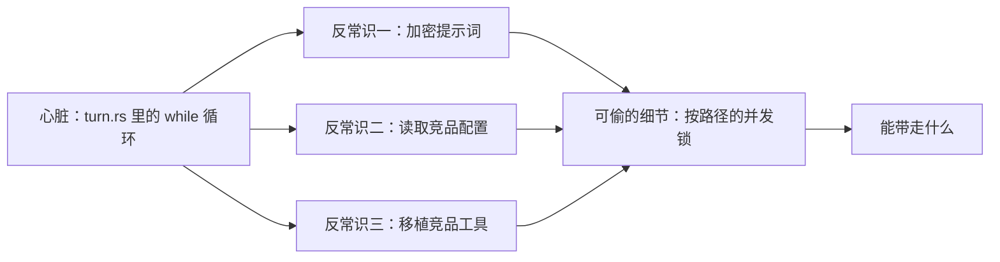
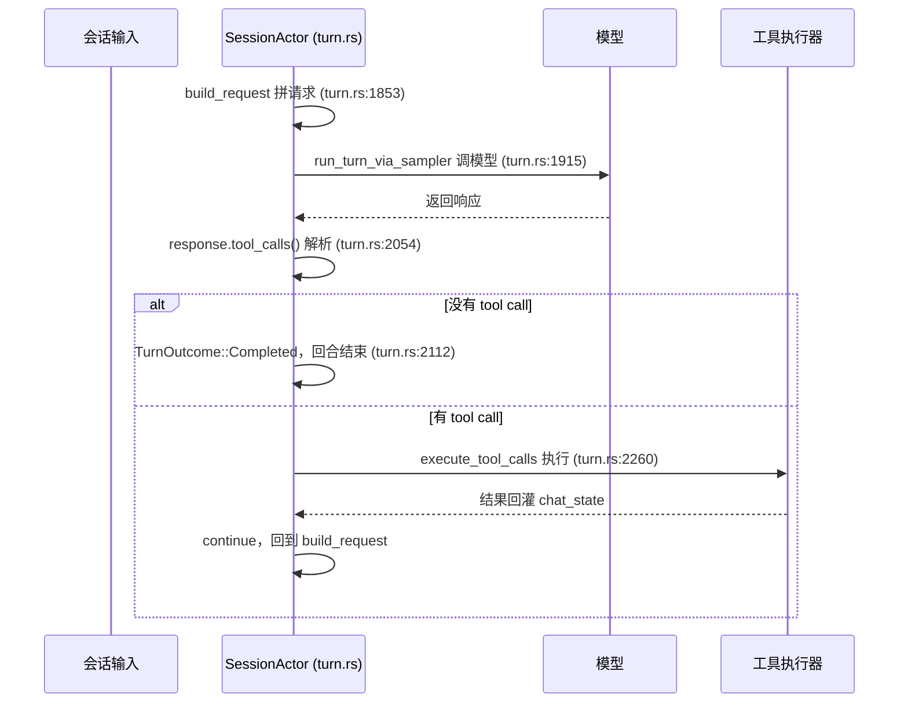

# xAI 把旗舰 coding agent 源码全开了：拆开核心，就是一个 while 循环

coding agent 这两年被谈得很玄——上下文怎么管理、工具怎么调度、多轮对话怎么不跑偏，讨论里经常出现"黑盒""复杂系统"这类词。但市面上能拿到手的旗舰级实现大多闭源，你能看到的只是产品行为，看不到背后的代码，判断也就只能停留在猜测。

这个缺口最近被填了一块：xAI 在 2026-07-14 建了个新仓库 [xai-org/grok-build](https://github.com/xai-org/grok-build)，07-15 公告开源，把自家旗舰 coding agent 的**全部源码**放了出来——纯 Rust，Apache-2.0 协议，装出来的二进制叫 `grok`（仓库不接受外部贡献，issue 是关的，等于是"给你看，但不找你一起改"）。这不是某个开源社区的玩具项目，是一家大厂正在用的旗舰产品的真实实现，值得花时间读一遍。

这篇文章带你逐层拆开这份源码：先确认 agent loop 本身到底有多朴素，再看真正拉开体验差距的三个"循环外"设计，最后给出一个可以直接搬进自己项目的并发控制细节。读完你能做到：说清 `turn.rs` 里 loop 的四步骨架、讲明白 Grok Build 在 prompt 保护和配置复用上和 Claude Code/Cursor 的差异、看懂它按文件路径做工具并发锁的实现思路——并且知道去仓库哪个文件的哪一行验证这些结论。

## 一、为什么值得读这份源码

### 1.1 闭源产品只能验证行为，开源产品能验证机制

大部分旗舰 coding agent（包括你每天在用的那几个）不开源核心 agent 循环，你能测出来的只是"它会不会用工具""上下文丢不丢"这类外部行为，没法确认背后的实现选择。Grok Build 这次开源，第一次给了一个可以逐行核对的旗舰样本——本文所有结论都能在仓库里找到对应的文件和行号，不是从行为反推的猜测。

### 1.2 这次"全部源码"意味着什么

仓库是标准 Cargo workspace，本文会用到的几个 crate 分工大致如下（只列本文涉及的部分，不是完整仓库结构）：

```
grok-build/                              # https://github.com/xai-org/grok-build
├── crates/codegen/xai-grok-shell/       # 会话与 agent loop：turn.rs 在这里
├── xai-grok-agent/                      # prompt 组装与加密：prompt_encrypted.rs、context.rs
└── xai-grok-tools/                      # 工具实现与扩展发现：skills/discovery.rs、implementations/{codex,opencode}/
```

许可是 Apache-2.0，其中挪用的第三方代码保留原许可（这点在第五节展开）。

### 1.3 拆解路径

整篇文章按"先看心脏、再看心脏外面那圈、最后挖一个能直接复用的细节"的顺序推进：



顺序不能反：不先确认循环本身有多简单，就没法体会"复杂度都藏在循环外面"这句话的分量——后面三个反常识、一个工程细节，都是在这个朴素循环之外挂的东西。

## 二、心脏：agent loop 就是一个 while 循环

### 2.1 loop 骨架四步

核心循环叫 `SessionActor::process_conversation_turn`，实现在 `crates/codegen/xai-grok-shell/src/session/acp_session_impl/turn.rs:1799` 起的一个 `loop {` 里。整条链路的数据流大致如下：



这四步——拼请求、调模型、看有没有工具调用、按结果决定结束还是继续——就是整个 agent 的心脏。没有隐藏的状态机，没有额外的调度层，一个 `loop` 加一个 `if` 分支。很多人对 coding agent 的"高深"想象，来自不了解这一层其实就这么直白。

`build_request` 这一步顺带值得展开：每次拼请求时，system prompt 由 `PromptContext` 经 `ToolBridge::render_prompt()` 渲染（Jinja 风格的 Markdown 模板），组成部分包括 `AGENTS.md`（仓库级配置可以被当前工作目录的配置覆盖）、persona、memory、`<user_info>`（`xai-grok-agent/src/prompt/context.rs:84-138`）。历史消息不是无限累积——`CompactionPolicy` 默认在上下文用到 85% 时触发自动压缩（`compaction.rs:34-45`），这也是循环能一直转下去、不会把上下文撑爆的原因。

### 2.2 兜底：模型不发工具调用才真正结束

有一个细节容易漏看：`TurnOutcome::Completed` 只是"模型这次没发 tool call"的结果，但如果这时候还有 pending 的 todo 项，`turn.rs:2112-2162` 里的 `TodoGate` 会主动 nudge 一次让循环继续（有上限，不会无限续）。也就是说"回合结束"的真实判断条件是"没有工具调用 **且** 没有待办事项在追"，不是单看模型这一轮说了什么。

**怎么自己核实这个结论**：

```bash
git clone https://github.com/xai-org/grok-build
cd grok-build

rg -n "fn process_conversation_turn" crates/codegen/xai-grok-shell/src/session/acp_session_impl/turn.rs
# 预期：定位到 turn.rs 里的入口函数

sed -n '1799,1820p' crates/codegen/xai-grok-shell/src/session/acp_session_impl/turn.rs
# 预期：看到 loop { 开头，往下依次是 build_request / run_turn_via_sampler 的调用链
```

看到这四步能对上，心脏部分就算读完了——接下来的三节，才是真正决定 Grok Build 和其他 agent 之间体验差距的地方。

## 三、反常识一：系统提示词加密藏在源码里

### 3.1 为什么要加密自己的 prompt

多数 coding agent 的系统提示词是明文存在仓库里的——想看直接搜文件就行。Grok Build 反过来，把它当机密处理：`prompt_encrypted.rs` 文件开头的注释直接写着"XOR-encrypted prompt templates"，`xai-grok-agent/src/prompt/prompt_encrypted.rs:1-3`。这不是防不住认真的人（加密算法本身不复杂），但至少把"随手 grep 出完整 prompt"这道门槛立起来了——对一家把 prompt 工程当核心资产的公司，这是一个态度上的信号：明文暴露的代价，是别人可以零成本复制你调了很久的措辞。

### 3.2 怎么做的

运行时按需解密，用完立刻清零，不落盘明文——触发逻辑在 `xai-grok-agent/src/prompt/context.rs:16-18`；生成这份加密模板的脚本是 `scripts/encrypt_templates.py`，构建时把明文模板转成加密态写进仓库，源码里就再也看不到明文版本。

**怎么自己核实这个结论**：

```bash
rg -n "XOR-encrypted prompt templates" grok-build/xai-grok-agent/src/prompt/prompt_encrypted.rs
# 预期：能命中这行注释，说明确实是加密存储，不是明文

cat grok-build/scripts/encrypt_templates.py | head -20
# 预期：看到读取明文模板、加密后写回的构建脚本逻辑
```

**人工审查点**：如果你想把这套思路搬到自己的 agent 项目里，注意加密只解决"防随手 grep"，不解决"防运行时内存 dump"——不要把它当成能扛住认真逆向的安全边界，它更像是给 prompt 资产加了一把普通门锁,而不是保险柜。

## 四、反常识二：主动读取你机器上 Claude Code / Cursor 的配置

### 4.1 为什么要读竞品的配置

对一个新入场的 agent 工具，最大的迁移成本是用户已经在别的工具里攒了一堆东西——自定义 skill、hooks、plugin。Grok Build 的做法是不让用户重新攒一遍：直接认识 Claude Code 和 Cursor 的配置格式，装上就能接着用。

### 4.2 怎么做的

skill 搜索路径里同时包含 `.grok/skills/`、`.claude/skills/`、`.cursor/skills/` 三个目录（`xai-grok-tools` crate 下的 `skills/discovery.rs:22-26,54-63`）；hooks 会读 `~/.claude/settings.json`；plugin 系统认 `.claude-plugin/plugin.json`（`plugins/manifest.rs:5-6`）；此外还有专门的 `claude_import.rs` 和 `claude_alias.rs` 处理导入和别名映射。

这里有一个容易被忽略但设计得很细的点：如果只是简单地把 `.claude/skills/` 目录整个拉进来，会和 Grok Build 自带的内置 skill 重复。它内置了一份 `CLAUDE_DEFAULT_SKILLS` 去重清单（覆盖 pdf/docx/xlsx/pptx/skill-creator 这几个常见内置 skill，`skills/discovery.rs:299`），导入时对照这份清单跳过重复项，不会把用户机器上 Claude Code 自带的技能又拉一份进来。

**怎么自己核实这个结论**：

```bash
rg -n "\.claude/skills|\.cursor/skills" grok-build/xai-grok-tools/src/skills/discovery.rs
# 预期：命中两条搜索路径注册

rg -n "CLAUDE_DEFAULT_SKILLS" grok-build/xai-grok-tools/src/skills/discovery.rs
# 预期：能看到去重清单的定义
```

**人工审查点**：这套机制反过来也是一个隐私提醒——如果你本地的 Claude Code / Cursor 配置里存了偏私密的自定义 skill 或 hook 内容,装上 Grok Build 之后它默认会被发现和读取。想确认自己账号权限、生产环境凭据一类的信息有没有意外躺在会被扫描的目录里，值得花两分钟对照一下上面这几条搜索路径。

从工程量上看，这不是"顺手兼容"能做到的——Grok Build 自己也搭了一套对等的扩展系统：skills（`SKILL.md` + YAML frontmatter，自带 6 个内置）、plugins（`plugin.json`，可以打包 skill、agent、command、hook、mcp、lsp）、hooks（独立 crate，支持 `PreToolUse` 等事件，command 和 http 两种 runner）、MCP（独立 crate，HTTP+SSE+OAuth，带探活重启）、subagents（`SubagentCoordinator` 调度，子会话共享父会话的文件系统和终端，区分 New/Forked/Resumed 三种上下文）。先把自己的扩展面建完整，再去兼容对方的配置格式——这个顺序是"读竞品配置"这件事能落地的前提，不是单靠一个 import 脚本就能糊弄过去的。

## 五、反常识三：把竞品的工具代码原样搬进仓库

### 5.1 为什么不自己重写

工具实现（比如文件 patch 应用逻辑）这类东西，社区里已经有打磨过很多轮的成熟版本，重写一遍性价比不高，还容易在边界情况上踩坑。Grok Build 的选择是直接移植，而不是重新发明。

### 5.2 怎么做的

仓库里能看到两个明确标注来源的目录：`xai-grok-tools/src/implementations/codex/`，移植自 [openai/codex](https://github.com/openai/codex) 的 `apply_patch` 实现；`xai-grok-tools/src/implementations/opencode/`，移植自 [sst/opencode](https://github.com/sst/opencode) 的工具集。仓库根目录的 `THIRD-PARTY-NOTICES` 文件和 README 的 License 段落，把这些移植代码对应的原始许可逐一标了出来。

**给判断**：这不是抄袭指控——有 `THIRD-PARTY-NOTICES` 坐实是走了正规流程的合规 vendored（把第三方代码原样纳入并保留其许可声明），是开源协作里的常规操作，不是灰色地带。值得记住的是这个信号：一家大厂的旗舰产品，愿意公开承认"这部分工具代码不是我们写的，来自 X"，比藏着不说更值得信任。

**怎么自己核实这个结论**：

```bash
ls grok-build/xai-grok-tools/src/implementations/
# 预期：看到 codex/ 和 opencode/ 两个目录

cat grok-build/THIRD-PARTY-NOTICES | grep -A3 -i "codex\|opencode"
# 预期：能找到对应的第三方许可声明
```

## 六、可以直接偷走的工程细节：按文件路径的细粒度并发锁

### 6.1 为什么不能简单地全局锁或完全不锁

一轮对话里模型可能一次性发出好几个工具调用，agent 要决定这些调用能不能并发执行。两种偷懒方案都有明显代价：全局加一把锁，所有工具调用无论是否相关都被迫串行，读文件和查网络这种互不冲突的操作也要排队等，白白浪费并发能力；完全不加锁，两个工具同时写同一个文件会直接冲突。

### 6.2 怎么做的

Grok Build 的实现分两步。第一步是权限门：`execute_tool_calls` 先让每个工具调用逐个过 `prepare_tool_call`（`tool_calls.rs:284-402`），确认这次调用被允许执行。第二步是并发安全：通过的调用并发执行，并发控制不是一把全局锁，而是**按文件路径的 Mutex**——只有写操作命中同一个文件路径时才会互相等待，不同文件之间、以及所有只读操作，全部并发跑（`tool_dispatch.rs:40-56`）。

用伪代码示意这个思路（下面是按公开描述整理的示意写法，不是仓库原文，实际实现见上面两个文件）：

```rust
// 示意：按文件路径细粒度加锁，不是源码原文
async fn execute_tool_calls(calls: Vec<ToolCall>) {
    let mut handles = vec![];
    for call in calls {
        if !prepare_tool_call(&call).await.is_allowed() {
            continue; // 权限门没过，跳过
        }
        let lock = path_mutex_for(call.target_path()); // 按路径取锁，不同路径互不阻塞
        handles.push(tokio::spawn(async move {
            let _guard = lock.lock().await; // 只有同路径写操作才会在这里排队
            run_tool(call).await
        }));
    }
    futures::future::join_all(handles).await;
}
```

这个设计能直接搬到任何"agent 需要并发调用带副作用工具"的场景——不只是文件写入，数据库行级更新、任意带 key 的资源竞争，都可以照这个思路：锁的粒度按资源的自然 key（文件路径、行 id）来分，而不是按调用整体分。

**人工审查点**：按路径加锁的前提是路径本身要规范化——`./a.txt` 和 `a.txt` 如果不统一成同一个 key，锁会形同虚设，两个写操作照样能并发踩到同一个文件。这一步在自己实现时容易漏，务必在取锁之前先做路径规范化。

## 七、验证清单与小结

把本文涉及的结论汇总成一张自查表，照着核对一遍就算把这份源码真正读完了：

| 结论 | 验证方式 | 预期结果 |
| --- | --- | --- |
| agent loop 是一个 while 循环 | 打开 `turn.rs:1799` | 看到 `loop {`，往下是 build_request→调模型→查 tool_calls 的四步链 |
| 没有 tool call 才结束，pending todo 会 nudge 继续 | 读 `turn.rs:2112-2162` | 看到 `TurnOutcome::Completed` 分支和 `TodoGate` 的 nudge 逻辑 |
| 系统提示词加密存储 | `rg "XOR-encrypted" prompt_encrypted.rs` | 命中加密声明注释，源码里搜不到明文 prompt |
| 主动读取 Claude Code / Cursor 配置 | 读 `skills/discovery.rs:22-26,54-63` | 看到三条 skill 搜索路径和 `CLAUDE_DEFAULT_SKILLS` 去重清单 |
| 移植 Codex / opencode 工具 | `ls implementations/` + 查 `THIRD-PARTY-NOTICES` | 看到 codex/opencode 两个目录，许可声明齐全 |
| 按路径细粒度并发锁 | 读 `tool_calls.rs:284-402`、`tool_dispatch.rs:40-56` | 看到权限门 + 按路径 Mutex 的并发执行逻辑 |

几个值得记住的判断：这份源码最大的价值不是证明"agent loop 很简单"（这本来就该是常识），而是证明复杂度确实都转移到了循环外面——prompt 怎么保护、怎么对接生态里已有的用户资产、工具代码要不要重造轮子、并发怎么控制，这四类决策才是真正决定一个 agent 产品体验和工程质量的地方。读别人的旗舰实现，比自己凭空猜测这些决策该怎么做，效率高得多。

从这里往下走，接下来可以做的几件事：把仓库 clone 下来，对照本文的验证清单自己走一遍，会比只读文字理解更深；如果你自己在做 agent 类项目，按路径加锁这个思路可以直接迁移到你的工具调度层；仓库虽然不接受外部 PR，但可以 fork 下来在自己的分支上继续读其他没覆盖到的部分——比如 MCP 和 subagent 那两个独立 crate，本文因为篇幅没有展开。

---

参考资料：
- 仓库：[github.com/xai-org/grok-build](https://github.com/xai-org/grok-build)
- 官方公告：[x.ai/news/grok-build-open-source](https://x.ai/news/grok-build-open-source)
- 官方文档：[docs.x.ai/build/overview](https://docs.x.ai/build/overview)
