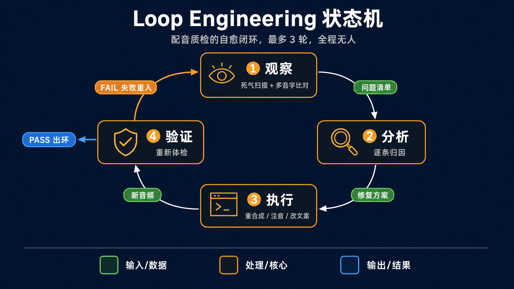
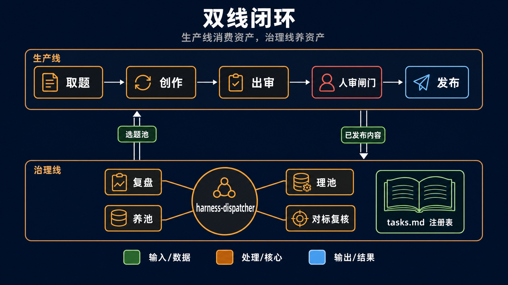

# 讲义：Loop Engineering，用我的抖音自动化流水线一次讲明白

> 以本仓库（抖音自媒体双线闭环流水线）为案例的技术分享讲义。
> 配图位于 assets/ 目录（gpt-image-2 生成），各图的提示词存于 assets/prompts/，重制配图改提示词后按 assets/batch.json 重跑即可。

**适用场景**：15-25 分钟抖音技术分享视频（口播 + 网页演示录屏）
**目标听众**：用过 Claude Code / Cursor 的工程师，想从"跟 AI 聊天"升级到"让 AI 自己跑"
**案例仓库**：本人的抖音自媒体生产仓库（非代码项目，一条内容流水线）

## 开篇概览

本节目标：让观众建立 Loop Engineering 的工程视角，看待 AI 协作不再是"怎么写更好的 Prompt"，而是"怎么设计一个让 AI 自己跑完整循环的执行环境"。并且用一个**非代码业务**证明：这套方法不只能管代码仓库，还能管真实业务。

**我实现的效果**（开场直接亮数据）：

> 定时触发 → AI 自己取选题 → 写口播稿 → 网页演示开发 → 无人录屏 → TTS 配音 → 质检自愈 → 推飞书审核卡 → 我点两次按钮 → 自动发布抖音 → 自动复盘拉数据 → 提议改进 → 我审一眼 → 反哺下一轮选题

| 指标 | 数据 |
|---|---|
| 运行时长 | 2026-06-15 起，一个多月 |
| 已发布作品 | 21 条（含 15 集日更源码解读系列收官） |
| 生产线运行 | 26 次全自动运行（工作日定时触发） |
| 治理线账本 | 35 条运行记录（复盘 / 选题养池 / 对标复核 / 自审） |
| 治理任务 | 5 个启用 + 5 个已写规格待接入 |
| 人的介入 | 每条内容点两次按钮（过审 + 确认发布），加每周扫几份治理报告 |
| 踩坑沉淀 | 18 条教训进登记簿，每条都变成了流水线里的一道闸 |

内容结构：

1. 开场钩子（约 2 分钟）
2. Loop Engineering 是什么（约 3 分钟）
3. 我的系统怎么运作：双线闭环（约 6 分钟）
4. 质量门禁与失败处理（约 4 分钟）
5. 人和 AI 的边界（约 3 分钟）
6. 关键经验 + 怎么开始（约 3 分钟）

## 1. 开场钩子 [约 2 分钟]

**核心结论**：我有一个抖音账号，工作日的视频从选题到成片全程没有我，我只在飞书上点两次按钮。这不是一个更强的 Prompt 做到的，是一套循环做到的。

重点：

- 契子（对着数据表讲）：
  - 你现在用 AI，是不是还在一来一回聊？它写一段你看一段，改三轮才能用？
  - 我这个账号，AI 自己从选题池取题、写口播稿、做网页演示、无人录屏、配音、自己质检、质检不过自己修，修完把成品推到我飞书上。
  - 我全程只干两件事：审核卡上点"通过"，确认发布卡上再点一次。两次按钮，一条视频。
- 抛问题：从"AI 帮我写"到"AI 自己跑完、我只点头"，中间差的不是模型能力，是一层工程设计。这层设计现在有个名字，叫 Loop Engineering。
- 背景一句带过：这个词 2026 年 6 月由 Chrome 工程负责人 Addy Osmani 推广开，火的原因不是概念新，是大家终于有了一个共同的词。

→ 过渡：先说清楚 Loop 到底是个什么东西。

## 2. Loop Engineering 是什么 [约 3 分钟]

**核心结论**：Loop Engineering 的本质是一个状态机，AI 在"观察 → 分析 → 执行 → 验证"四个状态里自主流转，关键在于：验证的输出不是给人看的报告，是驱动下一轮观察的输入信号。

先给四代演进定位（快讲，每代一句话）：

- 第 1 代 Chatbot：你问它答，所有步骤你自己串。
- 第 2 代 Agent：它能执行了，但你得盯着，怕它改错东西。
- 第 3 代 Harness：你给它搭好执行环境、规范、工具和权限，它在框架里干活。
- 第 4 代 Loop Engineering：它自己找活、自己干、自己验收、验收不过自己修，你只做最终决策。

然后用我流水线里真实的一环讲状态机，配音质检循环：

- **观察（Observe）**：配音合成完，AI 跑 dubbing-check 体检：ffmpeg silencedetect 扫每段 mp3 的异常静音，对照文案查多音字、查段落错位。拿到的是一张机器可读的问题清单，不是"感觉不太对"。
- **分析（Analyze）**：质检 agent 逐条归因。这段 18 个字撑了 6.78 秒还带 1 秒死气，根因是引号和破折号触发了 TTS 的停顿；那个"行"字该读 xíng 读成了 háng，根因是多音字没注音。
- **执行（Execute）**：回判结果不是"不合格"三个字，是每条问题带具体改法：这段加 depause、那个字注音进配置、这段改文案解两读冲突。主流程按改法重新合成。
- **验证（Verify）**：重新体检。PASS 就进入下一环节；FAIL 就把新问题清单带回观察，开下一轮，最多 3 轮。

关键点（放慢讲）：**Verify 的输出是下一轮 Observe 的输入**。silencedetect 的扫描结果驱动着下一轮修复，整个回路里没有人。这就是"Loop"和"让 AI 干活"的本质区别：不是它会不会干，是它干完之后信号流向哪里。流回它自己，就是循环；流到你面前等你看，就还是第 2 代。

→ 过渡：一个质检环只是零件。真正值钱的是把很多个这样的环，组织成一个系统。看我的整体架构。

## 3. 我的系统怎么运作：双线闭环 [约 6 分钟]

**核心结论**：整个系统是三层嵌套的循环：小环管单条内容的质量自愈，中环是生产线和治理线的日常运转，大环把发布后的真实数据变成下一轮选题的依据。生产线消费资产，治理线养资产，两条线咬合成一个会自己变聪明的系统。

（流程条：定时触发 → 取题 → 创作（内含质检小环）→ 出审 → 人审 → 发布 → 复盘 → 变更提议 → 人审 → 改大脑 → 反哺选题打分）

### 3.1 生产线：每天造一条内容，停在人审 [约 2 分钟]

工作日定时任务读一个入口文件 daily-run.md，五步：

1. 读账号大脑 brain/（定位、人设、风格、对标），这是所有决策的硬约束。
2. 取题：优先取我钦点的 next_up 指针，没有就按选题池里的评分取最高。**池子空了不硬造题，停产并立刻通知我**。
3. 创作：口播四件套。文章变成点击驱动的网页演示 → 无人录屏 → TTS 逐段配音 → 配音质检循环（就是第 2 节那个小环）。
4. 出审：终检闸全过之后，成品推飞书审核卡。
5. 停。**全自动只到这里，发布必须过人审**。

为什么停在人审：发布是不可逆动作，一条烂视频发出去，撤回的成本远大于审一眼的成本。这个判断第 5 节展开。

### 3.2 治理线：没人催、但断供才痛的活 [约 2 分钟]

生产线只管今天这一条。但有些活是没有 deadline 的：

- 选题池不补水会烂。实证：我曾经 24 天没跑选题调研，9 条选题全过期，生产线直接断粮。
- 对标打法会过时。AI 圈几周一变，拿一个月前的爆款打法给今天的选题打分，分数本身就是错的。
- 发布完没人看数据，打分规则就永远停在拍脑袋的假设上。

这类活的共同点：**平时没人催，断供的时候才知道痛**。所以单独成一条治理线，时间驱动、独立调度：

- 任务注册表 tasks.md 里声明每个任务的触发条件：复盘走事件触发（发布后 24h/72h/7d 三个窗口），选题养池每 2 天，理池撞题每 7 天，对标复核每 30 天。
- 调度器 harness-dispatcher 只干一件事：读注册表，评估谁到点了，派给对应的执行 skill，收回执行报告记账。
- **调度和执行解耦：加一个治理任务，只在注册表里加一段配置和一张任务卡，调度器一行不改。**
- 治理线铁律：**只产报告和变更提议，不自动改任何东西**，人审通过才应用。

### 3.3 大环：系统怎么自己变聪明 [约 2 分钟]

最值钱的是这个环，讲慢一点：

1. 视频发布后 24 小时、72 小时、7 天，复盘任务自动到点，拉创作者中心后台数据。
2. 用传播漏斗归因：这条视频漏在哪一环？是封面没人点，还是开头 3 秒划走，还是完播了不关注。
3. 归因产出**大脑变更提议**：比如"实测对比类选题完播率显著高于纯资讯类，建议上调该维度打分权重"。
4. 我审一眼，采纳的写进账号大脑 brain/benchmarks.md。
5. 下一轮选题打分，用的就是新权重。**上周的真实数据，决定了下周做什么题**。

两个设计决策值得点出来：

- **受众信号只有复盘这一条来路**。选题端不爬抖音，情报只从技术圈信源来（X/Reddit/HN/GitHub/arxiv）。选题管"什么值得讲"，复盘管"观众爱看什么"，两个信号不混。
- 治理线还有个元层任务 account-audit：每 30 天读自己的运行账本，统计每个任务的执行数、成功率、人采纳率，按一张钉死的限幅表微调治理线自己的参数。**连"系统自我调整"这件事本身，也有一张人审过的边界表管着**。这个第 5 节接着讲。

→ 过渡：循环要敢放手让它自己转，前提是转错的时候兜得住。看质量门禁。

## 4. 质量门禁与失败处理 [约 4 分钟]

**核心结论**：验证做得越硬，人需要盯的就越少。我的四条门禁原则，每一条背后都是一次真实翻车。

重点（每条都是"坑 + 规则"的结构，坑是故事，规则是现行闸）：

- **所有检查一次性前置，不分轮反应式修**。早期一条视频钩子炸一轮、封面打回一轮、音画不符一轮、配音死气又一轮，有的问题过审后才发现，反复重渲染。现在终检闸 A 到 G 七道检查全过才允许出审：音画一致抽帧对照、死气扫描、封面规范、发布物料齐备，一项不过不交审。
- **别信 exit code，信复扫**。最险的一次：批量去死气脚本原地读写同一个文件，ffmpeg 打开输出即截断输入，17 段全部静默失败，命令一个错没报，时长一点没变，64 处死气全留着。只看"命令没报错"就会带着废品出审。规则改成：处理完必须用检测工具复扫一遍，验证问题数归零才算过。**验证要独立于执行，执行说成功不算，检测说干净才算**。
- **失败不静默，阻塞即上报**。选题池空了之后，流水线连续 6 天空跑，每天老老实实写本地日志"无题可取"，喊了 6 天没人看见。现在是铁律：凡导致停产或挂起的事件，必须推飞书通知到人，写清事件、根因、需要人做什么。**只写本地日志不算上报**。对应参考做法里"失败提 Draft MR 而不是静默丢弃"，一个意思：失败要变成显式信号，不能变成沉默。
- **卡住就降级持有，不硬闯**。TTS 余额耗尽会返错误码卡死配音。现在配音前先单段试探余额，真没钱了就把这条内容停在"就差配音"的状态，推飞书报充值，不带病推审。**循环要能识别自己修不了的问题，把它交出来，而不是硬闯或者假装成功**。

→ 过渡：门禁管的是 AI 自己能修的。还有一类问题 AI 永远不该自己拍板，这就是边界问题。

## 5. 人和 AI 的边界 [约 3 分钟]

**核心结论**：一句话判断标准：**不可逆动作和价值判断归人，可逆的机械动作归 AI**。边界清楚，人才敢放手；边界模糊，就退化成 AI 帮你写、你帮 AI 收尾。

我系统里三道人闸，位置都是按这个标准放的：

- **闸 1，内容审核卡**：视频发出去就收不回，且"这条内容好不好"是价值判断，机器验不了。所以出审必停，人点头才走。
- **闸 2，确认发布卡**：过审之后，最终发布物料（标题、话题、封面、排期、完整发布命令）再推一次飞书，人再点一次才真发。发布前必须 dry-run，把即将执行的命令原样亮给人看。**不可逆动作，宁可多点一次**。
- **闸 3，治理线 report-only**：复盘再有把握，也只能提议改大脑，不能直接改。因为账号大脑是所有下游决策的依据，改错一条打分规则，污染的是之后每一轮选题。

反过来，这些完全放给 AI，不设人闸：

- 选题入池、过期清扫：规则人审钉死过，执行是机械的，错了可回滚。
- 质检自愈 3 轮、发布失败原样重试一次：可逆，有上限。
- 治理线参数微调:account-audit 可以自动调任务间隔和权重，但被一张**限幅表**钉死。可调的参数、可调的范围、单次步长，全列成表；表外的动作，比如停用一个任务、大幅跳变，一律降级为提议交人审。还有一条熄火线：单任务运行记录不足 5 条，只出"样本不足"报告，不调参。**小样本上的自动调参不是智能，是抖动**。

点题：Loop Engineering 不是把人赶出循环，是把人从循环的每一步，移到循环的边界上。人的判断力是系统里最贵的资源，应该全部花在不可逆决策和价值判断上，而不是花在盯着 AI 干活上。

→ 过渡：最后，如果你想在自己的项目里搭一套，我的路径和几条直接来自翻车的经验。

## 6. 关键经验 + 怎么开始 [约 3 分钟]

**核心结论**：先把验证做硬，再从最安全的环节开始放手，让失败日志驱动迭代。循环是长出来的，不是一次设计出来的。

怎么开始，三步：

- **第一步，把验证配硬**。这步不可跳过。代码项目是 tsc + lint + 测试；我这种内容项目是 silencedetect、抽帧对照、物料完整性检查。**AI 自愈的精度上限，就是你验证工具的覆盖度**。验证是软的，循环就只是把错误自动化了。
- **第二步，从最安全的环节起步**。我不是一天搭成这样的：先让 AI 只管创作、我人肉串流程；跑顺了把质检交给它；再跑顺了才敢把取题和调度交给它。治理线也一样，先启用最机械、最可回滚的任务，攒了信任再扩。
- **第三步，让教训变成闸**。每次翻车，故事登记进教训簿，规则落进对应环节的检查清单，下次这类错就过不了闸。我的登记簿现在 18 条，每条都是一次真实翻车换来的。**系统的可靠性不是设计出来的，是每一次失败都被消化成一道闸，攒出来的**。

收尾回顾（对着三环图说）：

- Loop 的本质：状态机 + 验证输出驱动下一轮观察，信号流回 AI 自己就是循环，流到人面前就还是助手。
- 体系的骨架：生产线消费资产，治理线养资产，大环用真实数据反哺决策，注册表让加任务不动调度。
- 敢放手的前提：验证够硬、失败必上报、不可逆动作和价值判断永远留给人。

结尾钩（口播收束）：我的角色现在是什么？循环自己转，我每天点两次按钮，每周扫几份报告，剩下的时间用来干循环干不了的事：决定这个账号往哪走。这就是 Loop Engineering 承诺的东西：**不是 AI 取代你干活，是你终于可以只干值得你干的活**。

## 附：讲义与本仓库文件的对照（备稿用，非口播内容）

| 讲义章节 | 仓库落点 |
|---|---|
| 生产线五步 | `pipeline/daily-run.md`（入口 Prompt），各阶段契约 `pipeline/1~4-*.md` |
| 配音质检小环 | `tts-dub` / `dubbing-check` skill + dubbing-reviewer agent（≤3 轮） |
| 治理任务注册表与任务卡 | `harness/tasks.md`（yaml 机器契约 + 每任务一张五件事任务卡） |
| 调度器 | `harness-dispatcher` skill（触发感知，非加权随机） |
| 大环复盘 | `douyin-retro` skill + `harness/retro.md`，账本 `harness/logs/index.jsonl` |
| 元层自审与限幅表 | `harness/tasks.md` account-audit 任务卡 |
| 终检闸 A-G | `pipeline/2-create.md` 成片终检闸 |
| 教训簿（L1-L18） | `pipeline/lessons.md`，本讲义引用 L4 / L14 / L16 / L9 |
| 人审通道 | `feishu-notify` skill（审核卡 + 确认发布卡两道闸） |
| 账号大脑 | `brain/`（positioning / persona / style-guide / benchmarks / sources） |
