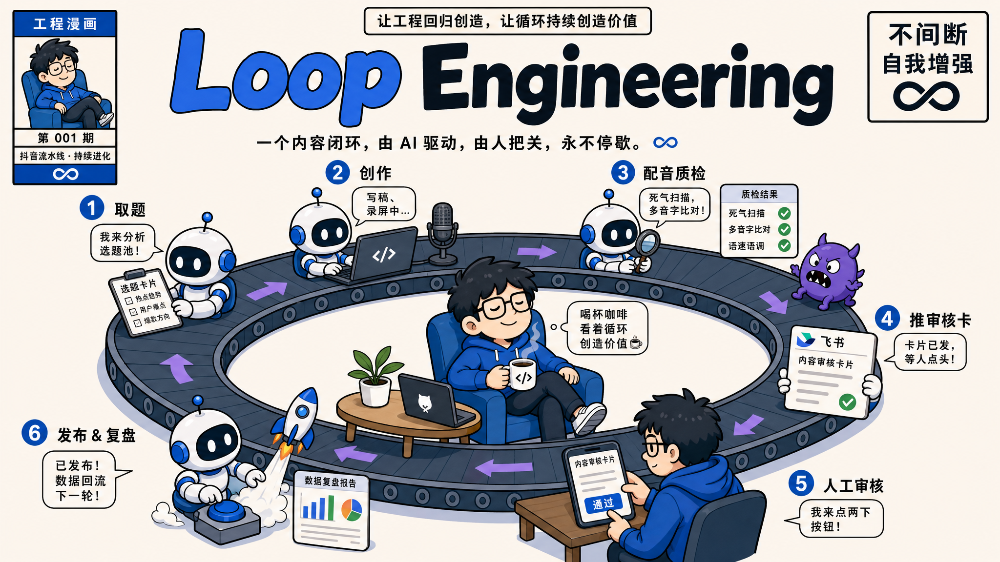
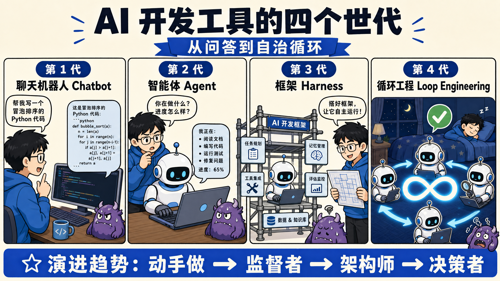
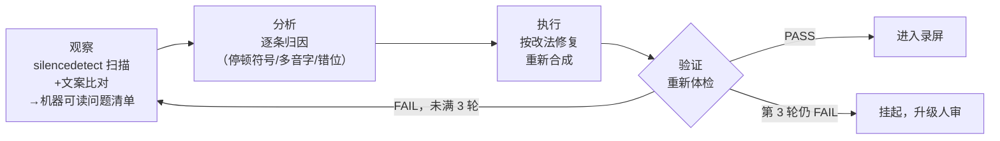
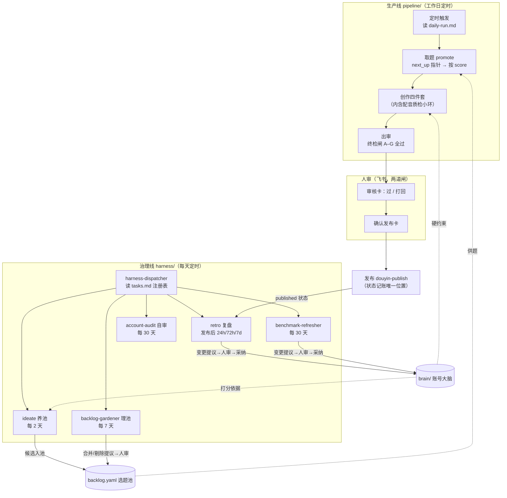
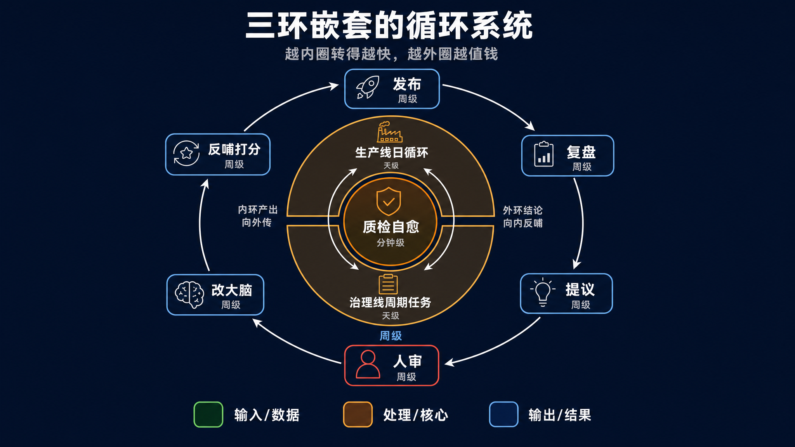
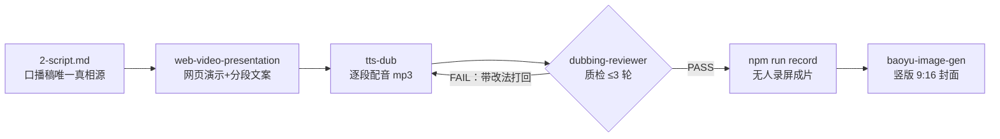
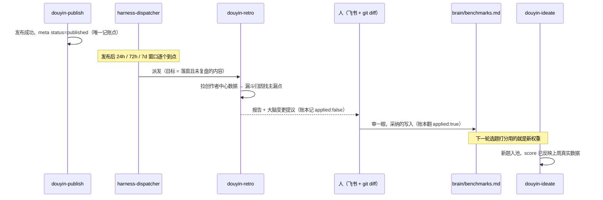
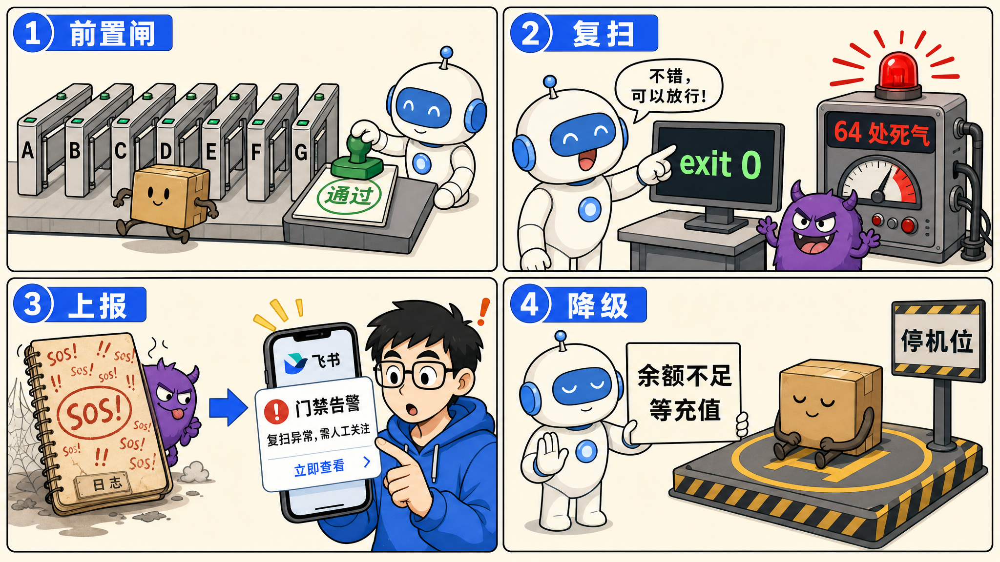
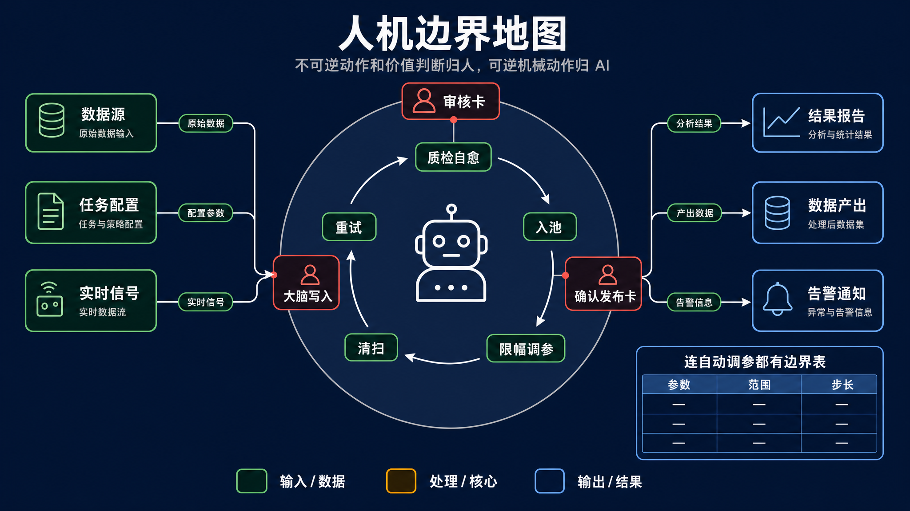
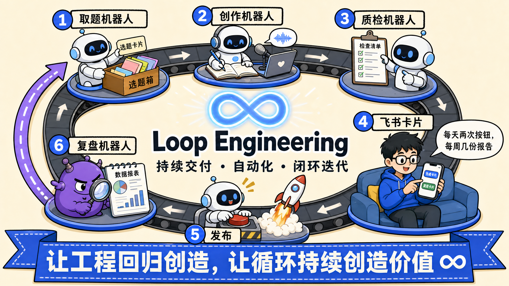

# Loop Engineering 实战：从零搭一条会自己变聪明的内容流水线



我有一个抖音技术账号，工作日的视频从选题到成片全程没有我：定时任务触发后，AI 自己从选题池取题、写口播稿、把稿子做成网页演示、无人录屏、逐段 TTS 配音、自己质检、质检不过自己修，修完把成品推到我的飞书上。我全程只干两件事：审核卡上点「通过」，确认发布卡上再点一次。截至写这篇文章，这套系统跑了一个多月——21 条已发布作品、26 次生产线全自动运行、治理线账本 35 条运行记录、18 条踩坑教训沉淀成流水线里的 18 道闸。

做到这件事的不是一个更强的 Prompt。如果你把「帮我做一条抖音视频」写得再详细，AI 也只能帮你干完一轮活，然后停在那里等你验收——验收出问题你再喂回去，改三轮才能用，本质还是你在跑循环，AI 只是循环里的一个函数。从「AI 帮我写」到「AI 自己跑完、我只点头」，中间差的是一层工程设计：怎么让验证的输出变成下一轮修复的输入，怎么让没人催的维护活自己到点执行，怎么让发布后的真实数据反哺下一轮决策，以及最关键的——哪些动作永远不能交给 AI。这层设计现在有个名字，叫 Loop Engineering（2026 年 6 月由 Chrome 工程负责人 Addy Osmani 推广开）。

这篇文章的任务是两件事：一是把我这套「双线闭环」系统的运行机制讲透——生产线和治理线各自怎么转、靠什么咬合成闭环、每个环节的核心 skill 是什么；二是给出一组可以直接喂给 Claude Code 的搭建 prompt，让你在自己的项目（不限于内容业务，任何有「生产 + 维护」两类活的仓库都适用）里搭出同构的一套。做完之后你应该达到这个状态：定时触发能自动跑到「待人审」为止，治理任务到点自动派发并在账本记账，任何导致停摆的失败都会主动推通知到你面前——文末有一张验证清单逐项确认。

## 一、Loop Engineering：从聊天到循环

### 1.1 四代演进：你现在在第几代

先做个定位。按「人在循环里的位置」，AI 开发工具的用法可以分四代：

- 第 1 代 Chatbot：你问它答，所有步骤你自己串。
- 第 2 代 Agent：它能执行了，但你得盯着——怕它改错东西，每步产出你亲自验收。
- 第 3 代 Harness：你给它搭好执行环境、规范、工具和权限，它在框架里干活，出格的动作被框架拦住。
- 第 4 代 Loop Engineering：它自己找活、自己干、自己验收、验收不过自己修，你只做最终决策。



大部分人卡在第 2 代和第 3 代之间。卡住的原因通常不是模型能力，而是一个具体问题没解决：AI 干完活之后，验证信号流向哪里。流到你面前等你看，就还是第 2 代；流回 AI 自己，才是循环。

### 1.2 用一个真实的环讲状态机

Loop Engineering 的本质是一个状态机：AI 在「观察 → 分析 → 执行 → 验证」四个状态里自主流转，验证的输出不是给人看的报告，是驱动下一轮观察的输入信号。这句话比较抽象，用我流水线里真实的一环——配音质检循环——拆开看：

- **观察（Observe）**：配音合成完，质检 agent 跑体检脚本：用 ffmpeg 的 silencedetect 扫每段 mp3 的异常静音，对照文案查多音字、查段落错位。拿到的是一张机器可读的问题清单，不是「感觉不太对」。
- **分析（Analyze）**：逐条归因。这段 18 个字撑了 6.78 秒还带 1 秒死气——根因是引号和破折号触发了 TTS 的停顿；那个「各十几行」的「行」读成了 háng——根因是多音字没注音。
- **执行（Execute）**：回判结果不是「不合格」三个字，是每条问题带具体改法：这段跑去停顿脚本、那个字把注音写进配置、这段同字两读无解就改文案。主流程按改法修复后重新合成。
- **验证（Verify）**：重新体检。PASS 进入下一环节；FAIL 就把新的问题清单带回观察，开下一轮——上限 3 轮，第 3 轮仍 FAIL 就挂起升级人审，不硬闯。

整个回路的数据流大致如下：



这张图上最重要的一条边是 FAIL 指回观察的那条——Verify 的输出是下一轮 Observe 的输入，silencedetect 的扫描结果直接驱动下一轮修复，整个回路里没有人。另外两条出边同样是设计出来的：PASS 才放行，3 轮打满强制升级——循环必须有硬上限，否则一个修不好的问题会让它无限空转。

这个环在我的仓库里由三个部件组成：`tts-dub`（合成）、`dubbing-check`（体检脚本与检查点定义）、`dubbing-reviewer`（一个只判不改的 subagent）。职责分离是刻意的：reviewer 没有写文件的权限，只产回判报告；修复和重合成全部由主流程做。回判报告大概长这样（示意，字段以你的实现为准）：

```yaml
# dubbing-reviewer 第 1 轮回判（示意）
verdict: FAIL
round: 1
issues:
  - segment: hook/2
    problem: 内部死气 1.02s（silencedetect @4.3s）
    root_cause: 文案含「——」触发 TTS 长停顿
    fix: 跑 depause 去停顿（写临时文件再 move，跑完复扫验证归零）
  - segment: body/7
    problem: 「各十几行」的「行」读作 háng
    root_cause: 多音字未注音
    fix: tts.config.json overrides 给该段注 xíng，重合成此段
```

为什么回判要带「具体改法」而不只是「不合格」——因为改法就是下一轮 Execute 的指令。回判越具体，循环收敛越快；回判只说「有问题」，主流程就得自己重新归因一遍，等于把 Analyze 白做了。

### 1.3 判断标准，一句话

看一个 AI 工作流是不是循环，只看一件事：**验证信号流回 AI 自己，还是流到你面前**。前者是第 4 代，后者无论自动化程度多高，人仍然是循环的一部分。后面所有章节的设计，都是在系统的不同尺度上重复这一个动作：把信号接回去。

## 二、系统总览：双线闭环与三环嵌套

### 2.1 为什么是两条线

单条内容的生产只是系统的一半。跑了一段时间你会发现另一类活：选题池不补水会烂（我的实证：24 天没跑选题调研，9 条选题全过期，生产线直接断粮）；对标打法会过时（AI 圈几周一变，拿一个月前的爆款打法给今天的选题打分，分数本身就是错的）；发布完没人看数据，打分规则就永远停在拍脑袋的假设上。这类活的共同点是**平时没人催，断供的时候才知道痛**——它们没有 deadline，所以永远会被「今天这条内容」挤掉，除非单独成线。

于是系统分成两条线：

- **生产线 `pipeline/`**：消费资产。工作日定时触发，取题 → 创作 → 出审，停在人审。
- **治理线 `harness/`**：养资产。每天定时触发（含周末），复盘已发布内容、给选题池补水、清理撞题、复核对标、自审调参。铁律：只产报告和变更提议，人审后才应用。

生产线消费选题池和账号大脑，治理线保养选题池和账号大脑——两条线通过这两份共享资产咬合。

### 2.2 仓库骨架

整个系统就是一个 git 仓库加一堆 Markdown，没有服务、没有数据库。目录结构：

```plain
douyin-media/
├── brain/                  # 账号大脑：所有决策的硬约束（人审后才可改）
│   ├── positioning.md      #   定位与赛道配比
│   ├── persona.md          #   人设与语气
│   ├── style-guide.md      #   视觉与文案规范
│   ├── sources.md          #   选题信息源清单
│   └── benchmarks.md       #   对标账号与有效打法（复盘反哺的落点）
├── pipeline/               # 生产线：阶段契约 + 编排入口
│   ├── daily-run.md        #   定时 agent 读它执行（入口 prompt）
│   ├── 1-ideate.md ~ 4-publish.md   # 四个阶段契约（输入/输出/状态翻转/闸口）
│   └── lessons.md          #   踩坑教训登记簿（L1~L18）
├── harness/                # 治理线
│   ├── tasks.md            #   任务注册表（yaml 机器契约 + 任务卡）
│   └── logs/index.jsonl    #   运行账本（append-only）
├── content/                # 内容资产
│   ├── _backlog/backlog.yaml   # 选题池（候选选题唯一真相源）
│   └── <日期>/<slug>/      #   每条内容一个目录，meta.yaml 是它的状态机
└── .claude/skills/         # 各环节执行 skill（操作细节住这里）
```

这个结构里有一条不显眼但重要的约定：`pipeline/*.md` 是**阶段契约**，只写输入/输出/状态翻转/闸口；操作细节住对应 skill。同一条规则只写一处，其余引用——两处各写一份必漂移，AI 读到过时的那份就会按错的跑。

### 2.3 整体架构

两条线怎么咬合，一张图看全：



图上有三个约束是文字才能讲清的：

1. **受众信号只有复盘这一条来路**。选题端不爬抖音，情报只从技术圈信源来（X/Reddit/HN/GitHub/arxiv）。选题回答「什么值得讲」，复盘回答「观众爱看什么」，两个信号不混——混了之后选题会退化成追热榜，账号定位就没了。
2. **状态真相源分层**。选题池 backlog.yaml 只管粗粒度三态（idea → picked → published），生产中的细粒度状态（drafting/review/approved/…）只写各内容目录的 meta.yaml，backlog 不镜像。为什么要拆——同一个状态写两处，早晚有一次只翻了一处，之后所有依赖状态的自动化都在错误数据上跑。
3. **发布是状态记账的唯一位置**。meta.yaml、backlog.yaml、dashboard 三处的收尾翻转全部收口在发布成功后一次做完，其它环节不代翻。这条是被「漏翻发生过两次、靠第二天例行任务事后补」的教训逼出来的。

### 2.4 三环嵌套

换个尺度看，整个系统是三层嵌套的循环，每层的周期不同：

- **小环（分钟级）**：单条内容的质量自愈——第一章讲的配音质检循环，以及录屏后的音画体检循环。
- **中环（天级）**：生产线和治理线的日常运转——每天定时触发，各自跑完自己的清单。
- **大环（周级）**：发布 → 复盘拉数据 → 变更提议 → 人审 → 改 brain → 下一轮选题打分。上周的真实数据，决定了下周做什么题——系统靠这个环变聪明，第四章展开。



### 2.5 核心 skill 一览

后面两章会逐个用到，先给全景。每个 skill 是 `.claude/skills/` 下的一个目录，Claude Code 按需加载：

| 环节 | skill | 作用 |
|---|---|---|
| 选题 | `douyin-ideate` | 从技术圈信源抓料，双赛道六维打分，去重后入池，产调研报告 |
| 创作·演示 | `web-video-presentation` | 口播稿 → 点击驱动的网页演示 + 分段文案，`npm run record` 无人录屏 |
| 创作·配音 | `tts-dub` | 分段文案 + 配置 → 每段一个 mp3；多音字注音、单段语速可控 |
| 创作·质检 | `dubbing-check` + `dubbing-reviewer` agent | 体检脚本 + 只判不改的质检判官，≤3 轮自愈循环 |
| 创作·封面 | `baoyu-image-gen` | 竖版 9:16 封面生成，系列用参考图锁定视觉身份 |
| 出审/审批 | `feishu-notify` | 审核卡出站 + 长连接收按钮，审批/打回/确认发布在飞书闭环 |
| 发布 | `douyin-publish` | 薄封装 sau CLI；dry-run 铁律；发布收尾统一记账 |
| 治理·调度 | `harness-dispatcher` | 读注册表，评估触发条件，派活、收报告、记账本 |
| 治理·复盘 | `douyin-retro` | 拉创作者中心数据，漏斗归因，产大脑变更提议 |
| 治理·对标复核 | `benchmark-refresher` | 逐条验证 benchmarks.md 里的打法是否还成立 |
| 治理·理池 | `backlog-gardener` | 扫选题池撞题与已发布重复，产合并/剔除提议 |
| 治理·自审 | `account-audit` | 读运行账本统计成功率/采纳率，按限幅表微调治理线自身参数 |

## 三、搭生产线：从账号大脑到出审

这一章按依赖顺序给四步搭建。顺序不能乱：大脑要在选题池之前（打分依据），选题池要在入口 prompt 之前（取题对象），入口 prompt 要在创作链路之前（编排先于被编排）。每步给一段喂 Claude Code 的 prompt、产物参考、审查点和验证方式。

### 3.1 第一步：写账号大脑 brain/

为什么先做这个——brain/ 是所有下游决策的硬约束：选题打分读 positioning 和 benchmarks，创作读 persona 和 style-guide。没有它，AI 每次运行都在重新猜「这个账号是干什么的」，产出方向随 session 漂移；有了它，每次运行的第一步就是读全部 brain 文件，把约束加载进上下文。

```plain
我要搭一个「账号大脑」目录 brain/，作为内容流水线所有决策的硬约束。请创建以下文件，
每个文件先和我对话问清再落笔：

1. positioning.md：账号定位。问我：账号方向、目标人群、内容赛道配比（如深度:流量 = 6:4）。
2. persona.md：人设与语气。问我：第一人称口吻的具体特征、禁忌（如不写论文腔）。
3. style-guide.md：视觉与文案规范。问我：封面规格（画幅/风格锚点）、字幕字号、标题套路。
4. sources.md：信息源清单。问我：选题从哪些渠道抓（X/Reddit/HN/GitHub/arxiv 等），
   各渠道关注什么关键词。
5. benchmarks.md：对标账号与有效打法。初始只有假设也行，逐条标注「初版假设，按复盘修正」。

约束：每个文件都要能被后续流程直接引用；不要写成愿景文档，每条都要具体到能当检查项用。
```

生成后人工审查两个重点。第一是「能当检查项用」——「内容要有深度」是废话，「技术结论必须可溯源，benchmark 数字必须带出处」才能进检查清单。第二是 benchmarks.md 的假设标注——这个文件后面会被复盘持续修正，初版没标「假设」，三个月后你分不清哪条是拍脑袋、哪条是数据验证过的。

验证：

```bash
ls brain/   # 预期至少 5 个文件：positioning / persona / style-guide / sources / benchmarks
```

### 3.2 第二步：选题池 backlog.yaml 与状态机约定

为什么需要一个池而不是每天现想——现想的题质量随当天信息波动，而且「想题」和「做题」耦合在一起，某天信源没料生产就停摆。池子把两件事解耦：养池是治理线的活（后面 4.2 讲），生产线只管从池里取分最高的。

```plain
在 content/_backlog/backlog.yaml 建选题池，作为候选选题的唯一真相源。要求：

1. 文件头用注释写清状态机约定：backlog 只管粗粒度三态 idea → picked → published
   （异常态 rejected / expired / archived）；生产中的细粒度状态（drafting/review/approved…）
   只写各内容目录的 meta.yaml，backlog 不镜像。
2. backlog 只在两个时点翻状态：promote 时置 picked，发布完成时置 published。
3. 每个条目字段：id（YYYY-MM-DD-NNN）、title、track（depth|traffic）、status、score、
   scores（多维原始分）、reason、links、tags（归一化标签，去重用）、created、
   content_path（promote 后回填）。
4. 顶部加 next_up: null 指针——我钦点下一条要做的题就填 id，取题逻辑最高优先读它。

约束：不要设计我没提的字段；注释里写清「谁在什么时点改哪个字段」，防止多个环节抢着记账。
```

产物的核心部分长这样：

```yaml
# content/_backlog/backlog.yaml（节选）
# 状态分两层：backlog 只管 idea → picked → published；细粒度状态住 meta.yaml，此处不镜像。
# 翻状态只在两个时点：promote(→picked) 与发布完成(→published)。

next_up: null    # 人钦点下一条：填 id 即最高优先；promote 后置回 null

topics:
  - id: 2026-07-08-001
    title: "AI圈突然都在说的 Spec Coding，到底在解决什么问题"
    track: depth
    status: published
    score: 8.4
    tags: [spec-coding, ai-workflow]
    content_path: content/2026-07-08/spec-driven-development/
```

`next_up` 指针值得单独说一句：人挑题只改这一个字段，不靠把条目挪到文件顶部这种「物理位置即语义」的隐式约定——隐式约定 AI 迟早理解歪。

验证：

```bash
grep -c "status: idea" content/_backlog/backlog.yaml   # 池里有候选即可，数字 >0
grep "next_up" content/_backlog/backlog.yaml           # 预期：next_up: null
```

### 3.3 第三步：入口 prompt daily-run.md

为什么编排要写成一个 Markdown 文件而不是代码——因为执行者是 Claude Code，定时任务只需要一句「读 pipeline/daily-run.md 执行」，编排逻辑本身用自然语言写在仓库里，改流程 = 改文档，git diff 可审。这个文件就是生产线的「main 函数」。

```plain
写 pipeline/daily-run.md，作为生产线定时任务的入口 prompt——定时 agent 每个工作日读这个文件执行。
内容五步：

1. 读 brain/ 全部文件 + 项目 CLAUDE.md，作为本次运行的硬约束。
2. 取题：读 backlog.yaml，next_up 非空取它（promote 后置回 null）；否则在 status: idea 中
   按 score 取最高。promote = 翻 picked、建 content/<今天>/<slug>/ 目录、写 meta.yaml 和 1-brief.md。
   无题可取 → 停产，并推即时通讯通知我（写清事件/根因/需要我做什么），不硬造题。
3. 创作：按 pipeline/2-create.md 执行，产出成品。
4. 出审：meta.yaml status=review，推审核卡给我。
5. 到此停止。发布必须等我人工确认，任何情况下不自动发布。

另加一节「阻塞即上报」铁律：凡导致当日无产出或流程挂起的事件，必须推通知到人，
只写本地日志不算上报。

约束：这个文件是编排入口，不要把创作细节写进来（细节住 2-create.md）；每步写清产物和状态翻转。
```

这里有一个坑需要提前说明：「阻塞即上报」不是锦上添花，是必需品。我的流水线曾经因为选题池空了连续 6 天空跑，每天老老实实写本地日志「无题可取」——喊了 6 天没人看见，因为没人每天去翻日志。失败必须变成显式信号推到人面前，沉默的失败等于没失败，直到你发现的那天一起爆发。

验证——手动触发一次完整运行：

```bash
claude -p "读 pipeline/daily-run.md 执行"
# 预期：content/<今天>/<slug>/ 目录出现，meta.yaml 里 status: review，
# 收到审核通知；backlog.yaml 对应条目翻成 picked。全程无发布动作。
```

### 3.4 第四步：创作链路与出审闸

创作是链路里工程量最重的一段。我的形态是口播视频，链路是四件套：



图里有个不显眼的关键约定：口播稿 `2-script.md` 是**唯一真相源**，网页演示内部的文案文件是它的派生件。我踩过的坑：改了演示里的文案没重抽分段文案，结果成片「画面是新钩子、声音是旧钩子」，连过两轮画面截图检查都没抓到——因为截图只证明画面，不证明声音。真相源多于一个，音画不符只是时间问题。

你的内容形态大概率不同（图文、播客、代码产物都行），所以这一步的 prompt 只钉契约结构，链路细节按你的形态填：

```plain
写 pipeline/2-create.md（创作阶段契约）。结构：

1. 输入/输出：输入是 1-brief.md 和 brain/ 的 persona、style-guide；
   输出是成品 + 封面 + 发布物料 4-publish.md。
2. 创作链路按我的内容形态定义（我的形态是：____，请先问清我的工具链再写）。
   链路里凡有多份文案/配置指向同一内容的，指定唯一真相源，其余标注为派生件。
3. 质检循环：核心产物生成后派一个只判不改的 reviewer subagent，回判 PASS/FAIL +
   每条问题的具体改法；FAIL 由主流程修复后重做再送审，最多 3 轮，第 3 轮仍 FAIL
   就挂起升级人审，不强行往下走。
4. 「出审前终检闸」：列一张 checklist，所有检查一次性前置过完才允许出审
   （首版至少含：成品完整性、事实合规、封面达标、发布物料齐备四项，之后每踩一个坑加一道）。

约束：契约只写输入/输出/状态翻转/闸口，操作细节住对应 skill；同一规则只写一处，其余引用。
```

终检闸是这一步的灵魂。我的版本有 A 到 G 七道：声画一致、音频自然度（无 >0.45s 内部死气）、钩子冷启动（第一句自成立，不依赖「上一集」）、事实合规、封面达标、音画同步抽帧、发布物料齐备。为什么强调「一次性前置过完」——早期我是反应式修：钩子炸一轮、封面打回一轮、音画不符一轮、配音死气又一轮，每轮都要重渲染成片，有的问题甚至过审后才发现。检查分散在流程各处，等于每个问题都要单独付一次重渲染的钱；集中在出审前一次过完，重渲染最多一次。

其中 G 闸（发布物料 `4-publish.md` 必须在出审前产出）值得点名。我踩过的坑：出审时没产发布物料，人在飞书点了「通过」，确认发布卡立即报「缺标题、无法发布」——人审的点头作废，流程卡在最接近终点的地方。物料在出审前备齐，人审通过的那一刻发布就是「拼命令 + 点确认」的机械动作。

验证：

```bash
cat content/<今天>/<slug>/meta.yaml
# 预期：status: review，deliverables 列出成品/封面/发布物料且文件都实际存在
ls content/<今天>/<slug>/assets/   # 预期：成品文件 + cover.png
```

## 四、搭治理线：注册表、调度器与大环

### 4.1 治理线的三条设计原则

搭之前先钉三条原则，它们决定了后面所有文件的形态：

1. **只产报告和变更提议，不自动改任何资产**（状态记账例外，如复盘完把 meta 翻 retro_done）。原因：治理任务改的是 brain 这类「所有下游决策的依据」，改错一条打分规则，污染的是之后每一轮选题——半径太大，必须人审。
2. **调度与执行解耦**。加一个治理任务只改注册表，调度器一行不改。原因：治理任务会持续增加（我从 2 个起步，现在 5 个启用 + 5 个写好规格待接入），每加一个都要动调度器的话，调度器很快变成没人敢碰的巨石。
3. **一切运行留痕进账本**。append-only 的 `logs/index.jsonl`，每次任务执行记一行。它既是「periodic 任务距上次运行多久」的判据，也是后面自审任务统计成功率/采纳率的数据源——没有账本，治理线自己就成了没人治理的黑箱。

### 4.2 任务注册表 tasks.md

```plain
建治理线：harness/tasks.md 作为治理任务的唯一注册表。要求：

1. 文件分两部分：顶部一段 yaml 是机器契约（调度器读），下面每个任务一张人读的「任务卡」。
2. yaml 每项字段：task、skill（执行技能名）、enabled、trigger。trigger 支持两类：
   - periodic:<N>d：距上次成功运行 ≥N 天就跑（从运行账本 logs/index.jsonl 里算）；
   - post-publish-window：对已发布内容，在发布后 24h/72h/7d 三个窗口各触发一次。
3. 任务卡固定讲五件事：为什么存在 / 目标怎么选 / 干什么 / 产物与记账 / 人审关注点。
4. 首批只启用两个任务：retro（复盘，post-publish-window）和 ideate（选题养池，periodic:2d）。
   其余想到的任务先写卡、enabled: false——卡就是未来写执行 skill 的规格。

约束：所有治理任务只产报告和变更提议，不自动改任何资产（状态记账例外）；这条铁律写进文件头。
```

我的注册表 yaml 现状（节选）：

```yaml
# harness/tasks.md 顶部 yaml（节选）
tasks:
  - task: retro                    # 复盘：受众信号唯一来路
    skill: douyin-retro
    enabled: true
    trigger: post-publish-window
    windows: [24h, 72h, 7d]

  - task: ideate                   # 选题养池：给生产线补库存
    skill: douyin-ideate
    enabled: true
    trigger: periodic:2d

  - task: backlog-gardener         # 理池：撞题与重复
    skill: backlog-gardener
    enabled: true
    trigger: periodic:7d

  - task: benchmark-refresher      # 对标复核：打法过时检测
    skill: benchmark-refresher
    enabled: true
    trigger: periodic:30d

  - task: account-audit            # 元层：治理线自审
    skill: account-audit
    enabled: true
    trigger: periodic:30d
```

「任务卡五件事」是这个文件里最值得抄的设计。以 ideate 的卡为例，「为什么存在」一栏写的是：选题池是生产线的原料库存，只入不出会烂（实证：24 天没补水 9 条全过期）；耦合在生产线上，生产一换模式保鲜就停摆（实证：系列日更期加空跑期共三周零调研）。每张卡都这样带着实证写动机——半年后你想砍任务瘦身时，能一眼判断哪张卡的动机还成立。「先写卡、enabled: false」的用法也划算：卡就是未来执行 skill 的规格书，想到一个任务先花十分钟写卡登记，接入时间成熟再补 skill 翻 enabled。

### 4.3 调度器 harness-dispatcher

```plain
写一个调度器 skill：harness-dispatcher。职责只有一件事——调度，不执行：

1. 被定时任务或手动触发时，读 harness/tasks.md 的 yaml 注册表。
2. 对每个 enabled 任务评估 trigger：periodic 型读 logs/index.jsonl 找上次成功时间；
   post-publish-window 型扫内容目录的 meta.yaml 找落进窗口且账本里无该(任务,目标,窗口)记录的目标。
3. 到点的任务，派给注册表里声明的执行 skill；没到点的跳过并记原因。
4. 收回每个任务的执行报告，把一行摘要 append 进 logs/index.jsonl。

约束：加新治理任务时只改 tasks.md，本 skill 一行不改——调度与执行必须解耦；
账本只 append 不改写，它是后续自审（统计成功率/采纳率）的数据源。
```

账本每行的样子（真实数据）：

```json
{"ts": "2026-07-19T09:09:00", "task": "retro", "target": "2026-07-16/cc-safety-net", "window": "72h", "result": "report", "report": "logs/2026-07-19-retro.md", "findings": 4, "applied": false}
```

注意 `applied: false` 这个字段——它是治理线铁律在数据层的落点。任务产了变更提议，账本记 applied:false；人审采纳、提议真正写进 brain 之后才翻 true。这个字段让「提议了多少、人采纳了多少」变成可统计的数字，4.5 节的自审就靠它。

验证：

```bash
claude -p "/harness-dispatcher"          # 手动触发一轮调度
tail -3 harness/logs/index.jsonl         # 预期：新增若干行记账；没到点的任务不出现
# 再连跑一次：预期 periodic 任务全部被跳过（距上次成功 <N 天），验证触发判据生效
```

第二条验证别跳过——「连跑两次第二次全跳过」证明的是调度器在读账本判断时机，而不是每次触发就无脑全跑。后者会让 30 天周期的任务天天跑，报告堆到没人看。

### 4.4 大环：复盘怎么把数据变成决策

这是整个系统最值钱的一个环。发布不是终点，是大环的起点：



这条时序里有两个容易走错的点。一是复盘的触发方是调度器而不是发布——发布只负责把状态翻成 published 就退场，窗口到点由治理线自己从 meta.yaml 算出来，两条线之间只靠状态文件通信，没有直接调用；二是从提议到 brain 之间必须经过人这一跳，applied 字段翻 true 的动作和写 brain 的动作是同一次人审的两个产物，缺一个账就对不上。

复盘执行 skill 的搭建 prompt：

```plain
写复盘任务的执行 skill（按你的平台命名，我的叫 douyin-retro）。契约：

1. 目标：status=published 且落进 24h/72h/7d 某窗口、账本里无该(内容,窗口)记录的作品。
2. 拉平台后台数据：曝光、播放、完播率、点赞/评论/收藏/转发、涨粉，
   能拿到同类对标百分位更好。
3. 漏斗归因：逐环对比基线（同类百分位 / 自己历史均值），找出最先低于基线的「主漏点」，
   回答「这条为什么火/不火」——是封面没人点，还是开头 3 秒划走，还是完播了不关注。
4. 产出执行记录报告：数据快照 + 主漏点诊断 + 大脑变更提议（建议怎么改 benchmarks 里的
   打法或打分权重，注明证据）。账本记 applied:false，人审采纳后写进 brain 再翻 true。

约束：绝不自动改 brain——改错一条打分规则污染的是之后每一轮选题；
小样本（播放量三位数）时明确标注「样本不足，不建议归因」，别在噪音上下结论。
```

一条真实形态的变更提议长这样：「实测对比类选题完播率显著高于纯资讯类，建议上调该维度打分权重」。我审一眼，采纳就写进 benchmarks.md——下一轮 ideate 打分时，实测对比类的题分数自然上去。**上周的真实数据，决定了下周做什么题**，这就是「系统自己变聪明」的全部机制，没有任何魔法，就是把信号接回去了。

为什么复盘窗口选 24h/72h/7d 三个点——24h 看冷启动（封面和钩子的问题这时最显），72h 看推荐系统的二轮扩散，7d 收长尾定终局。单点采样会把「慢热」误判成「扑了」。

### 4.5 元层：account-audit

治理线的周期和参数（2d/7d/30d、窗口、权重）全是初始拍脑袋定的。不对着运行数据调，配置在钉下那一刻就被冻结——所以治理线里有一个任务专门治理治理线自己：`account-audit` 每 30 天读账本，统计每个任务的执行数、成功率、人采纳率、逾期积压，然后微调 tasks.md 里的参数。

「AI 自动调自己的调度参数」听起来危险，它被两道机制拴着：一张限幅表（哪些参数可自动调、范围多大、单次步长多少，表外动作一律降级为提议交人审）和一条熄火线（单任务有效记录不足 5 条只出「样本不足」报告，不调参——小样本上的自动调参不是智能，是抖动）。表本身放在第六章，因为它本质是人机边界问题。

## 五、质量门禁：让教训变成闸

**验证做得越硬，人需要盯的就越少。** 这一章四条原则，每条背后都是一次真实翻车。格式统一为「坑 + 现行规则 + 你怎么落同款闸」。



### 5.1 所有检查一次性前置，不分轮反应式修

坑：3.4 节讲过的反应式修——四类问题各炸一轮，反复重渲染，有的过审后才发现。规则：终检闸 A–G 七道检查全过才允许出审，一项不过不交审。落法：把你流程里所有「曾经在下游才发现的问题」抽成检查项，全部挪到出审这一个闸口——闸口越靠后越集中，返工半径越小。

### 5.2 别信 exit code，信复扫

这是 18 条教训里最险的一条，值得完整讲。批量去死气的脚本被 AI 以「原地读写同一个文件」的方式调用（`depause.mjs in.mp3 in.mp3`）——ffmpeg 打开输出文件的瞬间就把输入截断了，17 段全部静默失败：命令一个错没报、exit code 全 0、文件时长一点没变，64 处死气原样留着。只看「命令没报错」，就会带着废品出审。

现行规则两条：处理必须写临时文件再 move；跑完必须用检测工具复扫一遍，验证问题数归零才算过。

```bash
# 修复后复扫（示意）：统计所有段的内部静音 >0.45s 的次数
for f in public/audio/*/*.mp3; do
  ffmpeg -i "$f" -af silencedetect=n=-35dB:d=0.45 -f null - 2>&1 | grep -c silence_start
done
# 预期：全部输出 0。非 0 说明修复没生效——不管 exit code 说什么
```

抽象成一句话：**验证要独立于执行。执行说成功不算，检测说干净才算。** 这条在代码项目里对应的是「AI 说改好了不算，测试跑绿才算」——同一个原理。

### 5.3 失败不静默，阻塞即上报

坑：3.3 节讲过的 6 天空跑。规则：凡导致停产或挂起的事件，必须推即时通讯通知到人，写清事件、根因、需要人做什么；只写本地日志不算上报。落法：给你的流水线接一条到人的推送通道（飞书/Slack/邮件都行），并把「什么事件必须走这条通道」写成清单钉进入口 prompt——留给 AI 自由裁量，它会倾向于「记录下来就算处理过了」。

### 5.4 卡住就降级持有，不硬闯

坑：TTS 服务余额耗尽返错误码，配音卡死，整条「配音 → 出审」链路挂起。规则：配音前先单段试合成探余额；真没钱，就把这条内容停在「就差配音」的中间状态（status=drafting），推通知报充值，不带病推审。落法：给流程里每个依赖外部服务的环节想一个「优雅持有」的状态——循环要能识别自己修不了的问题，把它交出来，而不是硬闯或者假装成功。

### 5.5 教训簿：故事和规则分家

四条原则怎么持续长出来——靠一个登记机制。每次翻车，「故事」登记进 `pipeline/lessons.md`（一张表：编号、坑、现行规则落点），「规则」落进它该在的 SOP 或 skill，标 Lx 回指登记簿：

```markdown
| # | 坑（出处） | 现行规则落点 |
|---|---|---|
| L16 | 批量去停顿原地写，ffmpeg 静默失败，17 段死气全留、exit 0 | 2-create.md：必写临时文件再 move + 跑完必复扫验零 |
```

故事和规则分家是刻意的：故事只写一处（不然每个 SOP 都复述一遍坑的来龙去脉，文档膨胀），规则住在执行时会被读到的位置（不然教训躺在登记簿里，下次照样踩）。我的登记簿现在 18 条——**系统的可靠性不是设计出来的，是每一次失败都被消化成一道闸，攒出来的。**

## 六、人机边界：三道人闸与限幅表

### 6.1 判断标准

一句话：**不可逆动作和价值判断归人，可逆的机械动作归 AI。** 边界清楚，人才敢放手；边界模糊，就退化成 AI 帮你写、你帮 AI 收尾——你不知道哪步会出格，只好每步都盯。

### 6.2 三道人闸，位置都是论证出来的

- **闸 1，内容审核卡**：视频发出去就收不回（不可逆），且「这条内容好不好」是价值判断，机器验不了——终检闸能验「死气归零」，验不了「这个选题讲得值不值」。所以出审必停。
- **闸 2，确认发布卡**：过审之后，最终发布物料（标题、话题、封面、排期、完整发布命令）再推一次，人再点一次才真发。发布前必须 dry-run，把即将执行的命令原样亮给人看。过审 ≠ 发布授权——不可逆动作，宁可多点一次。
- **闸 3，治理线 report-only**：复盘再有把握也只能提议改 brain，不能直接改。理由第四章讲过：brain 是所有下游决策的依据，错误会被每一轮选题放大。

### 6.3 放权清单与限幅表

反过来，这些完全放给 AI，不设人闸——注意每条都能对上「可逆 + 机械 + 有上限」：

- 选题入池、过期清扫：规则人审钉死过，执行是机械的，git 里可回滚。
- 质检自愈：3 轮上限。发布失败重试：原样一次。
- 治理线参数微调：account-audit 可以自动调，但被这张限幅表钉死（真实全表）：

| 参数 | 当前 | 可自调范围 | 单次步长 |
|---|---|---|---|
| benchmark-refresher 间隔 | 30d | 14~60d | ×1.5 或 ÷1.5 |
| backlog-gardener 间隔 | 7d | 7~30d | ×1.5 或 ÷1.5 |
| ideate 间隔 | 2d | 锁定（生产线消费节奏依赖它，动它=动生产，人审） | - |
| retro 窗口 24h/72h/7d | - | 锁定（复盘方法论，不是调度参数） | - |
| 任务池权重 | 预留 | 1~12 | ≤±3 |

配套的调整规则也全是显式的：连续 2 轮成功且零发现 → 间隔放宽一档；出现人采纳的重要提议 → 收紧一档；采纳率 <30%（样本 ≥5）→ 不自动动，提议降频或修任务卡；连续 3 次执行失败 → 提议停用（不自动停——任务少且各有独立职责，误停伤闭环）。表外动作一律降级为提议交人审，另有熄火线：单任务记录不足 5 条只出「样本不足」报告。

这张表值得抄的不是数值，是形态：**连「系统自我调整」这件事本身，也有一张人审过的边界表管着。** 给 AI 放权不是二选一（管死 / 放飞），是把「放到什么程度」参数化成一张可 diff、可回滚的表。



点题：Loop Engineering 不是把人赶出循环，是把人从循环的每一步，移到循环的边界上。人的判断力是系统里最贵的资源，应该全部花在不可逆决策和价值判断上，而不是花在盯着 AI 干活上。

## 七、怎么开始 + 全文验收

### 7.1 三步起步路径

我的系统不是一天搭成的，照它的生长顺序走比照终态抄更稳：

1. **先把验证配硬**——这步不可跳过。代码项目是 tsc + lint + 测试；内容项目是 silencedetect、抽帧对照、物料完整性检查。**AI 自愈的精度上限，就是你验证工具的覆盖度**——验证是软的，循环只是把错误自动化了。
2. **从最安全的环节起步**。我最初只让 AI 管创作、我人肉串流程；跑顺了把质检交给它；再跑顺了才敢交出取题和调度。治理线同理：先启用最机械、最可回滚的任务（我首批是 retro 和 ideate），攒了信任再扩。
3. **让教训变成闸**。翻车 → 故事进登记簿 → 规则落进检查清单 → 下次这类错过不了闸。循环是长出来的，不是一次设计出来的。

### 7.2 验收清单

对照引言的承诺逐项验：

| 模块 | 验证方式 | 预期结果 |
|---|---|---|
| 账号大脑 | `ls brain/` | 5 个文件，条条能当检查项用 |
| 选题池 | `grep -c "status: idea" content/_backlog/backlog.yaml` | >0，且文件头有状态分层约定 |
| 生产线全链路 | `claude -p "读 pipeline/daily-run.md 执行"` | 产出内容目录，meta status=review，收到审核通知，**无发布动作** |
| 出审终检闸 | 查看当日内容 meta.yaml | 各闸检查结论有留痕，物料文件实际存在 |
| 治理调度 | `claude -p "/harness-dispatcher"` 连跑两次 | 第一次到点任务执行并记账；第二次 periodic 任务全跳过 |
| 运行账本 | `tail harness/logs/index.jsonl` | 每次执行一行，含 applied 字段 |
| 阻塞上报 | 把选题池临时清空再触发生产线 | 收到停产通知（事件/根因/要人做什么），而非仅本地日志 |
| 大环闭合 | 一条内容发布 7 天后 | 复盘报告 + 变更提议出现，账本 applied:false 待你审 |

### 7.3 小结

几个决策值得带走：验证信号流回 AI 自己才是循环，流到人面前就还是助手；「没人催、断供才痛」的活必须单独成线，靠注册表 + 调度器解耦地跑；状态真相源分层、记账收口单点，是所有自动化不跑飞的地基；验证独立于执行，别信 exit code 信复扫；不可逆动作和价值判断永远留给人，放权用限幅表参数化。

关键产出文件清单（搭完你的仓库应该有这些）：

+ `brain/`——账号大脑，5 个文件，所有决策的硬约束
+ `content/_backlog/backlog.yaml`——选题池，粗粒度三态 + next_up 指针
+ `pipeline/daily-run.md`——生产线入口 prompt，五步停在人审
+ `pipeline/2-create.md`——创作契约，含质检循环与出审终检闸
+ `pipeline/lessons.md`——教训登记簿，故事一处、规则回指
+ `harness/tasks.md`——治理任务注册表，yaml 契约 + 五件事任务卡
+ `harness/logs/index.jsonl`——运行账本，append-only
+ `.claude/skills/` 下各执行 skill——调度器、复盘、养池、自审

从这里往下走，你自然会遇到三个方向：一是把人审通道做成闭环（我用飞书长连接收按钮，打回可以选「自动重做」直接起新一轮创作）；二是接更多治理任务（我有 5 张写好规格的任务卡待接入：复盘欠账回收、死链检查、文档同步、事实过时审计、封面风格巡检——每张卡都是十分钟登记、成熟再接）；三是当任务多到周期调度不划算时，启用加权池调度（同质的海量 per-item 维护债按权重随机摊开跑）。这三个方向的共同前提，仍然是那句话：验证够硬，才敢放手。


