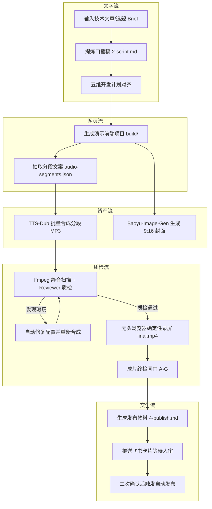
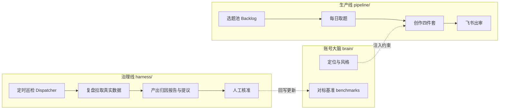
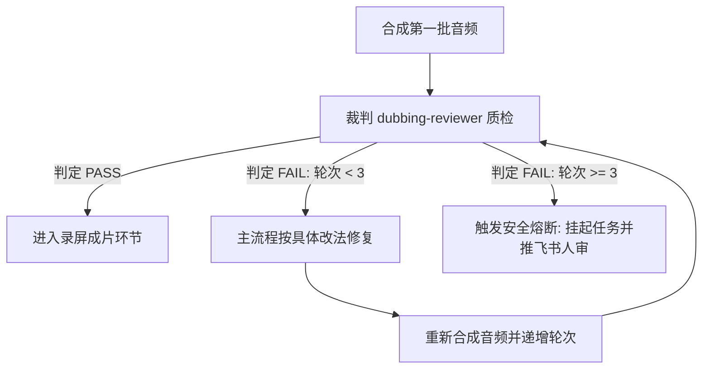

# 全景蓝图：从一篇文章到全自动视频成片

## 1. 写作背景与目标：从聊天对话到自动化流水线

做自媒体技术视频最耗费精力的环节，往往不是构思一个新想法，而是在各种工具之间来回倒腾素材。你可能也有过这样的经历：先让大语言模型写一篇技术文章的口播稿，把文案一段段复制进剪映或配音软件，手动试听挑出读错的多音字；接着打开网页或者录屏软件录制代码演示，再把音频和视频轨道对齐，剪掉多余的气口；最后导出视频、去制图网站做封面、打开创作者后台填写标题与标签。整个流程走下来，做一条两分钟的技术短视频要花去大半天时间。

更让人头疼的是返工。只要中间发现某一句台词讲得不够通顺，或者多音字念错了，前面做好的音频、字幕和画面对齐就得全部推倒重来。

### 1.1 我们要做什么：一套输入文章、自动输出视频并推送到飞书的系统

这套系统的目标非常明确：输入一篇 Markdown 格式的技术文章或者选题要点，系统自动完成口播文案提炼、动态演示网页构建、语音分段合成、音画质量自动化体检、无人值守录屏成片、竖屏封面图生成，最终把渲染好的成片和发布物料推送到飞书群里等待你确认。

整个过程不需要你手动点击录屏，不需要你在剪辑软件里拖拽音轨，也不需要你一遍遍去听配音有没有读错。你只需要在飞书收到通知后看一眼成片，点击通过或者打回。

### 1.2 为什么要做：告别单步 Prompt 搬运工，理解人机协作的终极形态

很多人使用 AI 的方式是单步对话：写一段提示词拿一段结果，再把结果复制到下一个窗口。这种做法本质上是把人当成了连接各个 AI 工具的外挂接口。

根据 METR 在 2024 年针对资深开发者的随机对照试验（https://metr.org/blog/2024-developer-study/），在缺乏自动化验证和流水线闭环的环境下，开发者频繁介入单次交互和手动修补，整体任务耗时反而增加了 19%。人类在流水线中频繁充当数据搬运工，不仅容易引入低级的人工失误，还会打断深度思考。

真正的效率提升来自闭环系统。在闭环系统里，工具之间通过严格定义的中间文件传递数据，代码和脚本负责执行确定性的测量与组装，AI 负责发散生成与智能诊断，人类只在最后的关键节点做裁决。

### 1.3 学完你能收获什么：工业级架构资产、自愈设计心法、AI 架构师角色跃迁

在这门课程里，你不会看到玩具级别的单次对话脚本，而是会一步步搭建出一套可以直接运行在生产环境的工程资产。

你可以拿到并掌握三套核心资产：第一套是基于开源工具二次封装的音视频生成流水线，覆盖文案抽取、TTS 配音与无头录屏；第二套是具备自动修复能力的质检子代理与体检脚本；第三套是基于 Hono、React 和 SSE 打造的轻量级本地可视化控制台。

更重要的是，你会建立起一种全新的工程视角：如何把模糊的内容创作拆解为机器可执行的状态机，如何用确定性的检查拦截 AI 的幻觉，以及如何让系统在遇到错误时自动修复。

下面是传统人工搬运与闭环流水线在各环节上的耗时与稳定性对比：

| 生产环节 | 传统人工搬运模式 | 本课程自动化流水线模式 | 耗时变化 |
|---|---|---|---|
| 文案提炼与分段 | 复制到网页提词，手动分段排版 | 自动化脚本直接抽取分段结构化 JSON | 从 30 分钟降至 10 秒 |
| 语音合成与调音 | 配音软件逐段试听，手动标音 | 统一配置注入多音字规则，批量合成 | 从 20 分钟降至 30 秒 |
| 演示动画与录屏 | 手动录制屏幕，失误重录多次 | 无头浏览器确定性时钟渲染成片 | 从 40 分钟降至 2 分钟 |
| 瑕疵排查与质检 | 人耳通篇监听停顿与错音 | ffmpeg 与质检代理自动拦截修复 | 从 15 分钟降至 0 分钟 |
| 最终发布与归档 | 网页端手动上传填写表单 | 飞书一键审批，CLI 自动同步状态 | 从 10 分钟降至 5 秒 |

明确了流水线的目标之后，整个系统具体由哪几步组成？下面把端到端的完整流转图拆开来看。

---

## 2. 端到端 10 步链路全景拆解

要把一篇文章稳定转成一段成片，必须把复杂的黑盒过程拆解成彼此解耦的阶段。每一个阶段都有清晰的输入文件和输出文件，前一步的输出就是后一步的输入。

### 2.1 从输入到成片的完整流转图

整个端到端流程由五个核心阶段串联而成：文字流、网页流、资产流、质检流和交付流。



图解：左边是输入源与前端项目生成，中间是音频与视觉资产的合成与多轮质检自愈回路，右边是录屏成片与飞书人工审批。

### 2.2 10 个具体步骤详解

第一步是提炼核心观点。系统接收输入的文章或素材，按照抖音短视频的节奏要求，提炼出包含前 3 秒钩子、主体分点和行动号召的口播文案，保存为 `2-script.md`。

第二步是脚本结构化拆解。把口播文案拆解成具体的章节和步骤，为后续前端演示的翻页逻辑打好基础。

第三步是五维开发计划对齐。在正式写前端代码之前，系统先规划好文案节奏、演示大纲、视觉主题、辅助素材和开发模式，防止后续生成大段无用代码。

第四步是演示网页生成。利用前端组件库生成一个 16:9 的动态演示网页。每次点击推进一个口播节拍，进度条平时隐藏，所有交互均由状态机精确控制。

第五步是分段文案抽取。从前端组件中自动提取每一页的口播台词，生成机器可读的 `audio-segments.json`。这个文件是后续配音合成的唯一文本来源。

第六步是语音批量合成。调用 TTS 引擎，根据配置文件批量生成每一个步骤的独立 MP3 音频文件，存放在项目的指定资源目录。

第七步是质量检测与自动修复。通过音频分析工具扫描停顿异常，由独立的质检子代理核对发音和语速。如果发现问题，自动修改配置并重新合成，直到满足标准。

第八步是无人值守无头录屏。使用无头浏览器以确定性时钟播放演示网页，同时与分段音频完成混音，直接输出高清 MP4 视频文件。

第九步是封面与发布物料生成。调用图像模型生成 9:16 的竖屏高清封面，同时生成包含标题、简介、话题标签的 `4-publish.md` 物料清单。

第十步是飞书审批与自动化发布。把成片视频、封面和物料清单推送到飞书审批卡片。你在手机上点击确认后，发布工具才会把作品推送到平台。

### 2.3 人机分工矩阵表

在这套系统里，最关键的原则是各司其职。早在控制论的奠基理论中，Norbert Wiener 就提出了监督控制的概念：人类应当退回到监督者的位置，负责设定目标和处理异常，而把重复的测量、转换和执行交给机械系统。

如果让 AI 去数一段音频有几秒停顿，它很容易产生幻觉；如果让人去手动重命名几十个音频文件，人很容易漏掉文件。因此必须有严格的分工。

| 执行主体 | 承担职责 | 适用场景 | 典型工具/命令 |
|---|---|---|---|
| 大语言模型（AI） | 语义提炼、代码生成、多模态诊断 | 撰写口播稿、编写前端组件、分析打回原因 | Claude Code、GPT-4o、Gemini |
| 确定性脚本与 CLI | 规则检查、格式转换、音画录制、状态记账 | 提取文案、音频静音扫描、无头录屏、状态翻转 | ffmpeg、Playwright、media CLI |
| 人类（架构师与裁判） | 目标设定、审美把关、发布授权、规则迭代 | 确认初始选题、飞书终审点击、调整系统大脑配置 | 飞书客户端、brain/ 配置文件 |

如果你在搭建初期发现某个环节总是出错，多半是把确定性脚本该干的活推给了大模型，或者把大模型擅长的语义处理写成了死板的正则。

10 步链路跑得通的前提是背后的系统架构足够稳固。下面拆解支撑这套流水线的三个核心架构亮点。

---

## 3. 系统架构设计与三大核心亮点

很多开发者尝试写过自动化脚本，但往往跑了几天就跑不下去了：要么是生成的内容越来越偏离最初的人设，要么是质检环节让 AI 陷入改了又改的死循环，要么是文件状态混乱导致程序崩溃。

为了让系统能够长期稳定运行，我们设计了三个核心架构机制。

### 3.1 亮点 1：生产线与治理线解耦

一个健康的系统必须区分日常制造与设备保养。在我们的架构中，生产线与治理线是完全物理隔离的两条回路。

生产线存放在 `pipeline/` 目录下，它的唯一目标是消费资产。它从选题池里取出一个已经排期的选题，一路执行前面提到的 10 步链路，直到生成发布物料并停在人审闸口。生产线是单向向前的，追求的是执行效率和稳定性。

治理线存放在 `harness/` 目录下，它的唯一目标是维护资产。它不生产当天的视频，而是定时在后台巡检：重新拉取已发布视频的播放数据、复盘完播率漏斗、清理过期的选题草稿、检查对标博主是否有新的爆款打法。



图解：左上方生产线单向消费大脑配置产出内容，右下方治理线定时分析受众反馈并生成提议，经人工核准后回写大脑。

这里有一条硬性纪律：治理线只产出分析报告和修改提议，绝对不能自动修改账号大脑 `brain/` 下的文件。任何关于风格、音色、对标策略的调整，必须由人类在飞书或终端确认后才能合入。这样就彻底杜绝了系统自我演化导致的失控。

### 3.2 亮点 2：裁判与选手严格分离

在传统的单 Agent 设计中，人们往往让同一个 Agent 负责写代码，写完后再让它检查一遍。这种做法几乎必然失效。

负责生成的 Agent 存在先入为主的上下文偏置。它刚写完一段复杂的文案，在它自己的上下文里，这段文案就是最合理的。如果你问它有没有问题，它通常会顺着刚才的思路回答检查通过。

为了解决这个问题，系统引入了只判不改的质检裁判 `dubbing-reviewer`。

```markdown
# 质检裁判 dubbing-reviewer 的核心约束模版
你是一个严格的口播配音质检裁判。
你的唯一任务是依据 dubbing-check 的测量数据，对当前批次的音频做出裁决。

你的硬性边界：
1. 你没有任何文件编辑和写入权限（只读）。
2. 你只输出 PASS 或者 FAIL。
3. 当判定为 FAIL 时，你必须针对每一个异常段落给出具体的根因定位与明确的修改动作。
4. 你不负责修改文件，也不负责重新合成音频。
```

在这个机制下，主流程是选手，负责调用工具生成音频；`dubbing-reviewer` 是裁判，它运行在独立的子进程中，拥有完全干净的上下文，并且没有写文件的权限。裁判挑出毛病并给出修复建议，主流程拿到建议后负责动手修改。双方职责分明，避免了既当运动员又当裁判员带来的虚假合格。

### 3.3 亮点 3：CLI 唯一写入收敛

在复杂的自动化系统中，文件状态很容易产生漂移。比如文案已经改到了第二版，但控制看板上显示的状态还是第一版；或者后台录屏正在跑，前端页面又触发了一次重新生成。

我们没有采用复杂的数据库，而是采用了单一真实源的设计：以文件系统和元数据 `meta.yaml` 作为唯一事实。所有的状态变更、目录创建和文件流转，全部收敛到一个专门的命令行工具 `media`。

```bash
# 从选题池取题并初始化工作目录
media promote ep01-agent-loop --slug ep01-agent-loop

# 完成制作后将状态流转至待审核
media flip ep01-agent-loop review

# 审核通过后流转至待发布
media flip ep01-agent-loop approved
```

不管是后台定时任务、终端里的开发人员，还是可视化工作台的前端界面，凡是涉及到状态改变的操作，全部通过底层调用 `media` CLI 来完成。这种设计不仅极大地降低了系统复杂度，而且不需要在内存中维持长连接状态，保证了每一次写入的绝对确定性。

架构搭好之后，真正的挑战往往藏在多媒体处理的工程细节里。下面看自媒体流水线中最容易翻车的 5 个典型痛点。

---

## 4. 自媒体流水线的 5 大真实痛点与解法

把几个 API 串起来写个演示 Demo 很容易，但要在生产环境实现连续几十天无人值守稳定产出，必须踩过并解决一系列底层的工程暗坑。

### 4.1 痛点 1：文案 AI 味过浓与前 3 秒划走

很多 AI 生成的技术文案有一个通病：喜欢使用排比句、宏大叙事开头，或者第一句写成在之前的视频中我们讲了某个概念。

在短视频平台上，用户刷到一条视频只有 2 到 3 秒的耐心。如果第一句话不能直接抛出核心痛点或关键结论，完播率会瞬间跌破警戒线。依赖上一集上下文的句子，对于第一次刷到你视频的新观众来说完全不知所云。

我们的解法是冷开铁律：第一句话必须做到单句自成立。

```markdown
# 错误示范（依赖上文，前 3 秒划走）
在上一期视频里，我们聊完了 Agent 的基本概念，今天我们继续来看看它的循环机制。

# 正确示范（第一句自成立，直击痛点）
写了 200 行提示词，AI 跑着跑着还是会失控，根本原因是你缺了一个确定性的状态机。
```

在系统规则中，我们强制要求口播稿的第一句不包含任何承接词，必须是一句可以直接独立成立的事实或者判断。系列的承接关系只允许放在视频最后的总结钩子里。

### 4.2 痛点 2：TTS 长停顿死气与多音字冲突

语音合成引擎在处理大段文字时，经常会在标点符号、书名号或者括号处插入长达 0.6 秒甚至 1 秒的不自然停顿。这种停顿会让整段口播显得死气沉沉。此外，技术文章里充满了专业术语和多音字，比如行高、重载、调优，通用语音引擎经常读错。

针对内部长停顿，我们使用 ffmpeg 的静音检测能力编写自动化扫描脚本，定位所有超过 0.45 秒的异常静音段，并用音频处理脚本在不切断正常单词的前提下将停顿压平到 0.25 秒以内。

针对多音字，我们在配置文件中建立了分段注音覆盖机制。

```json
{
  "voice_id": "moss_audio_4dd8142e",
  "speed": 1.05,
  "overrides": {
    "step_02": {
      "行": "háng",
      "得": "děi"
    },
    "step_05": {
      "重": "chóng"
    }
  }
}
```

这里有一个必须注意的工程细节：如果同一句话里同一个字有两种读法（例如既要读 děi 又要读 de），单纯靠分段词典是无法区分的。遇到这种情况，最稳妥的办法不是硬调参数，而是直接修改文案用词，把其中一个词换成没有多音歧义的日常白话。

### 4.3 痛点 3：无头录屏时间膨胀与音画错位

在无人值守环境下，视频画面是通过无头浏览器运行网页动画录制而成的。如果你直接使用系统的自然时钟去录制，一旦机器 CPU 负载升高，网页渲染就会掉帧变慢，导致原本 10 秒的动画实际跑了 13 秒，最终与提前录好的 10 秒音频产生严重错位。

要解决这个问题，必须在录屏脚本中接管浏览器的时钟系统。

我们使用 Playwright 的虚拟时钟机制，禁止页面依赖系统的真实时间戳。录屏脚本每次明确向浏览器发送前进 16.6 毫秒的指令（对应 60 帧每秒的渲染频率），等待页面把这一帧的 DOM 渲染完成并截图后，再推进下一帧。

无论宿主机的性能快慢，输出的画面帧数与音频时间线都能保持精确对齐。

### 4.4 痛点 4：质检打回陷入无限循环

当引入自动质检机制后，经常会出现一种情况：裁判指出第 3 段语速太快，生成流程调慢了语速重新合成；裁判又指出调慢后与画面对不齐，生成流程再次修改文案；修改文案后又引发了新的停顿问题。两个 Agent 在后台来回较劲，消耗了大量 token 却迟迟无法出片。

为了防止系统陷入死循环，我们设置了 3 轮硬熔断机制。



图解：左边是常规的质检与自愈回路，右下方是达到 3 轮上限后的强制熔断与人工介入分支。

一旦某个批次的音频在连续 3 轮修复后仍未达到及格线，系统会立刻中断自动循环，将当前状态标记为挂起，并将包含具体错误原因的诊断报告直接推送到飞书。这个时候人类只需要花 30 秒看一眼，手动指定一个词的读音或者微调一句文案，就能解开死锁。

### 4.5 痛点 5：选题枯竭与自嗨

很多技术创作者做到第十期视频就不知道该写什么了，或者写出来的选题全是自己感兴趣但受众根本不关心的冷门知识。

我们的流水线通过引入自动化情报收集与复盘反哺来解决选题问题。

在输入端，治理线通过 `agent-reach` 抓取工具定期扫描 GitHub 趋势榜、海外技术社区热帖与顶会论文，按照传播力模型进行自动打分，持续往选题池 `backlog.yaml` 补充新鲜题材。

在输出端，复盘工具 `douyin-retro` 定期拉取已发布视频的播放量、完播率和评论互动数据，通过漏斗模型定位每一条视频的表现：是前 3 秒流失过高（封面或第一句有问题），还是中途跳出过大（节奏拖沓）。这些分析结论会转化为具体规则，回写到知识库中指导下一次选题打分。

下面是自媒体流水线 5 大痛点的排查与修复速查表：

| 痛点分类 | 核心表象 | 确定性排查方法/工具 | 核心修复动作 |
|---|---|---|---|
| 1. 前 3 秒划走 | 完播率在前 3 秒暴跌 | 人工检查 `2-script.md` 开头第一句 | 删掉所有承接短语，确保第一句单句自成立 |
| 2. TTS 死气停顿 | 语调生硬，标点处长时间无声 | 运行 ffmpeg silencedetect 扫描 | 过滤 >0.45s 停顿，调用去停顿脚本切除静音 |
| 3. 音画时间脱节 | 录屏画面落后于口播声音 | 检查录屏日志与帧率对齐参数 | 启用 Playwright 虚拟时钟逐帧驱动渲染 |
| 4. 质检死循环 | 后台持续运行，token 消耗异常 | 检查当前执行轮次计数值 | 设置 3 轮硬熔断，超限立刻挂起并报警 |
| 5. 选题缺乏反馈 | 播放量长期低迷，选题无灵感 | 运行 douyin-retro 导出指标漏斗 | 结合外网热点打分，复盘结论反哺评分规则 |

扫清了技术盲区之后，如何按正确的节奏搭建起属于自己的系统？下面梳理具体的推进路线。

---

## 5. 私教建议：如何高效学完这套课程

面对一套包含 18 门子课程、涉及前端、音频、无头浏览器、子代理和控制台的完整系统，最容易犯的错误是试图一次性把所有代码全写出来。这种做法通常会在第一周就因为遇到各种环境和依赖问题而放弃。

### 5.1 心法转变：做定义规则的总设计师，不做写代码的工人

在整个学习过程中，你要完成的核心转变是角色跃迁：从一个手动写代码、手动调提示词的执行者，变成一个定义系统架构、制定输入输出契约的总设计师。

在后面的课程中，你不需要从零手写每一行复杂的 CSS 动画代码，也不需要手写复杂的音视频处理算法。所有的工程组件，我们都会带你通过清晰的架构定义和结构化提示词，指挥 AI 协同生成。你的精力应当集中在以下三件事上：

第一，定义各阶段的数据契约。确保上游输出的 JSON 格式能够被下游脚本稳定解析。

第二，设计客观的体检标准。用 ffmpeg、正则或者无头浏览器等确定性工具，把好坏的评价标准数字化。

第三，制定人机协作的边界。明确哪些事情必须放手让机器自动闭环，哪些事情必须死守人审闸口。

### 5.2 渐进推进路径：从单点网页到双线治理

建议你按照由浅入深、逐层递进的 5 个阶段来推进整个系统的搭建。


图解：从左至右代表从单模块功能验证到多模块自愈，最终演进至双线治理与全景可视化看板。

第一阶段是单点突破（模块 1 与模块 2）。不要一上来就搞复杂的自动化，先借力开源的 `web-video-presentation` 和语音生成工具，手动把一篇文章做成可运行的动态演示网页和音频文件，跑通最基础的声画组装。

第二阶段是质量自愈（模块 3）。引入 ffmpeg 扫描脚本和 `dubbing-reviewer` 裁判子代理，给你的音频合成加上客观的体检与最多 3 轮的自动修复机制，彻底解决多音字与停顿死气。

第三阶段是交付安全（模块 4）。把状态流转收敛到统一的 `media` CLI，封装自动化发布工具，并接入飞书长连接审批卡片，确保成片在未获得人工确认前绝不擅自发布。

第四阶段是双线治理（模块 5）。建立账号大脑与治理调度器，接入外网情报自动抓取与受众数据复盘，让系统具备自我进化的能力。

第五阶段是全景总控（模块 6）。搭建基于本地轻量服务的可视化 Console 工作台，用结构化流解析接管后台耗时任务，实现整套流水线的全局可视化管理。

### 5.3 课后作业与验证标准

在进入下一课之前，请你完成以下两项准备工作：

1. 梳理流程草图：拿出一张白纸，画出你目前制作一条内容（无论是技术视频、图文还是文章）从选题到发布的全部步骤。
2. 标出时间断点：在你的流程草图上，圈出当前最耗费你人工时间、最容易因为小改动而反复返工的 3 个具体节点。

完成这两件事，你就已经迈出了从工具使用者走向系统架构师的第一步。后面的课程，咱们就按这个路线一步步把这套系统搭起来。
