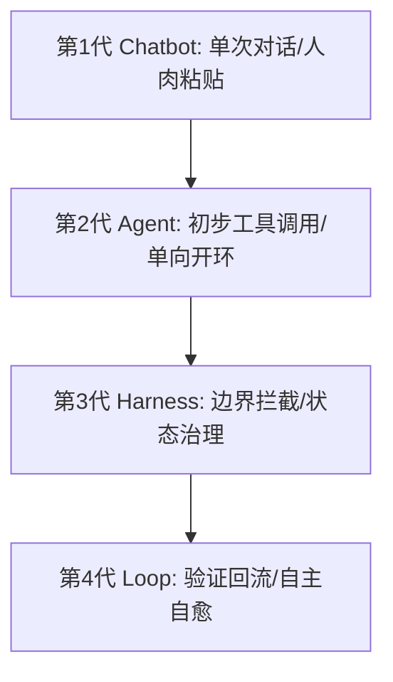
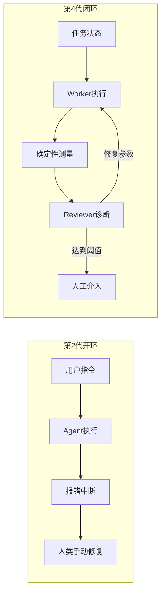
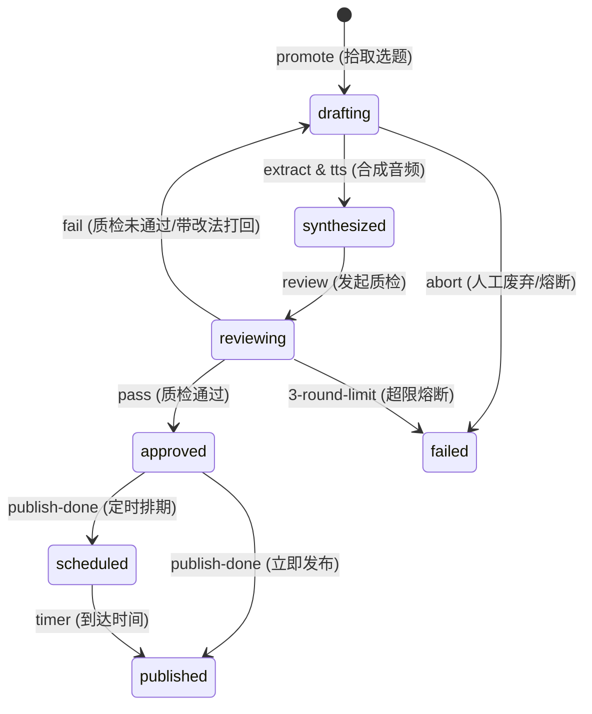
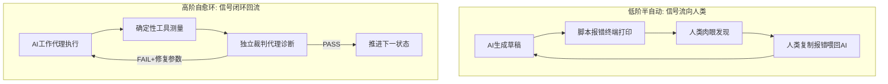
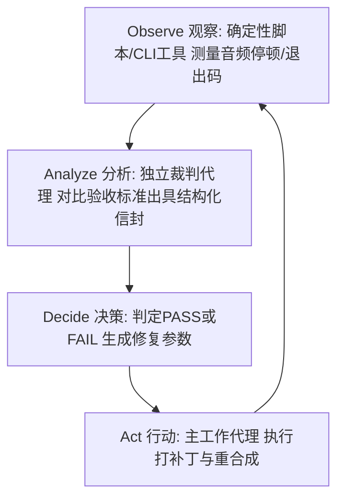
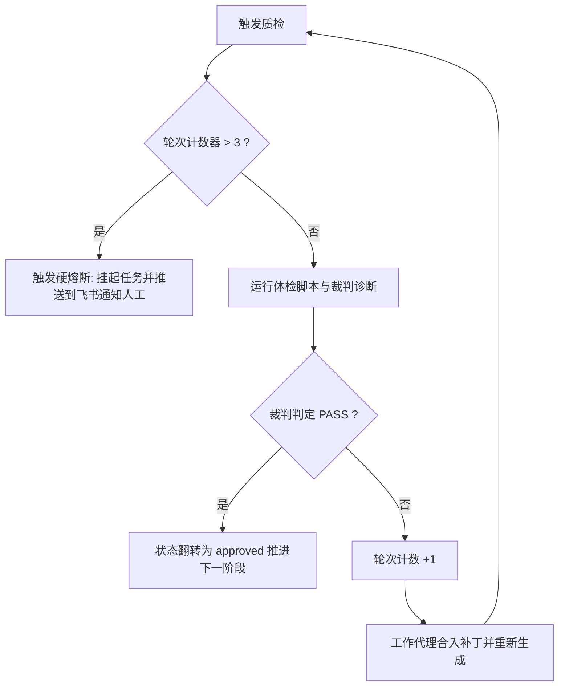

# 第 02 课：状态机思维：为什么你的自媒体流水线总是在半途崩溃？

一个包含了文案生成、演示网页制作、语音合成、视频录屏与自动发布的自动化脚本，在跑了八分钟之后突然停在第四步。排查终端发现，语音合成接口因为网络抖动返回了一次超时错误。此时没有任何重试与断点保存机制，整个进程直接退出。如果想要拿到成片，只能把整套流程从头再跑一遍。重新运行之后，第一步的大模型因为随机采样，生成了一版结构完全不同的文案，导致上一轮已经调试好的页面样式全部错位。

这是很多团队在搭建 AI 自动化流水线时反复遇到的典型困境。

整个流水线的崩溃往往并不是因为大模型不够聪明，主要原因在于系统缺乏状态边界与自愈反馈回路。把所有的任务塞进一条连续的执行链条中，任何一个微小节点的网络抖动、模型幻觉或格式漂移，都会直接演变成整条链路的灾难性中断。解决这个问题的核心，在于用状态机思维重构生产流程，把连续模糊的生成动作切分成离散的确定性状态，并让验证信号能够自动流回模型自身。



## 1. 工具演进的四个世代：你停留在哪一步？

很多开发者使用 AI 的方式，本质上仍然停留在前两个世代。要理解为什么流水线总是在半途崩溃，首先需要厘清 AI 工具演进的技术坐标。

### 1.1 第 1 代 Chatbot 与第 2 代 Agent 的局限

第 1 代工具是纯粹的对话机器人（Chatbot）。这种形态以网页对话框为核心载体，交互模式是一问一答。在这个阶段，所有的状态都保存在人类的大脑中，上下文由人类手动复制粘贴传递。大模型没有外部工具调用能力，无法直接读写本地文件，也无法触发任何脚本。人类在其中充当了纯粹的数据总线。

第 2 代工具引入了工具调用能力（Agent），典型代表是早期基于 ReAct 范式或 Function Calling 构建的智能体。模型可以根据用户的自然语言指令，自主决定调用搜索接口、读写文件或者执行终端命令。

第 2 代 Agent 在面对复杂的多步骤长链路任务时依然极其脆弱。核心问题在于它是单向开环的。当 Agent 执行一条命令失败或者遭遇非预期的工具返回时，它往往缺乏恢复策略，要么直接在终端报错中断，要么在错误的输出上继续胡乱调用其他工具，直到把上下文填满或者消耗掉所有的 Token。整个过程中，人类依然必须守在屏幕前面死盯每一步输出，一旦出现异常就手动干预。人类从手动复制粘贴的数据总线，变成了随时准备救火的肉体报错接口。

### 1.2 第 3 代 Harness 到第 4 代 Loop 的本质跃迁

控制论学者 Sheridan 在 1974 年提出的监督控制模型指出，系统自动化的演进并不是为了消灭人类，而是把人类的角色从低层级的连续控制操作员，提升为高层级设定目标、监控运行并在异常时仲裁的监督者。

第 3 代工具形态被称为 Harness，即测试治理与约束框架。Harness 的核心思想是给具备工具调用能力的 Agent 戴上紧箍咒。它不再放任 Agent 随意调用系统命令，而是构建了严格的运行沙盒、细粒度的权限拦截、环境重置机制以及持久化的状态管理。在 Harness 体系下，模型的操作被限制在明确的安全边界之内，每一次文件修改和状态流转都有迹可循。

第 4 代工具形态则是具备自愈能力的自治循环（Loop）。Loop 让 Agent 具备了完整的闭环运行能力，包括自主拾取任务、自我执行、客观体检、自主修复以及在达到边界时的自动升级上报。

| 世代维度 | 第 1 代 Chatbot | 第 2 代 Agent | 第 3 代 Harness | 第 4 代 Loop |
|---|---|---|---|---|
| 核心交互载体 | 网页对话框 | CLI / 简单脚本 | 约束沙盒 / 框架 | 自愈控制循环 |
| 状态管理机制 | 人脑记忆 | 内存单次会话 | 文件 / 数据库持久化 | 离散状态机 + 检查点 |
| 异常处理方式 | 人工重新提问 | 原地崩溃或幻觉发散 | 权限拦截与报错记录 | 自动化体检与定向重试 |
| 人类角色定位 | 剪切板搬运工 | 实时盯盘操作员 | 规则与边界制定者 | 终态仲裁与异常审批者 |
| 反馈回路流向 | 仅流向人类 | 仅单向开环输出 | 记录到审计日志 | 闭环流回模型自身 |

单靠把提示词写长无法解决长流程的稳定性问题。因为提示词只是静态的输入约束，无法预测运行时的外部动态扰动。一个没有反馈回路的系统，无法在遭遇局部偏离时自我拉回正轨。

如果你在运行多步骤自动化脚本时发现程序经常卡在中间无响应，多半是没有为每个子任务设置超时熔断与状态落盘。咱们写长流程代码，最怕的就是中间挂了还得从头开始。



从第 3 代到第 4 代的跃迁，本质上是把系统的脆弱性从依靠人类手动兜底，转变为由系统内部的状态机与自愈机制吸收。

## 2. 状态机思维：把模糊创作拆成确定性状态

在自媒体内容生产中，创作往往被视为一种难以量化的模糊流程。如果直接把这种模糊性原封不动地搬进自动化程序里，结果必然是灾难性的。

### 2.1 为什么大模型无法处理连续模糊流？

大模型的底层机理是基于自回归概率预测。模型在生成第 N 个 token 时，计算的是基于前 N-1 个 token 的条件概率分布。这意味着长任务链条中的每一次生成，都包含着微小的概率扰动。

任务链路越长，模型需要维持的注意力上下文越庞大，前置步骤的微小偏差在经过多轮级联之后就会呈指数级放大。假设一条包含 5 个子任务的流水线，每个子任务的单步成功率为 90%，那么整条流水线一次性跑通的概率只有大约 59%（0.9 的 5 次方）；如果子任务增加到 10 个，全链路跑通的概率将直接跌破 35%。

很多开发者的直觉是写一个长达三千字的超级提示词，要求模型同时完成选题提炼、口播文案起草、网页排版代码编写、语音配置生成以及语法检查。这种做法忽视了模型的注意力分布规律。当提示词塞满了不同维度的要求时，模型在关注代码格式时就会漏掉文案的字数限制，在关注文案情绪时就会破坏配置文件的结构字段。

解决这个问题的工程手段，就是切断连续模糊流，引入状态机。

### 2.2 什么是 AI 工程中的有限状态机？

有限状态机（Finite State Machine, FSM）是一个数学计算模型，包含三个核心要素：
1. 离散状态（State）：系统在某一时刻所处的固定阶段，状态数量是有限且明确的。
2. 触发事件（Event）：引起状态发生转移的具体动作或外部信号。
3. 守卫条件（Guard）：在状态转移发生前必须满足的布尔逻辑断言，断言失败则拒绝转移。

在视频内容生产工程中，一个标准的内容单件通常被拆解为五个核心离散状态：



在真实生产系统 `tools/console/packages/core/src/state.ts` 中，状态转移通过严格的代码矩阵进行强制约束：

```typescript
export const META_TRANSITIONS: Record<MetaStatus, Partial<Record<MetaStatus, TransitionSpec>>> = {
  ideated: {
    drafting: { requiresReason: false, line: 'production', viaCommand: 'flip' },
  },
  drafting: {
    review: { requiresReason: false, line: 'production', viaCommand: 'flip' },
  },
  review: {
    drafting: { requiresReason: false, line: 'production', viaCommand: 'flip' },
    approved: { requiresReason: false, line: 'production', viaCommand: 'flip' },
    rejected: { requiresReason: true, line: 'production', viaCommand: 'flip' },
  },
  approved: {
    drafting: { requiresReason: false, line: 'production', viaCommand: 'flip' },
    scheduled: { requiresReason: false, line: 'production', viaCommand: 'publish-done' },
    published: { requiresReason: false, line: 'production', viaCommand: 'publish-done' },
  },
  scheduled: {
    published: { requiresReason: false, line: 'production', viaCommand: 'publish-done' },
  },
  published: {
    retro_done: { requiresReason: false, line: 'harness', viaCommand: 'flip' },
  },
  rejected: {
    drafting: { requiresReason: false, line: 'production', viaCommand: 'flip' },
  },
  retro_done: {},
}

export function assertMetaTransition(from: MetaStatus, to: MetaStatus): TransitionSpec {
  const spec = META_TRANSITIONS[from]?.[to]
  if (!spec) {
    const legal = Object.keys(META_TRANSITIONS[from] ?? {})
    const legalStr = legal.length > 0 ? legal.join(', ') : '无合法出边（终态）'
    throw new MediaError(
      'E_ILLEGAL_TRANSITION',
      `${from} 到 ${to} 的流转非法：${from} 当前合法目标状态为 ${legalStr}`,
      { rule: 'state:meta' },
    )
  }
  return spec
}
```

这段状态机代码立下了两条设计铁律：

第一条是单一职责原则。处于 `drafting` 状态时，程序只负责产出口播文本与演示代码，绝不尝试去调用语音合成；处于 `synthesized` 状态时，程序只关注音频文件的落地，绝不触碰录屏命令。每个阶段只做一件事，把复杂问题降维成单点任务。

第二条是硬性前置守卫。当程序尝试把状态从 `review` 翻转到 `approved` 时，底层函数 `assertMetaTransition` 会强制校验前置条件。如果质检脚本没有给出 PASS 信号，或者必要文件不存在，状态机直接抛出 `E_ILLEGAL_TRANSITION` 异常，中断非法转移。这彻底杜绝了带病运行。

如果你在修改状态表时遇到了 TypeScript 编译报错，检查是不是漏写了某个状态在联合类型中的穷举分支。这个地方初次看确实容易绕，但只要把每种状态的合法流出路径一条条画在纸上，逻辑就清楚了。

## 3. 验证信号流向：自动化的高低阶分水岭

状态机把长任务切成了离散节点，接下来的关键问题是：节点与节点之间的校验由谁来做，校验产生的数据流向哪里？

### 3.1 什么是验证信号与信号回流？

在自动化流程中，运行产物是否合格需要一套评估机制。评估产生的客观数据（如字数是否超标、是否存在敏感词、音频停顿是否过长、退出码是否为 0）被称为验证信号。

根据验证信号流向的不同，自动化系统可以清晰地划分为两种层级：

低阶自动化（信号流向人类）：脚本执行完毕后，在终端或者日志文件里打印出一段报错信息。人类工程师坐在电脑前肉眼辨别报错，分析原因，然后再打开 ChatGPT 或者 Claude 的聊天界面，把报错内容手工粘贴进去，催促模型给出修改方案。在这个模式下，自动化只是局部的工具调用，整个系统的连接中枢依然是人类肉体。

高阶自愈闭环（信号流回模型）：确定性的检测工具自动运行，将测量结果直接打包为结构化的数据格式（如 JSON 或 YAML）。这组结构化数据不经过人类手工中转，而是作为上下文直接回灌给对应的 AI 修正代理。AI 代理读取客观数据后定位偏差，直接输出修复补丁并重新触发当前状态的执行，直到验证信号返回通过，或者触发安全熔断。



### 3.2 为什么必须用确定性工具充当观察者？

很多刚接触智能体的开发者容易走入另一个极端：让大模型既当运动员又当裁判员，用模型去直接肉眼审查模型自己的输出。

大模型具有极强的语义理解和内容生成能力，但在面对严格的物理测量和精确计数时表现很差。模型无法准确计算一段音频波形在第 3.2 秒处是否出现了 450 毫秒的非预期静音，无法准确统计一段 800 字口播稿中某个特定字的真实出现频次，也无法判断一个浏览器渲染页面的首屏绘制耗时是否超标。

这些客观指标必须交由确定性的 CLI 工具或脚本去测量。

在经典的 OODA 决策循环中，系统的四步流转与职责分配如下：



1. Observe（观察）：由确定性脚本或命令行工具执行。比如使用 `ffmpeg -af silencedetect` 探测音频内部的静音停顿区间，使用 TypeScript 编译器 `tsc --noEmit` 检查语法类型，使用字数统计脚本计算字符长度。这一步完全不涉及大模型，追求绝对的客观与精准。
2. Analyze（分析）：由独立的裁判子代理（Reviewer Agent）执行。裁判代理读取第一步生成的客观测量数据，对照内容规范进行规则匹配与诊断。
3. Decide（决策）：裁判代理做出裁决。如果全部指标达标，输出 PASS 并放行；如果不达标，输出 FAIL 并附带具体的修复指令。
4. Act（行动）：由主流程工作代理（Worker Agent）执行。工作代理根据裁判代理给出的修复指令，精确修改配置文件或文案内容，然后重新触发当前状态的生产命令。

四个步骤各司其职，形成了自我修复的闭环。

如果你在写音视频检测脚本时发现 `ffmpeg` 的 `silencedetect` 过滤器输出了一堆乱七八糟的文本，不要慌。用正则表达式过滤出带有 `silence_duration` 的日志行，提取出具体的浮点数即可。

## 4. 自愈闭环能跑通的 3 个关键硬设计

建立起 OODA 循环之后，要让系统在实际生产中不陷入死循环或者越修越乱，必须在工程上落实三个关键硬设计。

### 4.1 结构化信封：为什么必须严禁用自然语言模糊报错？

当质检未通过时，最糟糕的做法是让裁判代理向主工作代理抛出一句自然语言反馈，比如：第三段音频听起来有点生硬，读音似乎有点怪，请修改一下。

这种模糊的自然语言报错会导致严重的负面后果：
1. 模型无法定位具体的物理坐标。它不知道生硬究竟是指语速过快、停顿过长，还是多音字读错了音调。
2. 模型容易产生防御性幻觉，回复诸如我已经调整了语气，但实际上并没有修改任何实质参数。
3. 模型可能会在上下文的诱导下，把原本没有问题的其他段落改得面目全非。

在自愈闭环中，所有的诊断信息必须封装在机器可读的结构化信封内。

```json
{
  "schema_version": "1.0",
  "review_timestamp": "2026-09-02T10:15:30Z",
  "decision": "FAIL",
  "summary": "发现多音字读音错误与局部静音停顿超标",
  "issues": [
    {
      "issue_id": "ERR_POLYPHONE_001",
      "target_file": "build/audio-segments.json",
      "segment_index": 3,
      "error_type": "polyphone_mispronunciation",
      "measured_value": {
        "word": "行业",
        "current_pinyin": "xíng yè",
        "audio_timestamp_range": [4.2, 5.1]
      },
      "expected_value": {
        "correct_pinyin": "háng yè"
      },
      "fix_action": {
        "action_type": "update_config",
        "config_file": "build/tts.config.json",
        "json_path": "overrides.3",
        "patch": {
          "行": "háng"
        }
      }
    },
    {
      "issue_id": "ERR_SILENCE_002",
      "target_file": "build/public/audio/01/step-04.mp3",
      "segment_index": 4,
      "error_type": "excessive_silence",
      "measured_value": {
        "silence_duration_seconds": 0.62,
        "silence_start_seconds": 2.1
      },
      "expected_value": {
        "max_silence_seconds": 0.45
      },
      "fix_action": {
        "action_type": "run_command",
        "command": "node rec/depause.mjs --input build/public/audio/01/step-04.mp3 --cap 0.25 --minact 0.45"
      }
    }
  ]
}
```

通过结构化信封，工作代理拿到的是清晰的定位坐标、实测数值与精确到字段级别的修复动作。AI 不需要再去揣摩模糊的情绪语义，只需要像打补丁一样把指定的配置合入文件。

### 4.2 带着改法的判决：为什么单纯打回等于制造死循环？

在传统的人工协作中，上级只说这里不行打回去重做，下属往往能通过经验摸索猜测意图。大模型没有这种主观默契。如果裁判代理只判定 FAIL 而不提供具体的修复参数，主工作代理就会在巨大的概率空间内随机试探。

例如在多音字发音错误的场景中，MiniMax 或 OpenAI 的语音合成接口对上下文中的生僻词或多音字判断失误。如果只是告诉模型第三段发音错了，模型下一次可能会把整句话重写一遍，导致新生成的句子引发了页面 CSS 排版的连锁坍塌。

正确的做法是职责分离下的参数化诊断：
1. 裁判代理只负责判决和给出修复参数，不直接修改工程文件（没有文件写入权限，保证独立客观）。
2. 裁判代理在给出 FAIL 的同时，必须在信封内直接计算出具体的补丁配置（例如 `overrides: {"行": "háng"}`）。
3. 主工作代理拿到结构化信封后，只针对 `tts.config.json` 的对应段落执行局部补丁合入，保持文案和代码其余部分不动，然后仅重新合成第 3 段的单个音频切片。

这把不确定性的重试收敛为了确定性的配置替换。

### 4.3 硬熔断与降级：为什么 3 轮上限是系统生命线？

即使有了结构化信封和带着改法的判决，自愈系统依然存在陷入对抗性震荡的潜在风险。例如修复 A 错误的操作诱发了 B 错误，而修复 B 错误的操作又把 A 错误引了回来。在缺乏外部干预的情况下，两个代理可能会在会话中互相推诿并无限循环下去，造成 Token 账单暴增和任务死锁。

在任何自动化自愈环中，必须设定严格的轮次上限计数器（Loop Counter），建议将重试上限设为 3 轮。



当重试计数器达到 3 轮依然无法通过自动化测试时，系统必须果断执行硬熔断：
1. 立即中断自动重试循环，阻止继续调用付费 API。
2. 将当前内容条目的元数据状态翻转为 `review` 或挂起，同时把 3 轮质检的完整诊断日志写入 `3-review.md`。
3. 触发通知通道（例如通过飞书机器人或企业微信 Webhook），将异常卡片和定位信息推送给人类工程师，交由人工进行最终仲裁。

通过这种方式，系统既能在前 3 轮内自主消化掉 90% 以上的常见偶发性瑕疵，又能在遇到深层死锁时安全降级，保障整条流水线的确定性。

如果你在配置轮次计数器时发现计数器没有自增，检查是不是每次调用都重新初始化了内存变量。轮次计数必须持久化存储在文件的元数据里，不能只放在单次执行的内存上下文里。

## 5. 实战演练：亲手设计一个最小的文案与代码自愈环

理解了理论框架之后，咱们动手设计一个真实的最小自愈闭环。以自媒体口播视频的文案规范化与语音配置生成为例，完整走一遍输入契约、客观验证断言以及三套驱动提示词模板。

### 5.1 定义输入契约与完成标准

在启动 AI 工作之前，必须首先确立输入契约与完成标准（Definition of Done）。

输入契约：
- 输入文件：`content/2026-09-02/demo-topic/1-brief.md`（包含选题核心观点、目标受众与三段式论点骨架）。
- 规范文件：`brain/style-guide.md`（包含禁用词清单、字数上下限与标点规范）。

完成标准：
- 产出文件：`content/2026-09-02/demo-topic/2-script.md` 与 `build/audio-segments.json`。
- 客观断言 1：总字数必须严格落在 600 至 800 字之间。
- 客观断言 2：正文中严禁包含禁用标点（如破折号、直角引号）与绝对化词汇。
- 客观断言 3：分段文案 `audio-segments.json` 的段落数必须严格等于 5 段，且每段字数不超过 160 字。

### 5.2 编写测试断言与客观验证命令

我们编写一个确定性的 Node.js 验证脚本 `scripts/verify-script.mjs`，用于承担 OODA 环中的 Observe 职责：

```javascript
import fs from 'node:fs'
import path from 'node:path'

const scriptPath = path.resolve(process.argv[2] || 'content/demo/2-script.md')
const jsonPath = path.resolve(process.argv[3] || 'build/audio-segments.json')

const issues = []

if (!fs.existsSync(scriptPath)) {
  console.error(JSON.stringify({ status: 'ERROR', message: `文件不存在: ${scriptPath}` }))
  process.exit(1)
}

const content = fs.readFileSync(scriptPath, 'utf-8')
const charCount = content.replace(/\s+/g, '').length

if (charCount < 600 || charCount > 800) {
  issues.push({
    code: 'ERR_CHAR_COUNT_OUT_OF_RANGE',
    message: `总字符数不合规: 当前为 ${charCount} 字，要求在 600 至 800 字之间`,
    current: charCount,
    expected: [600, 800],
  })
}

const bannedPunctuation = [
  { reg: /—|–|——/, name: '破折号' },
  { reg: /[「」『』〈〉]/, name: '直角引号' },
  { reg: /[\U0001F300-\U0001FAFF☀-➿]/, name: 'emoji符号' },
]

for (const bp of bannedPunctuation) {
  if (bp.reg.test(content)) {
    issues.push({
      code: 'ERR_BANNED_PUNCTUATION',
      message: `检测到违禁标点或符号: ${bp.name}`,
    })
  }
}

if (fs.existsSync(jsonPath)) {
  try {
    const segments = JSON.parse(fs.readFileSync(jsonPath, 'utf-8'))
    if (!Array.isArray(segments) || segments.length !== 5) {
      issues.push({
        code: 'ERR_SEGMENT_COUNT_INVALID',
        message: `分段数量不正确: 当前为 ${segments.length} 段，要求严格为 5 段`,
        current: segments.length,
        expected: 5,
      })
    }
  } catch (e) {
    issues.push({
      code: 'ERR_JSON_PARSE_FAILED',
      message: `JSON 文件解析失败: ${e.message}`,
    })
  }
} else {
  issues.push({
    code: 'ERR_FILE_MISSING',
    message: `缺少分段配置文件: ${jsonPath}`,
  })
}

const result = {
  status: issues.length === 0 ? 'PASS' : 'FAIL',
  issue_count: issues.length,
  issues: issues,
}

console.log(JSON.stringify(result, null, 2))
process.exit(issues.length === 0 ? 0 : 2)
```

这个脚本纯粹基于规则和文件做客观断言。执行完成后通过标准输出打印 JSON 结果，并通过退出码（0 为通过，2 为断言失败，1 为严重错误）明确表达状态。

### 5.3 引导 AI 自主捕获报错并修复的 Prompt 结构模板

在具备了状态机和客观断言脚本后，如何通过结构化的提示词来驱动整个自愈流程？

#### 模板一：第一步驱动工作启动的提示词模板

本模板用于驱动 Worker Agent 启动初始生产。核心在于锁定输入状态前置检查、角色边界以及明确的输出文件契约。

```markdown
# 角色与职责
你是一名资深的自媒体技术内容工程师，负责将选题提纲转换为严格符合规范的口播文案与分段音频配置。

# 前置状态检查
在开始执行任务之前，请按顺序检查以下文件是否存在且可读：
1. 确认输入文件 <INPUT_BRIEF_PATH> 存在，读取并提取其中的核心观点与分段大纲。
2. 确认规范文件 <STYLE_GUIDE_PATH> 存在，读取其中的字数约束与标点禁令。
如果任一前置文件不存在，请立即停止执行并输出：`PRECONDITION_FAILED: <缺失文件路径>`，严禁在缺少输入时自行臆造内容。

# 任务目标与输出契约
请根据输入提纲撰写口播稿，并产出以下两个具体文件：
1. 文件一路径：`<OUTPUT_SCRIPT_PATH>`
   - 字数要求：全文有效字符数必须严格控制在 600 至 800 字之间。
   - 结构要求：包含 5 个明确的小节（钩子引言、核心痛点、原理解析、实操演示、总结升华）。
   - 标点要求：只使用标准中文标点（，。！？；：），严禁使用破折号、直角引号、emoji 或任何装饰性符号。
2. 文件二路径：`<OUTPUT_SEGMENTS_JSON_PATH>`
   - 格式要求：标准 JSON 数组，包含 5 个对象，每个对象包含 `segment_id` (1-5) 与 `text` (对应小节的纯文本文案)。

# 执行动作
读取输入文件 -> 生成符合上述约束的文案 -> 将对应内容写入指定文件路径。写入完成后，输出：`GENERATION_COMPLETED` 并报告每个文件的字数统计。
```

#### 模板二：第二步状态流转与质检驱动提示词模板

本模板用于驱动 Reviewer Agent 介入。核心是只赋予其测量与诊断权限，禁止其直接篡改代码或文案。

```markdown
# 角色与职责
你是一名严格的代码与内容质检裁判（Reviewer Agent）。你的职责是对当前工作产物执行客观测量并给出仲裁信封。你只有只读权限，严禁修改任何业务文件。

# 测量与执行指令
请在当前工作目录下执行客观验证脚本：
`node <VERIFY_SCRIPT_PATH> <OUTPUT_SCRIPT_PATH> <OUTPUT_SEGMENTS_JSON_PATH>`

# 仲裁决策逻辑
1. 如果脚本执行退出码为 0，且控制台输出 `status: "PASS"`：
   - 输出仲裁结果：`REVIEW_PASSED`。
   - 生成推进指令：调用状态机工具流转至下一状态：`media flip <SLUG> review`。
2. 如果脚本执行退出码非 0，或输出中包含任何 `issues`：
   - 逐条分析每个 issue 的错误代码与测量差值。
   - 输出符合统一 Schema 的 JSON 质检信封，重点必须在 `fix_action` 字段中给出具体的修复补丁或修改指引（如具体的字符裁剪区间、标点替换映射或配置字段路径）。
   - 严禁输出模糊的自然语言评价，严禁直接动手修改受检文件。
```

#### 模板三：第三步捕获报错并引导 AI 定位根因出补丁的提示词模板

当质检未通过时，不能只把错误扔给模型让其重新生成整篇文件。本模板引导 Worker Agent 基于结构化报错信封定位根因，并以局部外科手术式补丁完成修复。

```markdown
# 角色与任务
你收到了一份来自独立质检裁判的失败诊断信封。你的任务是根据信封内的结构化数据定位根因，对目标文件执行局部精准修复，消除所有测试断言失败项。

# 质检诊断信封输入
<INSERT_REVIEW_JSON_ENVELOPE_HERE>

# 根因排查与修复规范
在动手修改前，请按以下三步进行思考并输出分析过程：
1. 根因确认：针对信封中的每一个 `issue_id`，指出导致该断言失败的根本原因（如：第 2 小节末尾误用了连续破折号，导致违禁标点断言失败；全文总字数 842 字，超出上限 42 字）。
2. 影响面评估：本次修复是否会影响其他原本合格的段落？（原则：严格限制在出现 issue 的段落或字段内，严禁对没有报错的段落进行推倒重写）。
3. 补丁实施：
   - 针对标点错误：直接执行精准字符替换。
   - 针对字数超标：仅在对应段落内部精简冗余修饰词，保留核心论点。
   - 针对配置缺失：根据信封中的 `fix_action.patch` 精确合入字段。

# 执行与复检
完成局部文件修改后，请在终端重新运行验证命令：
`node <VERIFY_SCRIPT_PATH> <OUTPUT_SCRIPT_PATH> <OUTPUT_SEGMENTS_JSON_PATH>`
如果验证通过（退出码 0），输出：`SELF_HEALING_COMPLETED` 并附带修改的 Git Diff 摘要；如果依然存在报错，输出剩余 issue 列表。
```

通过这套结构化的提示词三件套，整个流水线不再依赖运气。前置检查挡住输入缺陷，客观断言捕获物理偏差，根因模板引导局部修复。三个环节咬合在一起，自愈环就能在无人值守的深夜稳定运转。

## 6. 总结与作业

一个工业级的自媒体流水线，其可靠性不在于大模型的参数规模有多庞大，而在于外部系统赋予其的边界约束与信号回流机制。把连续的模糊创作切分为离散的有限状态机，用确定性的工具测量代替主观猜测，用带着修复参数的结构化信封打通 OODA 闭环，并以硬熔断守住系统安全底线，你就能彻底摆脱流水线频频半途崩溃的泥潭。

### 课后作业

1. 状态机闭环建模：
   选择你当前自媒体生产中的一个真实环节（如封面图生成、文案撰写或视频剪辑），使用 Mermaid 语法画出一张完整的状态机闭环图。图中必须清晰标注出离散状态、流转事件、前置守卫条件，以及在失败时回流的具体路径。

2. 编写结构化质检信封：
   假设你在对一篇技术口播稿进行自动化质检时，发现了两处错误：一是正文包含了违禁的英文缩写未展开，二是第二段的预估朗读时长超过了 25 秒。请根据本课讲授的规范，手写一份完整的 JSON 质检报错信封，包含清晰的定位坐标、客观实测值与可执行的 `fix_action` 补丁参数。

3. 跑通一次最小自愈实操：
   在本地创建 `verify-script.mjs` 验证脚本，并使用本课 5.3 节提供的三套提示词模板，引导 AI 完成一次故意包含格式错误的文案自愈修复，观察并记录 AI 从捕获 JSON 报错到输出 Git Diff 补丁的完整过程。
