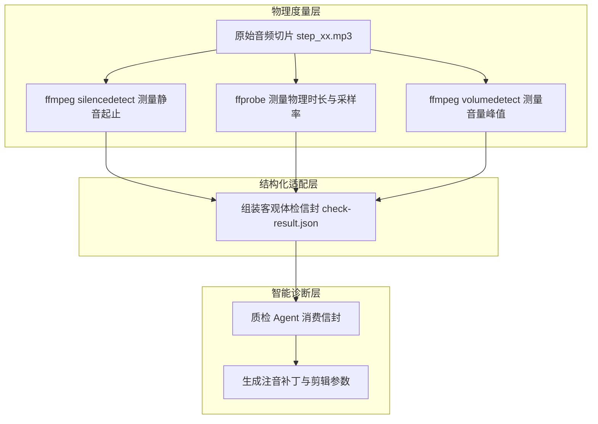

# ffmpeg音频体检脚本：如何用纯脚本建立客观音画质检门禁？

做自动化短视频流水线时，最容易让人陷入被动的一个环节，是语音合成之后的质量验收。

一段两分钟的技术解说视频通常会被切分成三十到五十个解说切片。调用语音合成接口批量生成几十个 MP3 文件只需要十几秒钟。如果依靠人工逐段佩戴耳机去听，检查里面有没有读错的多音字、有没有突兀的长停顿死气、有没有音画时长对不齐，每条视频至少要耗费二十分钟。

一旦中途修改了某句口播文案，重新合成之后整套音频又必须重新试听一遍。人工试听成了整条流水线里最大的耗时瓶颈。

很多人尝试直接把文案和大模型对接，在提示词里询问大模型生成的音频有没有问题。大模型会非常顺从地回复音频语速均匀、发音清晰、没有停顿异常。但实际上大模型只是根据文本在进行概率补全，它在物理世界根本听不见声音。

解决这个问题的工程路径，是用确定性工具给大模型装上物理世界的测量仪器。让底层的 ffmpeg 与 ffprobe 负责精准测量音频的起止毫秒、静音分贝与波形峰值；把测量出来的客观数据打包成标准格式的结构化信封；再把信封喂给大模型做定向诊断和参数修补。

## 1. 为什么大语言模型必须依赖底层物理度量工具？

要建立稳定的自动化流水线，首先需要厘清大语言模型的能力边界与物理事实之间的关系。

### 1.1 语言模型的物理盲区：听不见波形、分贝与毫秒

大语言模型的核心机制是根据上下文预测下一个 Token 的概率分布。无论提示词写得多么详尽，大语言模型处理的对象本质上都是离散的符号与文本语义，而不是连续的时域物理信号。

当我们将一个名为 step_03.mp3 的音频文件路径或者对应的文字口播稿输入给大模型，要求它判断这段配音是否存在停顿过长或音画不同步时，大模型既无法读取音频文件在磁盘上的二进制字节流，也无法感知时域波形的振幅起伏。它之所以能给出头头是道的点评，完全是在模仿人类在类似语境下的评价话术。

这种基于语义概率的评价，必然会产生主观幻觉。如果把一段中间包含了 1.5 秒完全死寂的错误音频文件路径发给大模型，只要文案读起来通顺自然，大模型依然会判定该音频符合短视频发布标准。

物理世界的客观度量需要交给底层的确定性工具。一段音频的真实时长是多少毫秒、内部在第几秒出现了低于负 30 分贝的无声区间、音频采样的峰值是否发生了削顶爆音，这些都是不可辩驳的物理事实。



图解：上方物理度量层通过确定性工具抓取声学数据，中间结构化适配层将数据聚合为标准信封，下方智能诊断层接收事实后完成参数生成。

确定性工具擅长物理测量，大语言模型擅长基于已知数据做逻辑归纳与文本修复。分工原则是：测量归测量，推理归推理。永远不要让大模型去猜测客观物理参数，只让它在拿到了确凿测量数据之后再做决策。

### 1.2 什么是音频死气？为什么 0.45 秒是短视频完播率的生死线？

在短视频平台的算法推荐体系中，完播率和前 3 秒留存率是决定内容能否进入更大流量池的核心指标。短视频的受众在滑动屏幕时处于高频刺激的心理预期中，对声音的连续性极其敏感。

短视频里的音频死气，指的是在两句口播之间、或者在同一句话的词语之间，出现的超过正常呼吸节奏的不自然静音。

在日常面对面对话或者长视频解说中，0.8 秒甚至 1 秒的停顿被视为沉思或语气停顿。但在节奏紧凑的短视频语境下，一旦解说声音中断超过 0.45 秒，受众的大脑会在几十毫秒内产生视频播放卡顿、或者当前内容已经讲完的心理暗示，手指会本能地向上划动切换到下一个视频。

数据统计表明，一条两分钟的短视频如果出现三处以上超过 0.5 秒的内部死气，整体完播率通常会直接下跌 30% 到 50%。

导致音频死气频繁产生的根因主要来自语音合成引擎的断句算法。商业语音合成接口（如 MiniMax、OpenAI TTS、Azure TTS 等）在解析中文文本时，高度依赖标点符号来控制停顿。当口播稿中出现中文全角逗号、句号、引号、破折号、括号或者夹杂英文代码变量名时，分词器往往会在这些符号位置机械插入 0.6 秒到 1.2 秒的静音空白。

```markdown
# 口播稿原始文本
如果这个接口返回了 null，系统就会直接抛出 NullPointerException 异常。

# TTS 引擎分词后的实际渲染节奏
如果这个接口返回了 null [停顿 0.8s] 系统就会直接抛出 [停顿 0.6s] NullPointerException [停顿 0.7s] 异常。
```

正常人声解说在句逗之间的自然气口通常在 0.15 秒到 0.25 秒之间。超过 0.45 秒的停顿就已经属于必须在流水线中被拦截和处理的异常死气。

这里有一处必须注意的卡点：如果直接把停顿门限设置为 0.1 秒，会导致正常的语句呼吸气口全部被误判为异常，引发脚本频繁误报；如果把门限放宽到 0.6 秒以上，短视频的卡顿感又无法消除。经过大量短视频工程实测，0.45 秒是平衡误报率与完播体验的黄金分割阈值。

## 2. 实战拆解：用 silencedetect 与 ffprobe 捕获声学异常

搞清楚了死气的成因与危害，接下来就要动用 ffmpeg 和 ffprobe 这两把手术刀，编写可以批量扫描音频文件的检测脚本。

### 2.1 ffmpeg 与 ffprobe 核心参数深度剖析

ffmpeg 提供了强大的音频滤镜生态，其中 `silencedetect` 是探测静音区间的核心滤镜。

```bash
# 扫描单个音频切片中超过 0.45 秒的内部静音区间
ffmpeg -hide_banner -nostats -i audio_01.mp3 -af silencedetect=noise=-30dB:d=0.45 -f null -
```

参数拆解：
- `-hide_banner -nostats`：屏蔽 ffmpeg 启动时的编译信息与编码过程日志，只保留纯净的诊断输出；
- `-af silencedetect=noise=-30dB:d=0.45`：应用静音探测音频滤镜；
  - `noise=-30dB`：静音噪音门限。音频信号强度低于负 30 分贝时被判定为静音。日常人声解说电平通常在负 12 分贝到负 6 分贝之间，环境底噪在负 45 分贝以下，负 30 分贝能稳妥切分有效人声与背景静音；
  - `d=0.45`：最小静音持续时间。只有静音连续持续超过 0.45 秒，滤镜才会记录并抛出事件；
- `-f null -`：将输出定向到空设备，不进行任何重编码与落盘操作，纯做内存流式分析，执行速度极快。

当命中静音区间时，ffmpeg 会在标准错误输出（stderr）中打印出如下格式的时间标记：

```text
[silencedetect @ 0x7fa289408040] silence_start: 1.248
[silencedetect @ 0x7fa289408040] silence_end: 2.105 | silence_duration: 0.857
```

从日志中可以清晰获得该静音段从第 1.248 秒开始，到第 2.105 秒结束，持续了 0.857 秒的物理事实。

除了静音探测，还需要使用 `ffprobe` 提取音频的物理总时长、采样率以及声道数：

```bash
# 提取音频精确时长（秒）
ffprobe -v error -show_entries format=duration -of default=noprint_wrappers=1:nokey=1 audio_01.mp3

# 提取音频采样率与声道信息（JSON 格式）
ffprobe -v error -select_streams a:0 -show_entries stream=sample_rate,channels -of json audio_01.mp3
```

参数拆解：
- `-v error`：只在发生严重错误时输出警告，屏蔽多余提示；
- `-show_entries format=duration`：只提取文件容器中的时长字段；
- `-of default=noprint_wrappers=1:nokey=1`：输出无包裹、无键名的纯数字字符串，例如 `4.582000`，便于脚本直接解析为浮点数；
- `-select_streams a:0`：精确选中第一条音频流，防止多音轨容器混淆。

在音量管理方面，可以使用 `volumedetect` 滤镜检查音频切片是否存在过爆或音量过小问题：

```bash
# 探测音频最大电平与平均电平
ffmpeg -hide_banner -nostats -i audio_01.mp3 -af volumedetect -f null -
```

输出中会包含 `max_volume: -0.1 dB` 和 `mean_volume: -16.4 dB`。如果 `max_volume` 达到 0.0 dB，说明音频可能已经发生削波失真；如果 `mean_volume` 低于负 28 dB，说明声音太轻，在手机外放时会听不清楚。

### 2.2 批量扫描与多切片时间线对齐

在真实的自动化流水线中，音频文件按照章节和步骤组织在目录结构中，例如 `audio/chapter_01/step_01.mp3`。检测脚本需要遍历所有切片，提取物理数据并与字幕文案的预期时长进行对比。

下面是用 Node.js 编写的底层测量封装模块 `audio-probe.mjs`：

```javascript
import { execFile } from 'node:child_process';
import { promisify } from 'node:util';

const execFileAsync = promisify(execFile);

// 提取单个音频文件的精确时长
export async function probeDuration(filePath) {
  try {
    const { stdout } = await execFileAsync('ffprobe', [
      '-v', 'error',
      '-show_entries', 'format=duration',
      '-of', 'default=noprint_wrappers=1:nokey=1',
      filePath,
    ]);
    const durationSec = parseFloat(stdout.trim());
    return Number.isFinite(durationSec) ? Math.round(durationSec * 1000) : 0;
  } catch (error) {
    throw new Error(`无法探测音频时长: ${filePath}，原因: ${error.message}`);
  }
}

// 探测音频内部超过指定阈值的静音区间
export async function detectSilence(filePath, thresholdSec = 0.45, noiseDb = -30) {
  try {
    const { stderr } = await execFileAsync('ffmpeg', [
      '-hide_banner',
      '-nostats',
      '-i', filePath,
      '-af', `silencedetect=noise=${noiseDb}dB:d=${thresholdSec}`,
      '-f', 'null',
      '-',
    ]);

    const silences = [];
    const startRegex = /silence_start:\s*([\d.]+)/g;
    const endRegex = /silence_end:\s*([\d.]+)\s*\|\s*silence_duration:\s*([\d.]+)/g;

    let startMatch;
    const starts = [];
    while ((startMatch = startRegex.exec(stderr)) !== null) {
      starts.push(parseFloat(startMatch[1]));
    }

    let endMatch;
    let index = 0;
    while ((endMatch = endRegex.exec(stderr)) !== null) {
      const end = parseFloat(endMatch[1]);
      const duration = parseFloat(endMatch[2]);
      const start = starts[index] !== undefined ? starts[index] : end - duration;
      silences.push({
        start_ms: Math.round(start * 1000),
        end_ms: Math.round(end * 1000),
        duration_ms: Math.round(duration * 1000),
      });
      index++;
    }

    return silences;
  } catch (error) {
    throw new Error(`静音扫描执行失败: ${filePath}，原因: ${error.message}`);
  }
}
```

这里有一个高频踩坑点需要拦截：在跨平台环境或者容器镜像中，如果系统环境变量 PATH 中没有配置 ffmpeg，Node.js 会抛出 `spawn ffmpeg ENOENT` 错误。如果脚本没有对子进程异常进行捕获，整个批处理任务会直接崩溃退出。在执行扫描前，必须先在初始化阶段调用 `which ffmpeg` 或执行版本探针确认二进制文件可用。

另一个需要处理的细节是静音截断：如果音频刚好在末尾进入静音状态，ffmpeg 可能只输出 `silence_start` 而不会输出 `silence_end`。在解析正则时，如果发现末尾遗留了一个未闭合的 `silence_start`，需要结合音频总时长将其补齐闭合，防止漏报末尾长空白。

## 3. 架构设计：结构化体检信封与去停顿工具

测量脚本跑通后，很多人的习惯是在控制台打印一段人肉可读的提示，例如：警告，第 3 步音频停顿超标，请检查。

这种散文式的控制台日志对人类很直观，但在无人值守流水线中是致命的设计缺陷。

### 3.1 为什么严禁让体检脚本输出散文日志？

下游负责执行修复或决策的质检 Agent 是程序或者大模型，散文日志的排版变化、错别字或者行号漂移，会导致正则表达式解析失效，甚至让大模型产生误判。

体检脚本必须输出符合强契约的结构化信封（JSON 或 YAML 格式）。

```yaml
# check-result.yaml 结构化体检信封设计规范
run_id: "dubbing-check-20260902-0930"
check_time: "2026-09-02T09:30:15Z"
target_dir: "build/audio/chapter_01"
summary:
  total_segments: 12
  passed_segments: 10
  failed_segments: 2
  status: "FAIL"
issues:
  - segment_id: "step_03"
    file_path: "build/audio/chapter_01/step_03.mp3"
    issue_type: "EXCESSIVE_SILENCE"
    severity: "ERROR"
    metrics:
      actual_duration_ms: 3820
      silence_intervals:
        - start_ms: 1200
          end_ms: 2150
          duration_ms: 950
    text_content: "点击提交按钮之后系统会自动发起鉴权请求。"
    suggested_action: "DEPAUSE"

  - segment_id: "step_07"
    file_path: "build/audio/chapter_01/step_07.mp3"
    issue_type: "DURATION_MISMATCH"
    severity: "WARNING"
    metrics:
      actual_duration_ms: 5400
      expected_duration_ms: 4200
      diff_ms: 1200
    text_content: "如果遇到配置冲突可以在控制台执行回滚操作。"
    suggested_action: "SPEED_ADJUST"
```

结构化信封具备三个不可替代的优势：
1. 消费端无歧义：下游质检 Agent 拿到 YAML 后可以直接做结构化对象反序列化，通过 `issue.issue_type` 精准分发处理逻辑；
2. 历史归档与追溯：每一次体检报告都可以持久化落盘，作为该期视频的质检档案存入目录；
3. 状态闭环验证：修复脚本执行后可以再次运行体检，比对修复前后的 `failed_segments` 计数，形成确定性的自愈闭环。

### 3.2 静音自动切除工具（depause.mjs）的原理与防坑实战

发现异常静音后，最优雅的处理方式不是每次都让大模型重新调用 API 合成音频，因为重新合成不仅消耗网络配额，而且 TTS 引擎下一次依然可能在同样的位置插入停顿。

对于纯粹由标点符号引起的非预期死气，可以直接使用去停顿工具（`depause.mjs`）在本地完成物理压平。

压平的核心原理是：找到超过 0.45 秒的长静音区间，切除多余的静默采样，但必须保留 0.20 秒到 0.25 秒的基础气口。如果将所有无声部分彻底切除至 0 秒，整段语音会听起来像机器机关枪连发，丢失所有语调呼吸感，甚至会切断声母字头的微弱辅音。


图解：原始波形中的长停顿被识别后，保留前段自然过渡，切除中间冗余无声切片并完成波形无缝拼接。

下面是基于 ffmpeg 的静音压平实现逻辑 `depause.mjs`：

```javascript
import { execFile } from 'node:child_process';
import { promisify } from 'node:util';
import fs from 'node:fs/promises';
import path from 'node:path';
import { detectSilence, probeDuration } from './audio-probe.mjs';

const execFileAsync = promisify(execFile);

// 压平指定音频中的异常停顿
export async function depauseAudioFile(inputPath) {
  const silences = await detectSilence(inputPath, 0.45, -30);
  if (silences.length === 0) {
    return { modified: false, reason: '无超标死气' };
  }

  // 构建临时输出文件路径，严禁原地同名写入
  const dir = path.dirname(inputPath);
  const ext = path.extname(inputPath);
  const base = path.basename(inputPath, ext);
  const tempOutput = path.join(dir, `${base}.depause.tmp${ext}`);

  try {
    // 使用 silenceremove 滤镜进行平滑压缩
    // stop_periods=-1 持续处理所有出现的静音
    // stop_duration=0.20 压平后保留的最大静音长度
    // stop_threshold=-30dB 门限
    await execFileAsync('ffmpeg', [
      '-hide_banner',
      '-nostats',
      '-y',
      '-i', inputPath,
      '-af', 'silenceremove=stop_periods=-1:stop_duration=0.20:stop_threshold=-30dB',
      tempOutput,
    ]);

    // 校验产物是否有效
    const newDuration = await probeDuration(tempOutput);
    if (newDuration === 0) {
      await fs.unlink(tempOutput).catch(() => {});
      throw new Error(`压平后音频时长为 0 字节: ${tempOutput}`);
    }

    // 原子覆盖替换原文件
    await fs.rename(tempOutput, inputPath);

    return {
      modified: true,
      original_silences: silences.length,
      new_duration_ms: newDuration,
    };
  } catch (error) {
    await fs.unlink(tempOutput).catch(() => {});
    throw error;
  }
}
```

这里记录一个血泪踩坑实录：原地写入静默失败坑。

在早期的脚本实现中，有人直接执行 `ffmpeg -y -i step_03.mp3 -af ... step_03.mp3`。ffmpeg 在启动时会优先以写模式打开输出文件，此时操作系统会立即将同名的输入文件清空截断为 0 字节。由于输入端还没来得及读取数据文件就已经变空，ffmpeg 处理完空流后正常退出，退出码依然是 0。

这就造成了致命的静默破坏：音频文件变成了 0 字节损坏文件，但自动化流水线以为执行成功。

规避这个坑的铁律是：
1. 必须先输出到独立命名的临时文件（如 `.depause.tmp.mp3`）；
2. 检查临时文件的体积与时长，确认大于 0 毫秒；
3. 使用操作系统的原子重命名操作（`fs.rename`）覆盖原文件；
4. 压平完成后强制调用 `detectSilence` 重新扫描一遍，验证异常静音数彻底归零。

## 4. 零代码与提示词引导：如何用三步法指挥 AI 搭建质检闭环

理解了底层的物理测量与信封契约，在日常开发中不需要完全手动手写每一行 ffmpeg 胶水代码。我们可以通过三步提示词引导法，指挥 AI 搭建起稳固的自动化质检闭环。

### 4.1 第一步：用提示词引导 AI 封装底层度量工具

第一步的核心是向 AI 明确需求契约，约束 AI 只做确定性的工具封装，禁止输出任何未经测量的估算值。

```markdown
# 提示词模版：引导 AI 封装底层度量工具
你是一个音视频底层工具开发工程师。
请为 Node.js 环境编写一个名为 audio-checker.mjs 的测量模块，严格遵循以下契约：

1. 功能范围：
   - 使用 child_process 调用本地安装的 ffmpeg 与 ffprobe 二进制程序。
   - 实现 probeAudioMetrics(filePath) 函数，提取音频的物理时长（毫秒）、采样率、声道数。
   - 实现 detectSilenceGaps(filePath, minDurationSec, noiseThresholdDb) 函数，提取所有大于指定时长的静音区间起止毫秒。
   - 实现 detectVolumePeak(filePath) 函数，提取 max_volume 与 mean_volume。

2. 约束条件：
   - 严禁在大模型中模拟或猜测数据，所有字段必须来自 CLI 执行的标准输出或标准错误。
   - 对 CLI 调用做完善的异常拦截，如果二进制不存在或执行出错，抛出包含明确文件路径的结构化 Error。
   - 保证解析浮点数时的精度换算，最终对外暴露的时间单位一律为整数毫秒（ms）。
   - 代码采用 ES Module 规范，无第三方外部依赖。
```

当 AI 按照上述提示词生成代码后，我们可以立刻在终端执行测试，确保工具能够稳定输出真实的测量数值。

### 4.2 第二步：将客观测试数据封装为结构化信封喂给 AI

第二步是将批量扫描产生的物理事实，组装成结构化上下文喂给质检 AI。提示词必须严密隔离主观推断，只喂入经过脚本验证的纯物理事实。

```markdown
# 提示词模版：输入客观体检信封
你是一个自动化视频流水线的质检仲裁 Agent。
以下是底层 ffmpeg 扫描工具刚生成的客观体检数据信封：

```yaml
run_id: "batch-scan-ep05"
total_segments: 3
segments:
  - id: "step_01"
    file: "audio/step_01.mp3"
    duration_ms: 2400
    silence_gaps: []
    max_volume_db: -1.2
    text: "在分布式系统设计中，一致性哈希是一个非常基础的路由算法。"

  - id: "step_02"
    file: "audio/step_02.mp3"
    duration_ms: 4850
    silence_gaps:
      - start_ms: 1100
        end_ms: 2600
        duration_ms: 1500
    max_volume_db: -2.1
    text: "当节点发生宕机时，只需要迁移受影响的那部分哈希环数据。"

  - id: "step_03"
    file: "audio/step_03.mp3"
    duration_ms: 1900
    silence_gaps: []
    max_volume_db: 0.0
    text: "这样可以避免引发全量缓存雪崩。"
```

请根据上述客观数据，严格核对以下门禁标准：
1. 任何单段音频内部是否存在 >450ms 的静音死气；
2. 任何单段音频的 max_volume 是否达到 0.0dB（过爆风险）；
3. 语速是否异常（字数与时长比例过快或过慢）。
```

通过这种方式，AI 接收到的输入全是确定性的物理参数，彻底消除了基于主观臆测产生幻觉的可能。

### 4.3 第三步：用质检提示词引导 AI 自动生成修复参数

第三步是指挥 AI 充当裁判，生成具体的修复动作指令。

这里必须实施权限物理隔离：质检 AI 只有只读权限，不能直接修改原始文件，它只能输出修复参数清单，由主流程负责调度工具去执行。

```markdown
# 提示词模版：引导 AI 生成修复参数清单
你作为质检仲裁裁判，针对上一阶段体检信封中发现的异常项，输出结构化的修复指令 YAML。

硬性要求：
1. 判定状态只能是 PASS 或 FAIL。
2. 存在任何一项 ERROR 级别异常即判定为 FAIL。
3. 对每个失败的切片，输出明确的修复策略（action）与参数：
   - 若属于内部死气，指定 action: "DEPAUSE" 并给出保留气口毫秒数；
   - 若属于音量过爆（0.0dB），指定 action: "VOLUME_ADJUST" 并计算衰减分贝；
   - 若属于 TTS 发音错误，指定 action: "PRONUNCIATION_PATCH" 并输出词典覆盖规则。

输出格式示例：
status: "FAIL"
actions:
  - segment_id: "step_02"
    action: "DEPAUSE"
    target_file: "audio/step_02.mp3"
    target_silence_start_ms: 1100
    target_silence_end_ms: 2600
    keep_gap_ms: 200

  - segment_id: "step_03"
    action: "VOLUME_ADJUST"
    target_file: "audio/step_03.mp3"
    gain_db: -2.0
```

主流程拿到这份修复清单后，调用 `depause.mjs` 或者 ffmpeg 增益滤镜批量执行修复，修复完成后再次拉起扫描，直到信封状态变为 PASS。

为了防止两个 Agent 在后台针对难以修复的极端音频不断互相调用导致死循环，系统必须设置 3 轮硬熔断。如果连续修复 3 轮仍然无法通过门禁，任务自动挂起并推送到飞书让人类介入排查。

## 5. 验收标准、卡点排查与实战作业

把整套检测与自愈流程搭建完毕后，我们需要用一组明确的标准和排查手段来验证系统的健壮性。

### 5.1 验收清单与卡点拦截汇总

在正式将脚本接入生产线之前，对照以下清单进行逐项核验：

1. 测量脚本独立可用：在无网络、无大模型介入的情况下，运行 `node dubbing-check.mjs` 能在 3 秒内完成全部切片扫描并生成 `check-result.yaml`；
2. 误报与漏报边界清晰：一段包含 0.3 秒正常呼吸停顿的音频判定为正常，一段包含 0.5 秒停顿的音频被精准捕捉并记录时间戳；
3. 压平工具幂等安全：对同一段异常音频连续运行 3 次 `depause.mjs`，文件大小稳定，不发生二次损坏或内容截断；
4. 修复闭环能够收敛：压平处理完成后自动触发复扫，`check-result.yaml` 中的 `failed_segments` 能够自动归零。

常见报错排查与降维路径：

第一种报错：`Error: Command failed: ffprobe ...` 提示无权限或格式不支持。
排查方法：检查音频文件是否在语音合成失败时生成了包含错误信息的 JSON 文本而伪装成 `.mp3` 后缀。在调用 ffprobe 之前，先检查文件尺寸是否大于 1KB。

第二种报错：`silence_end` 缺失导致数组越界。
排查方法：当音频文件结尾恰好是静音时，ffmpeg 不会输出闭合事件。在解析逻辑中务必增加兜底：若 `starts` 数组长度大于 `ends` 数组长度，自动将文件总时长作为最后一个静音区间的结束点。

如果遇到了语速极端多变、多音字与停顿交织极其复杂的疑难片段，不要试图在一个脚本里编写无限复杂的音轨拼接正则。最实用的降维路径是：直接修改 `2-script.md` 中的原句措辞，把容易引发停顿的长句拆分成两句简短的大白话，从输入源头消除歧义。

### 5.2 课后实战作业

为了把本节课学到的度量与质检机制真正跑通，请在本地完成以下三道实战练习：

练习 1：制造故障样本。
使用 ffmpeg 的 `anullsrc` 滤镜或者剪辑工具，人为拼接一段包含 1.2 秒完全无声区间的测试音频 `test_dead_air.mp3`。

```bash
# 生成一段包含 1.2 秒静音的人工故障音频
ffmpeg -f lavfi -i "sine=frequency=440:duration=1" -f lavfi -i "anullsrc=duration=1.2" -f lavfi -i "sine=frequency=440:duration=1" -filter_complex "[0:a][1:a][2:a]concat=n=3:v=0:a=1[out]" -map "[out]" test_dead_air.mp3
```

练习 2：运行体检并生成信封。
编写体检脚本扫描 `test_dead_air.mp3`，验证脚本能否精准捕获起始点在 1000 毫秒左右、持续时长 1200 毫秒的静音数据，并输出标准的 `check-result.yaml`。

练习 3：自动压平与复检。
调用 `depause.mjs` 对 `test_dead_air.mp3` 进行平滑压平处理，将静音压缩至 200 毫秒。处理完成后再次运行体检脚本，确认复扫报告中异常静音计数清零。
