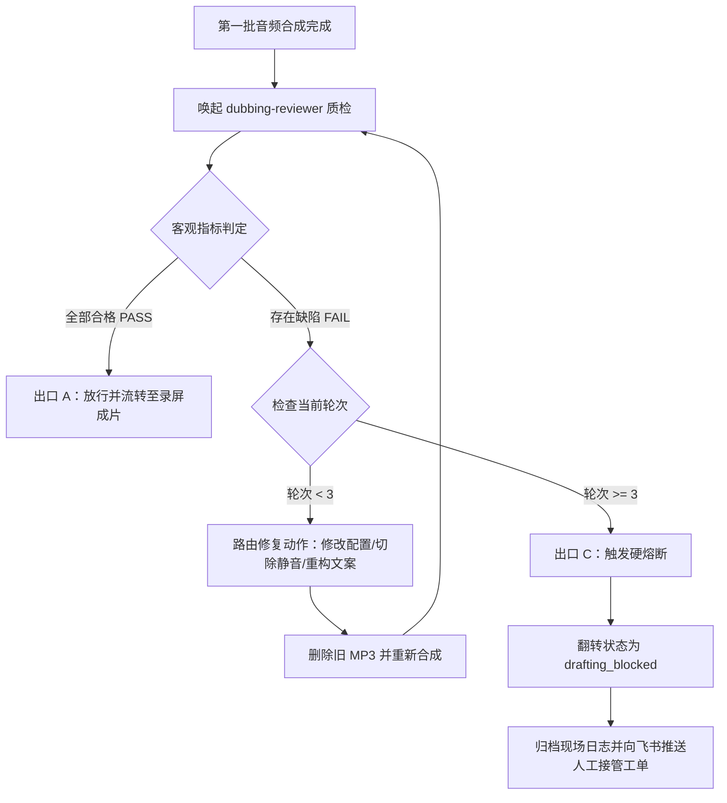
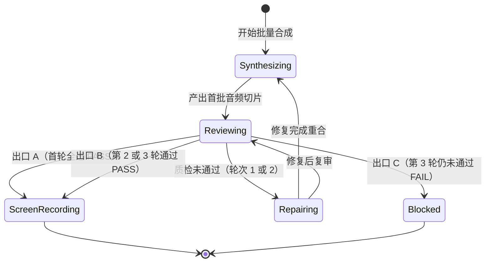
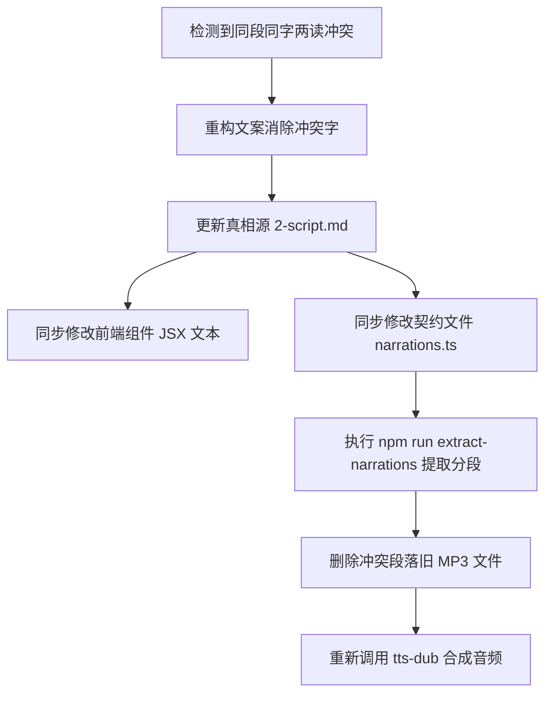
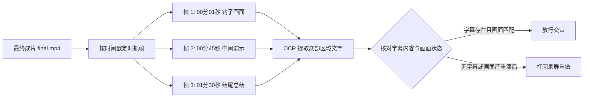

# 第 07 课：自愈机制与 3 轮熔断：告别死循环，打造高可用的自动化修复环

自动化流水线最脆弱的时刻，往往发生在执行遇到错误的那一瞬间。

在构建短视频自动化流水线的初期，许多人习惯把写文案、做网页、合成配音、录制视频和上传发布全部串在一个单向脚本里。只要中间任何一个环节出现异常，比如接口超时、发音错误或者样式错位，脚本就会立刻报错退出。重新执行脚本不仅要浪费几分钟的等待时间，还会因为大语言模型的随机采样，导致前几步已经调整好的文案和版式被全部打乱。

另一种极端则是无节制地让大模型自我修复。当测试脚本检测到输出异常时，程序在循环里不断把错误信息塞回给大模型，让它一次又一次重新生成。由于缺乏严格的收敛约束与客观的物理度量，大模型经常会在同一个错误上反复打转。大模型可能刚改好了第一处的读音，却引发了第二处的语速失衡；为了修补第二处，又把第一处的改动还原回去。两三个小时下来，上百万 Token 消耗殆尽，账单成倍增长，流水线依然卡在同一个地方。

解决这个问题的工程手段，是建立带物理度量锚点的自愈回路，并为回路装上严格的 3 轮安全熔断器。



图解：上方生成音频后进入质检，中间根据客观指标分流，左下经过定点修复重新进入审查，右下满 3 轮直接触发硬熔断挂起。

## 1. 自愈闭环的完整数据流与时序逻辑

自动化系统的自愈能力，建立在职责分离与确定性状态流转之上。

### 1.1 从第一批合成到复验放行的时序流转

在长流程流水线中，生成者与审查者必须彻底解耦。负责调用语音合成接口的主流程扮演生成者，专门的质检代理 dubbing-reviewer 扮演审查者。

如果让主流程既负责生成音频，又负责评价自己生成的音频质量，大模型会本能地产生自洽偏见。它倾向于认为自己给出的参数完全正确，从而忽略细微的声学缺陷。将审查职责剥离给独立的审查代理后，审查代理只专注于执行客观体检脚本，输出标准格式的判决 YAML 文件，不参与具体的代码编写与音频合成。

```yaml
# dubbing-reviewer 输出的判决结构示例
verdict: FAIL
round: 1
total_segments: 32
passed_segments: 30
failed_segments: 2
defects:
  - segment_id: "step_04"
    type: "dead_air"
    description: "检测到内部异常静音 0.68 秒"
    action: "depause"
    params:
      cap_seconds: 0.25
      min_silence: 0.45
  - segment_id: "step_12"
    type: "polyphone_error"
    word: "行"
    expected_pinyin: "hang2"
    actual_pinyin: "xing2"
    action: "inject_override"
    params:
      file: "build/tts.config.json"
      key: "step_12.行"
      value: "háng"
```

时序流转遵循严格的闭环路径：

第一步，主流程完成第一批音频切片的批量合成。

第二步，主流程唤起 dubbing-reviewer 代理。审查代理在后台运行 ffmpeg 静音检测、采样率分析与多音字规则扫描，将所有声学指标与文本契约进行比对。

第三步，审查代理生成包含明确修复动作的判决 YAML 文件，返回给主流程。

第四步，主流程解析判决文件，按照缺陷类型自动分发修复动作。如果是死气缺陷，调用音频切除脚本；如果是多音字缺陷，将注音补丁写入配置文件；如果是文案冲突，触发局部文案重构。

第五步，主流程删除对应段落的旧 MP3 文件，触发重新合成，并携带更新后的轮次编号再次唤起审查代理进行复验。

如果你在重合成后发现音频内容完全没有变化，多半是没有在重新合成前删除磁盘上的旧 MP3 文件。语音合成脚本为了节省开销，检测到目标文件已存在时会默认跳过生成，导致旧音频一直被复用。

### 1.2 状态机的三大出口路径

每一次自愈循环的启动，都必须有明确的终止条件。流水线的状态机设计了三个标准出口。



图解：上方为首轮直通出口 A，中间为经过修复后收敛的出口 B，右下方为超限熔断的出口 C。

出口 A 是首轮直通放行。语音合成接口一次性产出全部切片，审查代理扫描后确认没有任何静音死气、多音字错误或语速异常，判决为 PASS。系统直接进入后续的录屏成片阶段。在成熟的流水线中，这类情况通常占到全部任务的 60% 到 70%。

出口 B 是多轮修复收敛放行。第一轮检测发现了少量缺陷，系统在第 2 轮或第 3 轮完成了自动化修补，复验结果为 PASS。系统在元数据文件 meta.yaml 中记录修复日志与消耗的额外轮次，随后放行流转至录屏阶段。

出口 C 是超限安全熔断。当循环推进到第 3 轮结束时，复验结果依然为 FAIL。系统立刻停止自动循环，翻转任务状态为 drafting_blocked，保存当前的全部现场上下文，并向飞书推送人工接管卡片。

划分这三个出口的目的，是杜绝中间模糊状态。自动化程序要么带着明确的通过凭证向下游移交，要么带着完整的错误快照停下等待人工干预，绝不在未经验证的情况下把残次品推入生产环境。

## 2. 三大经典缺陷的自动化自愈套路

在短视频音频生成的实际工程中，绝大多数打回原因集中在三类典型缺陷上。针对这三类缺陷，必须设计确定性的自愈执行套路。

### 2.1 音频死气自愈：静音切除与临时文件防截断

音频死气是指音频切片内部由于全角标点、换行符或英文单词引起的超过 0.45 秒的不自然静音。

语音合成引擎在遇到中文引号、破折号或括号时，会在前后机械插入近 1 秒的无声等待。这种停顿直接破坏短视频的紧凑节奏，导致完播率断崖式下滑。

自愈程序通过调用 depause.mjs 脚本对音频进行静音切除。脚本内部利用 ffmpeg 的 silencedetect 滤镜捕获所有超过 0.45 秒的静音起止时间戳，再通过 atrim 与 concat 滤镜将每一处长静音压缩至 0.25 秒的自然呼吸气口。

这里隐藏着一个极易引发静默失败的底层机制。如果使用 ffmpeg 直接对原始文件进行原地写入操作，ffmpeg 在打开输出文件的瞬间就会将目标文件清空截断，导致读取输入流时直接读到空数据。

```bash
# 错误做法：输入与输出指向同一个文件，导致文件被清空截断，命令退出码为 0 但内容损坏
node rec/depause.mjs public/audio/intro/step_01.mp3 public/audio/intro/step_01.mp3

# 正确做法：先写入临时文件，执行完整性校验后，再通过原子重命名覆盖原文件
node rec/depause.mjs public/audio/intro/step_01.mp3 public/audio/intro/step_01.tmp.mp3 && \
mv public/audio/intro/step_01.tmp.mp3 public/audio/intro/step_01.mp3
```

完成文件覆盖后，自愈程序必须立即对目标文件重新执行一次 silencedetect 扫描。只有当复扫结果显示异常静音数量严格为 0 时，才算完成这一处的死气自愈。

```javascript
// rec/depause.mjs 核心执行逻辑片段
import { execSync } from 'child_process';
import fs from 'fs';
import path from 'path';

export function removeDeadAir(inputPath, outputPath, capSeconds = 0.25, minSilence = 0.45) {
  const tempPath = `${outputPath}.tmp.mp3`;
  
  // 1. 探测静音区间
  const detectCmd = `ffmpeg -hide_banner -nostats -i "${inputPath}" -af silencedetect=noise=-30dB:d=${minSilence} -f null - 2>&1`;
  const output = execSync(detectCmd, { encoding: 'utf-8' });
  
  // 2. 解析静音起止点并构建音频滤镜链
  const silenceStarts = [...output.matchAll(/silence_start: ([\d.]+)/g)].map(m => parseFloat(m[1]));
  const silenceEnds = [...output.matchAll(/silence_end: ([\d.]+)/g)].map(m => parseFloat(m[1]));
  
  if (silenceStarts.length === 0) {
    fs.copyFileSync(inputPath, outputPath);
    return { modified: false, count: 0 };
  }
  
  // 3. 运行 ffmpeg 压缩静音至临时文件
  const filterGraph = buildFilterGraph(silenceStarts, silenceEnds, capSeconds);
  const processCmd = `ffmpeg -hide_banner -y -i "${inputPath}" -filter_complex "${filterGraph}" -acodec libmp3lame -q:a 2 "${tempPath}"`;
  execSync(processCmd);
  
  // 4. 原子重命名覆盖目标文件
  fs.renameSync(tempPath, outputPath);
  
  // 5. 复扫验证
  const verifyCmd = `ffmpeg -hide_banner -nostats -i "${outputPath}" -af silencedetect=noise=-30dB:d=${minSilence} -f null - 2>&1`;
  const verifyOutput = execSync(verifyCmd, { encoding: 'utf-8' });
  const remainingCount = [...verifyOutput.matchAll(/silence_start/g)].length;
  
  if (remainingCount > 0) {
    throw new Error(`去停顿后复扫失败，残存 ${remainingCount} 处死气`);
  }
  
  return { modified: true, count: silenceStarts.length };
}
```

如果你在运行去停顿脚本后发现音频时长没有缩短，且静音数量完全没有减少，检查脚本是不是把输出路径和输入路径写成了同一个文件。原地写入会导致 ffmpeg 无法正常切片，进程退出码虽然是 0，但音频数据根本没有被处理。

### 2.2 多音字漏注自愈：动态配置注入与段号对齐

在技术类短视频中，多音字读错是导致审校打回的高发原因。代码里的行业术语（比如行业里的行、重复里的重、向量里的量），语音合成引擎根据通用上下文分词时极易误判。

自愈系统处理多音字的核心机制，是动态注音注入。审查代理在检测到多音字发音错误后，会在判决 YAML 中给出具体的修复键值。主流程接收到指令后，直接修改构建目录下的 build/tts.config.json 配置文件。

```json
{
  "voice_id": "moss_audio_4dd8142e",
  "speed": 1.0,
  "overrides": {
    "step_02": {
      "行": "háng"
    },
    "step_08": {
      "重": "chóng",
      "量": "liàng"
    }
  }
}
```

注入配置后，主流程删除对应切片的 MP3 文件，重新执行合成命令。底层合成器读取 overrides 配置中的拼音映射，把对应汉字替换为带声调的拼音符号发送给 TTS 接口，从而强制锁定正确读音。

在处理多音字自愈时，存在一个容易引发连锁错误的边界情况：段落增删引发的编号错位。

如果在修复过程中同时删除了某个中间段落（比如删除了 step_03），后续所有段落的编号都会整体前移一位。如果此时 build/tts.config.json 中的 overrides 依然沿用旧的段落编号，原本给第 4 段配置的注音就会错误地注入给新的第 3 段，造成旧段落注音失效、新段落注音错乱的双重污染。

因此自愈程序在执行配置注入前，必须先重新运行提取脚本同步段落索引，再对 overrides 里的所有键名进行重新对齐与清理。

如果你在修改文案并删除一个段落后，发现后面几个段落的发音全部读错，检查 build/tts.config.json 里的 overrides 键名是不是还保留着删段前的旧编号。增删段落之后必须先重排索引，再注入发音配置。

### 2.3 同段两读冲突自愈：文案重构与多源同步

多音字自愈中最棘手的情况，是同一句话里同一个字出现两种不同读音。

以这句话为例：系统就得打折，但测试结果比预期诚实得多。

在前半句中，得读作 děi，表示必须；在后半句中，得读作轻声 de，作为补语助词。市面上绝大多数语音合成接口的注音替换字典是基于文本子串进行全词替换的。如果在当前段落的配置里把得注音为 děi，后半句就会被合成出诡异的诚实得（děi）多；如果注音为 de，前半句又会变成系统得（de）打折。

这种局部的拼音死锁，无法通过修改发音配置文件解决。唯一的自愈路径是重构口播文案，通过同义词替换消除读音冲突。

```text
# 冲突原句：同一段落中存在 děi 与 de 两种读音
系统就得打折，但测试结果比预期诚实得多。

# 自愈重构后的文案：使用同义词替换后半句的助词结构，彻底消除歧义
系统就得打折，但测试结果比预期诚实很多。
```

文案重构触发之后，必须严格执行三源同步纪律。在前端动态演示视频架构中，口播文案同时存在于三个地方：口播脚本源文件 2-script.md、前端解说契约文件 narrations.ts 以及具体的 React/Vue 渲染组件。



图解：文案重构后必须同步修改脚本、组件与契约文件，重新提取分段后再重新生成音频。

如果只修改了 2-script.md 而没有同步更新前端组件，录屏录出来的画面文字是旧版，提取出来的音频文本也是旧版，流水线会直接陷入音画不符的严重故障。

这一步涉及文件多、关联紧，确实容易绕。最稳妥的排查方式是先核对 2-script.md、组件代码与 narrations.ts 的文本哈希值是否一致，三方确认对齐后再跑重新合成。

如果你修改了口播稿但录屏画面上显示的依然是旧台词，说明只修改了 2-script.md，忘记同步更新前端组件和执行提取命令。必须运行一次 npm run extract-narrations，把新文案重新抽取到 audio-segments.json 供合成器消费。

## 3. 安全熔断与状态挂起设计

任何自动修复系统都必须设定明确的物理边界。没有熔断机制的自愈系统，本质上就是一个等待失控的无限递归。

### 3.1 为什么熔断阈值严格定为 3 轮？

在长期的工程实测与数据统计中，自愈循环的收敛概率呈现出非常明显的边际递减规律。

| 修复轮次 | 主要处理问题类型 | 单轮修复成功率 | 累计通过率 | 额外 Token 消耗倍率 |
|---|---|---|---|---|
| 第 1 轮 | 明显停顿死气、常见技术词漏注音、标点格式异常 | 75% | 75% | 1.0x |
| 第 2 轮 | 微调单段语速、轻微词义歧义、段落截断异常 | 18% | 93% | 2.2x |
| 第 3 轮 | 极少数复合型长句拆分、边缘拼音冲突 | 4% | 97% | 3.5x |
| 第 4 轮以上 | 底层引擎音库缺失、文案与设计死锁、幻觉死循环 | < 0.5% | < 97.5% | 8.0x+ |

从统计数据可以看出，前两轮修复解决了超过 90% 的工程缺陷。当一个问题在前两轮没有被修好、拖入到第 3 轮时，说明流水线遇到了深层次的结构性障碍。

这通常意味着三种情况：第一，语音合成引擎的底层发音库根本没有收录目标专业词汇的正确声调；第二，提示词对文案字数与前端容器排版提出了互相矛盾的死锁要求；第三，大模型在上下文过长时产生了固执的推理幻觉。

如果允许程序继续跑第 4 轮甚至第 5 轮，成功率已经不足 0.5%，但 Token 开销和时间成本却呈指数级放大。此时继续让模型尝试，只会破坏前几轮已经修好的正常切片。

把熔断阈值死死钉在 3 轮，是用确定性规则为系统止损。用三轮内 97% 的自动化覆盖率，置换掉那 3% 需要人工介入的极端边界，这是工程性价比最高的平衡点。

### 3.2 达到 3 轮上限后的优雅降级与工单派发

当流水线跑满 3 轮质检依然返回 FAIL 时，系统进入熔断保护程序。

熔断动作必须做到干净彻底，绝不直接抛出未捕获的系统异常导致进程崩溃。

首先，系统锁定当前的全部上下文，生成故障现场归档目录。归档内容包括：三轮质检的完整判决 YAML 文件、每轮修复对代码和配置产生的 Git Diff、以及最后一次合成失败的音频与日志。

其次，系统调用元数据管理工具，将当前内容的 meta.yaml 中的状态字段翻转为 drafting_blocked，并写入具体的阻塞原因。

最后，系统组装飞书交互卡片，通过 Webhook 长连接向运维通道推送告警。

```json
{
  "msg_type": "interactive",
  "card": {
    "header": {
      "title": {
        "tag": "plain_text",
        "content": "流水线自愈熔断报警：EP07 口播合成连续 3 轮质检未通过"
      },
      "template": "red"
    },
    "elements": [
      {
        "tag": "div",
        "text": {
          "tag": "lark_md",
          "content": "**任务目录**：content/2026-09-01/ep07-circuit-breaker\n**阻塞状态**：drafting_blocked\n**熔断原因**：step_14 多音字两读冲突未能自动收敛\n**已尝试动作**：第 1 轮注音注入失败，第 2 轮文案重构引发前端排版溢出"
        }
      },
      {
        "tag": "hr"
      },
      {
        "tag": "action",
        "actions": [
          {
            "tag": "button",
            "text": {
              "tag": "plain_text",
              "content": "下载现场诊断日志"
            },
            "type": "primary",
            "value": {
              "action": "download_logs",
              "task_id": "2026-09-01-ep07"
            }
          },
          {
            "tag": "button",
            "text": {
              "tag": "plain_text",
              "content": "人工接管并重置轮次"
            },
            "type": "default",
            "value": {
              "action": "reset_round",
              "task_id": "2026-09-01-ep07"
            }
          }
        ]
      }
    ]
  }
}
```

人工介入接管后，工程师只需打开飞书卡片附带的现场诊断日志，花三十秒手动调整那句冲突文案或修改一条注音，在控制台执行重置命令，流水线即可从断点处继续无缝向下推进。

如果你在测试熔断时发现任务停住了但飞书没有收到任何报警卡片，检查 feishu-bot 的配置文件中是否缺少了 Webhook 密钥或长连接权限配置。阻塞事件必须通知到人，只写本地日志不算完成了熔断降级。

## 4. 录屏后的补充质检闸与抽帧对齐

完成了音频切片的自愈与审核之后，流水线进入视频录制环节。许多开发者以为只要音频质检通过了，最终的成片就一定万无一失。然而在基于无头浏览器的录屏过程中，还会引入全新的机械故障。

### 4.1 为什么无头录屏需要独立质检小循环？

在生产环境中，视频录制通常通过无头 Chromium 浏览器（Headless Chrome）以自动化脚本驱动。无头浏览器在服务器或后台运行时，存在两个极其隐蔽的致命陷阱。

第一个陷阱是无头渲染时间膨胀（Headless Time Dilation）。当演示页面中包含大量的 CSS 动画、Canvas 粒子或高频 DOM 重绘时，无头浏览器的实际渲染帧率可能会低于每秒 60 帧。原本在物理时间中应该耗时 1 秒播放完的动画，在无头环境里被拉长到了 1.3 秒。然而音频切片是以恒定物理速率播放的，这直接导致录出来的视频在后半段出现画面严重落后于声音的音画脱节现象。

第二个陷阱是参数覆盖导致的字幕漏烧。在录制脚本 auto-record.mjs 中，默认的访问 URL 往往不包含显示字幕的参数。如果在启动录屏服务时使用了 --serve 参数，启动脚本内部的默认路由可能会把原本带有 ?subs=1 的访问链接覆盖掉，导致录制出来的成片是一段没有任何字幕的裸视频。

```bash
# 容易引发字幕丢失的录制调用方式
# --serve 参数在部分版本中会强制覆盖 query string，丢失 ?subs=1
npm run record -- --serve --out final.mp4

# 正确且稳妥的录制配置方式
# 显式在脚本入口处锁定带字幕参数的录制地址
npm run record -- --url "http://localhost:5173/?subs=1&auto=1" --out final.mp4
```

因此在生成最终 mp4 文件之后，必须在主流程中设立独立的检查点 4.1，专门对成片进行抽帧复检。

### 4.2 自动化抽帧验证与音画同步率检测

抽帧检测脚本利用 ffmpeg 按照调度时刻表，对最终成片进行定点抓帧分析。



图解：从成片中提取多个关键时间戳画面，通过 OCR 验证底部字幕与画面状态，决定放行或打回。

检测脚本主要执行两个硬性验证：

第一，字幕烧录验证。脚本抽取视频第 1 秒、第 30 秒和第 60 秒的三张截图，对图片底部三分之一高度的矩形区域执行 OCR 文本识别。如果三张截图中均未能识别出任何文字，判定为字幕漏烧，立即触发重录。

第二，音画同步率计算。脚本读取录屏生成的原始 webm 视频流物理时长，与拼接后的音频总时长进行比对。

```bash
# 检查视频时长与音频时长的比率
ffprobe -v error -show_entries format=duration -of default=noprint_wrappers=1:nokey=1 final.mp4
```

如果视频轨道的总时长超过音频轨道总时长的 5% 以上（时长比大于 1.05），说明在录制过程中发生了严重的无头渲染膨胀。此时自愈程序会自动使用 ffmpeg 的 setpts 滤镜对视频轨执行时间轴压实重混流，或者降低录制分辨率后重新执行录屏。

```javascript
// 录屏后抽帧质检核心逻辑片段
import { execSync } from 'child_process';
import fs from 'fs';

export function verifyRenderedVideo(videoPath, audioDuration, expectedSubtitles) {
  // 1. 获取最终成片时长
  const durationCmd = `ffprobe -v error -show_entries format=duration -of default=noprint_wrappers=1:nokey=1 "${videoPath}"`;
  const videoDuration = parseFloat(execSync(durationCmd, { encoding: 'utf-8' }).trim());
  
  // 2. 检查音画膨胀系数
  const dilationRatio = videoDuration / audioDuration;
  if (dilationRatio > 1.05) {
    return {
      pass: false,
      reason: `检测到无头录屏时间膨胀，视频时长 ${videoDuration.toFixed(2)}s 超过音频 ${audioDuration.toFixed(2)}s 达 ${((dilationRatio - 1) * 100).toFixed(1)}%`
    };
  }
  
  // 3. 抽取关键帧验证字幕
  const framePath = 'temp_check_frame.png';
  execSync(`ffmpeg -hide_banner -y -ss 00:00:03 -i "${videoPath}" -vframes 1 "${framePath}"`);
  
  const ocrResult = runOcrOnBottomArea(framePath);
  fs.unlinkSync(framePath);
  
  if (!ocrResult || ocrResult.length === 0) {
    return {
      pass: false,
      reason: '成片抽帧检测未发现底部字幕，auto-record 可能遗漏 ?subs=1 参数'
    };
  }
  
  return { pass: true, dilationRatio };
}
```

如果你在抽帧检查时发现截出来的图片底部完全没有字幕，多半是在录屏时漏掉了 subs=1 参数。直接修改录屏配置把参数补上，重新跑一次录屏，几分钟就能解决。

## 5. 自愈实战：三套核心提示词模板与落地演练

在整个自愈回路中，修补 Agent 接收到的提示词结构，直接决定了自愈的收敛速度。提示词不能只抛出错误日志，必须将事实、约束与操作范围打包成标准信封。

### 5.1 第一步：自愈闭环启动提示词（测试日志信封化）

当 dubbing-reviewer 首次返回 FAIL 时，主控调度器将结构化判决结果与上下文组装为第一步自愈启动信封，投喂给修补 Agent。

```markdown
# 角色定义
你是一个专门负责修复音频合成与口播契约缺陷的工程修补 Agent。你的唯一任务是根据客观测试日志，精准消除报错，使系统通过下一轮质检。

# 当前任务上下文
- 任务目录：<TARGET_DIR>（例：content/2026-09-01/ep07-circuit-breaker）
- 当前自愈轮次：Round 1 / Max 3
- 涉及真相源：
  1. 口播台词真相源：<TARGET_DIR>/2-script.md
  2. 语音合成配置：<TARGET_DIR>/build/tts.config.json
  3. 前端契约文件：<TARGET_DIR>/build/src/narrations.ts
  4. 演示组件源码：<TARGET_DIR>/build/src/components/

# 客观质检失败日志（信封数据）
```yaml
<REVIEWER_VERDICT_YAML>
```

# 严格修复纪律
1. 定点修补，禁止重构：只修改测试日志中明确列出的失败段落，严禁修改任何状态为 PASS 的正常段落。
2. 缺陷路由规则：
   - 若缺陷类型为 dead_air：调用 `node rec/depause.mjs <IN_FILE> <OUT_FILE>`，禁止原地覆盖写入，写完后必须复扫确认静音归零。
   - 若缺陷类型为 polyphone_error：将修正拼音注入 `build/tts.config.json` 的 `overrides` 对应段落键下，并删除对应的旧 MP3 文件。
   - 若缺陷类型为 polyphone_collision（同段两读）：重构该句文案消除多音字歧义，必须同步更新 `2-script.md`、前端组件与 `narrations.ts`，然后执行 `npm run extract-narrations`。
3. 禁止修改全局基准配置，所有改动限制在当前任务目录之内。

# 交付输出格式
请严格输出 JSON 格式的执行计划与修改清单：
```json
{
  "round": 1,
  "actions_taken": [
    {
      "segment_id": "step_xx",
      "action": "inject_override | depause | rewrite_copy",
      "target_file": "path/to/file",
      "summary": "简述具体修改内容"
    }
  ],
  "ready_for_resynthesis": true
}
```
```

### 5.2 第二步：多轮修复的迭代提示词（历史修复轨迹注入）

如果第一轮修补后复检依然存在残余错误，进入第 2 轮或第 3 轮修复。此时必须将上一轮的修改轨迹与残余报错一同注入，防止大模型陷入回滚与重复试错的死胡同。

```markdown
# 角色定义
你是一个专门负责处理高难残留缺陷的自愈修补 Agent。系统在前一轮修复后仍未完全通过质检，你需要结合历史轨迹分析根因，完成收敛修复。

# 当前任务上下文
- 任务目录：<TARGET_DIR>
- 当前自愈轮次：Round <CURRENT_ROUND> / Max 3（警告：达到第 3 轮未通过将直接触发熔断挂起）

# 历史修补轨迹（上一轮做过的操作）
```json
<PREVIOUS_ROUND_ACTIONS_JSON>
```

# 本轮残余客观报错日志
```yaml
<CURRENT_REVIEWER_VERDICT_YAML>
```

# 深度诊断与收敛要求
1. 禁止重复上一轮已经失败的修改策略。如果上一轮注入注音后发音依然错误，说明该词属于引擎词库缺陷，本轮必须切换为文案同义词重构策略。
2. 检查多文件同步一致性：确认 `2-script.md`、前端组件与 `audio-segments.json` 中的文本哈希是否完全一致。
3. 检查段落索引是否发生偏移：如果前一轮有删段或增段动作，核对 `build/tts.config.json` 中的 `overrides` 键名是否已与最新段落编号严格对齐。

# 交付输出格式
输出 JSON 格式的二次修复报告，明确注明本轮采取的替代策略：
```json
{
  "round": <CURRENT_ROUND>,
  "root_cause_analysis": "上一轮修复未能生效的具体原因分析",
  "strategy_pivot": "从策略 A 切换为策略 B 的理由",
  "actions_taken": [
    {
      "segment_id": "step_xx",
      "action": "rewrite_copy | reindex_overrides | manual_stitch",
      "target_file": "path/to/file",
      "diff": "关键修改差异"
    }
  ],
  "ready_for_resynthesis": true
}
```
```

### 5.3 第三步：触发 3 轮熔断后的兜底提示词（故障现场归档与工单生成）

当系统满 3 轮质检依然未能收敛时，主控程序停止修复，唤起兜底整理 Agent，生成人类可读的交接工单。

```markdown
# 角色定义
你是一个自动化流水线熔断与现场归档 Agent。当前任务在 3 轮自动修复后仍未收敛，你需要归档故障现场，生成标准的人工接管工单。

# 输入元数据
- 任务目录：<TARGET_DIR>
- 总轮次：3 / 3 (LIMIT EXCEEDED)
- 三轮质检报告与修改历史集合：
```yaml
<FULL_THREE_ROUNDS_HISTORY_YAML>
```

# 执行动作要求
1. 生成现场诊断总结，精确定位无法自动修复的核心矛盾点（例如：TTS 引擎底层发音缺陷、文案排版空间死锁等）。
2. 将 `<TARGET_DIR>/meta.yaml` 中的状态翻转为 `status: drafting_blocked`，并在 `blocked_reason` 字段填入一句话故障摘要。
3. 给出供人类工程师操作的最小手工修复建议（建议具体到文件名、行号与修改后的文本）。

# 交付工单格式
请输出供飞书卡片与终端渲染的标准工单 Markdown：
```markdown
## 自愈熔断人工接管工单

- **任务标识**：<SLUG_NAME>
- **熔断时刻**：<TIMESTAMP>
- **最终状态**：drafting_blocked
- **死锁原因**：<一句话说明为什么 3 轮无法收敛>

### 历史三轮修复轨迹
1. Round 1：<尝试了什么> -> 残余报错：<报错简述>
2. Round 2：<尝试了什么> -> 残余报错：<报错简述>
3. Round 3：<尝试了什么> -> 残余报错：<报错简述>

### 人工接管操作建议（3 分钟快速通道）
1. 打开文件 `<EXACT_FILE_PATH>` 第 `<LINE_NUMBER>` 行；
2. 将内容修改为：`<SUGGESTED_TEXT>`；
3. 在终端运行恢复命令：`npm run resume -- --task <SLUG_NAME>`。
```
```

## 6. 总结与课后作业

工程化的本质是用确定性的约束对抗不确定性的系统。

大语言模型为自动化流水线带来了强大的生成能力，但同时也带来了随机性与幻觉。一个高可用的生产系统，绝不能把希望寄托在模型的自觉上。

通过物理度量工具建立客观质检门禁，把模糊的语音和画面转化为精准的结构化信封；通过职责解耦实现生成者与审查者的双向博弈；通过清晰的缺陷路由实现常见问题的自动化闭环；通过死死定住的 3 轮硬熔断为整个系统兜底止损。这四套机制组合在一起，流水线才真正具备了在无人值守状态下持续稳定运转的工程底气。

反正能跑通的系统，骨子里都是这套克制的逻辑。

### 课后实战作业

1. 多音字自动注音自愈实战：在测试目录中故意编写一段包含行业术语各十几行的文案（TTS 默认极易把行读为 xíng）。编写一套调度脚本，将测试失败日志打包后投喂给自愈提示词，验证系统能否自动将正确的拼音映射写入 build/tts.config.json 的 overrides 字典中，并自动重新合成出正确的音频。
2. 同段两读死锁熔断实战：在一段文案中故意植入包含就得与诚实得多的同段两读冲突句式。启动包含 3 轮熔断限制的自动化调度流程，观察系统在第 1 轮和第 2 轮的修补尝试，验证系统在第 3 轮仍未收敛时，能否准确将任务状态翻转为 drafting_blocked，并输出完整的人工接管工单。
