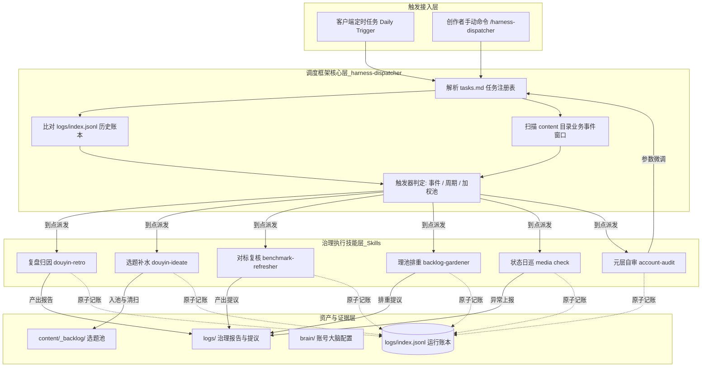
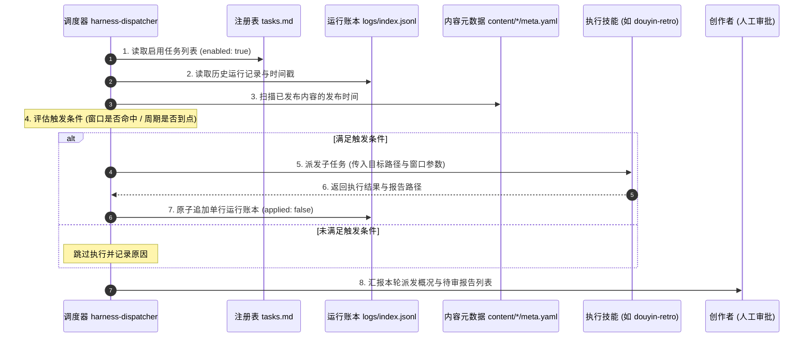
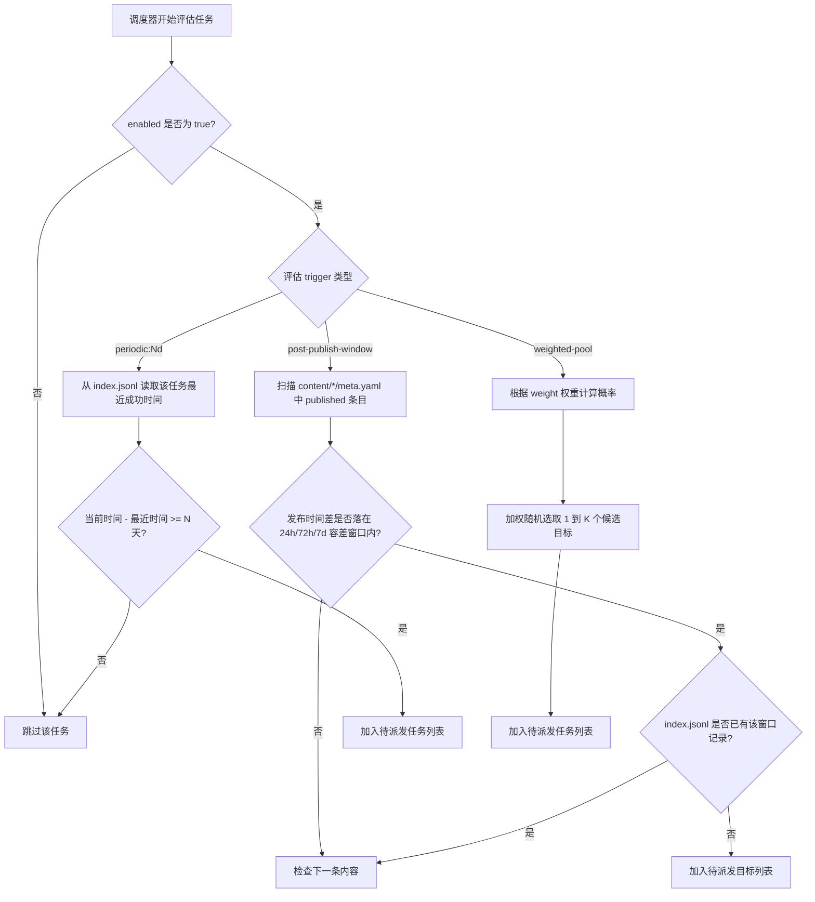
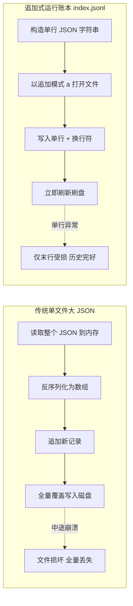
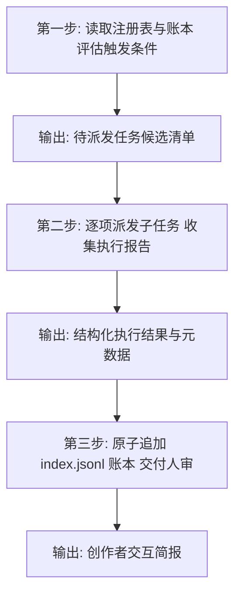
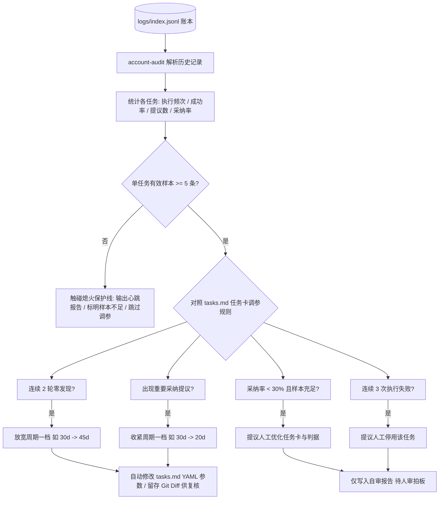

# 第 15 课：治理总调度harness-dispatcher：如何用框架层调度所有资产保养任务？

在编写完复盘、选题补水、死链排查与对标复核等治理脚本后，很多开发者会遇到同一个尴尬局面：所有的保养工具都写好了，但每天必须手动在终端敲命令去触发。只要忙于日常工作漏掉两三天，整个治理流程就会彻底停摆，已发布视频的复盘窗口会悄悄溜走，选题池也会因为没有及时补充新线索而干涸。

资产治理系统需要的是一套无人值守的自动化调度框架。这套框架每天定时扫描系统资产，自动计算每项任务距离上次执行的时间差与业务事件窗口，精确派发到点任务，并将所有执行记录追加到结构化账本中。



## 1. 为什么你需要一个声明式治理调度框架？

自动化流水线的维护难度往往不在于单个脚本的编写，而在于多个脚本之间的协同与时机把控。如果调度机制设计得过于脆弱，整个系统的维护成本很快就会超过手动操作。

### 1.1 传统定时任务的无状态困境

传统的系统级定时工具（如 Linux Cron）在处理简单的周期任务时非常直接，比如每天凌晨 3 点打包一次数据库备份。但在自媒体资产治理场景中，任务的触发条件与内容生命周期深度绑定。

自媒体治理存在三类差异极大的时间逻辑：
1. 强依赖内容发布时间点的事件窗口：一条视频在发布后的第 24 小时需要拉取初始播放量进行冷启动复盘，在第 72 小时拉取互动数据评估长尾效应，在第 7 天拉取完播曲线进行终局归因；
2. 固定天数间隔的周期巡检：选题池每隔 2 天需要从技术社区抓取一次新线索，账号大脑中的对标账号每隔 30 天需要重新核验活跃度；
3. 海量历史资产的加权轮询：已发布的上百篇图文中的引用链接，需要按照权重逐步排查死链。

如果使用传统的 Cron 表达式管理这些任务，开发者通常有两种做法，但都会带来严重的维护问题。

第一种做法是在 Crontab 中为每个任务配置独立的定时规则。这种做法完全无法感知业务事件，Crontab 根本不知道哪天发布了新视频，也就无法在视频发布后的第 24 小时精准触发复盘。

第二种做法是写一个总的 Shell 脚本每天定时执行，在脚本内部写满复杂的条件判断。这种做法会导致调度逻辑与具体的业务操作死死耦合。一旦某个视频的元数据格式发生微调，或者某个外网抓取请求超时卡住，整个调度脚本就会中途崩溃，导致排在后面的选题补水和对标复核全部被跳过。

| 维度 | 传统 Cron 定时脚本 | 声明式治理调度框架（harness-dispatcher） |
|---|---|---|
| 触发维度 | 仅支持固定时钟（如每天 10:00） | 支持发布事件窗口（24h/72h/7d）、固定周期与加权池 |
| 状态感知 | 无状态，无法感知历史执行记录与重试 | 读取追加账本，精准判断上次运行时间与窗口完成度 |
| 耦合程度 | 调度时间与执行代码紧密交织 | 调度器只读配置派发，具体业务封装在独立技能中 |
| 容错隔离 | 单点报错容易导致整条调度链中断 | 任务之间严格隔离，单任务失败不影响其他任务派发 |
| 扩展成本 | 每增加一个任务都需要修改调度核心逻辑 | 仅需在 tasks.md 增加一行配置和一张任务卡 |

如果你在编写定时脚本时尝试把所有任务串行写在一个文件中，一旦遇到网络抖动导致某一步执行超过 15 分钟，后续任务就会全部超时。治理系统必须将时钟评估与业务执行彻底拆开。

### 1.2 harness-dispatcher 的解耦设计原则

为了解决上述困境，系统引入了框架层调度器：`harness-dispatcher`。

调度器的核心设计原则是：只做条件评估与任务派发，绝不承载具体治理逻辑。



调度器的工作范围被严格限定在五个步骤：
1. 读注册表：解析 `harness/tasks.md`，提取所有标记为 `enabled: true` 的任务；
2. 算时间差：比对 `harness/logs/index.jsonl` 中的历史运行记录与 `content/*/meta.yaml` 中的发布时间，判断是否有任务落入触发窗口；
3. 派发任务：对所有到点的任务，调用其绑定的独立技能（如 `douyin-retro` 或 `douyin-ideate`），并将目标文件与窗口参数传递给子技能；
4. 收集报告：接收子技能返回的执行报告路径与发现项数量；
5. 追加记账：向 `logs/index.jsonl` 原子追加一行结构化执行记录，状态标记为待人工审核（`applied: false`）。

调度器本身不包含任何视频分析算法，不包含任何大模型打分规则，也不直接修改账号大脑文件 `brain/benchmarks.md`。

当需要新增一个死链检测任务时，开发者只需编写对应的检测技能，并在 `harness/tasks.md` 中增加一段 YAML 声明。调度器代码不需要做任何改动，系统即可自动获得对新任务的调度能力。

## 2. 声明式任务注册表：tasks.md 设计

调度系统的第一核心资产是任务注册表。注册表放置在项目的 `harness/tasks.md` 中，兼顾机器可读的配置契约与人类可读的操作指南。

### 2.1 任务定义规范：YAML 契约

在 `harness/tasks.md` 的顶部，使用标准 YAML 代码块声明所有已接入的治理任务。

```yaml
tasks:
  - task: retro
    skill: douyin-retro
    enabled: true
    trigger: post-publish-window
    windows: [24h, 72h, 7d]

  - task: benchmark-refresher
    skill: benchmark-refresher
    enabled: true
    trigger: periodic:30d

  - task: ideate
    skill: douyin-ideate
    enabled: true
    trigger: periodic:2d

  - task: backlog-gardener
    skill: backlog-gardener
    enabled: true
    trigger: periodic:7d

  - task: check
    enabled: true
    trigger: periodic:1d

  # 元层治理任务：自审调度器本身
  - task: account-audit
    skill: account-audit
    enabled: true
    trigger: periodic:30d

  # 以下为规划中任务（disabled），待编写独立技能后开启
  - task: link-rot-checker
    enabled: false
    trigger: weighted-pool
    weight: 10
```

YAML 契约中各字段的语义规定如下：
- `task`：任务的唯一标识符，对应账本中的记录标识；
- `skill`：执行该任务所需的技能名称。若该任务由底层命令行工具直接完成（如 `check` 任务直接运行 `media check`），该字段可省略；
- `enabled`：任务开关，布尔值。只有标记为 `true` 的任务会被调度器评估，标记为 `false` 的任务会被直接忽略；
- `trigger`：触发器类型表达式，支持 `post-publish-window`、`periodic:<N>d` 以及 `weighted-pool`；
- `windows`：时间窗口列表，仅在触发器类型为 `post-publish-window` 时生效；
- `weight`：加权权重，仅在触发器类型为 `weighted-pool` 时生效，取值范围通常为 1 到 12。

如果你在编辑 YAML 配置时不小心遗漏了 `trigger` 字段，调度器在解析该条目时会直接报出键值缺失错误，导致当前任务判定失败。在注册新任务时，必须核对字段完整性。

### 2.2 核心触发器机制深度剖析：事件窗口与固定周期

调度器内置了三种触发器求值机制，用于匹配不同的治理节奏。



第一种机制是事件窗口触发器（`post-publish-window`）。

这类任务的目标是已发布的内容个体。判定流程如下：
1. 遍历 `content/*/meta.yaml`，筛选出 `status: published` 的所有内容；
2. 提取其发布时间戳 `timestamps.published`，计算当前时间与发布时间的差值；
3. 将时间差与配置中的窗口数组（`[24h, 72h, 7d]`）进行比对，设置 ±12 小时的容差区间；
4. 检索 `logs/index.jsonl`，检查是否已经存在 `task=retro`、`target=<该内容路径>` 且 `window=<当前窗口>` 的成功记录；
5. 如果未曾执行且处于容差区间内，判定为命中窗口，加入执行清单；如果发布时间已超过 7 天加容差上限，判定为严重逾期，正规复盘窗口不再硬补，转由专门的债务回收任务处理。

第二种机制是周期触发器（`periodic:<N>d`）。

这类任务通常面向全仓全局资产（如选题池、对标库）。判定流程如下：
1. 从 `logs/index.jsonl` 中过滤出该任务的所有历史记录；
2. 找到最近一次执行结果为成功的记录，提取其时间戳 `ts`；
3. 计算当前时间与该时间戳的天数差。如果差值大于等于 N，或者账本中没有任何历史记录（冷启动状态），判定为到点触发；
4. 这里的日期判定支持基于特定文件的实测日期覆盖。例如选题调研任务 `ideate` 在判定周期时，会优先比对 `content/_research/` 目录下最新调研报告的生成日期，避免人工临时触发导致周期计算失真。

第三种机制是加权池触发器（`weighted-pool`）。

这类任务针对单次耗时短但资产数量庞大的同质维护项（如死链检测）。判定流程如下：
1. 根据任务卡中设定的客观度分配权重：完全由机器断言客观判断对错的任务赋予高权重（8 到 10），需要大量人工介入主观判断的任务赋予低权重（1 到 4）；
2. 调度器在每次运行时按权重加权随机挑选 1 到 2 个目标执行，避免单次全量扫描消耗过多系统资源，将维护成本平摊在每一天的日常运行中。

以下是实现上述触发器判定逻辑的 Python 代码片段：

```python
# scripts/eval_triggers.py
import yaml
import json
from datetime import datetime, timedelta
from pathlib import Path

def parse_iso_time(ts_str: str) -> datetime:
    return datetime.fromisoformat(ts_str)

def evaluate_task_triggers(tasks_file: Path, index_log_file: Path, content_dir: Path) -> list:
    with open(tasks_file, "r", encoding="utf-8") as f:
        # 提取顶部 yaml 块
        content = f.read()
        yaml_text = content.split("```yaml")[1].split("```")[0]
        config = yaml.safe_load(yaml_text)

    # 读取历史账本
    logs = []
    if index_log_file.exists():
        with open(index_log_file, "r", encoding="utf-8") as f:
            for line in f:
                line = line.strip()
                if line:
                    logs.append(json.loads(line))

    now = datetime.now()
    dispatch_list = []

    for task_cfg in config.get("tasks", []):
        if not task_cfg.get("enabled", False):
            continue

        task_name = task_cfg["task"]
        trigger = task_cfg.get("trigger", "")

        # 1. 周期触发器判定
        if trigger.startswith("periodic:"):
            days = int(trigger.replace("periodic:", "").replace("d", ""))
            task_logs = [l for l in logs if l.get("task") == task_name and l.get("result") != "failed"]
            if not task_logs:
                # 从未跑过，直接触发
                dispatch_list.append({"task": task_name, "skill": task_cfg.get("skill"), "target": "global", "window": trigger})
            else:
                last_ts = parse_iso_time(task_logs[-1]["ts"])
                if now - last_ts >= timedelta(days=days):
                    dispatch_list.append({"task": task_name, "skill": task_cfg.get("skill"), "target": "global", "window": trigger})

        # 2. 发布事件窗口触发器判定
        elif trigger == "post-publish-window":
            windows = task_cfg.get("windows", ["24h", "72h", "7d"])
            # 扫描 content 目录
            for meta_path in content_dir.glob("*/meta.yaml"):
                with open(meta_path, "r", encoding="utf-8") as mf:
                    meta = yaml.safe_load(mf)
                if meta.get("status") != "published":
                    continue
                pub_time_str = meta.get("timestamps", {}).get("published")
                if not pub_time_str:
                    continue
                pub_time = parse_iso_time(pub_time_str)
                delta = now - pub_time

                target_slug = meta_path.parent.name
                for win in windows:
                    target_hours = 24 if win == "24h" else (72 if win == "72h" else 168)
                    # 允许 12 小时容差
                    if abs(delta.total_seconds() / 3600 - target_hours) <= 12:
                        # 检查账本是否已记录
                        already_done = any(
                            l.get("task") == task_name and 
                            l.get("target") == target_slug and 
                            l.get("window") == win 
                            for l in logs
                        )
                        if not already_done:
                            dispatch_list.append({
                                "task": task_name, 
                                "skill": task_cfg.get("skill"), 
                                "target": target_slug, 
                                "window": win
                            })

    return dispatch_list
```

### 2.3 任务卡模式：把执行边界与人审关注点落在文档

在 `harness/tasks.md` 中，除了顶部的 YAML 配置，下方必须为每个任务编写一份标准化的任务卡（Task Card）。

任务卡是面向人类工程师与智能代理的双重操作指南，统一遵循五要素结构：

```markdown
### 任务名称 ✅ 启用状态

- 为什么：说明该任务存在的业务价值，以及如果不做该任务系统会付出什么代价；
- 目标怎么选：明确输入目标的筛选规则、时间窗口边界以及跳过条件；
- 干什么：列出核心执行步骤与绑定的具体技能，明确契约边界；
- 产物与记账：规定生成的 Markdown 报告路径命名、index.jsonl 账本字段以及状态流转规则；
- 人审关注点：明确告诉创作者在审查报告时应该重点关注哪些指标与潜在误判。
```

以下是项目中 `retro`（复盘）任务的真实任务卡示例：

```markdown
### retro（复盘）✅ 启用
- 为什么：发布后没人看数据，账号大脑的打分基准就永远停留在主观假设；且选题端不主动抓取平台数据，平台受众的真实反馈信号只有复盘这一条来路。断供会导致账号大脑停止进化。
- 目标怎么选：content/*/meta.yaml 中 status=published、发布时间落入特定窗口（24h/72h/7d，容差 ±12h）、且 index.jsonl 无该 (retro, 目标, 窗口) 记录的内容。严重逾期（超窗大于 7 天）不硬补，留给债务回收任务处理。
- 干什么：调用 douyin-retro 技能拉取创作者中心后台数据，进行漏斗归因分析找出主要流失节点，从评论区提取真实反馈与新选题线索。
- 产物与记账：生成报告 logs/<date>-retro.md；7d 终局复盘完成后将内容状态更新为 retro_done；向 index.jsonl 追加记录并标记 applied: false，待人工审核确认后翻为 true。
- 人审关注点：样本量较小时注意避免过度归因；修改 benchmarks.md 的提议必须有 2 条以上同向数据证据支撑；评论区提取的选题线索在入池前必须经过查重。
- 跳过：发布时间不足 24 小时跳过；数据通道登录状态失效跳过并在报告中记录原因，连续 2 轮失效上报人工。
```

任务卡把治理规则固化在文档中。即使未来更换了底层模型，智能代理在阅读任务卡后依然能严格按照设定的边界派发和执行任务。

## 3. 运行账本设计：logs/index.jsonl

调度系统的第二核心资产是运行账本。没有账本的调度器就像失去记忆的时钟，无法在无状态的命令行环境中实现幂等与追踪。

### 3.1 为什么选择追加写入的 JSONL 格式？

在轻量级 AI 自动化系统中，存储介质的选择直接决定了系统的健壮性。

很多开发者习惯使用单个 `history.json` 文件来保存历史记录，但在自动化运维场景下，大 JSON 存在严重的隐患。每次写入记录都需要将整个文件完整加载到内存中，追加后再全量写回磁盘。一旦系统在写入过程中遭遇断电、进程强杀或并发写入冲突，整个 JSON 文件就会损坏，导致所有历史记录彻底丢失。

系统选择采用单行追加写入的 JSONL（JSON Lines）格式，文件路径固定为 `harness/logs/index.jsonl`。



JSONL 格式具备以下四个工程优势：
1. 追加写入（Append-only）：每次调度只需以 `a` 模式打开文件，将一行 JSON 字符串和换行符追加到文件末尾，写完立即关闭，具备无锁并发安全特性；
2. 故障隔离：即使某次写入因为意外中断导致末尾行格式残缺，也只需要删除最后一行即可恢复，绝对不会损坏前面的历史数据；
3. 流式统计：分析工具可以使用行迭代器流式读取账本，逐行解析，内存占用恒定在几兆字节，不会随着运行天数增加而爆满；
4. Git 友好：每一行代表一次独立的运行事件，在版本控制系统中产生清晰的行级 Diff，便于追溯。

### 3.2 账本字段规范与生命周期记账

账本中的每一行必须是合法的单个 JSON 对象。字段 Schema 规范如下：

```json
{
  "ts": "2026-07-10T09:09:00",
  "task": "retro",
  "target": "2026-07-08/spec-driven-development",
  "window": "24h",
  "result": "report",
  "report": "logs/2026-07-10-retro.md",
  "findings": 6,
  "applied": false,
  "applied_note": "",
  "note": "初次冷启动复盘完成，发现完播率偏低，提议优化前 5 秒钩子"
}
```

各字段的具体语义如下：
- `ts`：执行完成的标准 ISO-8601 时间戳；
- `task`：任务标识符，与 `tasks.md` 中的定义保持一致；
- `target`：本次治理的具体对象路径（如单条内容目录名或全仓配置文件）；
- `window`：触发该任务的时间窗口标识（如 `24h`、`72h`、`7d`、`periodic:2d`、`manual`）；
- `result`：执行结果代码，常见取值包括 `report`（生成报告）、`report+pooled`（生成报告且有候选入池）、`skipped-duplicate`（重复跳过）、`no-targets`（无有效目标）；
- `report`：生成的详细 Markdown 报告相对路径；
- `findings`：本次治理发现的异常项或变更提议数量；
- `applied`：布尔值。这是治理线铁律的核心体现，所有生成的提议默认必须为 `false`，表示仅产出报告待人审；只有在创作者人工审核并在系统中确认落地后，该字段才会被翻为 `true`；
- `applied_note`：人工审核落地时的备忘说明，记录具体修改了哪些文件；
- `note`：本次执行的过程摘要与异常说明。

### 3.3 基于账本的历史时间窗口计算与幂等防重跑机制

在无人值守的自动化调度中，网络波动或者客户端重复触发可能导致调度器在短时间内被调用多次。调度器必须具备严格的幂等防重跑能力。

幂等判定的核心规则是：组合键 `(task, target, window)` 在账本中具有唯一性。

```python
# scripts/check_idempotent.py
import json
from pathlib import Path

def is_already_executed(index_file: Path, task: str, target: str, window: str) -> bool:
    if not index_file.exists():
        return False
    
    with open(index_file, "r", encoding="utf-8") as f:
        for line in f:
            if not line.strip():
                continue
            try:
                record = json.loads(line)
                if (record.get("task") == task and 
                    record.get("target") == target and 
                    record.get("window") == window and
                    record.get("result") not in ["failed", "no-targets"]):
                    return True
            except json.JSONDecodeError:
                continue
    return False
```

如果创作者在终端手动执行了一次复盘任务，调度器成功写入了 `window: 24h` 的记录。那么当下一次定时任务在同一窗口期内被触发时，调度器读取账本发现已存在匹配记录，就会直接跳过派发，避免对同一条内容重复生成多份冲突的复盘报告。

这里存在一个排查卡点：如果你在调试过程中手动删除了 `logs/` 目录下的某份报告文件，但没有同步清理 `logs/index.jsonl` 中的对应记录行，调度器在下一次运行时依然会判定该任务已经完成从而直接跳过。在清理测试数据时，必须同时维护报告文件与账本行。

## 4. 提示词工程落地：用三步引导实现无人值守调度

理解了注册表与账本的设计后，我们需要编写结构化的提示词，驱动大模型智能代理扮演调度器的角色。

为了防止智能代理在单次长会话中产生逻辑漂移或者越权修改文件，我们将调度流程拆解为严格的三步递进引导。



### 4.1 第一步：编写提示词解析注册表与评估触发条件

第一步的目标是让模型完成所有只读计算，输出明确的派发计划，禁止在这一步执行任何写操作或子任务调用。

```markdown
你现在是自媒体系统的治理总调度器（harness-dispatcher）。
你的首要职责是读取治理任务注册表与历史运行账本，准确评估当前有哪些任务达到了触发条件。

【只读输入文件】
1. 任务注册表：`harness/tasks.md`
2. 运行历史账本：`harness/logs/index.jsonl`
3. 内容元数据集合：`content/*/meta.yaml`
4. 选题调研报告目录：`content/_research/`

【执行规则】
1. 解析 `harness/tasks.md` 顶部的 YAML 块，筛选出所有 `enabled: true` 的任务列表；
2. 逐一评估每个启用任务的 `trigger` 条件：
   - 针对 `post-publish-window` 任务：
     扫描 `content/*/meta.yaml` 中 `status: published` 的内容，计算发布时间与当前时间差。比对 `windows` 数组（24h/72h/7d，允许 ±12 小时容差）。若账本 `index.jsonl` 中不存在该内容在该窗口的成功记录，加入派发清单；若超出窗口上限则跳过；
   - 针对 `periodic:<N>d` 任务：
     从 `index.jsonl` 中检索该任务最近一次成功的执行时间戳。若当前时间距离上次执行达到 N 天（或从未执行），加入派发清单。特别注意：`ideate` 任务必须同时核对 `content/_research/` 下最新报告日期；
   - 针对 `weighted-pool` 任务：
     根据其配置的 `weight` 权重，从候选池中加权选取指定数量的目标；
3. 全程只读，严禁修改任何文件，严禁调用执行技能。

【输出格式】
请输出结构化的待派发清单：
- 任务标识 (task)
- 绑定技能 (skill)
- 治理目标 (target)
- 触发窗口 (window)
- 触发依据 (简述时间差与账本比对结果)
若本轮无任何任务到点，请明确输出「本轮无需派发」。
```

如果在这一步模型计算出的时间差出现异常，多半是由于系统时区与元数据中的时间字符串格式不一致所导致的。提示词中需要明确要求模型严格按照 ISO-8601 标准进行时间换算。

### 4.2 第二步：编写提示词派发治理任务并收集报告

在确认派发清单后，第二步引导模型按顺序调用各个独立的执行技能，并捕获执行过程中的异常。

```markdown
你现在进入治理调度的第二阶段：任务派发与报告收集。
请根据第一阶段生成的待派发清单，逐一调用对应的执行技能。

【输入派发清单】
{{第一阶段生成的待派发任务列表}}

【执行规则】
1. 任务隔离执行：
   针对清单中的每一项，使用 Skill 工具调用对应的技能（如 `douyin-retro`、`douyin-ideate`、`benchmark-refresher`、`backlog-gardener`）。
   将目标路径（target）与触发窗口（window）作为入参传递；
2. 异常捕获与降级保护：
   - 如果某个技能因为网络波动或数据通道失效（如 cookie 过期）报错，记录其失败原因并继续执行下一个任务，禁止中断整个调度流；
   - 若属于数据通道失效，在本次调度中跳过该任务，并在结果中明确标记；
3. 收集产物元数据：
   - 确认每个技能执行后生成的 Markdown 报告路径（如 `logs/YYYY-MM-DD-<task>.md`）；
   - 统计报告中提出的变更提议或异常发现项数量（findings）；
   - 确认执行状态代码（result）。

【红线约束】
严禁在本阶段直接修改 `brain/` 目录下的任何基准配置；
严禁在未经人工授权的情况下直接翻转发布状态。

【输出格式】
请输出执行结果汇总表：
| 任务标识 | 目标对象 | 窗口 | 执行状态 | 报告路径 | 提议数 (findings) | 异常说明 |
```

在派发涉及外网检索或创作者后台数据拉取的任务时，执行过程可能会相对耗时。将每个任务作为独立上下文进行调用，能有效防止单个任务的上下文膨胀影响其他任务。

### 4.3 第三步：编写提示词原子追加运行账本并交付人审

第三步引导模型将执行结果写入账本，并为创作者生成简明扼要的审核汇报。

```markdown
你现在进入治理调度的收尾阶段：账本追加与人审交付。
请根据第二阶段的执行产物，完成运行账本的原子追加并生成创作者简报。

【输入执行结果】
{{第二阶段生成的执行结果汇总表}}

【执行规则】
1. 原子记账：
   针对每一个执行完毕的 (task, target)，构造单行标准 JSON 对象，追加写入到 `harness/logs/index.jsonl` 末尾。
   字段必须严格包含：
   - `ts`: 当前 ISO-8601 时间戳
   - `task`: 任务名称
   - `target`: 目标路径
   - `window`: 窗口标识
   - `result`: 状态码
   - `report`: 报告路径
   - `findings`: 提议数量
   - `applied`: 必须固定填 false（铁律：等待人工审核）
   - `note`: 执行摘要说明
2. 汇报总结：
   向创作者生成清晰的交互汇报，说明：
   - 本轮成功运行了哪些治理任务，生成了哪些报告；
   - 哪些报告中包含了待人工拍板的变更提议（高亮标出报告路径）；
   - 哪些任务因为未到触发时间而被跳过；
   - 是否存在需要人工干预的数据通道故障或状态阻塞。

【红线约束】
严禁替创作者做主将 `applied` 字段标记为 true；
追加写入时必须确保单行独立，末尾带换行符，禁止破坏已有历史账本。
```

通过这三步提示词的拆解，智能代理在执行调度时每一步都有明确的输入、规则与输出，彻底消除了单会话调用中的幻觉与状态混乱。

## 5. 元层治理：account-audit 自审任务与调参限幅

调度系统虽然实现了自动化派发，但注册表中配置的初始参数（例如对标复核间隔 30 天、理池间隔 7 天）最初往往来自开发者的主观设定。

如果这些参数在系统上线后被永久冻结，调度器就会面临两种失衡：如果调度频次过高，系统会不断产出没有实质变化的冗余报告，浪费算力；如果调度频次过低，系统又无法及时捕捉行业动态。

系统必须具备自我审视与参数自调能力，这就是元层治理任务：`account-audit`。



### 5.1 治理线的自审元层：给调度系统装上温度计

`account-audit` 本质上是一个特殊的治理任务，它自身也是 `tasks.md` 中注册的一项周期任务（`trigger: periodic:30d`），由调度器统一派发。

它的审视对象不是具体的内容或外部账号，而是治理系统自身产生的运行数据。

`account-audit` 的执行步骤如下：
1. 解析账本：读取 `harness/logs/index.jsonl`，按任务标识进行聚合分组，统计每个任务的累计执行次数、执行成功率、累计提议数量以及人工采纳率；
2. 计算采纳率口径：为了避免把创作者还没来得及审查的新报告误判为未采纳，采纳率只统计生成时间大于等于 7 天的历史报告，分子为 `applied: true` 的报告数，分母为包含提议的报告总数；
3. 统计积压情况：扫描全仓内容，统计已发布超过 7 天但仍未完成终局复盘的条目数量。

为了防止系统在上线初期因为数据不足而产生误调，`account-audit` 设置了一条严格的熄火保护线：单项任务在账本中的有效记录少于 5 条时，判定为样本不足。此时系统只输出基础指标的心跳报告，绝对不触发任何自动化参数修改。

### 5.2 基于运行账本的自动化限幅微调与参数预警

当任务的运行样本跨过熄火保护线后，`account-audit` 会对照任务卡中预设的限幅边界表进行参数评估。

系统将参数调整严格划分为自动档与提议档：
- 自动档：仅限于低风险、可逆的数值调整（如修改检查周期或轮询权重）。系统可以直接修改 `harness/tasks.md` 中的 YAML 字段，并在 Git 工作区中留存 Diff 供创作者查验；
- 提议档：涉及任务的启用停用、核心业务参数修改或任务卡规则重构。系统只在自审报告中给出分析与建议，绝对不自动修改文件。

下表为真实项目中的自调边界与步长约束规范：

| 参数名称 | 初始基准 | 可自调安全范围 | 单次调整步长 | 调整判定规则 |
|---|---|---|---|---|
| `benchmark-refresher` 周期 | 30d | 14d 到 60d | 乘 1.5 或 除 1.5 | 连续 2 轮零发现放宽一档；有重要采纳提议收紧一档 |
| `backlog-gardener` 周期 | 7d | 7d 到 30d | 乘 1.5 或 除 1.5 | 连续 2 轮零发现放宽一档；有重要采纳提议收紧一档 |
| `ideate` 周期 | 2d | 严格锁定 | 禁止自动调整 | 关系到生产线原料库存供给，动参数等于动生产，必须人工拍板 |
| `retro` 窗口 (24h/72h/7d) | - | 严格锁定 | 禁止自动调整 | 属于短视频平台算法传播分析的方法论核心，禁止自动修改 |
| `weighted-pool` 权重 | 预留 | 1 到 12 | 步长绝对值不超过 3 | 根据机器客观度与历史报错率微调 |

除了参数微调，`account-audit` 还承担关键异常预警的职责：
1. 采纳率过低报警：如果某项任务在样本充足的情况下，人工采纳率长期低于 30%，说明该任务不断产出低质量的无效报告，系统会报警并建议创作者重写任务卡；
2. 连续失败报警：如果某项任务连续 3 次执行报错，系统会提示该任务的底层接口或依赖环境已损坏，建议人工排查或暂时停用；
3. 复盘积压报警：如果全仓逾期未复盘的内容数量超过 3 条，系统会发出严重积压警告，建议启动专门的债务回收流程补齐历史数据。

以下是一份标准的自审报告示例：

```markdown
# 治理自审报告 · 2026-09-02

## 一、各任务运行概况
| 任务标识 | 调度周期 | 累计运行 | 成功率 | 提议总数 | 人工采纳率 (>=7d) | 样本状态 |
|---|---|---|---|---|---|---|
| retro | post-publish | 26 次 | 100% | 42 条 | 68.4% | 样本充足 |
| ideate | periodic:2d | 8 次 | 100% | 58 条 | 100% (自动入池) | 样本充足 |
| backlog-gardener | periodic:7d | 3 次 | 100% | 7 条 | - | 样本不足 (<5) |
| benchmark-refresher | periodic:30d | 2 次 | 100% | 19 条 | 100% | 样本不足 (<5) |

## 二、自动档参数微调记录
- 本轮无自动档微调：`backlog-gardener` 与 `benchmark-refresher` 有效样本量均未达到 5 条阈值，触发熄火保护，维持原配置运行。

## 三、系统健康预警与提议档
1. 严重积压报警：
   全仓检测到 17 条历史已发布内容超出 7 天复盘窗口但未标记 `retro_done`，大环数据反哺链路存在断供风险。
   建议：人工执行批量归档，或者接入 `retro-debt-collector` 任务进行集中债务回收。
2. 渠道降级提醒：
   近两轮选题调研中，部分海外社交平台抓取接口发生超时，当前依靠其他镜像渠道兜底。
   建议：检查本地代理环境与认证密钥配置。
```

有了自审元层与限幅机制，整个调度体系不仅能按部就班地执行日常保养，还能在长期运行中根据实际产出自我调节，保持适度的治理节奏。

## 6. 验收标准与课后练习

完成本课的学习与配置后，可以通过以下标准检验声明式调度系统的运行状态。

### 6.1 验收标准

1. 注册表契约完整：在 `harness/tasks.md` 中成功声明包含事件触发、周期触发与元层自审在内的治理任务，语法通过 YAML 解析器校验无报错；
2. 触发器计算精确：调度器在读取 `meta.yaml` 与 `index.jsonl` 后，能准确计算时间差，只筛选出真正到点的任务，未到点任务被正确忽略；
3. 账本记录规范：执行治理派发后，`harness/logs/index.jsonl` 中成功追加单行合法的 JSON 记录，所有字段类型正确，`applied` 字段初始值固定为 `false`；
4. 幂等与隔离验证：连续两次触发调度器，已完成的任务不会被重复派发；单个子任务执行异常时，不会阻断其他正常任务的执行与记账。

### 6.2 课后练习

1. 编写一张新任务卡：在你的 `harness/tasks.md` 中注册一个名为 `link-rot-checker` 的死链检测任务，设定其触发器为 `weighted-pool`（权重设为 10），并按照五要素规范（为什么、目标怎么选、干什么、产物记账、人审关注点）补全其任务卡内容；
2. 构造数据测试时间窗口：在 `content/` 目录下创建一个测试内容目录，将其发布时间设定为当前时间的 23 小时前。运行调度器评估逻辑，观察系统是否能够准确将其识别并匹配到 `24h` 复盘窗口；
3. 模拟自审元层判定：在 `harness/logs/index.jsonl` 中手动构造 6 条模拟的历史执行数据（其中包含 4 条生成超过 7 天但 `applied` 为 `false` 的提议记录）。运行 `account-audit` 技能，观察自审报告是否能正确计算出低于 30% 的采纳率并给出优化警示。
