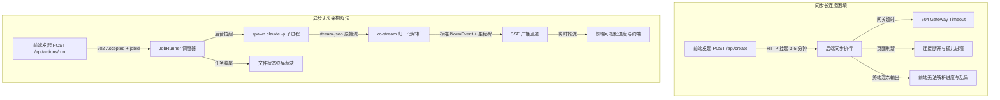
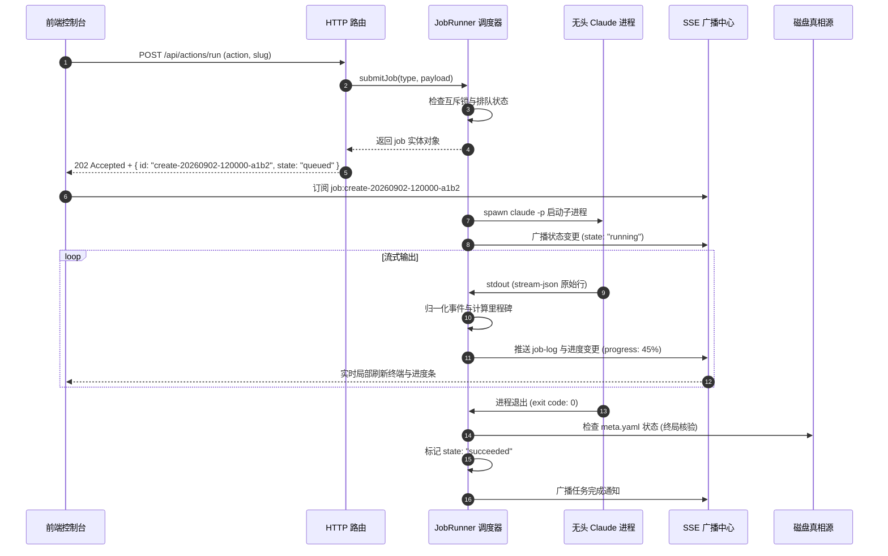
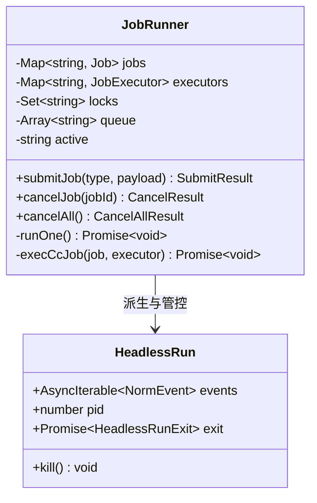
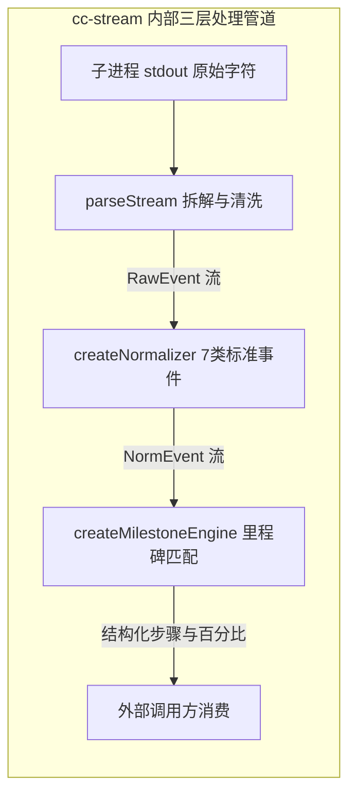
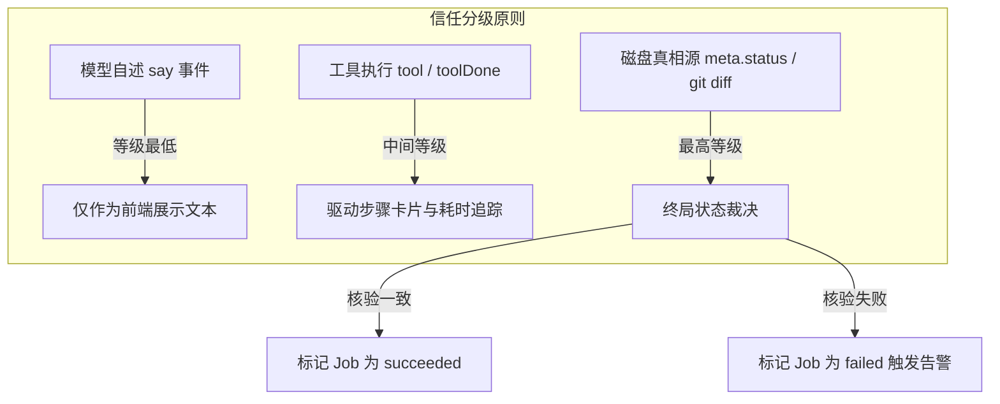
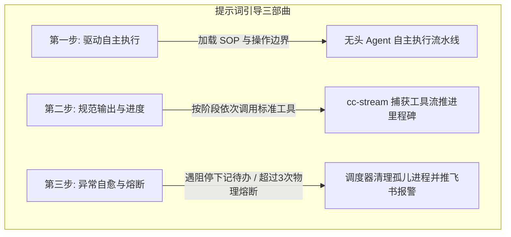
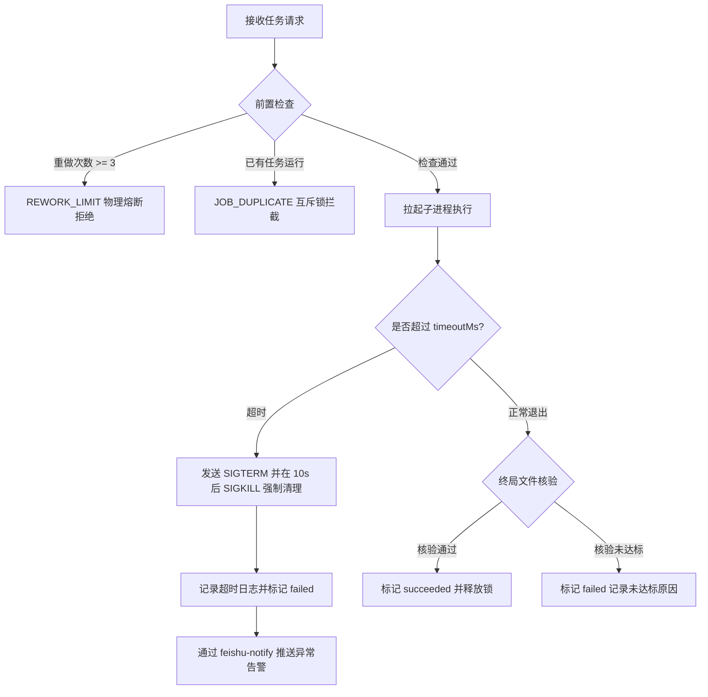
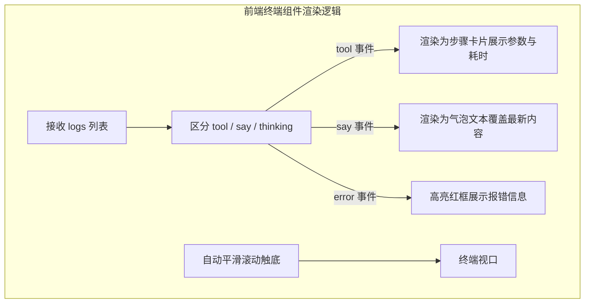

# 第 17 课：无头CC作业与进程流归一：如何用后台无头Agent实现无人值守全自动运转？

在自动化内容生产流水线中，创作、重做、配音与视频录制属于典型的长耗时作业。起草一篇两千字的口播文案需要消耗数十秒模型推理时间，批量合成高品质音频需要几十秒，而在无头浏览器中完成高分辨率的逐帧录屏通常需要两到三分钟。

如果把这些耗时数分钟的任务直接挂在常规的同步 HTTP 请求中，前端页面会长时间处于等待挂起状态。网络层随时可能抛出超时断开错误，浏览器刷新会导致正在运行的后台逻辑彻底失联。终端窗口中飞速滚动的 ANSI 颜色控制字符与无序的日志输出，也会让前端界面无法准确计算执行进度。



解决这类长跑作业的核心手段，是建立快写与慢跑严格分流的异步架构。前端发起耗时操作时，服务端秒级响应并返回任务唯一标识。后台派生出独立的无头 Claude Code 子进程接管执行，并通过零依赖的流式解析包将终端输出清洗为结构化事件流，最终通过轻量服务端事件通道实时同步到前端界面。

## 1. 长耗时 AI 作业的交互困境与架构解法

在桌面端工具或本地管理看板中，状态切换等轻量元数据修改通常只需要几毫秒。只要文件写入成功，接口立刻可以返回结果。但是一旦涉及调用大语言模型进行长文本创作、多轮质检打回重做或者调用音视频工具链，任务的执行特征就会发生本质变化。

### 1.1 为什么在 AI 作业场景下同步请求必定崩溃？

长耗时 AI 作业具有执行时间长、步骤不确定以及外部依赖多的特点。

在实际生产环境中，一个完整的视频创作作业包含四个连续阶段：
1. 文案起草：调用大模型读取项目背景与选题大纲，生成结构化口播稿，耗时通常在 20 到 40 秒。
2. 语音合成：调用 TTS 接口分段生成高采样率音频文件，若遇网络抖动或并发限制，耗时在 30 到 60 秒。
3. 动态录屏：启动自动化浏览器播放网页并使用虚拟屏幕进行逐帧捕获，耗时在 60 到 120 秒。
4. 封面生成与出审组装：调用生图模型生成多套封面并打包物料，耗时在 20 到 40 秒。

整个作业的端到端执行时间稳定在 2 到 5 分钟之间。如果采用传统的同步 HTTP 请求处理模式，系统会遭遇三个致命卡点：

第一是网关与代理超时。不管是 Nginx、各类 API 网关还是浏览器自带的 Fetch API，默认的连接超时时间通常设置在 30 秒到 60 秒之间。一旦超过这个窗口，网关就会主动切断连接并抛出 504 Gateway Timeout 错误。

第二是页面刷新引发的孤儿进程。用户在等待过程中一旦刷新页面或关闭标签页，底层的 TCP 连接立即重置。如果服务端将任务生命周期与 HTTP 连接强绑定，连接断开会导致后续状态更新丢失，服务端甚至可能抛出未捕获异常导致主进程崩溃。

第三是界面假死与状态盲区。同步等待会让前端应用处于阻塞状态，用户无法进行其他操作，也无法获知当前后台到底是在下载依赖、生成音频还是在等待模型返回。

如果前端控制台直接报错 `FetchError: network timeout at: http://localhost:5170/api/create`，说明有耗时较长的 AI 任务被直接写成了同步等待接口。排查时应当检查后端路由，确认所有执行时间超过 3 秒的操作都已经迁移到异步任务队列中。

### 1.2 标准异步 Job 架构模型

为了让系统具备高可用性与清晰的可观测性，长耗时任务必须遵循标准异步 Job 架构模型。



标准异步模型包含四个核心机制：
1. 秒级握手：客户端提交操作请求，服务端在 50 毫秒内完成前置合法性检查，生成全局唯一任务标识（`jobId`），将任务压入内存队列后直接返回 HTTP 202 Accepted 状态码与初始任务元数据。
2. 双向解耦：任务的实际执行完全由后台常驻的执行器调度，执行器的运行状态不依赖任何具体的 HTTP 请求上下文。
3. 状态投影：前端拿到 `jobId` 之后，通过服务端事件流（SSE）主动订阅该任务的状态频道，被动接收后端推送的事件。
4. 文件终局裁决：任务执行完毕后，执行器不以子进程自身的声明为准，而是去磁盘中检查产物文件与状态元数据，完成最终的状态闭环。

在任务生命周期中，定义六种确定性的任务状态：
- `queued`：任务已进入队列，等待空闲执行器槽位。
- `running`：子进程已成功拉起，正在持续接收流式输出并推进生产。
- `verifying`：子进程已退出，调度器正在检查磁盘真相源以判定最终结果。
- `succeeded`：产物与文件状态全部核验通过，任务圆满完成。
- `failed`：子进程执行报错、超时或终局文件核验未通过。
- `cancelled`：人工主动中止或被调度器熔断清理。

## 2. 后台执行器设计：JobRunner 与无头 Claude

后台执行器的核心职责是管理子进程生命周期、控制并发资源、维护任务状态机并将执行日志持久化到磁盘。在工程实现中，我们将这个模块封装为 `JobRunner` 类。



### 2.1 spawn claude -p 无头模式原理解析

在无人值守的自动化系统中，调用 Claude Code 不能依赖交互式终端界面，必须采用无头模式（Headless Mode）。

通过 Node.js 原生的 `child_process.spawn`，可以精准拉起无头命令行工具：

```typescript
import { spawn } from "node:child_process";
import type { SpawnOptions, HeadlessRun } from "./types.js";

export function runHeadlessCC(opts: SpawnOptions): HeadlessRun {
  const dropEnv = new Set(opts.dropEnv ?? ["ANTHROPIC_API_KEY"]);
  const env: NodeJS.ProcessEnv = {};
  for (const [key, value] of Object.entries(process.env)) {
    if (dropEnv.has(key)) continue;
    env[key] = value;
  }

  const bin = opts.claudeBin ?? "claude";
  const args = [
    "-p",
    opts.prompt,
    "--output-format",
    "stream-json",
    "--verbose",
    "--allowedTools",
    opts.allowedTools.join(","),
  ];

  const child = spawn(bin, args, {
    cwd: opts.cwd,
    env,
    stdio: ["ignore", "pipe", "pipe"],
  });

  return {
    events: parseAndNormalize(child.stdout!),
    pid: child.pid ?? -1,
    kill: () => child.kill("SIGTERM"),
    exit: waitForExit(child),
  };
}
```

启动无头子进程时有四个关键设计考量：

第一是参数组合。`-p` 参数用于传入具体的执行提示词；`--output-format stream-json` 让子进程把运行过程转换为逐行的结构化 JSON 流；`--verbose` 确保在流式输出中包含详细的工具调用参数；`--allowedTools` 明确指定允许无头 Agent 调用的工具白名单（例如 `Bash,Read,Write,Edit,Skill`），防止无头进程因调用未授权工具而弹出等待人工确认的交互提示。

第二是标准输入输出配置。`stdio` 显式设置为 `["ignore", "pipe", "pipe"]`。将 `stdin` 设置为 `ignore`，从物理上切断子进程等待用户终端输入的可能；将 `stdout` 和 `stderr` 设置为 `pipe`，以便父进程完整捕获数据流。

第三是环境变量隔离与净化。在启动子进程时，默认从子进程环境中剔除 `ANTHROPIC_API_KEY`。在本地开发者机器上，Claude Code 通常依赖全局的 OAuth 登录认证状态。如果子进程意外继承了父环境中配置的第三方 API 密钥，可能会导致认证通道错乱或权限降级。

第四是错误日志环形缓冲。后台维护一个容量为 50 行的环形数组，持续收集子进程 `stderr` 的输出。一旦子进程异常退出，能立刻从内存中提取出最后 50 行原始错误信息用于排障。

如果子进程拉起后立即以退出码 1 退出，并且在 stderr 中打印 `Error: Command failed: claude -p ... Tool use requires confirmation`，说明 `--allowedTools` 参数遗漏了无头任务实际调用的工具名称，导致命令行工具退化为交互确认模式并直接报错。

### 2.2 单任务串行排队锁与并发防御

AI 生产流水线对系统资源消耗极大。生成图片会占用显存与并发网络请求，无头浏览器录屏会消耗大量 CPU 与内存算力，高频调用模型还会触发接口限流。如果前端用户连续点击多个生成按钮，任由后台并发拉起多个无头子进程，系统资源会在短时间内被耗尽。

为了保证系统的稳定运行，`JobRunner` 采用严格的单并发串行调度与细粒度互斥锁机制：

```typescript
export class JobRunner {
  private jobs = new Map<string, Job>();
  private locks = new Set<string>();
  private queue: string[] = []
  private active: string | null = null;

  public submitJob(type: JobType, lockKey: string, executor: JobExecutor): SubmitResult {
    // 互斥锁防御：检查是否已有相同实体的任务在运行或排队
    if (this.locks.has(lockKey)) {
      return {
        ok: false,
        code: "JOB_DUPLICATE",
        message: `条目 ${lockKey} 已有正在运行或排队的任务，请勿重复触发`,
      };
    }

    const job = this.createJobEntity(type);
    this.jobs.set(job.id, job);
    this.locks.add(lockKey);
    this.queue.push(job.id);

    // 触发任务调度循环
    this.scheduleNext();
    return { ok: true, job };
  }

  private async scheduleNext(): Promise<void> {
    if (this.active !== null || this.queue.length === 0) {
      return;
    }

    const nextId = this.queue.shift()!;
    this.active = nextId;
    const job = this.jobs.get(nextId)!;

    job.state = "running";
    this.notifyJobChange(job);

    try {
      await this.executeJob(job);
    } finally {
      this.active = null;
      this.locks.delete(job.lockKey);
      this.scheduleNext();
    }
  }
}
```

这套并发防御体系包含三个核心要素：
1. 全局单执行槽：`active` 变量记录当前正在运行的任务 ID。只要有任务在跑，后续提交的任务只能停留在 `queue` 队列中，状态标记为 `queued`。
2. 实体互斥锁：`locks` 集合基于条目的唯一标识（如内容目录名 `slug`）加锁。即使当前有空闲队列容量，同一个条目也不允许同时存在两个重做或创作任务。
3. 自动出队驱动：当正在执行的任务无论是成功、失败还是取消而终结时，`finally` 代码块都会释放当前的执行槽与互斥锁，并主动调用 `scheduleNext` 启动队列中的下一个任务。

在处理任务取消和超时清理时，必须采用分阶段的优雅终止策略。先向子进程发送 `SIGTERM` 信号，请求其正常退出并保存已有文件。同时启动一个 10 秒的定时器，如果 10 秒宽限期过后子进程仍未退出，则补发强制性的 `SIGKILL` 信号，彻底消灭孤儿进程。

### 2.3 作业日志落盘与历史回放

为了实现运行记录的可追溯性，所有无头子进程的原始事件必须实时持久化到磁盘。

落盘日志统一保存在 `logs/jobs/<jobId>.jsonl` 路径下。在创建无头子进程时，父进程通过 `node:fs` 的 `createWriteStream` 打开一个追加写入流：

```typescript
import { createWriteStream, mkdirSync } from "node:fs";
import { dirname } from "node:path";

export function setupJobLogging(logPath: string) {
  mkdirSync(dirname(logPath), { recursive: true });
  const logStream = createWriteStream(logPath, { flags: "a" });

  const onRawEvent = (rawLine: string) => {
    logStream.write(rawLine + "\n");
  };

  const closeLogStream = () => {
    return new Promise<void>((resolve) => {
      logStream.end(() => resolve());
    });
  };

  return { onRawEvent, closeLogStream };
}
```

使用常驻的 `WriteStream` 实例而不是在每收到一行事件时调用 `fs.appendFile`。频繁的并发异步文件追加操作无法保证写入顺序，而流式写入能够确保磁盘中的日志顺序与终端子进程的吐出顺序严格一致。

当用户刷新前端页面或者通过 `GET /api/jobs/:id` 查询历史作业时，后端服务直接从磁盘中读取对应的 `.jsonl` 文件，将其送入解析管道重新执行一遍归一化处理。这种设计使得历史任务无需依赖数据库即可随时完整回放。

## 3. 进程输出归一化：打造零依赖叶子包 cc-stream

在设计流式解析层时，必须坚持底层通用的原则。直接将无头进程的原始字符透传给前端会导致渲染错乱；而如果将自媒体流水线的具体业务词写死在底层解析器里，又会让模块失去通用性。

为此，我们将子进程的流解析与事件转换提炼为一个完全独立的叶子包：`cc-stream`。



### 3.1 为什么严禁将原始终端字符串直接透传给前端？

很多开发者在对接 CLI 工具时，习惯直接把子进程的 `stdout.on('data')` 原始字符串转发给前端 WebSocket 或 SSE。在复杂无头 Agent 场景下，这种做法会带来三大严重问题：

第一是 ANSI 转义字符与光标控制码污染。命令行程序在终端中渲染颜色、进度条和光标回退时，会输出形如 `` 或 `` 的控制字符。如果在网页中直接当作纯文本显示，用户会看到大量混乱的乱码；如果直接用富文本注入，还存在 XSS 安全隐患。

第二是增量消息的重复与膨胀。在 `stream-json` 模式下，同一个回复消息的文本块会随着大模型生成而多次吐出包含相同 `messageId` 的事件。如果前端不做状态去重与覆盖合并，页面上会出现数十段重复的文本内容。

第三是缺少结构化的进度语义。前端需要明确知道任务当前处于哪个具体步骤、完成了百分之多少，以及各个工具调用的输入输出。原始字符串不包含这些结构化元数据。

在架构分层上，`cc-stream` 保持高度纯粹：它完全不包含诸如文章、视频、抖音、飞书等任何具体的业务概念，只处理进程通信与流式数据转换协议。

### 3.2 cc-stream 内部三层处理管道

`cc-stream` 的处理过程分为清晰的三层管道架构。

#### 第一层：parseStream 流式拆解

第一层负责从子进程的二进制流中按行提取出合法的 JSON 字符串，并过滤掉空行与格式损坏的片段。

```typescript
import readline from "node:readline";
import type { Readable } from "node:stream";
import type { RawEvent } from "./types.js";

export async function* parseStream(
  stdout: Readable,
  opts?: { onRaw?: (line: string) => void },
): AsyncGenerator<RawEvent> {
  const rl = readline.createInterface({
    input: stdout,
    crlfDelay: Infinity,
  });

  for await (const line of rl) {
    const trimmed = line.trim();
    if (!trimmed) continue;
    
    // 触发原始日志落盘钩子
    opts?.onRaw?.(trimmed);

    try {
      const parsed = JSON.parse(trimmed) as RawEvent;
      yield parsed;
    } catch {
      // 忽略非 JSON 格式的终端脏字符（如极个别工具直接打印到底层的提示）
      continue;
    }
  }
}
```

#### 第二层：createNormalizer 事件归一化

第二层将形态各异的原始事件收敛为 7 类标准的内部事件（`NormEvent`）：
- `started`：会话开始启动，附带 `sessionId`。
- `tool`：Agent 决定调用某个工具，附带工具名称与输入参数。
- `toolDone`：工具执行完毕，附带执行结果、耗时、截断后的输出摘要（`preview`，默认截取前 20 行）以及中断标记。
- `say`：Agent 对用户的文本回复，相同 `messageId` 采用最新消息覆盖语义。
- `thinking`：模型的思考过程记录。
- `stalling`：因触发 API 限流或重试而导致的暂时停滞信号。
- `done`：整体会话结束，附带执行耗时、轮数与 Token 开销。

```typescript
import type { NormEvent, RawEvent } from "./types.js";

export function createNormalizer(): (raw: RawEvent) => NormEvent[] {
  const seenToolIds = new Set<string>();

  return (raw: RawEvent): NormEvent[] => {
    switch (raw.type) {
      case "system":
        if (raw.subtype === "init") {
          return [{ kind: "started", sessionId: String(raw.session_id ?? "") }];
        }
        return [];
      case "assistant":
        return normalizeAssistant(raw, seenToolIds);
      case "user":
        return normalizeUser(raw);
      case "result":
        return [{
          kind: "done",
          ok: raw.subtype === "success",
          durationMs: typeof raw.duration_ms === "number" ? raw.duration_ms : undefined,
        }];
      default:
        return [];
    }
  };
}

function normalizeAssistant(raw: RawEvent, seen: Set<string>): NormEvent[] {
  const events: NormEvent[] = [];
  const message = raw.message as { id?: string; content?: Array<any> } | undefined;
  if (!message || !Array.isArray(message.content)) return events;

  for (const block of message.content) {
    if (block.type === "tool_use") {
      const toolId = String(block.id ?? "");
      // 核心防御：跨事件去重，同一 tool_use_id 只产出一次 tool 事件
      if (toolId && !seen.has(toolId)) {
        seen.add(toolId);
        events.push({
          kind: "tool",
          id: toolId,
          name: String(block.name ?? ""),
          input: block.input,
          at: typeof raw.timestamp === "string" ? raw.timestamp : undefined,
        });
      }
    }
  }
  return events;
}
```

#### 第三层：createMilestoneEngine 声明式里程碑计算

第三层通过外部注入的声明式规则表，将底层的工具调用映射为人类可读的业务里程碑与进度百分比。

```typescript
import type { MilestoneEngine, MilestoneHit, MilestoneTable, NormEvent } from "./types.js";

export function createMilestoneEngine(table: MilestoneTable): MilestoneEngine {
  const remaining = [...table];

  return {
    feed(ev: NormEvent): MilestoneHit[] {
      if (ev.kind !== "tool") return [];

      const hits: MilestoneHit[] = [];
      for (let i = 0; i < remaining.length; i++) {
        const rule = remaining[i];
        let matched = false;

        if (typeof rule.match.tool === "string") {
          matched = ev.name === rule.match.tool;
        } else if (rule.match.tool instanceof RegExp) {
          matched = rule.match.tool.test(ev.name);
        }

        if (matched && rule.match.input && typeof ev.input === "object" && ev.input !== null) {
          for (const [key, regex] of Object.entries(rule.match.input)) {
            const val = String((ev.input as Record<string, unknown>)[key] ?? "");
            if (!regex.test(val)) {
              matched = false;
              break;
            }
          }
        }

        if (matched) {
          hits.push({ id: rule.id, label: rule.label, at: ev.at ?? new Date().toISOString() });
          if (rule.once !== false) {
            remaining.splice(i, 1);
            i--;
          }
        }
      }
      return hits;
    },
  };
}
```

通过这种声明式设计，业务层只需定义一份匹配规则表（如匹配 `Read` 操作读取 `1-brief.md` 时对应读取大纲步骤，匹配调用 `douyin-publish` 时对应发布步骤），`cc-stream` 就能自动计算出进度。

### 3.3 终局裁决与模型自述解耦

在构建无人值守流水线时，有一条至关重要的信任分级纪律：模型的自我陈述仅供展示，绝对不能用作系统状态翻转的依据。

大语言模型在生成文本时具有概率性特征。它可能会在回复文本中宣称已经成功完成视频录制并发布，但实际上底层的脚本可能因为参数错误根本没有执行成功。



因此，当无头进程退出之后，调度器必须执行独立的终局裁决逻辑（`verdict`）。

例如对于创作任务，裁决器直接调用底层文件工具读取条目的 `meta.yaml` 文件。只有当文件中的 `status` 字段确实已经被翻转为 `review`，且目录中确实存在生成的口播稿与封面图片时，任务才会被标记为 `succeeded`；如果模型进程正常退出但文件状态未变，调度器会将其判定为 `failed`，并记录状态未达标的明确错误。

## 4. 提示词引导全流程与异常自愈实战

在无头模式下，提示词不仅是生成内容的模板，更是指导无头 Agent 按照特定规范使用工具、报告进度并处理异常的作业指导书。

通过精确的提示词引导，可以实现自主执行、规范输出与异常自愈的三步闭环。



### 4.1 第一步：编写提示词驱动无头 Claude Code 自主执行

驱动无头 Agent 的第一步，是明确授权来源、圈定操作范围并指定 SOP 执行规范。

提示词单一真相源必须集中维护，避免散落在各个路由或组件中。

以下是驱动内容创作任务的标准提示词实现：

```typescript
export const createPrompt = (slug: string, dir: string): string =>
  `人已在看板工作台对已选题内容 ${slug}（目录 ${dir}）点了开始创作，这就是本轮创作的授权来源。` +
  `请读 pipeline/2-create.md 与该条目的 1-brief.md，按口播四件套执行创作：写口播稿（2-script.md）→配音→录屏→封面。` +
  `完成后用 media flip ${slug} review 把状态翻到出审，并按 pipeline/3-review.md 经 feishu-notify 推审核卡。` +
  `项目铁律：全自动只跑到出审为止，绝不发布、绝不把状态翻到 approved/scheduled/published；` +
  `中途遇到需要人对齐的卡点就停下，把待办记进条目对应文件里，不要假装已经完成。`;
```

这份提示词包含五个关键约束要素：
1. 明确授权来源：开头第一句指明用户已经在看板点击授权，防止 Agent 反复询问是否可以继续。
2. 指定规范文件：引导 Agent 使用 `Read` 工具阅读项目的规范文件（`pipeline/2-create.md`）与输入大纲（`1-brief.md`），确保动作对齐标准操作流程。
3. 严格限定收尾动作：强制要求创作完成后调用标准 CLI 命令（`media flip`）翻转状态，并通过飞书通知模块推送审核卡片。
4. 设立红线铁律：严禁无头任务越权将状态修改为发布状态，确保人工审核闸口的有效性。
5. 诚实上报卡点：明确要求遇到未解决的卡点时停止执行并将待办写入文件，严禁伪造完成结果。

### 4.2 第二步：编写提示词引导无头 Agent 执行结构化输出与流式归一

为了让底层的 `cc-stream` 能够平滑捕获执行进度，提示词应当引导 Agent 按照标准工具链顺序发起操作，产生确定性的工具调用序列。

在处理打回重做任务时，提示词引导无头 Agent 按照阅读大纲、修改文案、重新录制与通知出审的固定次序推进：

```typescript
export const reworkPrompt = (slug: string, dir: string, reason: string, nth: number): string =>
  `内容条目 ${slug}（目录 ${dir}）被人在看板打回，这是第 ${nth} 次重做，打回原因：${reason}。` +
  `请读 pipeline/2-create.md 与该条目的 1-brief.md、2-script.md、3-review.md，针对原因重做创作` +
  `（口播稿改 2-script.md，必要时重配音/重录屏），完成后用 media flip ${slug} review 翻回出审、` +
  `在 3-review.md 记一行重做说明，并按 pipeline/3-review.md 经 feishu-notify 重新推审核卡。` +
  `若遇到需要人工对齐的节点，停下并在 3-review.md 记录待办，不要假装完成。`;
```

当 Agent 收到这份提示词后，会依次触发以下工具调用：
1. `Read` 工具读取 `1-brief.md` 和 `2-script.md`：触发里程碑引擎匹配阅读上下文阶段，进度推进至 20%。
2. `Edit` 或 `Write` 工具修改文案：触发文案重构里程碑，进度推进至 50%。
3. `Skill` 或 `Bash` 工具调用录屏与配音：触发媒体重制里程碑，进度推进至 80%。
4. `Bash` 工具执行 `media flip` 与 `feishu-notify`：触发状态收尾里程碑，进度推进至 100%。

通过提示词中对工具动作的标准化约束，无头 Agent 的自由发散行为被收敛到可预测的工程轨道上，使得后台能够准确绘制进度仪表盘。

### 4.3 第三步：任务卡死、进程异常与自愈熔断机制

在全自动运行过程中，无头进程可能会遇到死循环、网络挂起或外部服务崩溃。必须在调度器层面配合自愈提示词建立防死锁与熔断机制。



自愈与熔断机制包含四层安全防线：

第一层是重做次数物理熔断。如果同一个条目的打回次数达到了上限（如 `REWORK_LIMIT = 3`），调度器在前置检查阶段直接拒绝提交，防止 Agent 在同一个错误逻辑上反复消耗 Token 算力。此时系统会自动将任务状态挂起，并在管理界面提示人工介入。

第二层是硬超时熔断。在 `JobRunner` 中为每类任务配置硬超时时间（例如创作任务配置 15 分钟，发布任务配置 5 分钟）。一旦超过时间阈值，调度器自动触发双阶段优雅退出逻辑，先发送 `SIGTERM` 并在 10 秒后强杀进程，彻底释放被占用的系统资源。

第三层是提示词中的防卡死自愈引导。在提示词中明确注入兜底策略：如果外部接口返回失败（例如第三方平台 Cookie 失效或余额耗尽），提示词严禁 Agent 尝试自动弹窗登录或盲目重试，要求其如实记录错误并正常退出。

第四层是飞书报警与人工接管。当任务发生超时、熔断或核验失败时，调度器自动组装失败摘要，通过飞书通道向管理员推送报警卡片，实现异常发生时的快速人工感知。

## 5. 前端实时订阅与日志渲染实战

有了后端的无头执行器与流式解析包，前端只需要通过轻量 Hook 建立长连接订阅，就能实现平滑的终端交互体验。

### 5.1 前端 useJob 自定义 Hook 实现

在前端组件中，通过自定义 Hook 封装 SSE 连接管理、重连机制与状态更新：

```typescript
import { useState, useEffect } from "react";
import type { Job, JobLogEvent } from "../api-types.js";

export function useJob(jobId: string | null) {
  const [job, setJob] = useState<Job | null>(null);
  const [logs, setLogs] = useState<JobLogEvent[]>([]);
  const [connected, setConnected] = useState(false);

  useEffect(() => {
    if (!jobId) {
      setJob(null);
      setLogs([]);
      return;
    }

    const sse = new EventSource(`/api/events`);

    sse.addEventListener(`job:${jobId}`, (e: MessageEvent) => {
      const updatedJob = JSON.parse(e.data) as Job;
      setJob(updatedJob);
    });

    sse.addEventListener(`job-log:${jobId}`, (e: MessageEvent) => {
      const logEvent = JSON.parse(e.data) as JobLogEvent;
      setLogs((prev) => [...prev, logEvent]);
    });

    sse.onopen = () => setConnected(true);
    sse.onerror = () => setConnected(false);

    return () => {
      sse.close();
      setConnected(false);
    };
  }, [jobId]);

  return { job, logs, connected };
}
```

该 Hook 分离了两个独立的事件通道：`job:<id>` 通道用于接收任务的高层状态变更（如状态流转、当前里程碑与进度百分比）；`job-log:<id>` 通道用于接收细粒度的日志事件（如具体的工具调用与输出片段）。这种分离避免了日志高频推流导致整个任务对象的无谓重绘。

### 5.2 模拟终端组件与交互设计

在控制台界面中，终端模拟器组件采用暗黑主题，提供进度看板、步骤展开折叠与一键取消功能。



在渲染日志时，前端对不同类型的事件应用专门的视觉模板：
- 对于 `tool` 和 `toolDone` 事件，渲染为带有状态指示灯的折叠步骤卡片，显示调用的工具名、耗时以及前 20 行的输出预览。
- 对于 `say` 事件，渲染为对话气泡，并根据 `messageId` 实现打字机效果的平滑覆盖。
- 对于 `stalling` 事件，在界面顶部弹出黄色提示条，告知用户当前正在进行接口重试。
- 在任务处于 `running` 状态时，界面右上角常驻一个红色的终止任务按钮，点击后向后端发送取消请求，触发子进程的优雅强杀。

如果浏览器控制台频繁打印 `EventSource connection failed: reconnecting...`，通常是因为后端服务重启或本地反向代理配置了错误的连接超时时间。排查时应确认后端的 SSE 响应头包含了 `Content-Type: text/event-stream`、`Cache-Control: no-cache` 与 `Connection: keep-alive`，并且没有被任何中间件开启响应缓冲。

## 6. 验收标准与避坑指南

完成无头任务系统与进程流归一化模块的搭建之后，系统应当达到以下运行标准：

1. 异步响应无卡顿：在控制台点击开始创作或打回重做按钮，页面在 100 毫秒内弹出任务进度浮层，页面主线程保持流畅响应。
2. 进度与日志流式呈现：在任务弹窗中，能够实时观察到后台无头 Claude 进程的工具调用序列，进度条根据里程碑规则平滑推进。
3. 超时与取消自愈可靠：对运行中的任务点击取消按钮，后台子进程在 10 秒内被彻底销毁，互斥锁与执行槽立即释放，无任何僵尸进程残留。
4. 终局文件核验严格：任务完成判定不依赖模型自述，文件状态准确翻转并完成飞书通知闭环。

在工程落地过程中，总结出四个核心避坑要点：

第一是避免环境变量泄露。拉起无头子进程时，必须清理不必要的认证环境变量，防止无头 Agent 误用错误凭据导致权限降级或报错。

第二是防止孤儿进程扩散。无论是任务超时、异常报错还是父进程退出，都必须通过进程树探测或双阶段信号发送（`SIGTERM` 加宽限期后 `SIGKILL`）彻底清理子进程。

第三是严禁直接信任模型自报结果。无论模型在文本中如何宣称任务已经圆满完成，系统必须通过检查磁盘上的 `meta.yaml` 或真实产物文件来执行最终裁决。

第四是保持日志写入串行化。持久化子进程原始流时，必须使用单实例的写入流管理写入顺序，切忌使用并发的无序文件追加操作破坏日志时序。
