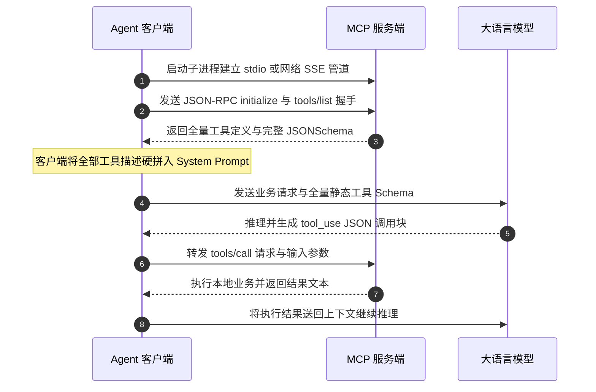
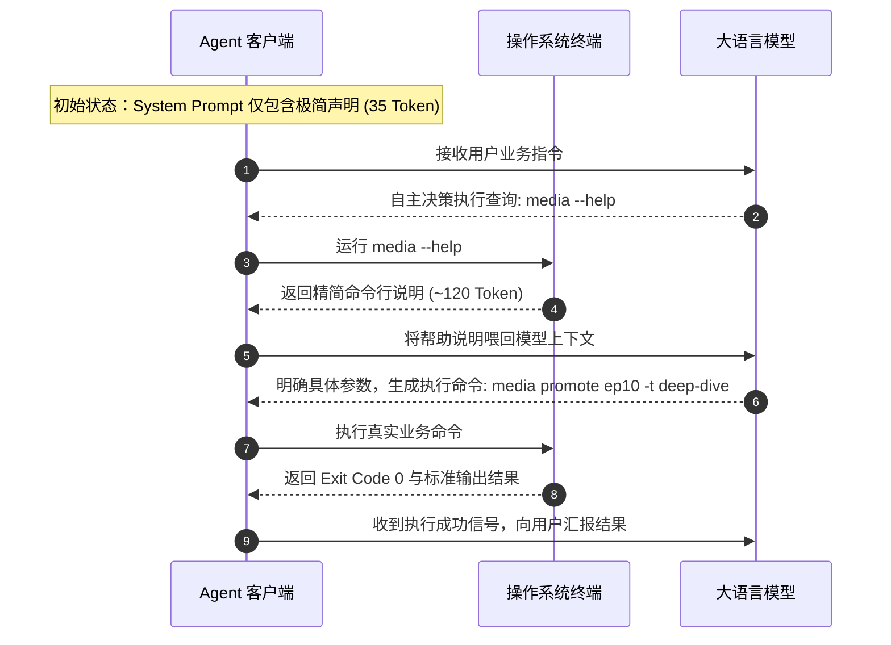
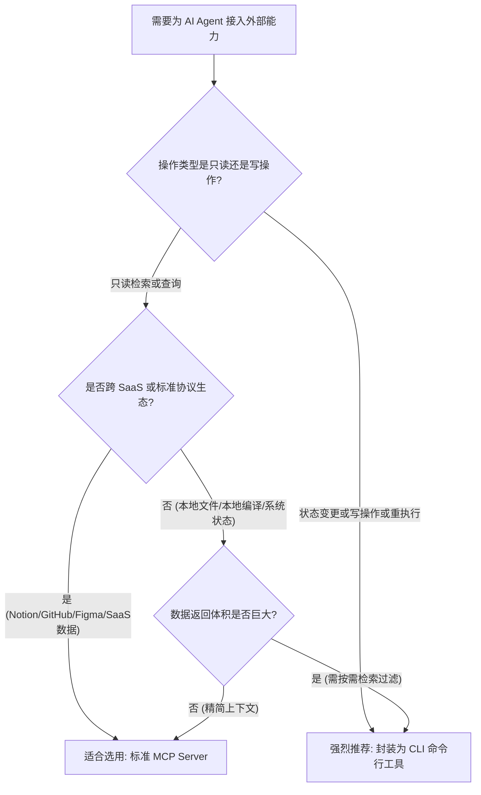

# 架构抉择：AI 时代 CLI 为什么比 MCP 更好用

## 1. MCP 的协议初衷与上下文代价

大语言模型接入外部系统的探索经历过多轮演进。从早期的函数调用（Function Calling），到后来的插件体系，再到由 Anthropic 发起并开源的 MCP（Model Context Protocol，模型上下文协议），业界一直在尝试为大模型与外部工具之间建立一套通用标准。

标准化的初衷是降低系统集成的边际成本。在 MCP 出现前，每接入一个 SaaS 平台或本地数据库，开发者都需要在客户端手写一套工具描述、参数序列化与错误重试逻辑。MCP 试图把这件事标准化：服务端暴露出统一的工具、资源与提示词接口，客户端通过统一的传输协议完成握手与调用。

这个设想在理论上很完整，但在实际工程落地过程中，特别是面对复杂的生产自动化流水线时，MCP 暴露出严重的上下文开销与稳定性瓶颈。

### 1.1 什么是 MCP：跨应用数据连接的标准协议

MCP 的核心定义是一套基于 JSON-RPC 2.0 规范的双向客户端与服务端通信协议。在协议规范中，它定义了三种核心能力：资源（Resources）、提示词（Prompts）以及工具（Tools）。其中在 Agentic 系统中使用最广泛的是工具能力。

在标准 MCP 架构中，客户端（如 Claude Desktop、Cursor 或各种自研 Agent 框架）与服务端（MCP Server）建立连接，底层通信通道通常分为两类：基于本地子进程的标准输入输出（stdio），或者基于网络的 HTTP Server-Sent Events（SSE）。



上图展示了 MCP 的典型通信全流程。左边是客户端与服务端在建立连接时获取全量工具定义，右边是客户端将所有工具定义注入提示词后发起模型推理与调用。

我们来看一次真实的 MCP 协议底层握手细节。客户端启动时，会向 MCP Server 的标准输入写入如下 JSON-RPC 报文：

```json
{
  "jsonrpc": "2.0",
  "id": 1,
  "method": "tools/list",
  "params": {}
}
```

服务端在收到该请求后，必须在标准输出中一次性返回该 Server 注册的所有工具清单。每个工具不仅包含工具名称和功能简介，还包含极其详尽的 JSONSchema 规范，用于约束每一个输入字段的类型、枚举值、默认值以及描述信息：

```json
{
  "jsonrpc": "2.0",
  "id": 1,
  "result": {
    "tools": [
      {
        "name": "create_or_update_pull_request",
        "description": "Create a new pull request or update an existing pull request in a GitHub repository.",
        "inputSchema": {
          "type": "object",
          "properties": {
            "owner": {
              "type": "string",
              "description": "The owner of the repository."
            },
            "repo": {
              "type": "string",
              "description": "The name of the repository."
            },
            "title": {
              "type": "string",
              "description": "The title of the pull request."
            },
            "head": {
              "type": "string",
              "description": "The name of the branch where your changes are implemented."
            },
            "base": {
              "type": "string",
              "description": "The name of the branch you want the changes pulled into."
            },
            "body": {
              "type": "string",
              "description": "The contents of the pull request description."
            },
            "draft": {
              "type": "boolean",
              "description": "Indicates whether the pull request is a draft."
            }
          },
          "required": ["owner", "repo", "title", "head", "base"]
        }
      }
    ]
  }
}
```

这种设计模式要求客户端必须在每次与大模型交互时，将所有返回的 JSONSchema 转换为模型能理解的提示词格式，并无差别地挂载在提示词中。当系统集成的服务逐渐增多时，架构的隐患开始显现。

### 1.2 上下文经济学：静态 JSONSchema 全量常驻的成本陷阱

大语言模型本身没有操作系统进程的概念，它无法主动探测本地磁盘有哪些二进制文件，它之所以能够发起工具调用，完全依赖客户端在每次 HTTP 请求的上下文（System Prompt 或 Tools 数组）中，将所有工具的 Schema 定义完整提交给模型。

这就产生了一个关键的技术矛盾：MCP 的工具加载是静态全量常驻的，但实际业务调用却是极其稀疏的。

我们来测算一个典型的企业级 Agent 开发者环境。开发者通常会接入多个核心基础设施：

| 服务组件 | 工具数量 | 单个工具平均字符数 | 静态占用 Token 估算 |
|---|---|---|---|
| GitHub MCP Server | 26 个 | 420 字符 | 2800 Token |
| Notion MCP Server | 16 个 | 380 字符 | 1900 Token |
| PostgreSQL MCP Server | 12 个 | 350 字符 | 1300 Token |
| 本地文件系统 MCP Server | 14 个 | 310 字符 | 1400 Token |
| 网络检索 MCP Server | 6 个 | 290 字符 | 600 Token |

将上述 5 个常用 MCP Server 同时挂载到一个 Agent 宿主中，静态常驻的工具描述就已经达到了 74 个，合计占用的静态上下文高达 8000 Token。

在单轮问答中，8000 Token 也许只相当于几分钱的成本。但在真实的复杂工程任务中，Agent 需要经历思考、检索、编写代码、运行测试、修复报错等多轮往返迭代。一个中等复杂度的任务通常需要 20 到 30 轮推理。

我们通过数学公式计算一次 25 轮对话的累计 Token 消耗模型：

```text
总静态传输消耗 = 轮次数 N * 单轮常驻工具 Token 数 T_tools
               = 25 * 8000
               = 200000 Token
```

在这一次任务中，仅仅为了让大模型知道这 74 个工具的存在，系统就白白传输了 20 万个 Token。而在这 74 个工具中，当前任务实际调用的通常只有 2 到 3 个（例如只用到了读取文件和执行命令）。其余 70 多个工具在整整 25 轮对话中一次都没有被调用过，但它们的每一个字段描述都在每一轮中被全额计费。

有人会提出，现代大模型 API 支持提示词缓存（Prompt Caching），静态工具定义的输入费用可以打折。

但提示词缓存机制有三个工程边界：
第一，缓存只降低计费单价，不降低计算延迟。每次请求依然需要将这 8000 Token 的注意力权重完整加载到显存中参与计算。
第二，缓存命中具有严格的前缀匹配约束。一旦在多轮对话中前置上下文发生动态变化，缓存极易击穿，退化为全额计费。
第三，缓存完全无法解决上下文窗口物理容量被挤占的问题。

主流大语言模型虽然宣称具备 128k 或 200k 的上下文窗口，但在实际工程中，随着输入长度的增加，模型的推理延迟会呈非线性上升。当 8000 个 Token 被静态工具牢牢占据后，留给代码文件、错误堆栈、业务规则以及历史对话的有效记忆空间被直接压缩了接近一万 Token，这会导致长任务更容易发生遗忘与信息截断。

如果你在启动一个 Agent 客户端时发现刚发送一句你好就消耗了上万 Token，多半是因为配置文件里挂载了过多未经筛选的 MCP Server。

### 1.3 工具过载引发的模型注意力稀释与误调用

上下文的消耗不仅关乎成本，更直接关系到系统的推理质量与准确率。

从 Transformer 的底层注意力机制来看，模型在生成每一个 Token 时，都需要在当前所有上下文的 Key 向量与当前 Query 向量之间计算点积相似度。当上下文中塞满了 70 多个工具的 Schema 描述时，注意力权重会被这海量的参数字段强行稀释。

在学术界与工业界的大量测试中，这种现象被称为工具过载（Tool Overload）。它会引发三种典型的智能退化：

第一种是深层参数混淆与幻觉。
当上下文中同时存在 GitHub、Notion 和文件系统的多个工具时，多个工具都包含路径或标识符参数。例如 GitHub 工具需要 `repo` 和 `owner`，文件系统工具需要 `path`，Notion 工具需要 `database_id`。大模型在长上下文的注意力干扰下，经常会出现参数拼装混乱，例如在调用本地文件读取时误传了 `owner` 参数，导致工具在底层直接抛出非法参数异常。

第二种是工具选错与决策死循环。
当用户的输入存在轻微的语义模糊时，过多的工具会导致模型产生决策困惑。例如用户说查一下昨天的变动，上下文中同时存在 `git_diff`、`github_list_commits`、`file_get_recent_changes` 以及 `notion_query_database`。模型极易在第一轮选错工具，在得到非预期的返回后，又在错误的路径上尝试另一个不相关的工具，导致整个 Agent 陷入连续试错的死循环，最终耗尽轮次上限而宣告失败。

第三种是对系统核心业务规则的注意力丢失。
认知心理学和模型测试表明，当 System Prompt 中工具描述的篇幅远远超过开发者编写的业务规范时，模型对业务约束的服从率会断崖式下跌。开发者写在前面的代码必须写单测、发布前必须确认等核心纪律，很容易被后面数千行的 JSONSchema 淹没，导致模型在执行任务时直接跳过关键步骤。

```
+-------------------------------------------------------------+
|                  大模型单次请求接收的上下文结构              |
+-------------------------------------------------------------+
| 1. System Prompt (角色设定、业务纪律、安全规范)              |
+-------------------------------------------------------------+
| 2. 静态常驻 MCP 工具 (5-10个 Server, 70+ 工具, 8000+ Token) | <-- 严重稀释注意力
|    - tool_1: schema...                                      |
|    - tool_2: schema...                                      |
|    - tool_74: schema... (95% 本轮完全不使用)                 |
+-------------------------------------------------------------+
| 3. 历史对话记录与环境上下文 (真正需要模型推理的核心内容)     |
+-------------------------------------------------------------+
| 4. 用户当前指令                                              |
+-------------------------------------------------------------+
```

工具并不是越多越好。静态全量常驻的机制，从物理规律上就限制了 Agent 接入工具的规模上限。要打破这个上限，必须引入新的工具发现范式。

---

## 2. 命令行界面的底层机制与架构优势

在计算机发展史上，命令行界面（CLI）已经稳定演进了半个世纪。从最初的 Unix 设计哲学，到现代的 DevOps 自动化流水线，CLI 始终是软件工程中最通用的执行载体。

当大语言模型具备了稳定的 Shell 代码生成与终端标准输出解析能力后，CLI 作为 Agent 工具接口的优势被重新激活。它不仅解决了上下文常驻问题，更在执行确定性与系统架构通用性上展现出巨大的工程优势。

### 2.1 懒加载发现：按需执行 help 的零常驻机制

CLI 配合大模型使用的核心机制是懒加载发现（Lazy Tool Discovery）。

在基于 CLI 的架构体系中，客户端在向大模型发起对话时，不需要在提示词中注入任何具体业务命令的参数格式。客户端只需要提供一个标准的 Bash 执行环境，并在系统提示词中声明有哪些基础命令可用。

例如，在系统提示词中，只需要一行极其干净的声明：

```markdown
系统中已内置 media 命令行工具用于管理自媒体资产，遇到相关任务时可执行 `media --help` 查看具体用法。
```

这一句声明仅仅消耗 35 个 Token。

当大模型接收到与媒体资产相关的用户指令时，它不会盲目猜测参数，而是通过 Bash 工具在后台执行一次自省查询：

```bash
media --help
```

CLI 工具会在标准输出中打印出精简、高密度的帮助文本：

```text
Usage: media <command> [options]

自媒体生产线核心状态与资产管理命令行工具

Commands:
  status                     查看当前流水线与内容状态
  promote <slug>             将选题从 backlog 推进到生产阶段
  publish-done <slug>        记录发布完成并归档元数据
  check-env                  检查当前运行环境与鉴权状态

Options:
  -h, --help                 显示帮助信息
  -v, --version              显示版本号
```

模型读取该输出后，如果需要进一步明确某一个子命令的必填参数，再按需执行针对性的二级查询：

```bash
media promote --help
```

```text
Usage: media promote [options] <slug>

将选题从 backlog 推进到生产流水线

Arguments:
  slug                       内容唯一标识符 slug

Options:
  -t, --track <track>        内容赛道: deep-dive 或 news-skill (必填)
  --priority <level>         优先级: high, normal, low (默认: normal)
  -h, --help                 显示帮助信息
```

模型阅读了这短短 100 个字符的帮助信息后，参数格式已经完全清晰，随即执行真正的业务命令：

```bash
media promote ai-coding-ep10 --track deep-dive
```



上图展示了 CLI 懒加载机制的完整时序。左边是系统启动时极低的初始上下文占用，中间是大模型根据实际需要动态查询参数格式，右边是基于确定性命令执行业务逻辑。

这种懒加载模式在工程上有三大显著优势：

第一，真正的零常驻成本。
如果一个会话任务只涉及写代码和查资料，与 `media` 命令完全无关，那么该工具在整个会话期间占用的 Token 数量恒等于 0。哪怕你的系统中安装了 200 个不同的 CLI 工具，只要当前任务不需要，它们就不会占用任何上下文空间。

第二，极高的信息密度。
人类编写 CLI 帮助文档时，天然具备极高的文字精炼能力。一段 150 Token 的 `--help` 输出，其包含的功能说明和用法指引，往往比转换后长达 1500 Token 的嵌套 JSONSchema 更加清晰易懂。

第三，分层按需探索。
大模型可以像人类工程师一样，先查一级命令，再查二级子命令。这种层级化的探索机制，从物理上隔绝了不同子命令之间的参数混淆，有效避免了工具过载引发的注意力稀释。

### 2.2 确定性保障：标准输入输出与退出码状态机

在自动化工程中，确定性是衡量架构健壮性的核心指标。

MCP 协议依赖大模型生成结构化的 JSON 报文，再由客户端反序列化后通过 JSON-RPC 传递给服务端。大模型在生成复杂的嵌套 JSON 时，偶尔会出现标点缺失、键名拼写错误或者数据类型不符合 Schema 预期的情况。一旦反序列化失败，服务端只能返回一个通用的协议层报错，Agent 需要耗费额外的推理轮次来指导模型纠正 JSON 语法。

CLI 工具的输入是扁平化的命令行参数，输出是标准的 Unix 三流（stdin、stdout、stderr），以及系统底层的退出状态码（Exit Code）。

```text
POSIX 退出码标准定义：
0       ：执行成功，标准输出（stdout）包含预期的业务数据
1       ：常规业务错误，标准错误（stderr）包含明确的错误原因
2       ：命令语法或参数错误（如缺少必填参数）
126     ：命令不可执行（权限不足）
127     ：命令未找到（环境缺失）
```

在工程架构中，状态机无需依赖模型的主观判断，只需要检查子进程的退出状态码是否为 0，即可做出百分之百确定的分支判断。

我们来看一个在 Node.js 环境中封装的通用 CLI 执行与状态断言模块：

```typescript
import { execFile } from "node:child_process";
import { promisify } from "node:util";

const execFileAsync = promisify(execFile);

export interface ExecutionResult {
  code: number;
  stdout: string;
  stderr: string;
  isSuccess: boolean;
}

export async function executeCommand(
  binary: string,
  args: string[],
  options: { cwd?: string; timeoutMs?: number } = {}
): Promise<ExecutionResult> {
  const timeout = options.timeoutMs ?? 60000;
  
  try {
    const { stdout, stderr } = await execFileAsync(binary, args, {
      cwd: options.cwd ?? process.cwd(),
      timeout,
      maxBuffer: 10 * 1024 * 1024,
      env: { ...process.env, LANG: "zh_CN.UTF-8" }
    });
    
    return {
      code: 0,
      stdout: stdout.trim(),
      stderr: stderr.trim(),
      isSuccess: true
    };
  } catch (error: any) {
    return {
      code: typeof error.code === "number" ? error.code : 1,
      stdout: error.stdout ? String(error.stdout).trim() : "",
      stderr: error.stderr ? String(error.stderr).trim() : error.message,
      isSuccess: false
    };
  }
}
```

CLI 工具通过成熟的命令行解析库（如 Node.js 的 Commander、Python 的 Click、Rust 的 Clap）提供强参数校验。如果大模型遗漏了必填参数，CLI 会在标准错误中直接输出明确的提示，并退出非 0 状态码：

```text
error: required option '-t, --track <track>' not specified
```

大模型读取到这行清晰的错误提示后，能够在下一轮交互中立即纠正命令，而不需要解析深层嵌套的 JSON-RPC 异常堆栈。这种直截了当的报错反馈循环，收敛速度极快。

CLI 机制还天然支持 Unix 管道与重定向。当一个命令产生的原始数据非常庞大（例如几千行的日志或大型 JSON 文件）时，MCP 工具往往只能把整批数据一股脑塞进大模型的上下文，直接撑爆窗口；而在 CLI 模式下，大模型可以组合使用 `grep`、`awk`、`head`、`jq` 等系统工具，在操作系统层完成数据前置过滤：

```bash
media list --json | jq '.items[] | select(.status=="reviewing") | {slug, title}' | head -n 5
```

这一行命令在操作系统底层完成了数兆字节数据的筛选，最终只向大模型上下文中返回了精准的 5 条关键记录，上下文消耗从上万 Token 瞬间降低到几十 Token。

### 2.3 跨运行时通用：人类调试、自动化流水线与 AI 的公约数

在软件系统设计中，如果一个工具只能被特定的专有协议调用，它的生命力与可维护性会大打折扣。

当一个功能被封装为 MCP Server 时，它的调用边界被严格限制在支持 MCP 的 Agent 宿主内部：
- 人类开发者在日常维护时，无法在终端直接单步调用该工具，必须启动专门的 MCP Inspector 调试套件。
- 部署在服务器上的定时任务（如 Linux crontab）无法直接消费该能力。
- GitHub Actions 或 GitLab CI 等自动化构建流水线，无法像执行常规 Shell 脚本那样便捷地集成该能力。

CLI 则是人类开发者、CI/CD 自动化流水线与 AI Agent 三者的最大公约数。

```
+-------------------------------------------------------------------+
|                        统一的底层能力层                            |
|                     (media CLI / git / ffmpeg)                    |
+-------------------------------------------------------------------+
       ^                           ^                           ^
       |                           |                           |
+---------------+          +---------------+          +---------------+
| 人类开发者终端 |          | CI/CD 自动化  |          | AI Agent 调度 |
| (本地手动单测)|          | (定时无头执行)|          | (按需懒加载)  |
+---------------+          +---------------+          +---------------+
```

当核心业务逻辑被沉淀为一个标准的 CLI 二进制文件或脚本后：
1. 人类开发者在终端中敲入 `media status`，0.1 秒内即可完成手动单测与功能验证。
2. 自动化流水线在触发构建任务时，直接通过 Shell 脚本调用 `media check-env` 完成前置环境门禁检测。
3. AI Agent 在执行自主任务时，通过子进程按需调用同一条命令完成状态流转。

三者共享同一份业务逻辑代码，走的是同一套参数校验规则，输出的是同一种日志格式。开发者不需要为人类和 AI 维护两套重复的接口，也不存在只有 AI 能跑、人类在本地无法复现的调试黑盒。

在设计现代 CLI 工具时，还可以采用双模输出规范：默认输出适合人类快速阅读的精简文本表格，当传入 `--json` 标志时输出紧凑的结构化 JSON。这样一套工具即可同时满足人类眼球与大模型高精度解析的双重诉求。

---

## 3. MCP 与 CLI 的全方位技术选型矩阵

为了在架构设计中做出理性的技术抉择，我们需要将 MCP 与 CLI 放置在同一维度下进行严谨的工程比对。

下表系统梳理了两种架构形态在上下文消耗、排错成本、进程模型、状态确定性等核心维度的差异：

| 评估维度 | MCP 协议工具 | CLI 命令行工具 |
|---|---|---|
| 上下文消耗 | 每次请求全量常驻 JSONSchema，挂载多个服务常驻数千 Token | 采用按需懒加载，平时 0 Token，查询 help 仅消耗一两百 Token |
| 调试排错 | 依赖专门的 MCP Inspector 或复杂宿主，难以单步复现 | 终端直接敲命令验证，支持管道、重定向与断点调试 |
| 跨环境复用 | 强绑定在支持 MCP 规范的 Agent 客户端内部 | 人类终端、CI/CD 脚本、Cron 任务、Web 后端通用 |
| 状态确定性 | 依赖模型生成的结构化 JSON，易出现格式与类型漂移 | 参数硬类型校验，Unix Exit Code 与 stderr 明确指示状态 |
| 进程生命周期 | 依赖常驻的 stdio 或 SSE 长连接，进程崩溃易引发会话挂起 | 短生命周期子进程，用完即销毁，进程故障完全隔离 |
| 数据传输开销 | 大体积数据必须全量塞入上下文返回 | 支持在终端就地重定向到本地文件或通过 grep 过滤 |
| 安全控制面 | 粒度较粗，通常由宿主做粗粒度的工具白名单放行 | 可精细结合操作系统权限、sudo、容器隔离与参数校验门禁 |

结合上述对比，我们可以深入剖析几个直接影响生产系统稳定性的关键维度。

### 3.1 上下文与费用开销对比

上下文开销的差距在长流程 Agent 中会被成倍放大。

假设一个典型的自动化工程包含 40 个操作工具（涉及文件处理、代码构建、测试运行、数据库操作、部署发布）。

在 MCP 方案下：
- 40 个工具的 JSONSchema 定义合计占用约 5000 Token。
- 每次 Agent 与大模型交互，这 5000 Token 都作为 Prompt 的一部分被全量提交。
- 一个包含 30 步推理的长流程任务，累计产生的工具 Prompt 消耗为：`5000 * 30 = 150000` Token。

在 CLI 方案下：
- System Prompt 仅声明 3 个主命令（如 `fs-tool`、`build-tool`、`deploy-tool`），占用约 80 Token。
- Agent 在第 1 步执行 `build-tool --help`，产生 200 Token 的输出并送回上下文。
- 随后的 29 步中，Agent 直接调用具体的构建命令，无需重复查看帮助。
- 整个 30 步任务中，工具描述相关的上下文总消耗不超过 1000 Token。

两者在工具描述上的上下文消耗相差了 150 倍。省下来的上下文窗口，不仅大幅降低了 API 账单支出，更为模型容纳真实的业务日志和长代码片段留出了宝贵空间。

### 3.2 调试排错与本地单测体验对比

当生产环境出现偶发性工具调用失败时，排错链路的长短决定了故障恢复的速度。

在 MCP 架构中，排查一个工具调用故障通常需要经历以下链路：
1. 检查 Agent 客户端的配置文件，确认 MCP Server 启动参数是否正确。
2. 确认 stdio 进程是否存活，环境变量是否正确注入。
3. 检查客户端发出的 JSON-RPC 请求报文，确认 params 内部的字段是否被模型正确填充。
4. 查看 MCP Server 内部的控制台日志（这些日志往往被 stdio 管道吞掉，必须重定向到特定本地文件）。

如果你在这一步报错了，多半是 MCP Server 内部的异常没有被捕获，直接往 stdout 输出了非 JSON 文本，导致客户端的 JSON-RPC 解析器崩溃。

而在 CLI 架构中，排查故障只需要人类工程师在终端重现那一行命令：

```bash
media promote test-article-slug --verbose
```

所有标准输出、标准错误、堆栈跟踪会毫秒级呈现在终端屏幕上。开发者可以使用系统自带的 `gdb`、`lldb`、`node --inspect` 或简单的 `console.log` 进行断点调试。一旦在终端验证修复，Agent 端的调用就会立刻恢复正常。

### 3.3 进程生命周期与稳定性对比

进程生命周期模型的差异，是很多架构师在选型时容易忽略的隐形炸弹。

MCP 服务端通常采用长生命周期模型。客户端在启动时通过子进程拉起 MCP Server，并通过标准输入输出流维持长连接。

```
[MCP 长连接模型]
Agent 宿主进程 <====( stdio 或 SSE 双向长连接 )====> MCP Server 守护进程 (长期保活)
                                                      |
                                                      +--> 发生未捕获异常或内存泄漏
                                                      |
Agent 宿主感知连接中断，整轮会话强行挂起 <-------------+
```

长生命周期模型带来三个致命问题：
1. 内存泄漏累积：长时间运行的 MCP Server 如果存在内存泄漏或未释放的文件句柄，最终会导致进程被操作系统 OOM 杀死。
2. 故障级联：MCP Server 内部一旦发生未捕获的全局异常导致进程退出，客户端与服务端的通信管道会瞬间关闭。许多 Agent 宿主无法优雅处理连接中途断开，直接导致整条对话任务彻底失败。
3. 状态污染：MCP Server 在内存中保存的全局变量会在多次调用间相互干扰，破坏了工具调用的无状态幂等性。

CLI 工具采用的是极其健壮的短生命周期模型（Fork-and-Exec）。

```
[CLI 短生命周期模型]
Agent 宿主进程 (稳定运行)
      |
      +-- 产生调用需求 --> 派生临时子进程: media promote (执行完毕立即销毁)
      |
      +-- 产生调用需求 --> 派生临时子进程: media status  (执行完毕立即销毁)
```

Agent 每发起一次操作，操作系统就创建一个全新的轻量级子进程，命令执行完毕输出结果后，进程立刻退出并由操作系统完全回收全部内存与文件资源。

哪怕某一次命令因为极端输入发生了段错误（Segmentation Fault）或抛出未捕获异常，崩溃的也仅仅是那一个短暂的子进程，Agent 宿主进程毫发无损，只会收到一个非 0 退出码和 stderr 错误信息，并能在下一轮尝试中优雅恢复。

### 3.4 参数校验与状态安全性对比

安全性与状态隔离是生产环境不可妥协的底线。

在 MCP 架构中，安全控制通常依赖客户端层面的配置。例如配置某个工具是否需要人类手动批准（Approval）。但这种批准是粗粒度的，如果一个 MCP 工具名为 `execute_sql`，每次调用弹出的确认框里只是一串复杂的 JSON 文本，人类审批者很难在一秒钟内肉眼分辨出该 SQL 是只读查询还是删库操作。

在 CLI 架构中，安全控制可以下沉到操作系统与命令本身的双重防线：
1. 操作系统权限隔离：CLI 可以以受限的用户身份（如 `nobody` 或专用的服务账号）执行，通过 Linux 文件权限、容器只读挂载、SELinux 等底层技术，从根本上杜绝越权写盘。
2. 命令行内置硬门禁：CLI 工具内部可以强制实行操作分级。例如高危命令必须显式传递 `--force` 或 `--dry-run` 标志，缺少标志直接报错拒绝执行。
3. 审计日志就地固化：每一次 CLI 命令的执行，都会被操作系统的 `auditd`、Shell 历史记录以及工具自身的审计日志模块原子性写入磁盘文件，审计追踪链条非常清晰。

---

## 4. 架构师决策模型：什么场景用 MCP？什么场景用 CLI？

强调 CLI 的工程优势，并不意味着要全盘否定 MCP。技术选型从来不是非黑即白的站队，而是根据具体业务场景的特征寻找最优解。

作为一个严谨的架构师，我们需要建立一套清晰、可执行的决策模型。



上面的决策树清晰展示了工具形态的分流逻辑。核心分水岭在于：操作的性质是只读检索还是状态写操作。

### 4.1 MCP 最佳适用场景：只读数据检索与跨 SaaS 资源连接

MCP 在以下场景中能够发挥其标准协议的真正价值：

第一，跨 SaaS 平台的只读知识与数据检索。
当你需要让 Agent 实时读取远程 Notion 知识库、检索 GitHub PR 讨论记录、查询 Linear 工单，或者检索企业内部已建立标准 MCP 接口的只读数据湖时，MCP 是非常理想的选择。这些场景通常由服务商官方维护标准的 MCP 端点，开发者无需自己写爬虫或 SDK 封装，拿来即用。

第二，IDE 与桌面宿主的高内聚上下文注入。
在 Cursor、Windsurf 或 Claude Desktop 等桌面端产品中，MCP 提供的 Resources 机制允许宿主按需拉取文档切片，这与只读场景的契合度很高。

只读操作具有天然的幂等性和安全性，哪怕模型选错了只读工具或多次重试，也不会对生产系统造成不可逆的破坏。

### 4.2 CLI 最佳适用场景：状态变更、重度文件 I/O 与自动化流水线

在以下场景中，应当把能力收敛为 CLI 命令行工具：

第一，任何引发系统状态变更的写操作。
包括但不限于：数据库写操作、Git 代码提交与合入、自媒体内容发布、服务器配置修改、云资源创建与销毁。状态变更必须经过 CLI 层严格的参数校验、环境前置检查以及确定性 Exit Code 闭环。

第二，重度文件 I/O 与长耗时流水线。
包括音视频转码渲染（如调用 ffmpeg）、全自动无头录屏、前端代码打包编译、批量数据清洗。这些任务耗时长、消耗系统资源大，CLI 能够在独立的子进程中稳定运行，并将实时进度刷入日志文件，避免打爆宿主连接。

第三，需要与现有 CI/CD 体系深度复用的基础设施能力。
如果一个能力既需要在本地被人类工程师调用，又需要在 GitHub Actions 里被自动化触发，还想让 AI Agent 能够按需使用，那么 CLI 是唯一的通用形态。

### 4.3 混合架构：让 MCP 负责找数据，让 CLI 负责改状态

在大型 Agentic 架构中，最成熟的实践通常是混合架构（Hybrid Architecture）：

```
[混合架构职责分工]
- 读通道 (Query Path)   : 采用轻量 MCP 或专职搜索 CLI，负责从外部检索知识与上下文。
- 写通道 (Command Path) : 全面收敛至业务专用 CLI，负责执行所有确定性状态变更与产物构建。
```

这种职责切分类似于软件工程中的读写分离（CQRS）原则：
- 检索数据时，追求灵活性与协议通用性；
- 变更状态时，追求极致的确定性、可测试性与故障隔离。

在架构落地时，可以通过十条选型准则进行快速自查：
1. 涉及磁盘写文件、数据库修改、代码提交的操作，选 CLI。
2. 涉及音频合成、视频渲染、无头浏览器录制的长任务，选 CLI。
3. 依赖第三方 SaaS 生态且只做数据拉取的，选官方 MCP。
4. 返回数据量可能超过 50KB 的操作，选 CLI 配合管道过滤。
5. 需要在本地终端由人类工程师频繁单测的工具，选 CLI。
6. 需要在 GitHub Actions 或定时任务中无头跑的工具，选 CLI。
7. 工具数量超过 20 个的大型系统，优先采用 CLI 懒加载。
8. 涉及敏感凭证（如发布私钥、数据库 root 密码）的操作，收敛在 CLI 内部读取环境变量，不向大模型上下文暴露。
9. 每次调用都需要精确事务回滚的写操作，选 CLI 封装原子事务。
10. 只服务于单个聊天会话的轻量问答辅助，选轻量 MCP。

---

## 5. 自媒体流水线中的工程落地与重构实战

为了让这一套架构决策模型在具体工程中落地，我们以 `douyin-media` 自媒体全流程自动化流水线为例，还原一次真实的架构重构过程。

### 5.1 痛点复盘：把发布做成 MCP 带来的灾难

在早期版本的设计中，团队曾尝试将所有能力都封装为 MCP Server。我们编写了一个包含 18 个工具的 `douyin-ops-mcp` 服务，其中包含 `upload_video`、`update_metadata`、`check_status` 等工具。

在实际运行一周后，流水线频繁出现灾难性故障：
1. 上下文严重污染：每次执行日常选题分析时，18 个长达数百行的音视频与发布参数 Schema 全量注入，导致模型在分析选题时经常产生幻觉。
2. 误调用危险写接口：在一次让 Agent 仅仅复盘历史视频数据的任务中，模型由于工具理解偏差，误调了 `upload_video` 工具，险些将未过审的草稿视频直接发布出去。
3. 调试困难：当视频上传由于网络超时卡住时，MCP Server 的 stdio 进程被阻塞，Agent 宿主直接无响应，开发者在本地无法单独拉起那个上传函数进行复现。

这促使我们彻底推翻了这一设计，开启了向 CLI 的全面重构。

### 5.2 架构重构：media CLI 核心设计与状态收敛

重构的第一步，是把所有与状态流转、元数据记账、发布收尾相关的逻辑，统一收敛到底层的核心库 `tools/console/packages/core` 中，并暴露出统一的 `media` 命令行入口。

我们来看核心状态定义文件 `tools/console/packages/core/src/state.ts` 的结构：

```typescript
export type ContentStatus = 
  | "idea"          // 选题池构思
  | "promoted"      // 已推进到生产
  | "scripted"      // 口播文案已完成
  | "recorded"      // 视频录制已完成
  | "dubbed"        // 配音合成已完成
  | "reviewing"     // 等待人类审核
  | "approved"      // 人审通过
  | "published"     // 已正式发布
  | "archived";     // 已归档

export interface ContentMeta {
  slug: string;
  title: string;
  track: "deep-dive" | "news-skill";
  status: ContentStatus;
  publishTime?: string;
  videoPath?: string;
  coverPath?: string;
}
```

基于这套严格的状态机定义，我们使用 Commander 编写了 `media` CLI 的状态记账命令：

```typescript
// tools/console/packages/core/src/cli.ts
import { Command } from "commander";
import { updateContentStatus, loadContentMeta, logOperation } from "./state.js";

const program = new Command();

program
  .name("media")
  .description("自媒体生产线核心状态与资产管理命令行工具")
  .version("1.0.0");

program
  .command("promote")
  .description("将选题从 backlog 推进到生产流水线")
  .argument("<slug>", "内容唯一标识符 slug")
  .requiredOption("-t, --track <track>", "内容赛道: deep-dive 或 news-skill")
  .action(async (slug, options) => {
    try {
      const meta = await loadContentMeta(slug);
      if (meta.status !== "idea") {
        console.error(`[错误] 状态非法: 当前状态为 ${meta.status}，只有 idea 状态可以被推进`);
        process.exit(1);
      }
      
      await updateContentStatus(slug, "promoted", { track: options.track });
      await logOperation({ slug, action: "promote", operator: "agent" });
      
      console.log(`[成功] 内容 ${slug} 已成功推进至生产阶段，赛道: ${options.track}`);
      process.exit(0);
    } catch (err: any) {
      console.error(`[执行失败] ${err.message}`);
      process.exit(1);
    }
  });

program
  .command("publish-done")
  .description("记录发布完成并更新元数据与看板")
  .argument("<slug>", "内容唯一标识符 slug")
  .requiredOption("--platform <platform>", "发布目标平台")
  .option("--item-id <id>", "平台返回的作品唯一 ID")
  .action(async (slug, options) => {
    try {
      const meta = await loadContentMeta(slug);
      if (meta.status !== "approved") {
        console.error(`[门禁拦截] 发布完成记账失败: 当前状态为 ${meta.status}，未经过人审通过(approved)的内容禁止标记发布`);
        process.exit(2);
      }

      await updateContentStatus(slug, "published", {
        publishTime: new Date().toISOString(),
        platformItemId: options.itemId
      });

      console.log(`[成功] 内容 ${slug} 发布收尾记账完成，状态已流转为 published`);
      process.exit(0);
    } catch (err: any) {
      console.error(`[执行失败] ${err.message}`);
      process.exit(1);
    }
  });

program.parse(process.argv);
```

在这个重构后的 CLI 中：
1. 业务纪律被硬编码进命令行逻辑：例如，未经过人审通过（approved）的内容，调用 `publish-done` 会直接被退出码 2 拦截，打印明确的门禁报错。
2. 零上下文注入：Agent 的 System Prompt 中不需要包含这段复杂的校验逻辑，只需知道有 `media publish-done` 这条命令。
3. 确定性执行：Exit Code 0 代表完全成功，非 0 代表失败且带有明确的中文错误信息。

### 5.3 生产验证：从人类单测到 Agent 无人值守调用

重构完成后，整个开发与运行体验发生了根本性转变。

第一步，人类工程师在本地终端快速自测：

```bash
# 故意触发非法状态流转，验证门禁拦截
$ node dist/cli.js publish-done ep10-cli-vs-mcp --platform douyin
[门禁拦截] 发布完成记账失败: 当前状态为 idea，未经过人审通过(approved)的内容禁止标记发布
$ echo $?
2
```

人类工程师在 0.5 秒内就确认了状态机门禁的有效性。

第二步，在 Agent 的调度编排中接入该命令。我们为 Agent 配置的提示词极度精简：

```markdown
当发布流程确认执行完毕后，调用终端执行状态收尾：
`media publish-done <slug> --platform douyin --item-id <id>`
根据返回的 Exit Code 判断是否成功。
```

Agent 在执行任务时，输出的调用序列干净利落：

```text
正在执行发布完成记账...
$ media publish-done ep10-cli-vs-mcp --platform douyin --item-id 7412893719283
[成功] 内容 ep10-cli-vs-mcp 发布收尾记账完成，状态已流转为 published
命令执行退出码: 0
发布收尾流程已确认闭环。
```

整个过程没有产生哪怕 1 个 Token 的无用静态工具常驻，也没有发生任何参数格式混乱。

### 5.4 总结

回顾 MCP 与 CLI 的技术演进路径，我们可以得出三个确定的结论：

第一，Token 就是系统的生命线。任何把大量未调用工具的静态 Schema 全量常驻在 System Prompt 中的做法，在复杂的长流程生产系统中都是不可持续的。

第二，CLI 依靠按需懒加载发现、标准输入输出与严格退出码，在确定性、可测试性与故障隔离上展现出巨大的工程优势，是承载系统状态变更与重度计算的最佳载体。

第三，在未来的 AI 架构设计中，保持理性的架构分工：让 MCP 留在只读、跨生态的数据接入层，让 CLI 统领一切业务执行与状态流转。

把工具做成可在终端单测的命令行，不仅让 AI 用得更稳定，也让维护系统的工程师睡得更踏实。
